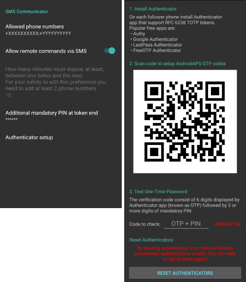
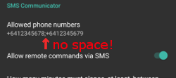
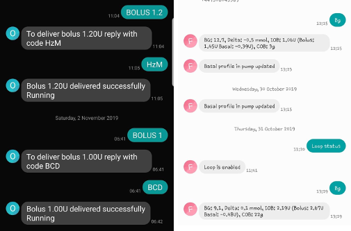

# SMS(簡訊) 指令

## 安全第一

- AAPS 允許你透過簡訊遠端控制孩子的手機。 如果你啟用此 SMS 通訊功能，請務必記住，設置為傳送遠端指令的手機可能會被盜。 因此，務必至少使用 PIN 碼來保護手機。 建議使用強度較高的密碼或生物識別技術。
- 此外，建議允許 [第二個手機號碼](SMS-Commands-authorized-phone-numbers) 來發送 SMS 指令。 這樣，當你的主遠端手機丟失或被盜時，可以使用第二個號碼 [臨時停用](SMS-Commands-other) SMS 通訊功能。
- 如果你傳送的遠端指令（如注射或更改設定檔）已執行，AAPS 也會透過簡訊通知你。 建議將其設置為至少傳送到兩個不同的手機號碼，以防其中一部接收手機被盜。
- **如果你透過 SMS 指令進行注射，則必須透過 Nightscout（AAPSClient、網站等）輸入碳水化合物！** 如果你未這樣做，活性胰島素（IOB）數值會正確，但活性碳水化合物化合物（COB）可能過低，導致 **AAPS** 假設你有過多的活性胰島素，從而未執行糾正注射。
- 從 AAPS 2.7 版本起，當使用 SMS 指令時，必須使用帶有時間一次性密碼的身份驗證器應用程式來提高安全性。

## 設定 SMS 指令

- 大多數臨時目標的調整、追蹤 AAPS 等操作可以在連線網路的 Android 手機上的 [AAPSClient 應用程式](../Children/Children.md) 中完成。
- 無法透過 Nightscout 進行注射，但可以使用 SMS 指令。
- 如果你使用 iPhone 作為追蹤者，無法使用 AAPSClient 應用程式，則有其他 SMS 指令可用。
- 在 Android 手機設定中，前往應用程式 > AndroidAPS > 權限並啟用 SMS。

(SMS-Commands-authorized-phone-numbers)=

### 授權手機號碼

- 在 AAPS 中，前往 **偏好設定 > SMS 通訊功能** 並輸入允許發送 SMS 指令的手機號碼（使用分號分隔 - 例如 +6412345678;+6412345679）。

- 請注意，根據你所在的位置，號碼前的「+」可能是必需的，也可能不是必需的。 為了確定這一點，請發送一條測試簡訊，這將顯示在 SMS 通訊功能標籤中接收到的格式。

- 啟用「允許透過 SMS 傳送遠端指令」。

- 如果你想使用多個號碼：

  - 只輸入一個號碼。

  - 透過發送並確認一條 SMS 指令使該號碼運作。

  - 輸入其他號碼，使用分號分隔，無需空格。

    

### 注射指令間的分鐘數

- 你可以定義透過 SMS 發送的兩次注射之間的最小間隔時間。
- 出於安全考慮，你必須添加至少兩個授權手機號碼來編輯此數值。

### 另外，必須在訊息末端添加 PIN 碼。

- 為了安全起見，回覆碼後面必須加上 PIN 碼。

- PIN 碼規則：

  - 3到6位數字
  - 不允許相同數字（例如 1111）
  - 不允許連續數字（例如 1234）

### 身份驗證器設置

- 使用雙因素身份驗證來提高安全性。

- 你可以使用任何支援 RFC 6238 TOTP 令牌的身份驗證應用程式。 常見的免費應用程式有：

  - [Authy](https://authy.com/download/)
  - Google 身份驗證器 - [Android](https://play.google.com/store/apps/details?id=com.google.android.apps.authenticator2) / [iOS](https://apps.apple.com/de/app/google-authenticator/id388497605)
  - [LastPass 身份驗證器](https://lastpass.com/auth/)
  - [FreeOTP 身份驗證器](https://freeotp.github.io/)

- 在追蹤者的手機上安裝你選擇的身份驗證應用程式，並掃描 AAPS 中顯示的 QR Code。

- 透過輸入你身份驗證應用程式中顯示的令牌和你剛剛在 AAPS 中設置的 PIN 來測試一次性密碼。 範例：

  - 你的強制 PIN 碼是 2020
  - TOTP 令牌來自身份驗證應用程式是 457051
  - 輸入 4570512020

- 如果輸入正確，紅色文字「PIN 錯誤」將**自動**變為綠色的「OK」。 **這裡沒有按鈕可以按！**

- 兩部手機上的時間必須同步。 最佳做法是從網路自動設置。 時間差可能會導致身份驗證問題。

- 如果你想移除已註冊的身份驗證器，請使用「重置身份驗證器」按鈕。  （透過重置身份驗證器，你將使所有已註冊的身份驗證器無效。 你將需要重新設置他們。）

## 使用 SMS 指令

- 從你的授權手機號碼向運作 AAPS 的手機發送 SMS，使用以下任何[指令](SMS-Commands-commands)。

- AAPS 手機將回覆以確認指令是否成功執行或請求的狀態。

- 如果需要，請透過發送代碼確認指令。 範例：

  - 你的強制 PIN 碼是 2020
  - TOTP 令牌來自身份驗證應用程式是 457051
  - 輸入 4570512020

**提示**：如果你將發送大量 SMS，則建議你手機方案中具有無限簡訊功能（對於每個使用的手機）。

(SMS-Commands-commands)=
## 指令

指令必須以英文發送，回覆將使用你當地的語言，如果該回覆字符串已經[翻譯](translations-translate-strings-for-AAPS-app)。

### 循環

- LOOP STOP/DISABLE (循環停止/停用) \* 回覆：循環已停用

- LOOP START/ENABLE (循環啟動/啟用) \* 回覆：循環已啟用

- LOOP STATUS (循環狀態)

  - 回覆取決於實際狀態

    - Loop is disabled \* 回覆：循環已停用
    - Loop is enabled \*回覆：循環已啟用
    - Suspended (10 min) \*回覆：暫停（10 分鐘）

- LOOP SUSPEND 20 (循環暫停 20) \* 回覆：循環已暫停 20 分鐘

- LOOP RESUME (循環恢復) \* 回覆：循環已恢復

- LOOP CLOSED (循環關閉) \* 回覆：目前循環模式：循環關閉

- LOOP LGS (循環低血糖暫停) \* 回覆：目前循環模式：低血糖暫停

### CGM 資料

- BG (血糖) \* 回覆：最後血糖值：5.6 4 分鐘前，變化：-0.2 mmol，活性胰島素：0.20U（注射：0.10U 基礎：0.10U）
- CAL 5.6 (校正 5.6) \* 回覆：要發送校正 5.6，請回覆來自身份驗證器應用程式的代碼和 PIN \* 正確代碼收到後的回覆：校正已發送（**如果安裝了 xDrip。 啟用 xDrip+ 的校正接受功能**）

### 基礎率

- BASAL STOP/CANCEL (基礎停止/取消) \* 回覆：要停止臨時基礎率，請回覆來自身份驗證器應用程式的代碼和 PIN
- BASAL 0.3 (基礎 0.3) \* 回覆：要開始 0.3U/h 的基礎率持續 30 分鐘，請回覆來自身份驗證器應用程式的代碼和 PIN
- BASAL 0.3 20 (基礎 0.3 20) \* 回覆：要開始 0.3U/h 的基礎率持續 20 分鐘，請回覆來自身份驗證器應用程式的代碼和 PIN
- BASAL 30% (基礎30%) \* 回覆：要開始 30% 的基礎率持續 30 分鐘，請回覆來自身份驗證器應用程式的代碼和 PIN
- BASAL 30% 50 (基礎30% 50 \* 回覆：要開始 30% 的基礎率持續 50 分鐘，請回覆來自身份驗證器應用程式的代碼和 PIN

### 注射

在最後一次注射指令或遠端指令後 15 分鐘內（此值僅在添加兩個手機號碼時可編輯）不允許進行遠端注射！ 因此回覆取決於最後一次注射的時間。

- BOLUS 1.2 (注射 1.2) \* 回覆 A：要注射 1.2U，請回覆來自身份驗證器應用程式的代碼和 PIN \* 回覆 B：遠端注射不可用。 稍後再試。
- BOLUS 0.60 MEAL (注射 0.60 餐前) \* 如果你指定了可選參數「餐前」，則會設定臨時目標「餐前」（預設值為：90 mg/dL，5.0 mmol/l 持續 45 分鐘）。 \* 回覆 A：要注射餐前注射 0.60U，請回覆來自身份驗證器應用程式的代碼和 PIN \* 回覆 B：遠端注射不可用。
- CARBS 5 (碳水化合物 5) \* 回覆：要在 12:45 輸入 5 克，請回覆來自身份驗證器應用程式的代碼和 PIN
- CARBS 5 17:35/5:35PM (碳水化合物 5 17:35/5:35PM) \* 回覆：要在 17:35 輸入 5 克，請回覆來自身份驗證器應用程式的代碼和 PIN
- EXTENDED STOP/CANCEL (擴展停止/取消) \* 回覆：要停止擴展注射，請回覆來自身份驗證器應用程式的代碼和 PIN
- EXTENDED 2 120 (擴展 2 120) \* 回覆：要開始擴展注射 2U 持續 120 分鐘，請回覆來自身份驗證器應用程式的代碼和 PIN

### 設定檔

- PROFILE STATUS (設定檔狀態) \* 回覆：設定檔 1
- PROFILE LIST (設定檔清單) \* 回覆：1.\`設定檔 1\` 2.\`設定檔 2\`
- PROFILE 1 (設定檔 1) \* 回覆：要切換至設定檔 1 100%，請回覆來自身份驗證器應用程式的代碼和 PIN
- PROFILE 2 30 (設定檔 2 30) \* 回覆：要切換至設定檔 2 30%，請回覆來自身份驗證器應用程式的代碼和 PIN

(SMS-Commands-other)=

### 其他

- TREATMENTS REFRESH (治療重新整理) \* 回覆：從 NS 重新整理治療
- NSClient RESTART (NSClient 重新啟動) \* 回覆：NSCLIENT 重新啟動已發送
- PUMP (幫浦) \* 回覆：上次連線：1 分鐘前，臨時基礎率：0.00U/h @11:38 5/30分鐘，活性胰島素：0.5U，儲量：34U，電池：100
- PUMP CONNECT (幫浦連線) \* 回覆：幫浦已重新連線
- PUMP DISCONNECT *30* (幫浦斷線 *30*) \* 回覆：要中斷幫浦 <0>30</0> 分鐘，請回覆來自身份驗證器應用程式的代碼和 PIN
- SMS DISABLE/STOP (SMS 停用/停止) \* 回覆：要停用 SMS 遠端服務，請回覆任意代碼。 請記住，你只能直接從 AAPS 主手機重新啟用此功能。
- TARGET MEAL/ACTIVITY/HYPO (目標 餐前/活動/低血糖) \* 回覆：要設定臨時目標餐前/活動/低血糖，請回覆來自身份驗證器應用程式的代碼和 PIN
- TARGET STOP/CANCEL (目標停止/取消) \* 回覆：要取消臨時目標，請回覆來自身份驗證器應用程式的代碼和 PIN
- HELP (幫助) \* 回覆：BG, LOOP, TREATMENTS，...... (回覆各項可用指令)
- HELP BOLUS (幫助 注射) \* 回覆：BOLUS 1.2 BOLUS 1.2 餐前

(SMS-Commands-troubleshooting)=
## 問題排除

### 多條簡訊

如果你反覆收到相同的訊息（例如設定檔切換），你可能與其他應用程式形成了循環。 例如可能是 xDrip+。 如果是這樣，請確保 xDrip+（或任何其他應用程式）沒有將治療資料上傳到 NS。

如果其他應用程式安裝在多部手機上，請確保在所有手機上停用上傳功能。

### SMS 指令在三星手機上無法正常運作

有報告指出，Galaxy S10 手機更新後，SMS 指令停止運作。 透過停用「以聊天訊息發送」可以解決此問題。

### Android Messages 應用程式

如果你在使用 Android Messages 應用程式發送或接收 SMS 指令時遇到問題，請在照護者和孩子的手機上停用端到端加密。
 - 打開 Messages 中的特定 SMS 對話
 - 選擇右上角的選項按鈕
 - 選擇「詳細訊息」
 - 啟用「僅發送 SMS 和 MMS 訊息」
