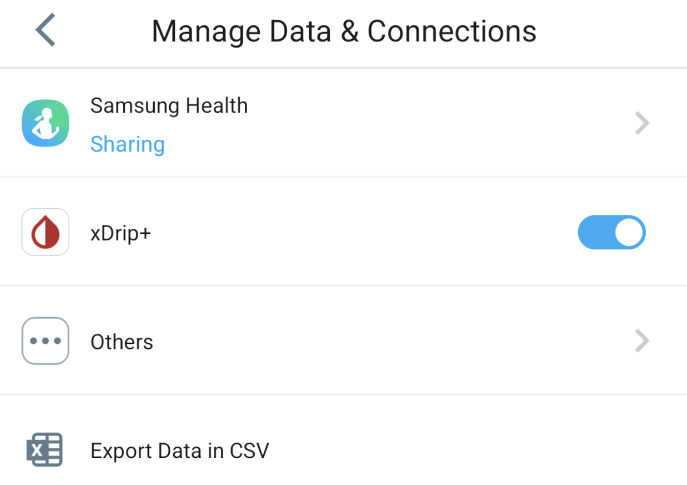

# CareSens

有多種方式可在 **AAPS** 中使用 CareSens 資料：

- xDrip+
- Juggluco

**注意：** 你不需要 Sens365 追蹤者 App 就能連線到 AAPS。

## 1. xDrip+

1. 安裝並設定官方的 CareSens App。
2. 在 CareSens App 中，前往 設定 -> 管理資料與連線 -> 開啟 xDrip 開關。 如有需要，可在「其他」中關閉到 CareLevo、DIA:CONN、CloudLoop 等的資料連線。

2. 安裝 xDrip+：[xDrip](https://github.com/NightscoutFoundation/xDrip)。
3. 在 xDrip+ 中，前往 設定 -> 硬體資料來源，選擇 `Companion App` 作為資料來源。
4. 在 **AAPS** 中，於 [組態建置工具，血糖來源](#Config-Builder-bg-source) 選擇 xDrip+。

## 2. Juggluco

1. 安裝 Juggluco App。
2. 在 Juggluco 中，打開左側選單並選擇 `Photo`
3. 掃描傳感器包裝上的 QR Code。
4. 在左側選單 -> 設定 -> 資料交換 中，確認已開啟 xDrip 廣播。
5. 在 **AAPS** 中，於 [組態建置工具，血糖來源](#Config-Builder-bg-source) 選擇 xDrip+。
