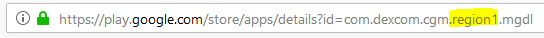

# Dexcom G5

## 如果使用 G5 與 xDrip+

-   除非你需要特定新開發的功能，否則可以安全下載[最新 APK（穩定版）](https://xdrip-plus-updates.appspot.com/stable/xdrip-plus-latest.apk)。
-   根據[這些指示](https://navid200.github.io/xDrip/docs/G5-Recommended-Settings.html)設定 xDrip+ 配合 G5。
-   閱讀[xDrip+ 設定頁面](../CompatibleCgms/xDrip.md)來設定 xDrip+。
-   在[ConfigBuilder 的血糖來源](#Config-Builder-bg-source)中選擇 xDrip+。

## 如果使用 G5 配合修改過的 Dexcom 應用程式

```{admonition} Legacy apps
:class: warning
這些應用程式與最近的 Android 版本不相容。  
```

-   從<https://github.com/dexcomapp/dexcomapp>下載 apk，並選擇符合你需求的版本（mg/dl 或 mmol/l 版本，G5）。

    -   資料夾 2.4 針對 AAPS 2.5 及以上版本的使用者。
    -   在電腦上打開<https://play.google.com/store/search?q=dexcom%20g5>。 區域將在 URL 中可見。

    

-   強制停止並卸載原始 Dexcom 應用程式（如果尚未完成）。

-   安裝下載的 apk

-   啟動傳感器

- 在[ConfigBuilder 的血糖來源](#Config-Builder-bg-source)中選擇 Dexcom App（修補版）。

-   如果你想通過本地廣播使用 xDrip+ 鬧鐘：在 xDrip+ 漢堡選單  > 設定 > 硬體資料來源 > 640G / EverSense.
