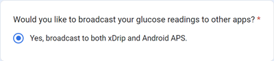

# Dexcom G6 和 ONE

## 基本事項

-   遵循一般 CGM 衛生和傳感器設定建議，[點擊此處](../CompatibleCgms/GeneralCGMRecommendation.md)了解更多。

## 使用 G6 和 ONE 的循環一般提示

- 最近的傳輸器稱為 Firefly。 傳感器無法在不移除傳輸器的情況下重新啟動，傳輸器本身也無法重置，並且他們也不會生成原始資料。

- 如果你正在重新啟動傳感器，請確保你已準備好進行校準並密切注意變化。

- G6/ONE 預浸泡使用工廠校準可能會導致結果變異。 如果你進行預先浸泡，為獲得最佳結果，你可能需要校正傳感器。

請閱讀 Tim Street 發表的[文章](https://www.diabettech.com/artificial-pancreas/diy-looping-and-cgm/)以了解更多，該文章發佈於[www.diabettech.com](https://www.diabettech.com)。

## 如果使用 G6 或 ONE 與 xDrip+

- 如果你正在使用最近的（Firefly）傳輸器，預防性重新啟動將**被忽略**。
- 如果你使用的是修改過的傳輸器，則**不需要**使用預防性重新啟動。
-   如果你使用的是舊的更換過電池的傳輸器，最安全的做法是**停用**[預防性重新啟動](https://navid200.github.io/xDrip/docs/Preemptive-Restart.html)。 但是，在這種情況下，你將不得不在非[原生模式](https://navid200.github.io/xDrip/docs/Native-Algorithm.html)下使用 G6（這不建議使用，因為他會停用工廠校準並且不會過濾吵雜的讀取值），否則傳感器將在 10 天後停止運作。
-   Dexcom G6 和 ONE 傳送器可以同時連接到 Dexcom 接收器（或替代的 t:slim 幫浦）以及你手機上的一個應用程式。
-   使用 xDrip+ 作為接收器時，請先卸載 Dexcom 應用程式。 **你無法同時將 xDrip+ 和 Dexcom 應用程式連線到傳輸器！**
-   如果你需要 Clarity 並希望使用 xDrip+ 的警報，請使用 [BYODA](#DexcomG6-if-using-g6-with-build-your-own-dexcom-app)（僅限 G6）並用本地廣播到 xDrip+。
-   你還可以將 xDrip+ 用作官方 Dexcom 應用程式的配套程式，但你可能會遇到血糖讀取延遲。
-   如果尚未設置，請下載[xDrip+](https://github.com/NightscoutFoundation/xDrip)並按照[xDrip+ 設定頁面](../CompatibleCgms/xDrip.md)上的指示進行操作。
-   在[組態建置工具的血糖來源](#Config-Builder-bg-source)中選擇 xDrip+。

- 根據[xDrip+ 設定頁面](../CompatibleCgms/xDrip.md)調整設定。

(DexcomG6-if-using-g6-with-build-your-own-dexcom-app)=
## 如果使用 G6 配合自製 Dexcom 應用程式

-   [自製 Dexcom 應用程式](https://docs.google.com/forms/d/e/1FAIpQLScD76G0Y-BlL4tZljaFkjlwuqhT83QlFM5v6ZEfO7gCU98iJQ/viewform?fbzx=2196386787609383750)（BYODA）支援本地廣播到 AAPS 和/或 xDrip+（不適用於 G5/ONE/G7 傳感器！）

-   此應用程式允許你將 Dexcom G6 與任何 Android 智慧型手機一起使用。
-   如果你之前使用過原版或修改過的 Dexcom 應用程式，請卸載他們（**不要停止**目前運作的傳感器）。
-   安裝下載的 apk
-   在修補版應用程式中輸入傳感器代碼和傳輸器序列號。
-   在手機設定中，前往應用程式 > Dexcom G6 > 權限 > 其他權限並按下「存取 Dexcom 應用程式」。
-   短時間後，BYODA 應該會收到傳輸器訊號。

### AAPS 設定

-   在[ConfigBuilder 的血糖來源](#Config-Builder-bg-source)中選擇「Dexcom App（修補版）」。

-   如果你未收到任何數值，請選擇其他資料來源，然後重新選擇「Dexcom App（修補版）」以觸發 AAPS 和 BYODA 廣播之間連線所需的權限請求。

### xDrip+ 設定

-   選擇「640G/Eversense」作為資料來源。
-   必須在 xDrip+ 中執行「啟動傳感器」指令，才能接收數值。 這不會影響你的目前傳感器，他仍由自製 Dexcom 應用程式控制。

(DexcomG6-troubleshooting-g6)=
## G6 和 ONE 問題排除

### Dexcom G6/ONE 特定問題排除

-   向下滾動至[**問題排除**](https://navid200.github.io/xDrip/docs/Dexcom_page.html)。

### 一般問題排除

可以在[這裡](#general-cgm-troubleshooting)找到一般 CGM 的問題排除。

### 新的傳輸器與正在運作的傳感器

如果你在傳感器會話期間更換了傳輸器，你可以嘗試取下傳輸器而不損壞傳感器底座。 你可以在[這裡](https://navid200.github.io/xDrip/docs/Remove-transmitter.html)找到相關影片。 如果你選擇[這種解決方案](https://youtu.be/tx-kTsrkNUM)，你必須小心避免使用膠帶時[損壞傳感器接觸點](https://navid200.github.io/xDrip/docs/Petroleum-jelly-in-Dexcom-G6-Sensor.html)。
