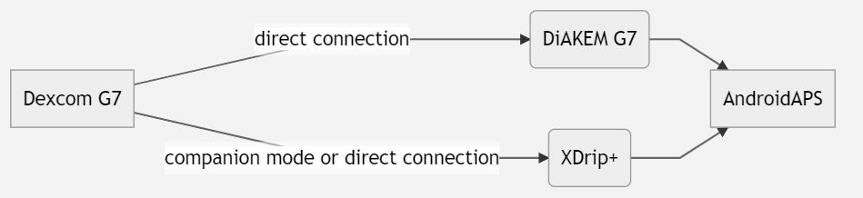

- - -
orphan: true
- - -

# Dexcom G7 和 ONE+


## 基本準備

值得注意的是，與 G6 相比，G7 和 ONE+ 系統在應用程式和讀取器中都不會平滑值。 更多詳細資訊請參閱 [這裡](https://www.dexcom.com/en-us/faqs/why-does-past-cgm-data-look-different-from-past-data-on-receiver-and-follow-app)。



```{admonition} [Smoothing method](../CompatibleCgms/SmoothingBloodGlucoseData.md)
:class: warning
**平均平滑或指數平滑** **必須** 開啟，才能有效使用 G7 / ONE+ 的數值。  
```

## 1. xDrip+（直接連接至 G7 或 ONE+）

- 請參閱這裡的說明：[Xdrip+ G7](https://navid200.github.io/xDrip/docs/Dexcom/G7.html)
- 在 [組態建置工具 的血糖來源](#Config-Builder-bg-source) 中選擇 xDrip+。

- 根據 xDrip+ 設定頁面上的解釋來調整 xDrip+ 設定 [xDrip+ 設定](../CompatibleCgms/xDrip.md)

## 2.  修補版 Dexcom G7 應用程式 (DiaKEM)

**注意：需要 AAPS 3.2.0.0 或更高版本！ 不適用於 ONE+。**

### 安裝新的修補版 G7 應用程式並啟動傳感器

修補版 Dexcom G7 應用程式 (DiaKEM) 可查看 Dexcom G7 資料。 這不是 BYODA 應用程式，因為該應用程式目前無法接收 G7 資料。

- 如果之前有使用過原Dexcom應用程式，請將其解除安裝（如果傳感器正在運作，可以繼續使用傳感器，請在移除應用程式前記下傳感器代碼！）

- 從 [這裡](https://github.com/authorgambel/g7/releases)或[這裡](https://github.com/emmatovar27/dexcom-g7-apk-patcher/releases)下載並安裝修補版.apk。

- 在修補版應用程式中輸入傳感器代碼。

- 請遵循一般 CGM 衛生規範和傳感器安裝位置的建議，詳情請參閱[此處](../CompatibleCgms/GeneralCGMRecommendation.md)。

- 浸潤階段結束後，資料會顯示在 G7 應用程式中。

### 在 AAPS 中進行配置

- 在 [組態建置工具 的血糖來源](#Config-Builder-bg-source) 中選擇 'BYODA' - 即便這不是 BYODA 應用程式！

- 如果 AAPS 無法接收任何資料，請切換到其他血糖來源，然後再切回 'BYODA' 以調用查詢以批准 AAPS 和 BYODA 之間的資料交換。

## 3. xDrip+（companion - 夥伴模式）

-   下載並安裝 xDrip+：[xDrip](https://github.com/NightscoutFoundation/xDrip)
- 在 xDrip+ 中必須選擇「夥伴應用程式」作為資料來源，並在進階設定 > 藍牙設定 > 啟用「夥伴藍牙」。
-   在 [組態建置工具的血糖來源](#Config-Builder-bg-source) 中選擇 xDrip+。

-   根據 xDrip+ 設定頁面上的解釋來調整 xDrip+ 設定 [xDrip+ 設定](../CompatibleCgms/xDrip.md) 
