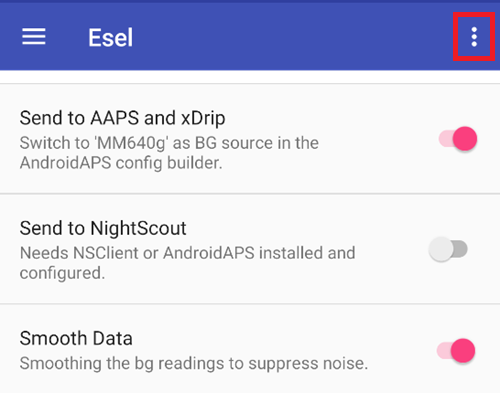

# 針對 Eversense 使用者

有三種不同的方法來存取 Eversense 的讀取值：

- ESEL 配套模式
- ESEL 修補版模式
- xDrip+ 配套應用程式

## ESEL

按照這些[指示](https://github.com/BernhardRo/Esel?tab=readme-ov-file#esel)，取得並安裝[ESEL 應用程式](https://github.com/BernhardRo/Esel/tree/master/apk)。

- 啟用「發送至 AAPS 和 xDrip」
- **停用**「發送至 Nightscout」
- 由於 Eversense 的血糖資料可能會產生干擾，建議在 ESEL 中啟用「平滑資料」功能。



### 配套模式

從 Eversense 應用程式通知中讀取資料（自 ESEL 版本 3.0.1 起可與標準 Eversense 應用程式一起使用）。

1. 使用來自 Google Play 商店的官方 Eversense 應用程式
   - 選擇性的操作，但若需回填則必須：登錄你的 Eversense 帳號
   - 在同步中，啟用自動同步功能
2. ESEL 設定：
   - 停用「從修補版 Eversense 應用程式獲取資料」設置
   - 若需回填：啟用「從 eversensedms.com 填補遺漏資料」
   - 輸入你的 Eversense 登錄資料作為電子郵件地址和密碼
3. 在[ConfigBuilder 的血糖來源](#Config-Builder-bg-source)中將「MM640g」設為血糖來源。

### 修補版 Eversense 應用程式

 需要修補版的 Eversense 應用程式（完全離線運作，包括回填）。

1. 卸載 Eversense 應用程式（警告：你將丟失超過 1 週的本地歷史資料！）

2. 安裝[修補版 Eversense 應用程式](https://cr4ck3d3v3r53n53.club)並按照供應商的描述進行使用。

   - 啟動 Eversense 應用程式，登錄，連線到你的傳輸器，並像使用正常應用程式一樣使用他。

3. ESEL 設定：

   - 啟用「從修補版 Eversense 應用程式獲取資料」設置


如果你首次安裝 Eversense 並運作 ESEL，可能需要長達 15 分鐘才能在 xDrip 中顯示第一個數值！

4. 在[ConfigBuilder 的血糖來源](#Config-Builder-bg-source)中將「MM640g」設為血糖來源。

## xDrip+

xDrip+ 可以像 ESEL 一樣從供應商應用程式的通知中讀取資料。 無法使用回填功能。

- 下載並安裝 xDrip+：[xDrip](https://github.com/NightscoutFoundation/xDrip)
- 在 xDrip+ 中必須選擇「配套應用程式」作為資料來源。
- 在[組態建置工具的血糖來源](#Config-Builder-bg-source)中選擇 xDrip+。
- 根據 xDrip+ 設定頁面的說明[調整 xDrip+ 設定](../CompatibleCgms/xDrip.md)。
- 在 AAPS 中啟用[指數平滑](../CompatibleCgms/SmoothingBloodGlucoseData.md)。

```{warning}
血糖 值的讀取頻率並不總是 5 分鐘，並且可能會出現重複數值。
```