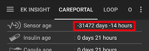

# 一般 CGM 建議

## CGM 衛生

無論你使用哪種 CGM 系統，如果你要使用基於血液的校準，則無論你使用 DIY CGM 軟體還是官方應用程式，都應遵循一些非常明確的規則。

-   確保手和設備清潔。
-   嘗試在有連續的點和扁平箭頭的情況下進行校準（通常 15-30 分鐘就足夠）
-   避免在血糖數值上升或下降時進行校準。
-   進行「足夠的」校準—在官方應用中，通常會提示你每天檢查一次或兩次。 在 DIY 系統中，你可能不會這樣做，因此在沒有校準的情況下應該小心持續使用。
-   對於不需要或不允許校準的傳感器，至少每天檢查一次實際的血糖值。 AAPS 的安全性取決於你的傳感器讀取值的可靠性。
-   如果可能的話，建議在較低範圍（4-5 mmol/l 或 72-90 mg/dl）和稍高範圍（7-9 mmol/l 或 126-160 mg/dl）的一些讀數下進行校準，因為這提供了更好的點/斜率校準範圍。

## 設置傳感器（G6）

在設置傳感器時，建議不要過於用力按壓插入器，以避免出血。 傳感器接觸部位不應與血液接觸。

設置傳感器後，發射器可以被插入到傳感器支架中。 警告！ 首先按下方形一側，然後再按下圓形一側。

(general-cgm-troubleshooting)=
## 問題排除

### 連線問題

藍牙連線可能會受到其他附近的藍牙設備（如血糖機、耳機、平板電腦或廚房設備如微波爐或陶瓷爐）的干擾。 在這種情況下，xDrip+ 不會顯示任何 血糖值。 當藍牙連線重新建立後，資料會回填。

### 傳感器錯誤

如果頻繁出現傳感器錯誤，請嘗試選擇不同的身體部位來設置你的傳感器。 傳感器接觸部位不應與血液接觸。

通常「傳感器錯誤」可以通過立刻喝水和按摩傳感器周圍的地方來修正！

### 跳動的數值

你可以嘗試更改 xDrip+ 中的干擾阻擋設置（設定 - 應用間設定 - 干擾阻擋），例如「阻擋非常高的干擾及更糟的情況」。 另請參見 [平滑血糖資料](../CompatibleCgms/SmoothingBloodGlucoseData.md)。

### 負傳感器時間

如果在 [操作選單](#screens-action-tab) 中存在雙重「CGM 傳感器插入」條目或日期不正確的傳感器插入，則會發生此情況。 請轉到療程選項卡 -> 照護入口，並刪除錯誤條目。
