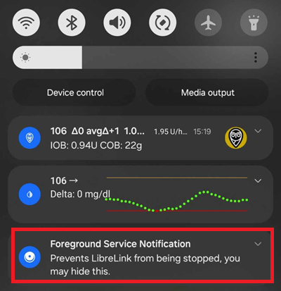
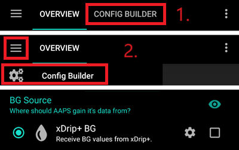
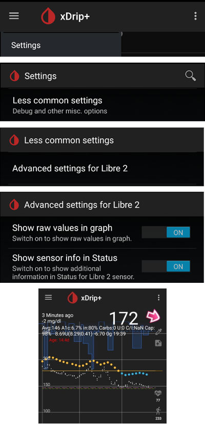
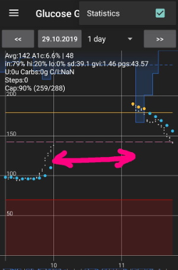

- - -
orphan: true
- - -

# Freestyle Libre 2 和 2+

即使使用官方應用程式，Freestyle Libre 2 傳感器現在也是一款真正的連續血糖監測儀（CGM）。 然而，LibreLink 仍無法將資料傳送至 AAPS。 有幾種解決方案可以將其與 AAPS 搭配使用。

## 1. 使用藍牙橋接器和 OOP

藍牙發射器可用於 Libre 2（EU）或 2+（EU），以及一個 非處理演算法 應用程式。 你可以像使用 [Libre 1](./Libre1.md) 一樣每 5 分鐘接收一次血糖讀取值。

檢查你要使用的橋接器和應用程式是否與你的傳感器及 xDrip+ 相容（舊版 Blucon 及近期的版本不支援，Miaomiao 1 需要韌體 39，Miaomiao 2 則需要韌體 7）。

Libre2 OOP 所生成的讀取值與原始讀取器或透過 NFC 掃描的 LibreLink 應用程式的讀取值相同。 AAPS 與 Libre 2 的讀取值會經過 10 至 25 分鐘的平滑處理，以避免某些讀取值的跳動。 請參閱以下內容[讀取值平滑化及原始讀取值](#libre2-value-smoothing-raw-values)。 OOP 每 5 分鐘生成一次讀取值，並取最近 5 分鐘的平均值。 因此，這些血糖讀取值可能不如其他方法平滑，但他們與原始讀取器的讀取值一致，並且更快速地反應“真實”血糖讀取值。 如果你嘗試使用 OOP 進行循環，請在 xDrip+ 中啟用所有平滑設定。

有幾個使用藍牙傳輸器的理由：

-   你可以選擇多種 OOP2 校正策略（1）：使用「無校正」獲得讀取器讀取值，或者像 Libre 1 一樣使用「基於原始資料進行校正」，或者最終使用「基於葡萄糖進行校正」來校正讀取器的讀取值。  
  請確保停用 OOP1（2）。

    → 漢堡選單 → 設定 → 不常見的設定 → 其他雜項選項 選項


-   Libre 2 傳感器可像 Libre 1 一樣使用 14.5 天。
-   支援 8 小時的回填資料。

備註：傳輸器可以與 LibreLink 應用程式並行使用而不會相互干擾。

## 2. 使用 xDrip+ 直接連線

```{admonition} Libre 2 EU only
:class: warning
xDrip+ 不支援直接連接到 Libre 2 美國和澳洲版本。
僅支持 Libre 2 和 2+ **EU** 型號。
```

- 請依照[這些指示](https://www.minimallooper.com/post/how-to-setup-freestyle-libre-2-and-oop2-to-use-a-native-bluetooth-connection-in-xdrip)來設置 xDrip+，但請確保下載[最新的 OOP2](https://drive.google.com/file/d/1hkbs60Bv2udTlMS81UStCdY4RaHR0V57/view)，因為文件中的版本已經過時。
- 按照[xDrip+ 設定頁面](../CompatibleCgms/xDrip.md)上的設置說明進行操作。

-   在[組態建置工具的血糖來源](#Config-Builder-bg-source)中選擇 xDrip+。

## 3. 使用 Diabox

- 安裝 [Diabox](https://www.bubblesmartreader.com/_files/ugd/6afd37_f183eabd4fbd44fcac4b1926a79b094f.pdf)。 在設定中，進入「整合」，啟用「與其他應用程式共享資料」。


- 在[組態建置工具的血糖來源](#Config-Builder-bg-source)中選擇 xDrip+。

## 4. 使用 Juggluco

請參閱 [這裡](./Juggluco.md).

(libre2-patched-librelink-app-with-xdrip)=

## 5. 使用修補版 LibreLink 應用程式與 xDrip+ 搭配使用

```{admonition} Libre 2 EU only
:class: warning
修補過的應用程式是舊版本（22/4/2019），可能與最近的 Android 發行版不相容。  
```

### 步驟 1：建立修補版應用程式

由於法律原因，「修補」必須自行完成。 使用搜索引擎查找相應的鏈接。 有兩個 變種：建議使用的原始修補版應用程式會阻止任何網路流量以避免追蹤。 另一個版本支援 LibreView。

修補版應用程式必須安裝替代原始應用程式。 下一個啟用的傳感器將透過藍牙將目前的血糖值傳送到在你智慧型手機上運作的 xDrip+ 應用程式。

重要提示：為避免潛在問題，建議先在支援 NFC 的智慧型手機上安裝並卸載原始應用程式。 NFC 必須啟用。 這不會消耗額外的電量。 然後安裝修補版應用程式。

修補版應用程式可以透過前景授權通知來識別。 前景授權服務提高了連線穩定性，相較於不使用此服務的原始應用程式。



其他標誌可能包括三點選單中的 Linux 企鵝圖示 -&gt; 資訊，或者修補版應用程式的字體（2）與原始應用程式（1）不同。 這些標準是可選的，具體取決於你選擇的應用程式來源。


確保啟用了 NFC，並為修補版應用程式啟用記憶體和位置權限，啟用自動時間和時區，並在修補版應用程式中至少設定一個鬧鐘。

### 步驟 2：使用修補版應用程式啟動傳感器

現在只需掃描傳感器即可使用修補版應用程式啟動 Libre2 傳感器。 請確保已設定好所有設定。

成功啟動傳感器的必要設定：

-   NFC 啟用 / 藍牙啟用
-   記憶體和位置權限已啟用
-   位置服務已啟用
-   自動時間和時區設定
-   在修補版應用程式中至少設定一個鬧鐘

請注意，位置服務是一個核心設定。 這並不是應用程式的位置權限，該權限也必須啟用！


使用修補版應用程式啟動傳感器，你將無法將其連線到其他應用程式或手機。 如果你卸載修補版應用程式，你將失去鬧鐘和連續的血糖讀取值。

首次連線傳感器的設置至關重要。 LibreLink 應用程式每 30 秒嘗試與傳感器建立無線連線。 如果缺少一個或多個必要設定，則需要進行調整。 你沒有時間限制來完成此操作。 傳感器會不斷嘗試建立連線。 即使這可能需要幾個小時。 耐心等待，並嘗試不同的設定，切勿急於更換傳感器。

只要在 LibreLink 啟動畫面左上角看到紅色感嘆號「!」， 表示尚未連線，或某些設定阻礙了 LibreLink 發出鬧鐘訊號。 請檢查是否啟用了音效，並確保停用所有可能阻擋應用程式通知的設定。 當感嘆號消失後，應該就會建立連線，並將血糖值傳送到智慧型手機。 這應該在最多 5 分鐘內完成。


如果感嘆號仍然存在或你收到錯誤訊息，可能有幾個原因：

-   Android 位置服務未授權 - 請在系統設定中啟用他
-   未設定自動時間和時區 - 請根據設定進行更改
-   啟用鬧鐘 - 必須在 LibreLink 中啟用三個鬧鐘中的至少一個
-   藍牙已關閉 - 請開啟藍牙
-   音效被阻止
-   應用程式通知被阻止
-   閒置螢幕通知被阻止

重啟手機可能會有所幫助，你可能需要多次重啟。 連線一建立，紅色感嘆號就會消失，這是最重要的一步。 根據系統設定，可能感嘆號仍然存在，但你仍能接收到讀取值。 無論哪種情況，都是正常的。 傳感器和手機現在已連線，每分鐘會傳送一次血糖讀取值。


在極少數情況下，清空藍牙快取和/或透過系統選單重置所有網路連線可能會有所幫助。 這會移除所有已連線的藍牙設備，這可能有助於建立正確的藍牙連線。 此過程是安全的，因為修補版 LibreLink 應用程式會記住已啟動的傳感器。 不需要執行其他操作。 只需等待修補版應用程式連線到傳感器。

成功連線後，如果有必要，可以更改智慧型手機的設定。 這並不推薦，但你可能希望節省電量。 位置服務可以關閉，音量可以設為零，或可以再次關閉鬧鐘。 無論如何，血糖資料仍會被傳送。

然而，在啟動下一個傳感器時，所有設定必須再次設定！

備註：修補版應用程式需要在傳感器預熱後的那一小時內設定所有必要的設定，才能啟用連線。 在 14 天的操作時間內，這些設定不再需要。 在大多數情況下，當你無法啟動傳感器時，通常是因為位置服務已關閉。 對於 Android，這是藍牙正常運作所需的必要條件！ 請參閱 Google 的 Android 文件。

在這 14 天內，你可以同時使用一個或多個支援 NFC 的智慧型手機（不是讀取器設備！）運作原始 LibreLink 應用程式進行 NFC 掃描。 開始時並無時間限制。 例如，你可以在第 5 天使用並行的手機。 並行手機可以將血糖資料上傳到 Abbott 雲端（LibreView）。 LibreView 可以為你的糖尿病醫療團隊生成報告。

請注意，原始修補版應用程式**沒有任何與網路的連線**，以避免追蹤。

然而，有一個版本的修補版應用程式支援 LibreView，並啟用了網路存取。 請注意，此時你的資料會被傳送到雲端。 但你的內分泌醫療團隊的報告將完全支援。 使用該版本，還可以將正在運作的傳感器的鬧鐘轉移到未啟動該傳感器的另一台設備。 請在與糖尿病相關的德國論壇中搜索此操作方式。

### 步驟 3：安裝並配置 xDrip+ 應用程式

血糖讀取值會透過 xDrip+ 應用程式接收到智慧型手機上。

-   除非你需要最新功能，否則可以安全下載[最新 APK（穩定版）](https://xdrip-plus-updates.appspot.com/stable/xdrip-plus-latest.apk)，在這種情況下，你應該使用最新的[Nightly Snapshot](https://github.com/NightscoutFoundation/xDrip/releases)。
-   使用 [修補版應用程式資料來源](#xdrip-libre2-patched-app)設定 xDrip+。
-   按照[xDrip+ 設定頁面](../CompatibleCgms/xDrip.md)上的設置說明進行操作。

### 步驟 4：啟動傳感器

- → 漢堡選單 (1) → 啟動傳感器 (2) → 啟動傳感器 (3) → 回答「暫不」(4)。


這不會實際啟動任何 Libre2 傳感器，也不會與其進行任何互動。 這只是為了讓 xDrip+ 知道有一個新的傳感器正在傳送血糖資料。 如果可用，請輸入兩個指血測量值進行初始校正。 現在，血糖值應每 5 分鐘顯示在 xDrip+ 中。 錯過的讀取值，例如因為你離手機太遠，不會被回填。

更換傳感器後，xDrip+ 會自動偵測到新傳感器並刪除所有校正資料。 啟動後，你可以檢查你的血糖值並進行新的初始校正。

### 步驟 5：配置 AAPS（僅適用於循環）

-   在 AAPS 中，前往 組態建置工具 >血糖來源，並勾選 'xDrip+'。



-   如果 AAPS 在手機處於飛航模式時未接收到血糖 值，請使用「識別接收器」，如在 [xDrip+ 設定頁面](#xdrip-identify-receiver) 所述。

(Libre2-experiences-and-troubleshooting)=
### 經驗與問題排除

#### 連線性

大多數手機的連線性良好，除非是華為手機。 如果手機在與傳感器相對的口袋中或在戶外時，連線可能會中斷。 請將手機佩戴在傳感器所在的一側。 在室內，藍牙訊號透過反射傳播時應該不會有問題。 如果你遇到連線問題，請嘗試其他手機。 將傳感器的內部藍牙天線朝下設置也可能有所幫助。 在安裝傳感器時，應將應用器上的縫隙朝下。

(libre2-value-smoothing-raw-values)=
#### 讀取值平滑化與原始值

技術上來說，目前的血糖值每分鐘會傳送到 xDrip+。 加權平均濾波器預設會計算最近 25 分鐘內的平滑資料。 你可以在 NFC 掃描功能選單中更改此時間段。

→ 漢堡選單 → 設定 → NFC 掃描功能 → 使用 xxx 方法時平滑 Libre 3 資料


這對循環是必要的。 曲線看起來很平滑，循環結果也非常好。 用來設定鬧鐘的原始值波動稍大一些，但與讀取器顯示的值相符。 此外，你可以在 xDrip+ 圖表中顯示原始值，從而及時應對快速變化。 請開啟「不常見的設定」\>「Libre 2 的進階設定」\>「顯示原始值」和「顯示傳感器資訊」。 然後，原始值會額外顯示為小白點，並在系統選單中提供更多傳感器資訊。

當血糖快速變化時，原始值非常有幫助。 即使這些點的波動較大，但與平滑線相比，你能更好地察覺趨勢，從而做出正確的治療決策。

→ 漢堡選單 → 設定 → 不常見的設定 → Libre 2 的進階設定



#### 傳感器運作時間

傳感器運作時間固定為 14 天。 Libre1 的額外 12 小時不再存在。 啟用 Libre2 的進階設定後，xDrip+ 會顯示更多傳感器資訊，例如啟動時間。 在修補版 LibreLink 應用程式中也可以看到剩餘傳感器時間。 無論是在主畫面上以剩餘天數顯示，還是在三點選單中查看傳感器啟動時間 → 幫助 → 事件日誌中的「發現新傳感器」。


#### 新傳感器

傳感器更換是在運作中進行的：在啟動前不久設置新傳感器。 xDrip+ 不再接收到舊傳感器的資料，請使用修補版應用程式啟動新傳感器。 一小時後，新讀取值應自動出現在 xDrip+ 中。

如果沒有，請檢查手機設定，並按首次啟動的步驟進行操作。 你沒有時間限制。 嘗試找到正確的設定組合。 在嘗試不同的組合前，無需急於立即更換傳感器。 這些傳感器非常穩定，並會持續嘗試建立連線。 請耐心操作。 大多數情況下，你可能意外更改了一個設定，導致問題出現。

成功後，請在 xDrip+ 中選擇「停止傳感器」和「僅刪除校正」選項。 這表示對 xDrip+ 而言，新傳感器正在釋放血糖值，舊的校正已不再有效，因此必須刪除。 此處不會對 Libre2 傳感器進行任何實際操作！ 你無需在 xDrip+ 中啟動傳感器。



#### 校正

你可以將 Libre2 校正為**偏差 -40 mg/dL 至 +20 mg/dL \[-2,2 mmol/l 至 +1,1 mmol/l\]**（截距）。 斜率無法更改。 請在設置新傳感器後進行指血測試，並注意插入後的前 12 小時可能不太準確。 由於血糖測試可能存在較大誤差，請每 24 小時驗證一次並在必要時校正。 如果幾天後傳感器的讀取值完全不準確，應考慮更換傳感器。

### 合理性檢查

Libre2 傳感器內部包含合理性檢查，用於偵測不正確的傳感器數值。 傳感器在手臂上移動或稍微抬起，數值可能開始波動。 為了安全起見，Libre2 傳感器會自動關閉。 不幸的是，當使用應用程式掃描時，會進行額外的檢查。 應用程式甚至可能停用正常的傳感器。 目前內部檢查過於嚴格。 避免使用其他手機掃描傳感器，以降低意外停用傳感器的風險。

(Libre2-best-practices-for-calibrating-a-libre-2-sensor)=
# Libre 2 傳感器校正最佳實踐

為了獲得最佳的 Libre 2 傳感器校正效果，你應遵循一些「規則」。 這些規則適用於處理 Libre 2 資料的軟體組合（例如修補版 Libre 應用程式、OOP2 等）。

1.  最重要的規則是在血糖平穩至少 15 分鐘時才校正傳感器。 最近三次讀取值的變化不應超過 10 mg/dL（在 15 分鐘內，而非每次讀取值間）。 由於 Libre 2 並不是測量你的血糖值，而是測量你的組織液葡萄糖值，因此在血糖上升或下降時會有一些延遲。 這種延遲可能導致在不利情況下出現過大的校正偏差，即使血糖值的上升/下降幅度並不大。 因此，盡可能避免在血糖上升或下降時進行校正。 → 如果你必須在血糖未平穩時添加校正（例如在啟動新傳感器時），建議儘早移除該校正，並在血糖平穩時添加新的校正。
2.  其實，當你遵循規則 1 時，這一點會自動被考慮，但為了保險起見：在進行比較測量時，你的血糖值也應平穩至少 15 分鐘。 避免在血糖上升或下降時進行比較測量。 重要提示：你仍然可以隨時進行血糖測量，但不要在血糖上升或下降時將結果用於校正！
3.  由於在平穩狀態下校正傳感器是個很好的起點，建議僅在你的目標範圍內校正傳感器，例如 70 mg/dL 至 160 mg/dL。 Libre 2 傳感器並未優化用於處理像 50 mg/dL 到 350 mg/dL 這樣的大範圍讀取值（至少在非線性情況下），因此盡量僅在你所需的範圍內進行校正。 → 接受你校正範圍外無法完美一致的血糖數值事實。
4.  不要過於頻繁地校正。 過於頻繁地校正傳感器通常會導致更差的結果。 當傳感器在平穩狀態下提供良好結果時，請不要再添加新的校正，因為這並不會帶來任何實際效果。 重新檢查狀態每 3-5 天一次就足夠了（當然，仍然是在平穩狀態下）。
5.  避免在不需要時進行校正。 這聽起來可能很奇怪，但當血糖與組織液葡萄糖的差異只有±10 mg/dL 時，不建議添加新的校正（例如：血糖值 95，Libre 傳感器顯示 100 -> 不要添加 95，血糖值 95，Libre 傳感器顯示 115 -> 添加 95 進行校正）。

一些一般性說明：啟動新傳感器後以及傳感器即將到期時，進行比較測量比每 3-5 天一次的建議更頻繁地進行更有意義。 對於新傳感器和舊傳感器來說，原始值更有可能發生變化，因此需要重新校正。 有時候，傳感器可能無法提供有效的數值。 最有可能的情況是傳感器的讀取值遠低於實際血糖數值（例如，傳感器讀取值：50 mg/dL，血糖值：130 mg/dL），即使經過校正後也是如此。 如果是這種情況，則無法校正該傳感器以報告有效結果。 例如： 當使用修補版 Libre 應用程式時，你可以添加最大 +20 mg/dL 的偏移值。 如果你遇到傳感器提供的值過低，不要猶豫，更換傳感器，因為他不會變得更好。 即使這可能是傳感器故障，但如果經常遇到讀取值過低的情況，請嘗試更換傳感器的位置。 即使在官方推薦的區域（上臂），某些位置可能也無法提供有效資料。 這是一種嘗試錯誤的過程，找到適合你的區域。
