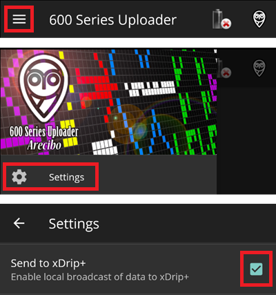

# 對於 MM640g 或 MM630g 用戶

-   如果尚未設定，請下載 [600SeriesAndroidUploader](https://pazaan.github.io/600SeriesAndroidUploader/) 並按照 [Nightscout](https://nightscout.github.io/uploader/setup/?h=uploader#medtronic-600-series-with-uploader) 的說明進行操作。
-   在 600 系列上傳器中，前往設定 > 傳送至 xDrip+ 並選擇開啟（勾選）。

-   在 [ConfigBuilder 的血糖來源](#Config-Builder-bg-source) 中選擇 MM640g。

