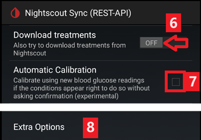

# xDrip+ 設定

如果尚未設定，請下載[xDrip+](https://jamorham.github.io/#xdrip-plus)。

停用電池優化，並允許 xDrip+ 應用程式在背景中運作。

除非你需要最近的功能或正在使用正在整合的傳感器（如 G7），否則可以安全地下載[最新 APK（穩定版）](https://xdrip-plus-updates.appspot.com/stable/xdrip-plus-latest.apk)，否則你應該使用最新的[Nightly Snapshot](https://github.com/NightscoutFoundation/xDrip/releases)。

## 所有 CGM & FGM 系統的基本設定

### 停用 Nightscout 上傳

從 AAPS 3.2 開始，你不應讓其他應用程式上傳資料（血糖和治療方案）到 Nightscout。

→ 漢堡選單 (1) → 設定 (2) → 雲端上傳 (3) -> Nightscout 同步（REST-API）(4) → 將`啟用`開關設為**關閉** (5)

#### 停用自動校正和治療方案

如果你使用的是舊版本的 AAPS（3.2 之前），請確保停用`自動校正` (7) 如果`自動校正`的複選框已勾選，請一次啟用`下載治療方案` (6)，然後再次取消勾選`自動校正`並停用`下載治療方案`。

點擊`額外選項`(8)

    {admonition} 安全警告
    :class: warning
    你必須在 xDrip+ 中停用「上傳治療」，否則在 AAPS 中可能會導致治療數量翻倍，導致錯誤的 COB 和 IOB。

停用`上傳治療方案`(9)，並確保你**不要**使用`回填資料` (11)。

應該也停用選項`失敗警報`(10)。 否則，若 Wi-Fi/行動網路有問題或伺服器不可用，你將每 5 分鐘收到一次警報。

### **應用間設定**（廣播）

如果你將使用 AAPS 並將資料轉發給 AAPS，則必須在 xDrip+ 的應用間設定中啟用廣播。

→ 漢堡選單 (1) → 設定 (2) → 應用間設定 (3) → 本地廣播**開啟** (4)

為了使 AAPS 中的數值與 xDrip+ 的數值相同，你應該啟用`發送顯示的血糖值`(5)。

啟用相容廣播 (6)。

如果你還在 xDrip+ 中啟用了`接受治療方案`，並在 AAPS xDrip+ 外掛中啟用了`啟用廣播到 xDrip+`，那麼 xDrip+ 將接收來自 AAPS 的胰島素、碳水化合物和基礎率資訊。

如果你啟用了`接受校正`，xDrip+ 將使用來自 AAPS 的校正值。 當你將此功能與 Dexcom 傳感器一起使用時請小心：請先閱讀[這篇文章](https://navid200.github.io/xDrip/docs/Calibrate-G6.html)。

請記得停用匯入音效，以避免每次 AAPS 發送基礎率/設定檔變更時 xDrip+ 播放鈴聲。

(xdrip-identify-receiver)=

#### 識別接收端

- 如果發現本地廣播有問題（AAPS 未收到來自 xDrip+ 的血糖值），請前往 → 漢堡選單 (1) 設定 (2) → 應用間設定 (3) → 識別接收端 (7)，並為 AAPS 建立輸入`info.nightscout.androidaps`（如果你使用的是 PumpControl 版本，請輸入`info.nightscout.aapspumpcontrol`）。
- 請注意：自動校正有時會將小寫字母 i 改為大寫字母。 輸入`info.nightscout.androidaps`（或 PumpControl 版本的`info.nightscout.aapspumpcontrol`）時**只能使用小寫字母**。 大寫 I 將會阻止應用程式接收來自 xDrip+ 的血糖值。
    
    

## 使用 AAPS 在 xDrip+ 中進行校正

- 如果你希望能夠使用 AAPS 進行校正，請在 xDrip+ 中前往設定 → 應用間相容性 → 接受校正並選擇開啟。 
- 你可能還想檢查設定 → 不常見的設定 → 高階校正設定中的選項。

## Dexcom G6

- Dexcom G6 傳輸器可以同時連線到 Dexcom 接收器（或替代的 t:slim 幫浦）和手機上的一個應用程式。
- 當使用 xDrip+ 作為接收器時，請先卸載 Dexcom 應用程式。 **你無法同時將 xDrip+ 和 Dexcom 應用程式連線到傳輸器！**
- 如果你需要 Clarity 並想利用 xDrip+ 的功能，請使用[自行建立的 Dexcom 應用程式](#DexcomG6-if-using-g6-with-build-your-own-dexcom-app)與 xDrip+ 進行本地廣播，或者使用 xDrip+ 作為接收來自官方 Dexcom 應用程式通知的配套應用程式。

### G6 傳輸器序列號決定的 xDrip+ 版本

- 2018 年秋季/年底後製造的所有 G6 傳輸器稱為“Firefly”。 他們不允許在不[移除傳輸器](https://navid200.github.io/xDrip/docs/Remove-transmitter.html)的情況下重新啟動傳感器，也不發送原始資料。 建議使用最新的[Nightly Snapshot](https://github.com/NightscoutFoundation/xDrip/releases)。
- 舊的重新更換電池的傳輸器和改裝過的傳輸器允許延長感測器的使用壽命和重啟，並且它們還會發送原始資料。 你可以使用[最新 APK（穩定版）](https://xdrip-plus-updates.appspot.com/stable/xdrip-plus-latest.apk)。

### Dexcom 特定設定

- 按照[這些指示](https://navid200.github.io/xDrip/docs/G6-Recommended-Settings.html)設定 xDrip+。

### 不建議進行預防性重啟

**僅限於重新電池處理或修改過的 Dexcom 傳輸器。 [預防性重啟](https://navid200.github.io/xDrip/docs/Preemptive-Restart.html)不適用於標準傳輸器，並將完全停止傳感器：你需要[移除傳輸器](https://navid200.github.io/xDrip/docs/Remove-transmitter.html)來重新啟動傳感器。**

Dexcom 傳感器的自動延長（`預防性重啟`）不建議使用，因為這可能會導致第9天後血糖值容易出現“波動”。

要安全使用此功能，請注意以下幾點：

- 如果你在 xDrip+ 或 Spike 中使用帶有校正碼的原始資料，最安全的做法是不允許傳感器進行預防性重啟。
- 如果必須進行預防性重啟，請確保在你能觀察變化並在必要時進行校正的時間進行。 
- 如果你正在重啟傳感器，請在沒有工廠校正的情況下進行，以在第11天和第12天獲得最安全的結果，或者確保你準備好進行校正並密切關注變化。
- 提前植入 G6 傳感器並使用出廠校準，可能會導致結果產生變異。 如果你進行預先浸泡，為獲得最佳結果，你可能需要校正傳感器。
- 如果你沒有密切注意可能發生的變化，可能會比較好切換回非出廠校準模式，並像使用 G5 一樣操作系統。

要了解更多詳細資訊和這些建議的原因，請閱讀 Tim Street 在[www.diabettech.com](https://www.diabettech.com)上發表的[完整文章](https://www.diabettech.com/artificial-pancreas/diy-looping-and-cgm/)。

(xdrip-connect-g6-transmitter-for-the-first-time)=

### 首次連線 G6 傳輸器

**如需第二個及後續傳輸器，請參閱[延長傳輸器壽命](#xdrip-extend-transmitter-life)部分。**

請按照[這些指示](https://navid200.github.io/xDrip/docs/Starting-G6.html)進行操作。

(xdrip-transmitter-battery-status)=

### 傳輸器電池狀態

- 可以在系統狀態中檢查電池狀態  
    → 漢堡選單 (1) → 系統狀態 (2) → 如果你處於傳統狀態頁面 (3) 向右滑動螢幕 (4) 到達 → G5/G6/G7 狀態頁面。

- 有關更多資訊，請參閱[這裡](https://navid200.github.io/xDrip/docs/Battery-condition.html)。

(xdrip-extend-transmitter-life)=

### 延長傳輸器壽命

- [Firefly 傳輸器](https://navid200.github.io/xDrip/docs/Transmitter-lifetime.html)的壽命無法延長：僅限於重新電池處理或修改過的傳輸器。
- 請按照[這些指示](https://navid200.github.io/xDrip/docs/Hard-Reset.html)為非 Firefly 傳輸器進行操作。

(xdrip-replace-transmitter)=

### 更換傳輸器

- 關閉原始 Dexcom 接收器（如果已使用）。
- [停止傳感器](https://navid200.github.io/xDrip/docs/Dexcom/StartG6Sensor.html)（僅在更換傳感器時）。

- 在 xDrip+ 系統狀態和手機的藍牙設定中忘記裝置（將顯示為 Dexcom?? 而 ?? 最後兩位數字是發射器序列號的最後兩位數）  
    → 漢堡選單（1）→ 系統狀態（2）→ 如果您不在傳統狀態頁面（3），請滑動螢幕（4）以到達該頁面 → 然後點擊「忘記裝置」（5）。

- 移除傳輸器（如果更換傳感器，則同時移除傳感器）。 若要在不移除傳感器的情況下移除傳輸器，請參閱[這裡](https://navid200.github.io/xDrip/docs/Remove-transmitter.html)，或觀看此影片<https://youtu.be/AAhBVsc6NZo>。
- 將舊的傳輸器放遠以防止重新連線。 微波是一個完美的法拉第屏蔽裝置 - 但為了完全確保安全，請拔掉電源線以確保沒有人會打開微波。
- 請按照[這些指示](https://navid200.github.io/xDrip/docs/Starting-G6.html)進行操作。
- 在 xDrip+ 顯示第一次讀取值之前，不要重新開啟原始 Dexcom 接收器（如果已使用）。

### 新傳感器

- 關閉原始 Dexcom 接收器（如果已使用）。
- 按照[這些指示](https://navid200.github.io/xDrip/docs/Dexcom/StartG6Sensor.html)停止傳感器。

- 植入並按照[這些指示](https://navid200.github.io/xDrip/docs/Starting-G6.html)啟動新傳感器。

(xdrip-retrieve-sensor-code)=

### 檢索傳感器碼

→ 漢堡選單 (1) → 系統狀態 (2) → 如果你處於經典狀態頁面 (3) 向右滑動螢幕 (4) 到達 → G5/G6/G7 狀態頁面 → 校正碼。

(xdrip-troubleshooting-dexcom-g5-g6-and-xdrip)=

### Dexcom G5/G6 和 xDrip+ 的問題排除

#### 傳輸器連線問題

按照[這些指示](https://navid200.github.io/xDrip/docs/Connectivity-troubleshoot.html)進行操作。

#### 啟動新傳感器時的問題

請按照[這些指示](https://navid200.github.io/xDrip/docs/Dexcom/SensorFailedStart.html)進行操作。

## Libre 1

- 在 xDrip+ 中設置你的 NFC 至藍牙橋接器
    
    → 漢堡選單 (1) → 設定 (2) → 不常見設定 (3) → 藍牙設定 (4)

- 在藍牙設定中，請將勾選框設置為下方截圖所示的設定 (5)
    
    - 停用監控程式，因為他們會重置手機藍牙並中斷幫浦連線。
    
    

- 你可以嘗試啟用以下設定 (7)
    
    - 使用掃描功能
    - 信任自動連線
    - 使用背景掃描

- 如果你經常失去與橋接器的連線或難以恢復連線，**請停用他們** (8)。
    
    

- 除非你知道為什麼要啟用，否則請保持其他選項為停用狀態。
    
    

### Libre 智慧讀取器電池電量

- 如 MiaoMiao 和 Bubble 等橋接器的電池電量可以顯示在 AAPS 中（Blucon 不支援）。
- 詳細資訊請參閱[螢幕截圖頁面](#screens-sensor-level-battery)。

### 連線 Libre 傳輸器並啟動傳感器

- 如果你的傳感器需要（例如 Libre 2 EU 和 Libre 1 US），請安裝最新的外部處理演算法。

- 你的傳感器必須已經使用供應商應用程式或讀取器啟動（xDrip+ 無法啟動或停止 Libre 傳感器）。

- 將資料來源設置為 Libre 藍牙。
    
    → 漢堡選單 (1) → 設定 (2) → 在硬體資料來源中選擇 Libre 藍牙 (3)
    
    

- 掃描藍牙並連線橋接器。
    
    → 漢堡選單 (1) → 掃描藍牙 (2) → 掃描 (3)
    
    - 如果 xDrip+ 找不到橋接器，請確保他未連線到供應商應用程式。將其插入充電並重置。
    
    

- 在 xDrip+ 中啟動傳感器。
    
        {admonition} 安全警告
        :class: warning
        在一小時的暖機時間結束之前請勿使用傳感器資料：該數值可能會異常高，並導致 AAPS 中的錯誤決策。
    
    → 漢堡選單 (1) → 啟動傳感器 (2) → 啟動傳感器 (3) → 設置你使用讀取器或供應商應用程式啟動傳感器的精準時間。如果你不是今天啟動的，請選擇“不是今天” (4)。

(xdrip-libre2-patched-app)=

## Libre 2 修補版(patched) 應用程式

- 將資料來源設置為 Libre 修補版應用程式。
    
    → 漢堡選單 (1) → 設定 (2) → 在硬體資料來源中選擇 Libre（修補版應用程式）(3)
    
    

- 你可以在不常見設定->額外日誌紀錄設定->額外標籤紀錄中新增`BgReading:d,xdrip libre_receiver:v`。 這將紀錄額外的錯誤訊息以進行問題排除。

