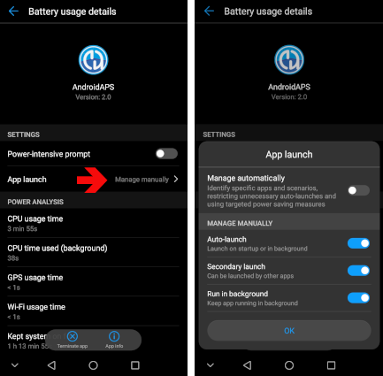

# 如何配置華為手機

有一些選項，部分是 Android 特定的，部分是華為特定的：

* 將 AAPS 和 xdrip+ 添加到忽略電池優化的應用程式列表中：
  
  * 設定 / 應用 / 設定 / 特殊授權 / 忽略電池優化 / 選擇「所有應用程式」/ 將應用程式設為允許
    
    

* 設置電池選項：
  
  * 設定 / 應用 / 選擇 AndroidAPS/xdrip+ / 在電池選項下 / 應用啟動
    
    * 確保移除「自動管理」
    * 允許：
      
      * 自動啟動
      * 次要啟動（可以由其他應用程式啟動）
      * 後台運作
        
        

* 鎖定應用程式
  
  * 進入應用程式最近使用列表並選擇鎖定圖示
    
    

對於 xDrip+，你必須啟用持久通知（在 xDrip+應用程式內）：

* 設定 / 不太常見的設定 / 其他雜項選項 / 在前景中運行收集器
  
  

根據 Android 版本，這些設定位於其他位置。 這些解釋適用於 Android 8.1。