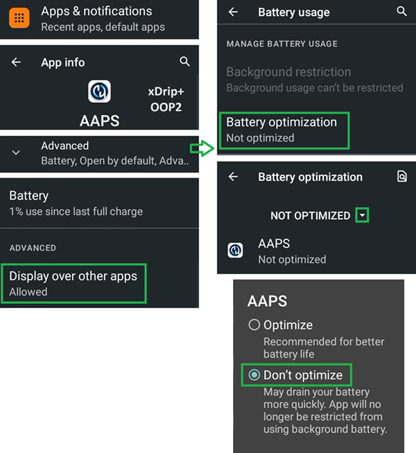
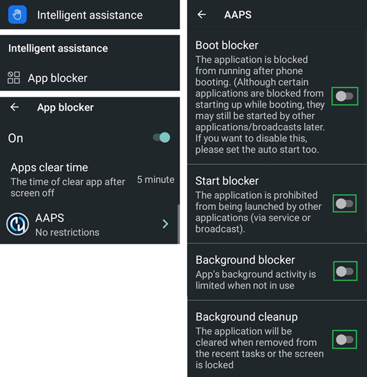

# Jelly

## Jelly 2

Do not confuse with Jelly Star (below).

**優點**

* 他真的很小。
* Android 11。
* 即使你告訴別人，他們可能也不會認為這是一台普通的智慧型手機，並會更容易接受他在禁止使用手機的場合中的例外情況。

**缺點**

* 僅推薦給經驗豐富的 Looper 使用者（某些設定無法辨識，你必須根據使用大尺寸 Android AAPS 手機的經驗知道什麼東西在哪裡）。 某些 AAPS 按鈕難以精準觸碰，尤其對於手指粗大的人來說。
* 只能作為 LooperPhone 使用。 口袋中最好還是放一台普通的智慧型手機。 

### 電池壽命最佳化

Jelly 2 配有強大的最佳化功能，**必須**停用這些功能以便 AAPS（以及其他 DIY 應用程式如 BYODA、xDrip+、OOP2、Juggluco 等）正常運作。

你可以啟用智慧輔助功能，但**必須停用這些功能以便 DIY 應用程式正常運作**。

你可以啟用 NFC 來支援 Libre 傳感器。

## Jelly Star Mini

**功能**

* Android 13
* 8 GB RAM

### 電池壽命最佳化

To avoid interference with **AAPS**, the Jelly Star 'battery usuage' should be disabled by selecting 'unrestricted' (and other **DIY apps** like BYODA, xDrip+, OOP2, Juggluco, etc...).

### Intelligent Assistance and App Blocker

Like with the Jelly 2 (above), the Jelly Star should have 'Intelligent Assistance' disabled for **DIY apps**. Similarly, 'App Blocker' under 'Settings' must also be switched off to avoid disruption with **AAPS**:

### Gooogle Play Protect

Google Play Protect should also be disabled.