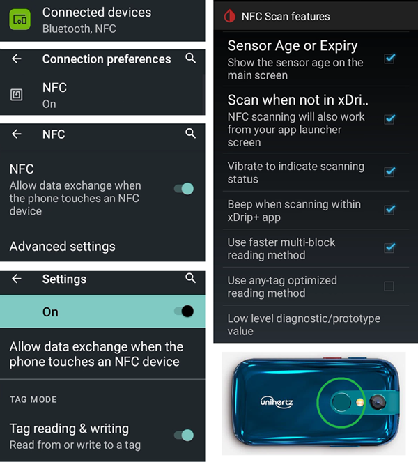

* * *

orphan: true

* * *

# Jelly

## Jelly 2

請不要與 Jelly Star (如下所示) 混淆。

**優點**

* 他真的很小。
* Android 11。
* 即使你告訴別人，他們可能也不會認為這是一台普通的智慧型手機，並會更容易接受他在禁止使用手機的場合中的例外情況。

**缺點**

* 僅推薦給經驗豐富的 Looper 使用者（某些設定無法辨識，你必須根據使用大尺寸 Android AAPS 手機的經驗知道什麼東西在哪裡）。 某些 AAPS 按鈕難以精準觸碰，尤其對於手指粗大的人來說。
* 只能作為 LooperPhone 使用。 口袋中最好還是放一台普通的智慧型手機。 

### 電池壽命最佳化

Jelly 2 配有強大的最佳化功能，**必須**停用這些功能以便 AAPS（以及其他 DIY 應用程式如 BYODA、xDrip+、OOP2、Juggluco 等）正常運作。

你可以啟用智慧輔助功能，但**必須停用這些功能以便 DIY 應用程式正常運作**。

你可以啟用 NFC 來支援 Libre 傳感器。

## Jelly Star Mini

**功能**

* Android 13
* 8 GB RAM

### 電池壽命最佳化

為了避免影響 **AAPS** 的使用，Jelly Star 的「電池使用」應該設定為「不限制」，並在其他 **DIY 應用程式**（如 BYODA、xDrip+、OOP2、Juggluco 等等）中也應如此設定。

### 智慧助手與應用程式阻擋器

與 Jelly 2 (如上所示) 一樣，Jelly Star 應該在 **DIY 應用程式** 當中關閉「智慧助手」。 同樣地，必須在「設定」中將「應用程式阻擋器」關閉，以避免干擾 **AAPS**：

### Google Play 保護

請記得關閉 Google Play 保護。