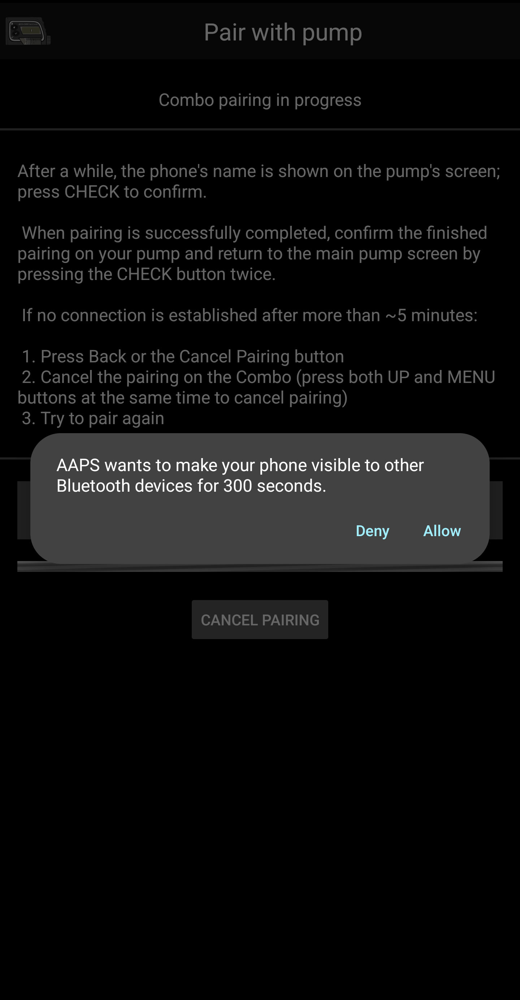
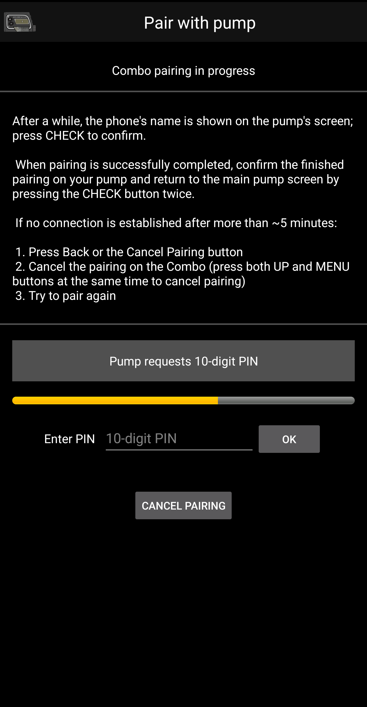

# Accu Chek Combo 幫浦

**這個軟體是 DIY 解決方案的一部分，並不是一個產品，因此需要你自己閱讀、學習並暸解系統以及如何使用他。 他不是一個能為你完全管理糖尿病的工具，但如果你願意投入時間，他可以幫助你改善糖尿病並提高生活品質。 不要急著使用，先給自己學習的時間。 你需要對自己使用的結果負完全責任。**

## 硬體和軟體需求

* 一台 Roche Accu-Chek Combo 幫浦（任何韌體版本均可使用）。
* 一個 Smartpix 或 Realtyme 裝置，配合 360 設定軟體來配置幫浦。 （Roche 在客戶要求下會免費寄送 Smartpix 裝置和設定軟體。）
* 一台相容的手機。 至少需要 Android 9（Pie）或更新版本。 如果使用 LineageOS，最低支援版本為 16.1。 請參閱 [發行說明](#maintenance-android-version-aaps-version) 以獲取詳細訊息。
* 手機上安裝了 AndroidAPS 應用程式。

根據手機的藍牙支援品質及其是否具備額外的省電邏輯，有些手機可能比其他手機運作得更好。 手機列表可以在 [AAPS 手機列表](#Phones-list-of-tested-phones) 文件中找到。 請注意，這不是完整的列表，只反應個人使用經驗。 我們鼓勵你也分享你的經驗，這樣可以幫助其他人（這些專案是關於傳遞經驗）。

(combov2-before-you-begin)=
## 開始之前

**安全第一**—請勿在無法復原的環境中嘗試此過程。 隨身攜帶你的 Smartpix / Realtyme 裝置，以及 360 配置軟體。 預計花費大約一小時來設置並檢查所有功能是否正常運作。

請注意以下限制：

* 目前不支援擴展注射和多波注射 (你可以使用 [擴展碳水化合物](../DailyLifeWithAaps/ExtendedCarbs.md) 作為替代)。
* 僅支援一個基礎設定檔（第一個）。
* 如果幫浦上的目前活動設定檔不是設定檔 1，則循環模式將被停用。 這種情況會持續到設定檔 1 被設為活動檔案；當這樣做後，下一次 AAPS 連線時（無論是自動還是因為用戶在 combov2 用戶介面中按下了重新整理按鈕），他會注意到設定檔 1 是目前的活動檔案，並重新啟用循環模式。
* 如果循環請求取消正在運作的 TBR，Combo 將設置一個 90% 或 110% 的 TBR，持續 15 分鐘。 這是因為實際取消 TBR 會在幫浦上觸發警報，並產生大量震動，這些震動無法停用。
* 藍牙連線的穩定性隨不同手機而異，可能會出現「幫浦無法使用」的警報，這時幫浦無法再建立連線。 如果發生此錯誤，請確認藍牙已啟用，按下 Combo 標籤中的重新整理按鈕以檢查是否是臨時問題，如果仍無法建立連線，重啟手機，這通常能解決問題。
* 另一個問題是重啟無法解決，必須按幫浦上的按鈕（這會重置幫浦的藍牙堆疊），幫浦才能再次接受來自手機的連線。
* 避免在幫浦上設定 TBR，因為循環控制 TBR。 在幫浦上偵測到新的 TBR 可能需要長達 20 分鐘，並且 TBR 的效果僅從偵測時開始計算，因此最壞情況下可能有 20 分鐘的 TBR 沒有反應在 IOB 中。

如果你一直在使用依賴於單獨 Ruffy 應用程式的舊 Combo 驅動程式，並希望切換到這個新驅動程式，請注意需要重新進行配對——Ruffy 和新 Combo 驅動程式無法共享配對資訊。 此外，請確保 Ruffy 未_在運作_。 如果有疑問，長按 Ruffy 應用程式圖示以調出上下文選單。 在該選單中，按「應用程式資訊」。 在剛剛打開的介面中，按「強制停止」。 這樣可以確保啟動的 Ruffy 實例不會干擾新驅動程式。

此外，如果你正在從舊驅動程式遷移，請注意，新驅動程式以完全不同的方式將注射指令傳達給 Combo，速度更快，因此不要驚訝於無論劑量大小，注射都會立即開始。 此外，有關處理 Ruffy 配對和連線問題的一般建議、提示和技巧等不適用於此處，因為這是一個全新的驅動程式，與舊驅動程式沒有共享任何代碼。

該新驅動程式目前支援 Combo 上以下語系。 （這與 AAPS 的語系無關——是顯示在 Combo LCD 上的語系。）

* 英語
* 西班牙語
* 法語
* 義大利語
* 俄語
* 土耳其語
* 波蘭語
* 捷克語
* 匈牙利語
* 斯洛伐克語
* 羅馬尼亞語
* 克羅地亞語
* 荷蘭語
* 希臘語
* 芬蘭語
* 挪威語
* 葡萄牙語
* 瑞典語
* 丹麥語
* 德語
* 斯洛文尼亞語
* 立陶宛語

**重要**：如果你的幫浦設置為不在此列表中的語系，請聯繫開發人員，並將幫浦的語系設置為此列表中的一個語系。 否則，驅動程式將無法正常工作。

## 手機設置

確保關閉電池優化設定非常重要。 AAPS 在自動偵測當受這些優化影響時，會發出請求將這些優化關閉。 但在現代 Android 手機中，藍牙_本身_是一個應用程式（系統應用程式）。 通常，「藍牙應用程式」在預設情況下_啟用了電池優化_。 結果是，當手機為了省電而關閉藍牙應用程式時，藍牙可能拒絕回應。 這意味著在藍牙系統應用程式的設置中，也必須關閉電池優化。 不幸的是，不同手機找到藍牙系統應用程式的方法各不相同。 在原生 Android 中，前往設定 -&gt; 應用程式 -&gt; 查看所有 N 個應用程式（N = 你手機上的應用程式數量）。 然後，打開右上角的選單，點擊「顯示系統」或「顯示系統應用程式」或「所有應用程式」。 現在，在新擴展的應用程式列表中，查找「藍牙」應用程式。 選擇他，並在其「應用程式資訊」頁面上，點擊「電池」。 在那裡，停用電池優化（有時稱為「電池使用量」）。

## Combo 設置

* 使用 Accu-Chek 360 設定軟體配置幫浦。 如果你沒有這個軟體，請聯絡你的 Accu-Chek 客服專線。 他們通常會向註冊用戶寄送附有 "360° 幫浦設定軟體" 的 CD 和 SmartPix USB 紅外線連線裝置（如果你有 Realtyme 裝置，也可以使用）。

  - **必要設定**（在螢幕截圖中以綠色標記）：

     * 將/保持選單配置設為「標準」，這將只顯示幫浦支援的選單/操作，並隱藏不支援的部分（如延長注射/多波注射、多重基礎率），使用這些功能會限制循環功能，因為無法在安全的情況下運作循環。
     * 確認 _快速資訊文本_ 設定為「快速資訊」（不加雙引號，位於 _胰島素幫浦選項_ 下）。
     * 將 TBR _最大調整_ 設定為 500%
     * 停用 _臨時基礎率的結束訊號_
     * 將 TBR _持續時間增量_ 設定為 15 分鐘
     * 啟用藍牙

  - **推薦設定**（在螢幕截圖中以藍色標記）

     * 根據你的需求設置低匣警報
     * 配置一個適合你治療的最大注射量，以防軟體中的錯誤
     * 同樣地，配置 TBR 的最大持續時間作為防護措施。 允許至少 3 小時，因為選擇中斷幫浦 3 小時會設置 0% 持續 3 小時。
     * 啟用幫浦的按鍵鎖定，以防止從幫浦進行注射，特別是當幫浦之前已經使用過且快速注射是習慣時。
     * 將顯示逾時和選單逾時分別設置為最小值 5.5 和 5。 這允許 AAPS 更快地從錯誤情況中恢復，並減少在這些錯誤期間可能發生的震動次數。

  

  

  

  

## 註冊驅動並將其與 Combo 配對

* 在[組態建置工具 > 幫浦](../SettingUpAaps/ConfigBuilder.md)中選擇 "Accu-Chek Combo" 驅動程式。 **重要提示**：名單中也有舊驅動，稱為 "Accu-Chek Combo (Ruffy)"。 請 _不要_ 選擇那個。

  

* 點擊齒輪圖示以打開驅動設定。

* 在設定用戶介面中，點擊螢幕頂部的 'Pair with pump' 按鈕。 這將打開 Combo 配對用戶介面。 按照螢幕上的指示開始配對。 當 Android 要求允許讓手機對其他藍牙裝置可見時，請按 "允許"。 最終，Combo 會在其螢幕上顯示一個自定義的 10 位配對 PIN，並且驅動程式會請求他。 在相應的欄位中輸入該 PIN。

  

  

  

  

  

* 當驅動請求 Combo 上顯示的 10 位 PIN，並且代碼輸入錯誤時，會顯示如下： 

* 配對完成後，在顯示配對成功的螢幕上按 OK 按鈕關閉配對用戶介面。 完成後，你會返回驅動設定用戶介面。 'Pair with pump' 按鈕現在應該變灰且無法使用。

  成功配對後，Accu-Chek Combo 標籤看起來如下：

  

  但如果沒有與 Combo 配對，則標籤看起來如下：

  

* 為了驗證你的設置（幫浦與任何導管**中斷連線**以確保安全！），使用 AAPS 設置一個 500％ 的 TBR 持續 15 分鐘並發出注射指令。 幫浦現在應該正在運作 TBR，並且歷史紀錄中有注射紀錄。 AAPS 也應顯示活動的 TBR 和已注射的紀錄。

* 建議在 Combo 上啟用按鍵鎖定，以防止從幫浦進行注射，特別是之前已經使用幫浦並使用 "快速注射" 功能時。

## 關於配對的注意事項

Accu-Chek Combo 是在藍牙 4.0 發佈之前開發的，僅在第一款 Android 版本發佈一年後。 這就是為什麼他與其他設備配對的方式，與當今 Android 中的方式不100％ 相容。 要完全克服這一點，AAPS 需要系統級別的權限，這僅適用於系統應用程式。 這些應用程式由手機製造商安裝在手機中 - 用戶無法安裝系統應用程式。

其結果是，配對永遠不會是100％無問題的，儘管在這個新驅動程式中已大幅改進。 特別是，在配對過程中，Android 的藍牙 PIN 對話框可能會短暫顯示並自動消失。 但有時，他會停留在螢幕上，並要求輸入 4 位數 PIN。 （這與 10 位 Combo 配對 PIN 不同。） 不要輸入任何東西，只需按取消即可。 如果配對未繼續，請按照螢幕上的指示重試配對。

(combov2-tab-contents)=
## Accu-Chek Combo 標籤內容

當幫浦已配對時，標籤顯示以下訊息（項目按從上到下的順序列出）：

1. _驅動狀態_：驅動可以處於以下狀態之一：
   - 「中斷連線」：沒有藍牙連線；驅動大多數時間處於此狀態，僅在需要時連線至幫浦 - 這樣可以節省電力
   - 「連線中」
   - 「檢查幫浦」：幫浦已連線，但驅動目前正在執行安全檢查，以確保一切正常並且是最新的
   - 「準備就緒」：驅動準備接受來自 AAPS 的指令
   - 「暫停」：幫浦暫停（在 Combo 中顯示為「停止」）
   - 「執行指令」：正在執行 AAPS 指令
   - 「錯誤」：發生錯誤；連線已終止，任何正在進行的指令都被中止
2. _最後連線_：驅動上次成功連線至 Combo 是多少分鐘前；如果此時間超過 30 分鐘，此項目會顯示為紅色
3. _目前活動_：有關幫浦目前正在執行的操作的詳細訊息；這里還顯示一個細長的進度條來顯示指令執行的進度，例如設置基礎輸注設定檔
4. _電池_：電池電量；Combo 只顯示「滿」、「低」、「空」電池，並且沒有提供更準確的數字（如百分比），因此這裡僅顯示這三個級別
5. _儲存庫_：Combo 儲存庫中目前有多少國際單位（IU）
6. _上次注射_：上次注射是多少分鐘前進行的；如果在啟動 AAPS 後還沒有進行過注射，這是空白的
7. _臨時基礎率_：目前活動的臨時基礎率的詳細訊息；如果目前沒有活動的臨時基礎率，這是空白的
8. _基本基礎率_：目前活動的基礎基礎率（「基礎」意味著不受任何活動 TBR 影響的基礎率因子）
9. _序列號_：Combo 序列號，如幫浦顯示的（這與 Combo 背面的序列號一致）
10. _藍牙地址_：Combo 的 6 位元組藍牙地址，以 `XX:XX:XX:XX:XX:XX` 格式顯示

Combo 可以在 _遠端終端_ 模式或 _指令_ 模式下透過藍牙操作。 遠端終端模式對應於 Combo 計的 "遠端控制模式"，該模式模擬了幫浦的 LCD 和四個按鈕。 有些指令必須由驅動在此模式下執行，因為他們在指令模式中沒有相應的功能。 後一種模式要快得多，但正如所說範圍有限。 當遠端終端模式註冊時，目前遠端終端螢幕顯示於位於底部 Combo 圖的上方的欄位中。 然而當驅動切換到指令模式時，該欄位將保持空白。

（用戶不影響這一點；驅動完全自主決定使用何種模式。這僅是為了讓用戶知道為什麼有時可以在該欄位中看到 Combo 畫面。） 最底部有一個 「重新整理」 按鈕。

這會觸發幫浦狀態的即時更新。 他也用於告訴 AAPS 之前發現的錯誤現在已修復，可以讓 AAPS 再次檢查一切是否正常（更多相關訊息請參閱 [警報部分](combov2-alerts)）。 他還用於讓AAPS知道之前發現的錯誤已修復，並且AAPS可以再次檢查一切是否正常（更多內容請參閱[關於警報的部分](#combov2-alerts)）。

## 偏好設定

這些偏好設定適用於 combo 驅動（項目按從上到下的順序列出）：

1. _與幫浦配對_：這是一個可以按下的按鈕，用於與 Combo 配對。 如果已經配對了幫浦，他將無法使用。
2. _取消幫浦配對_：取消配對已配對的 Combo；與項目1相反。 如果沒有已配對的幫浦，他將無法使用。
3. _發現持續時間（以秒為單位）_：配對時，驅動會使手機對幫浦可見。 這控制了這種可見性持續多久。 預設選擇最大值（300 秒 = 5 分鐘）。 Android 不允許可見性無限期持續，因此必須選擇一個持續時間。
4. _自動偵測並自動輸入胰島素儲存庫變更_：如果啟用，通常透過 Action 標籤中的 "注射/填充" 按鈕由用戶完成的 "儲存庫變更" 操作。 這在[下面進一步詳細說明](#combov2-autodetections)。
5. _自動偵測並自動輸入電池更換_：如果啟用，通常由用戶透過 Action 標籤中的 "幫浦電池變更" 按鈕完成的 "電池更換" 操作。 這在[下面進一步詳細說明](#combov2-autodetections)。
6. _啟用詳細 Combo 日誌紀錄_：這大大擴展了驅動紀錄的日誌數量。 **注意**：除非開發人員要求，否則不要啟用此功能。 否則，這會增加大量的干擾到 AndroidAPS 日誌中，減少他們的實用性。

大多數用戶只使用頂部兩個項目，即 _與幫浦配對_ 和 _取消幫浦配對_ 按鈕。

(combov2-autodetections)=
## 自動偵測並自動輸入電池和儲存庫變更

驅動程式能夠透過跟蹤電池和儲存庫的電量來偵測電池和儲存庫變更。 如果上次幫浦狀態更新時 Combo 報告的電池電量為低，且現在在新的幫浦狀態更新中顯示為正常，驅動程式就會推斷用戶必須已經更換了電池。 儲存庫電量也採用相同的邏輯：如果現在顯示為比之前更高，這被解釋為儲存庫變更。

這僅當電池和儲存庫報告為低時_並且_電池和儲存庫有充分的填充時才起效。

可以在偏好設定用戶界面中關閉這些自動偵測。

(combov2-alerts)=
## 警報（警告和錯誤）以及如何處理他們

Combo 以遠端終端螢幕的形式顯示警報。 警告會顯示一個“Wx”代碼（x 是一個數字），並附有簡短描述。 其中一個例子是“W7”，“TBR OVER”。 錯誤類似，但會顯示“Ex”代碼。

某些警告會被驅動程式自動消除。 這些包括：

- W1 “儲液槽低”：驅動程式會將其轉為顯示於 AAPS 主標籤上的“儲液槽低”警告
- W2 “電池低”：驅動程式會將其轉為顯示於 AAPS 主標籤上的“電池低”警告
- W3、W6、W7、W8：這些僅供用戶參考資訊，驅動程式會自動消除他們，因此是安全的

其他警告 _不會_ 被自動消除。 此外，錯誤 _絕不_ 會被自動消除。 這兩者都是以相同方式處理：他們會導致驅動程式在 AAPS 介面上顯示警報對話框，並中止任何正在執行的指令。 驅動程式會切換到“錯誤”狀態（詳見 [上述 Accu-Chek Combo 標籤內容描述](#combov2-tab-contents)）。 此狀態不允許任何指令執行。 用戶需要在幫浦上處理錯誤；例如，阻塞錯誤可能需要更換套管。 用戶處理好錯誤後，按下 Accu-Chek Combo 標籤上的“重新整理”按鈕即可恢復正常操作。 然後驅動程式會連線到 Combo 並更新其狀態，檢查畫面上是否仍顯示錯誤等。 此外，驅動程式會在稍後自動重新整理幫浦狀態，因此手動按該按鈕並非必要。

注射是一個特殊案例。 他在 Combo 的指令模式下執行，此模式下不會在中途報告出現的警報。 因此，驅動程式無法在注射期間自動消除警告。 這意味著不幸的是，幫浦在注射完成之前會一直發出哔哔聲。 最常見的中途警報通常是 W1“儲液槽低”。 **不要** 在注射期間手動取消幫浦上的 Comnbo 警告。 這會有中斷注射的風險。 注射結束後驅動程式會處理警告。

在驅動程式未與 Combo 連線期間發生的警報不會被驅動程式注意到。 Combo 無法自動將該警報推送到手機；始終需要手機發起連線。 因此，該警報將持續存在，直到驅動程式連線到幫浦。 用戶可以按“重新整理”按鈕以觸發連線，讓驅動程式立即處理該警報（而不是等待 AAPS 自行決定發起連線）。

**重要**：如果發生錯誤或顯示非自動消除的警告，驅動程式會進入錯誤狀態。 在這種狀態下，循環 **將會被阻斷** 直到幫浦狀態被重新整理！ 在幫浦狀態更新（無論是手動按“重新整理”按鈕還是驅動程式最終自動更新）且不再顯示錯誤後，狀態會被解除阻斷。

## 使用 Combo 時需注意的事項

* 請記住這不是一個產品，特別是在初期，使用者需要監控並暸解系統、其限制以及可能出現的故障方式。 強烈建議不要在不充分瞭解系統的人使用該系統時使用他。
* 由於 Combo 的遠端控制功能運作方式，幾個操作（特別是設定基礎設定檔）相比其他幫浦較慢。 這是 Combo 無法克服的不便限制。
* 不要在幫浦上設置或取消 TBR。 循環假設他控制 TBR，否則系統無法可靠工作，因為無法確定用戶在幫浦上設定 TBR 的開始時間。
* 當 AAPS 與幫浦進行通訊時（幫浦上顯示藍牙標誌時），請不要按任何按鈕。 這樣做會中斷藍牙連線。 只有在建立連線時出現問題時才這樣做 (請參見[上述的 "開始之前" 部分](#combov2-before-you-begin))。
* 在幫浦注射時請不要按任何按鈕。 特別是，不要嘗試透過按下按鈕來取消警報。 請參閱[有關警報的部分](#combov2-alerts)以獲取更詳細的解釋。

## 無法建立與 Combo 連線時的檢查清單

驅動程式會盡最大努力連線到 Combo，並使用幾個技巧以最大化可靠性。 然而，有時連線無法建立。 以下是一些解決此情況的步驟。

1. 按一下 Combo 的按鈕。 有時，Combo 的藍牙堆疊變得無反應，不再接受連線。 按一下 Combo 的按鈕並顯示 LCD 螢幕內容，藍牙堆疊會重置。 大部分情況下，這是解決連線問題所需的唯一步驟。
2. 重啟手機。 如果手機的藍牙堆疊本身有問題，則可能需要這樣做。
3. 如果 Combo 的電池蓋已經老化，考慮更換他。 老舊的電池蓋可能會導致 Combo 的電源供應問題，從而影響藍牙。
4. 如果連線嘗試仍然失敗，考慮解除配對並重新配對幫浦。
