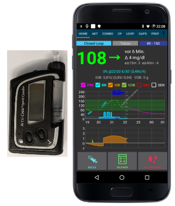

* * *

orphan: true

* * *

# Accu Chek Combo 幫浦

**這個軟體是 DIY 解決方案的一部分，並不是一個產品，因此需要你自己閱讀、學習並暸解系統以及如何使用他。 他不是一個能為你完全管理糖尿病的工具，但如果你願意投入時間，他可以幫助你改善糖尿病並提高生活品質。 不要急著使用，先給自己學習的時間。 你需要對自己使用的結果負完全責任。**

(Accu-Chek-Combo-Pump-hardware-requirements)=

## 硬體需求

- 任何版本的 Roche Accu-Chek Combo（任何韌體版本皆支援）
- 一個 Smartpix 或 Realtyme 裝置，配合 360 設定軟體來配置幫浦。 （Roche 在客戶要求下會免費寄送 Smartpix 裝置和設定軟體。）
- 一部相容的手機：Android 手機，需安裝 LineageOS 14.1（前稱 CyanogenMod）或至少 Android 8.1（Oreo）。 從 AAPS 3.0 開始，Android 9 是必須的。 請參閱 [發行說明](#maintenance-android-version-aaps-version) 以獲取詳細訊息。
- 使用 LineageOS 14.1 時，手機必須是 2017 年 6 月以後的版本，因為只有那時的改變才允許配對 Combo 幫浦。 
- 手機列表可以在 [AAPS 手機列表](#Phones-list-of-tested-phones) 文件中找到。
- 請注意，這不是完整的列表，只反應個人使用經驗。 我們鼓勵你也分享你的經驗，這樣可以幫助其他人（這些專案是關於傳遞經驗）。
- 請注意，儘管 Android 8.1 允許與 Combo 通訊，但 AAPS 在 8.1 上仍有問題。
- 對於進階使用者，可以在已 root 的手機上進行配對，然後將其轉移到另一部已 root 的手機上使用 ruffy/AAPS，這兩部手機都需要 root。 這使得使用 Android 版本低於 8.1 的手機成為可能，但尚未廣泛測試：https://github.com/gregorybel/combo-pairing/blob/master/README.md

## 限制

- 延長注射和多波段注射不支援（請參閱[延長碳水化合物](../DailyLifeWithAaps/ExtendedCarbs.md)）。
- 僅支援一個基礎率設定檔。
- 在幫浦上設定其他基礎率設定檔或進行延長注射或多波段注射，會干擾 TBR，並使循環進入低懸掛模式6小時，因為在這種情況下無法安全運作循環。
- 目前無法在幫浦上設定時間和日期，因此必須手動進行[夏令時間變更](#time-adjustment-daylight-savings-time-dst)（您可以在晚上停用手機的自動時鐘更新，早上與幫浦時鐘一起改回來，以避免夜間鬧鐘）。
- 目前僅支援 0.05 至 10 U/h 範圍內的基礎率。 這也適用於修改設定檔的情況，例如當增加到 200% 時，最高基礎率不得超過 5 U/h，因為加倍計算後會超過10 U/h。 同樣地，當減少到 50% 時，最低基礎率必須至少為 0.10 U/h。
- 如果循環要求取消正在運作的 TBR，Combo 將設定 90% 或 110% 的 TBR 持續 15 分鐘。 這是因為取消 TBR 會在幫浦上觸發警報，導致大量震動。
- 偶爾（大約每幾天），AAPS 可能無法自動取消 TBR 警報，用戶需要處理此問題（按下 AAPS 的重新整理按鈕以將警告傳送至 AAPS 或在幫浦上確認警報）。
- 藍牙連線的穩定性隨不同手機而異，可能會出現「幫浦無法使用」的警報，這時幫浦無法再建立連線。 
- 如果發生此錯誤，請確認藍牙已啟用，按下 Combo 標籤中的重新整理按鈕以檢查是否是臨時問題，如果仍無法建立連線，重啟手機，這通常能解決問題。 
- 另一個問題是，當重啟無效時，必須按下幫浦上的按鈕（這會重設幫浦的藍牙），然後幫浦才能再次接受來自手機的連線。 
- 目前對這些問題幾乎無法解決。 因此，如果你經常看到這些錯誤，目前唯一的選擇是換一部已知與 AAPS 和 Combo 幫浦相容的手機（請參閱上文）。
- 從幫浦發出的注射未必會及時偵測到（每當 AAPS 連線到幫浦時檢查），最壞情況下可能需要長達 20 分鐘。 
- 幫浦上的注射總是在 AAPS 發出高 TBR 或注射前檢查，但由於限制，AAPS 將拒絕執行這些操作，因為他們是在錯誤的前提下計算的。 （→不要從幫浦進行注射！ 請參閱下方章節[使用方式](#usage))
- 避免在幫浦上設定 TBR，因為循環控制 TBR。 在幫浦上偵測到新的 TBR 可能需要長達 20 分鐘，並且 TBR 的效果僅從偵測時開始計算，因此最壞情況下可能有 20 分鐘的 TBR 沒有反應在 IOB 中。 

## 設定

- 使用 360 設定軟體配置幫浦。 
- 如果你沒有這個軟體，請聯絡你的 Accu-Chek 客服專線。 他們通常會向註冊用戶寄送附有 "360° 幫浦設定軟體" 的 CD 和 SmartPix USB 紅外線連線裝置（如果你有 Realtyme 裝置，也可以使用）。
- **必要設定**（在螢幕截圖中以綠色標示）：
    
    - 將/保持選單配置設為「標準」，這將只顯示幫浦支援的選單/操作，並隱藏不支援的部分（如延長注射/多波注射、多重基礎率），使用這些功能會限制循環功能，因為無法在安全的情況下運作循環。
    - 確認 *快速資訊文字* 設為 "QUICK INFO"（不加引號，可在 *胰島素幫浦選項* 中找到）。
    - 將 TBR *最大調整* 設為 500%
    - 停用 *臨時基礎率結束訊號*
    - 將 TBR *持續時間增量* 設定為 15 分鐘
    - 啟用藍牙

- **建議設定**（在螢幕截圖中以藍色標示）
    
    - 根據你的需求設置低匣警報
    - 配置一個適合你治療的最大注射量，以防軟體中的錯誤
    - 同樣地，配置 TBR 的最大持續時間作為防護措施。 允許至少 3 小時，因為選擇中斷幫浦 3 小時會設置 0% 持續 3 小時。
    - 啟用幫浦上的鍵盤鎖以防止從幫浦進行注射，特別是在幫浦以前經常使用時。 當幫浦之前被使用且快速注射已成習慣時，這一點尤其重要。
    - 將顯示逾時和選單逾時分別設置為最小值 5.5 和 5。 這允許 AAPS 更快地從錯誤情況中恢復，並減少在這些錯誤期間可能發生的震動次數。

- 按照[AAPS wiki](https://androidaps.readthedocs.io/)中的描述安裝 AAPS
- 請務必閱讀 wiki 以了解如何設定 AAPS。
- 此時在 AAPS 中選擇 MDI 外掛，而非 Combo 外掛，以避免 Combo 外掛在配對過程中干擾 ruffy。
- 透過 git 從 [MilosKozak/ruffy](https://github.com/MilosKozak/ruffy) 進行 ruffy 的複製。 目前主要分支是 `combo` 分支，如果遇到問題，你也可以嘗試 'pairing' 分支（見下文）。
- 編譯並安裝 ruffy，並用他來配對幫浦。 如果多次嘗試後仍無法配對，切換到 `pairing` 分支，配對幫浦，然後再切換回原始分支。 如果幫浦已配對且可以透過 ruffy 控制，安裝 `combo` 分支即可。 請注意，配對過程有點不穩定（但只需要做一次），可能需要嘗試幾次；要快速回應提示訊息。如果要重新開始配對，先從藍牙設定裡移除幫浦裝置。 另一個選項是，在 啟動配對過程後進入藍牙選單（這會使手機的藍牙在選單顯示期間保持可被發現的狀態）， 然後在幫浦顯示授權碼後切回 ruffy。 如果多次（如 10 次）嘗試後仍無法配對，嘗試在幫浦顯示手機名稱後等待最多 10 秒再確認配對。 如果你之前將選單逾時設置為 5 秒，現在需要再次增加他。 有些用戶報告他們需要這麼做。 最後，考慮移動到另一個房間以避免本地無線干擾。 至少有一位用戶透過簡單地換房間立即解決了配對問題。
- 當 AAPS 使用 ruffy 時，ruffy 應用程式將無法使用。 最簡單的方式是 在配對過程後重啟手機，然後讓 AAPS 在背景中啟動 ruffy。
- 如果幫浦是全新的，你需要在幫浦上進行一次注射，這樣幫浦會建立第一個歷史紀錄。
- 在 AAPS 中啟用 Combo 外掛之前，請確保你的個人資料已正確設定並啟動（！），並且基礎率設定檔已更新，因為 AAPS 將會同步基礎率設定檔到幫浦上。 然後啟用 Combo 外掛。 按下 Combo 標籤上的*重新整理*按鈕以初始化 幫浦。
- 為了驗證你的設定，中斷幫浦*連線*，使用 AAPS 設定 500% 的 TBR 持續 15 分鐘，並進行一次注射。 幫浦現在應該正在運作 TBR，並且歷史紀錄中有注射紀錄。 AAPS 也應顯示活動的 TBR 和已注射的紀錄。

(Accu-Chek-Combo-Pump-why-pairing-with-the-pump-does-not-work-with-the-app-ruffy)=

## 為什麼應用程式 "ruffy" 無法與幫浦配對？

有多種可能的原因。 嘗試以下步驟：

1. 在幫浦中插入一顆**全新或充滿電的電池**。 查看電池部分以了解詳細資訊。 確保幫浦非常接近智慧型手機。

2. 關閉或移除任何其他藍牙裝置，以防他們在配對過程中與手機建立連線。 任何平行的藍牙通訊或連線提示都可能干擾配對過程。

3. 在幫浦的藍牙選單中刪除已連線的裝置：**藍牙設定 / 連線 / 移除** 直到 **無裝置** 顯示為止。

4. 在手機的設定 / 藍牙中，刪除與手機已配對的幫浦裝置：移除配對的裝置 "**SpiritCombo**"
5. 確保 AAPS 不在背景執行循環。 停用 AAPS 中的循環。
6. 嘗試使用[MilosKozak/ruffy](https://github.com/MilosKozak/ruffy/tree/pairing) 倉庫中的 '**pairing**' 分支來建立連線。 
7. 現在在手機上啟動 ruffy。 你可以按下重置！ 並移除舊的連線。 然後點擊**連線！**
8. 在幫浦的藍牙選單中，前往 **新增裝置 / 新增連線**。 按下 *連線！** 
    - 接下來的三個步驟對時間的要求很嚴格，如果配對失敗，你可能需要嘗試不同的停頓或速度。 在嘗試之前先閱讀完整步驟。

9. 現在幫浦應該顯示出手機的藍牙名稱以供選擇配對。 在按下選擇按鈕之前，至少等待 5 秒 。 否則幫浦將無法正確地發送配對請求到手機。
    
    - 如果 Combo 幫浦的螢幕逾時設定為 5 秒，可以嘗試使用 40 秒（原始設定）。 根據經驗， 從幫浦顯示到手機，直到選擇手機，大約需要 5-10 秒。 在許多其他情況下，配對會因逾時而失敗 。 之後，你可將其設定回 5 秒，以符合 AAPS Combo 設定並加速連線。
    - 如果幫浦根本未顯示手機作為配對裝置，則可能是手機的藍牙堆疊與幫浦不相容 。 確保你正在運作最新的 **LineageOS ≥ 14.1** 或 **Android ≥ 8.1（Oreo）**。 如果可能， 請嘗試使用另一部手機。 你可以在 [AAPS 手機列表](#Phones-list-of-tested-phones) 找到已成功使用的智慧型手機。 

10. 有時手機會要求輸入一個（通常為 4 位數的）藍牙 PIN 碼，這與幫浦稍後顯示的 10 位數 PIN 無關。 通常，ruffy 會自動設置這個 PIN，但由於時間問題，這並不總是有效。 如果在幫浦顯示任何代碼之前，手機出現藍牙配對 PIN 請求，你需要輸入**}gZ='GD?gj2r|B}>** 作為 PIN。 最簡單的方法是先將這 16 位字符的文本複製到剪貼板，然後在配對過程中出現此步驟時將其貼上。 詳情請參閱[Github 問題](https://github.com/MilosKozak/ruffy/issues/14)。

11. 接下來幫浦應該顯示一個 10 位數的安全代碼。 而 Ruffy 應顯示一個輸入此代碼的畫面。 輸入代碼後，你 應該可以繼續。
12. 如果配對不成功，並且幫浦上出現逾時，你將需要重新開始整個過程。
13. 如果你使用 'Pairing' 分支來建置 ruffy 應用程式，現在安裝來自 'combo' 分支的版本，覆蓋安裝。 確保在簽署兩個版本的應用程式時使用相同的密鑰，以便保持所有設置和資料，因為他們還包含連線屬性。
14. 重啟手機。
15. 現在你可以重新啟動 AAPS 循環。

(Accu-Chek-Combo-Pump)=

## 使用說明

- 請記住，這不是一個產品，特別是 剛開始時，用戶需要監控並暸解系統、其限制以及他如何可能失效。 強烈建議當使用者無法完全暸解系統時，不要使用此系統。
- 閱讀 OpenAPS 文件 https://openaps.org 以暸解 AAPS 所基於的循環演算法 。
- 閱讀線上文件以學習和暸解 AAPS https://androidaps.readthedocs.io/
- 此整合使用了 Combo 附帶的血糖機所提供的相同功能。 該血糖機允許鏡像幫浦螢幕並將按鍵輸入傳送到幫浦。 連線幫浦和傳送按鍵輸入是 ruffy 應用程式的功能 。 一個`腳本工具`組件會讀取螢幕 並自動輸入注射、TBR 等，確保輸入正確處理。 然後 AAPS 與腳本工具互動以應用循環指令並管理注射。 此模式有一些限制：速度相對較慢（但足夠快用於其用途）， 並且設置 TBR 或進行注射時會導致幫浦震動。
- Combo 與 AAPS 的整合假設所有輸入都是 透過 AAPS 進行的。 直接在幫浦上進行的注射能被 AAPS 偵測到，但可能需要 長達 20 分鐘 AAPS 才能察覺這種注射。 直接在幫浦上輸入的注射讀取是一個安全功能，並不建議經常使用（循環需要知道消耗的碳水化合物，這無法在幫浦上輸入，這是所有輸入應該在 AAPS 內完成的另一個原因）。
- 不要在幫浦上設置或取消 TBR。 循環假設 TBR 是由其控制的，否則將無法可靠工作，因為無法確定用戶在幫浦上設置的 TBR 開始時間。
- 幫浦的第一基礎率設定檔在應用程式啟動時被讀取，並由 AAPS 更新。 基礎率不應手動在幫浦上更改，若發生更改，會被偵測並作為安全 措施進行修正（預設情況下不要依賴安全措施，這是為了偵測幫浦上的非預期更改）。
- 建議啟用幫浦的鍵盤鎖以防止從幫浦進行注射，特別是 當幫浦以前被使用並且「快速注射」功能成為習慣時。 此外，啟用按鍵鎖定後，即使意外按到按鍵，也不會中斷 AAPS 和幫浦之間的通訊。
- 當幫浦在進行注射或設定臨時基礎率時，出現「注射/臨時基礎率取消」警報，這是因為幫浦和手機之間的連線中斷，這種情況偶爾會發生。 AAPS 會嘗試重新連線並確認警報，然後重試最後的操作（出於安全考量，注射不會重試）。 因此，這樣的警報可以忽略，因為 AAPS 會自動確認，通常在 30 秒內完成（取消警報沒問題，但會導致目前正在進行的操作必須等到幫浦螢幕熄滅後，才能重新連線到幫浦）。 如果幫浦的警報持續響起，代表自動確認失敗，這時用戶需要手動確認警報。
- 當在注射過程中出現低藥匣或低電量警報時，這些警報會被確認，並顯示為 AAPS 中的通知。 如果這些警報發生時幫浦沒有連線，前往 Combo 頁籤並按下重新整理按鈕會接管這些警報，確認後會在 AAPS 顯示通知。
- 當 AAPS 無法確認 '臨時基礎率取消' 警報，或因其他原因觸發該警報時，在 Combo 頁籤按下重新整理會重新建立連線，確認警報，並在 AAPS 顯示通知。 這樣做是安全的，因為這些警報是無害的——在下次循環時會再次設定適當的臨時基礎率（TBR）。
- 對於幫浦觸發的其他警報：連接到幫浦後，會在 Combo 頁籤顯示警報訊息，例如『狀態：E4：阻塞』，並且會在主畫面顯示通知。 錯誤會觸發緊急通知。 AAPS 不會確認幫浦上的嚴重錯誤，而是會讓幫浦震動並響鈴，以確保用戶知道需要處理的重大情況。
- 配對後，不應直接使用 ruffy（AAPS 會在需要時於背景啟動），因為同時使用 ruffy 和 AAPS 是不支援的。
- 如果 AAPS 當機（或被調試器停止）時 AAPS 正在與幫浦連線（使用 ruffy），可能需要強制關閉 ruffy。 重新啟動 AAPS 會再次啟動 ruffy。 如果你不知道如何強制關閉應用程式，重新啟動手機也是解決這個問題的簡單方法。
- 當AAPS與幫浦連線時（幫浦上顯示藍牙標誌），請不要按下幫浦上的任何按鈕。