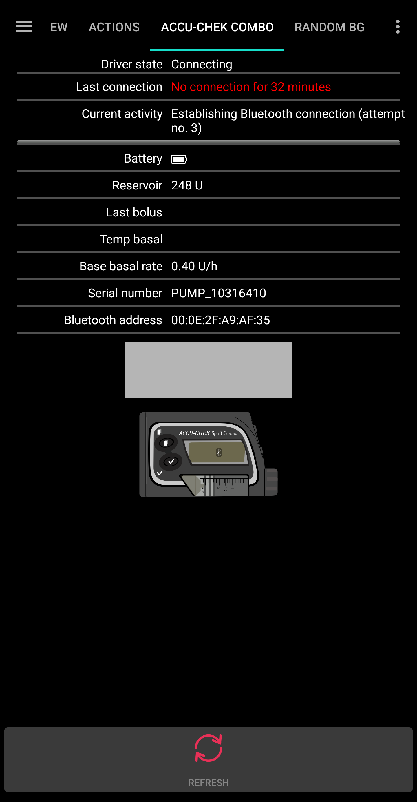
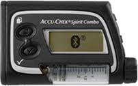

# Accu-Chek Combo 基本使用技巧

## 如何確保系統運作順暢

* 始終 **隨身攜帶手機**，晚上將其放在床邊。 由於你可能睡覺時幫浦位於或被身體擋住，將其放在較高的位置（如架子或桌面）效果最佳。
* 始終確保幫浦的電池盡可能充滿。 請參閱電池部分的相關提示。
* 儘可能僅透過 AAPS 應用程式操作幫浦。為了便於這一點，請在幫浦上啟動 **幫浦設置 / 按鍵鎖定 / 開啟**。 只有在更換電池或藥匣時，才需要使用幫浦的按鍵。 

## 幫浦無法連線。 該怎麼辦？

### 啟動幫浦無法連線的警報

* 在 AAPS 中，前往 **設定 / 本地警報**，啟動 **當幫浦無法連線時警報**，並將**幫浦無法連線時間上限 [分鐘]**設為**31** 分鐘。
* 這會給你足夠的時間，當你離開房間時不會觸發警報，但會在幫浦無法連線的時間超過臨時基礎率持續時間時通知你。

### 恢復幫浦連線

* 當 AAPS 報告 **幫浦無法連線** 時，首先解除按鍵鎖定並**按下幫浦上的任意鍵**（例如 "下" 鍵）。 當幫浦螢幕熄滅後，按下 AAPS 中的**重新整理**按鈕。 通常這樣操作後，通訊就能恢復正常。
* 如果這樣不行，請重新啟動你的手機。 重新啟動後，AAPS 會重新註冊並與幫浦建立新連線。 如果你使用的是舊驅動程式，ruffy 也會被重新註冊。

* 測試顯示，某些手機更容易觸發 "幫浦無法連線" 錯誤。 請查看 [AAPS 手機列表](#Phones-list-of-tested-phones) 以獲得成功測試的智慧型手機。

### 頻繁通訊錯誤的根本原因及後果

* 在內存較低或**節能模式較激進**的手機上，AAPS 經常會被關閉。 你可以透過主畫面上的 "餐數" 和 "計算機" 按鈕是否顯示來判斷，當這些按鈕不顯示時，表示系統正在初始化。 這可能會在啟動時觸發 "幫浦無法連線" 警報。 你可以在 Combo 標籤的 **最後連線** 欄位中查看 AAPS 最後一次與幫浦連線的時間。

* 此錯誤會加速幫浦電池耗電，因為應用程式重新啟動時會從幫浦讀取基礎設定檔案。
* 這也增加了幫浦拒絕所有來自外部的連線請求的錯誤機率，直到按下幫浦上的按鍵為止。 

## 無法取消臨時基礎率

* 有時 AAPS 無法自動取消**已取消的臨時基礎率**警報。 此時你需要按下 AAPS 中 Combo 標籤上的**更新**按鈕，或者需要在幫浦上確認警報。

## 幫浦電池考量

### 更換電池

* 在收到**低電量**警報後，應盡快更換電池，以確保即使手機與幫浦距離較遠時也能進行可靠的藍牙通訊。
* 即使在收到**低電量**警報後，電池仍可持續使用一段時間。 然而，建議在收到 "低電量" 警報後，隨身攜帶一顆新電池。
* 更換電池之前，按下主畫面上的**循環**圖示，並選擇**暫停循環 1 小時**。 
* 等待幫浦與手機通訊，直到幫浦上的藍牙標誌消失。

* 解除幫浦的按鍵鎖定，將幫浦設置為停止模式，確認是否取消了臨時基礎率，然後迅速更換電池。
* 使用舊版本驅動程式時，如果幫浦上的時鐘在更換電池後無法正常運作，請將幫浦上的日期和時間重新設定為與運行 AAPS 的手機上的日期/時間完全相同。 （新驅動程式會自動更新幫浦的日期和時間。）
* 然後將幫浦恢復為運作模式，按下主畫面上的**恢復循環**圖示，選擇**恢復**。
* 當下一個血糖值到達時，AAPS 會重新設置所需的臨時基礎率。

(Accu-Chek-Combo-基本使用技巧-電池類型及短電池壽命的原因)=

### 電池類型及短電池壽命的原因

* 由於頻繁的藍牙通訊消耗大量能量，僅使用**高品質電池**，如 Energizer Ultimate 鋰電池、"Power One" 來自大型 Accu-Chek 服務包中的電池，或者如果使用可充電電池，請使用 Eneloop 電池。 

 

不同電池類型的典型使用壽命範圍如下：

* **Energizer Ultimate 鋰電池**：4 到 7 週
* **Power One 碱性電池**（Varta）來自服務包：2 到 4 週
* **Eneloop 可充電電池**（BK-3MCCE）：1 到 3 週

如果你的電池壽命明顯短於上述範圍，請檢查以下可能的原因：

* Combo 幫浦有一些螺旋蓋的變種，他們會部分短路電池並迅速耗盡電池電量。 沒有這個問題的蓋子可以透過金色金屬接點識別。
* 如果幫浦時鐘在短暫的電池更換後無法恢復運作，可能是用於維持時鐘運作的電容損壞。 在這種情況下，Roche 公司在保修期內更換幫浦不是問題。 
* 智慧型手機硬體和軟體（Android 作業系統和藍牙堆疊）也會影響幫浦的電池壽命，儘管具體因素尚不完全清楚。 如果有機會，請嘗試使用另一台智慧型手機並比較電池壽命。

## 延長注射，波浪注射

OpenAPS 演算法不支援平行延長注射或波浪注射。 但可以透過以下替代方案達到類似的治療效果：

* 在輸入碳水化合物或使用計算機時，使用 **e-Carbs**，輸入整頓餐點的碳水化合物量及你預期碳水化合物轉換為血糖的時間。 系統將會計算整個時間段內均勻分佈的小份碳水化合物，這將使演算法提供相應的胰島素劑量，同時不斷檢查血糖數值的整體升降。 對於多波注射的方法，你也可以將較小的即時注射與 e-碳水化合物結合。 
* 在進餐前，於 AAPS 的 **動作標籤** 中設置一個臨時的 **即將用餐** 目標，將目標血糖設置為 80，持續幾個小時。 持續時間應基於您所選擇的延長注射間隔。 這將使你的目標低於通常值，因此增加注入的胰島素量。
* 然後使用 **計算機** 輸入整頓餐點的碳水化合物量，但不要直接採用注射計算機建議的數值。 如果要進行類似波浪注射的操作，則將胰島素劑量適當減少。 根據餐點的情況，演算法將需要額外的超微量注射 (SMBs) 或較高的臨時基礎率來應付血糖上升。 此處應非常謹慎地實驗基礎率的安全限制（最大 IU/小時，最大基礎 IOB），並在必要時臨時更改。

* 如果你傾向於直接在幫浦上使用延長或波浪注射，AAPS 將會處罰你，並在接下來的六個小時內停用閉環系統，以確保不會計算過量的胰島素劑量。

## 注射時的警報

* 如果 AAPS 偵測到在同一分鐘內已成功傳送相同的注射，則將會禁止再傳送相同劑量的胰島素單位。 如果你真的想在短時間內注射相同的胰島素，只需等兩分鐘再進行注射即可。 如果第一次注射被中斷或因其他原因未進行，則你可以立即重新提交注射，自 AAPS 2.0 起支持此功能。
* 此警報是一種安全機制，他在提交新注射之前會先讀取幫浦的注射歷史，以正確計算活性胰島素 (IOB)，即使注射是直接從幫浦完成的。 這裡必須防止無法區分的輸入紀錄。

* 這一機制還可能導致另一個錯誤原因：如果在使用注射計算機的過程中透過幫浦進行了另一個注射，從而改變了注射歷史，這將導致注射計算的基礎出錯，並且注射被中止。 

