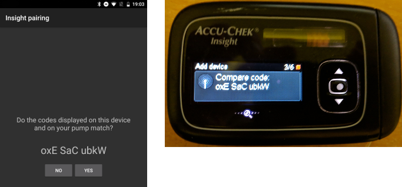
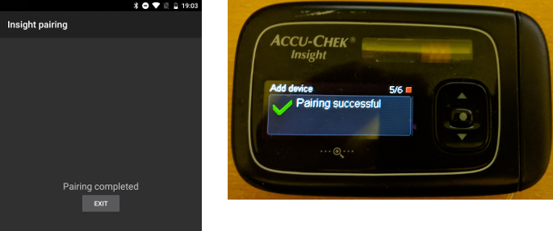
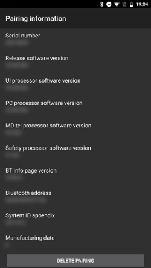

# Accu-Chek Insight 幫浦

**此軟體是DIY人工胰臟解決方案的一部分，不是產品， 你需要閱讀、學習並暸解整個系統，包括如何使用他。 他並不是為你自動管理所有糖尿病控制，而是 讓你在投入必要時間的前提下，提升糖尿病管理和生活品質。 不要急於使用， 請給自己時間學習。 你對自己 所做的決定負全部責任。**

* * *

## ***警告：** 如果你曾經使用過 Insight 與 **SightRemote**，請**更新至最新 AAPS 版本**並**卸載 SightRemote**。*

## 硬體和軟體需求

* 一台 Roche Accu-Chek Insight 幫浦（任何韌體都適用）

注意：AAPS 將資料寫入**幫浦的第一個基礎率設定檔**。

* 一台 Android 手機（基本上每個 Android 版本都適用於 Insight，但請檢查[模組](../Getting-Started/ComponentOverview)頁面了解運作 AAPS 所需的 Android 版本）。
* 你的手機上安裝了 AAPS 應用程式

## 設定

* Insight 幫浦一次只能連線一個裝置。 如果你之前使用過 Insight 遙控器（血糖機），必須從幫浦的配對裝置列表中移除該血糖機：選單 > 設定 > 通訊 > 移除裝置
    
    

* 在[組態建置工具 > 幫浦](../SettingUpAaps/ConfigBuilder.md)中，選擇 Accu-Chek Insight。
    
    

* 點擊齒輪圖示以打開 Insight 設定。

* 在設定中，點擊螢幕頂部的“Insight 配對”按鈕。 你應該會看到附近所有藍牙裝置的列表（左下方）。
* 在 Insight 幫浦上，前往選單 > 設定 > 通訊 > 添加裝置。 幫浦將顯示如下螢幕（右下方），顯示幫浦的序列號。
    
    

* 返回手機，點擊藍牙裝置列表中的幫浦序列號。 然後點擊配對以確認。
    
    

* 幫浦和手機將顯示一個代碼。 確認兩個裝置上的代碼相同，並在幫浦和手機上確認。
    
    

* 成功！ 配對成功後，為自己點個讚。
    
    

* 要檢查是否一切正常，返回 AAPS 中的組態建置工具並點擊 Insight 幫浦旁的齒輪圖示進入 Insight 設定，然後點擊 Insight 配對，你將看到一些關於幫浦的資訊：
    
    

注意：幫浦和手機之間不會有永久連線。 只有在需要時（例如設置臨時基礎率、進行注射、讀取幫浦歷史紀錄時）才會建立連線。 否則手機和幫浦的電池會消耗過快。

(Accu-Chek-Insight-Pump-settings-in-aaps)=

## AAPS 設定

**注意：現在可以（僅在 AAPS v2.7.0 及以上版本）使用「始終使用基礎絕對值」，如果你想使用 Autotune 與 Insight 幫浦，即使在 Nightscout 中啟用同步。**（在 AAPS 中轉到[偏好設定 > NSClient > 進階設定](#Preferences-advanced-settings-nsclient)）。

在 AAPS 的 Insight 設定中，你可以啟用以下選項：

* "紀錄儲液筒更換"：這將在幫浦運作“填充導管”程式時自動紀錄胰島素筒的更換。

* "紀錄導管更換"：當你在幫浦上運作“填充導管”程式時，這會在 AAPS 資料庫中添加一個註記。

* "紀錄注射點更換"：這會在幫浦上運作“填充導管”程式時，在 AAPS 資料庫中添加一個註記。 **注意：更換注射點也會重置自動敏感度調整（Autosens）。**

* "紀錄電池更換"：當你在幫浦中放入新電池時，這會紀錄電池更換。

* "紀錄操作模式變更"：這會在 AAPS 資料庫中插入註記，當你啟動、停止或暫停幫浦時。

* "紀錄警報"：這會在幫浦發出警報時紀錄在 AAPS 資料庫中（提醒、注射和臨時基礎率取消除外——這些不會被紀錄）。

* "啟用臨時基礎率仿真"：Insight 幫浦最多只能發出250%的臨時基礎率（TBR）。 為了繞過這一限制，當你請求超過250%的 TBR 時，TBR 仿真會指示幫浦發送一個延長注射以額外供應胰島素。
    
    **注意：一次只使用一個延長注射，因為同時多次延長注射可能會導致錯誤。**

* "停用手動注射時的震動"：這會在手動注射（或延長注射）時停用 Insight 幫浦的震動。 此設定僅在最新的 Insight 韌體（3.x）版本中可用。

* "停用自動注射時的震動"：這會在自動注射（SMB 或 TBR 仿真）時停用 Insight 幫浦的震動。 此設定僅在最新的 Insight 韌體（3.x）版本中可用。

* "恢復時間"：這定義了在連線失敗後，AAPS 將等待多長時間後再嘗試連線。 你可以選擇0到20秒。 如果你遇到連線問題，請選擇較長的等待時間。   
      
    恢復時間範例：最小 恢復時間=5，最大 恢復時間=20   
      
    無連線 -> 等待**5**秒。   
    再試 -> 無連線 -> 等待**6**秒。   
    再試 -> 無連線 -> 等待**7**秒。   
    再試 -> 無連線 -> 等待**8**秒。   
    ...   
    retry -> no connection -> wait **20** sec.   
    retry -> no connection -> wait **20** sec.   
    ...

* "斷線延遲"：這定義了在操作完成後 AAPS 將等待多少秒後再中斷與幫浦的連線。 預設值為5秒。

當幫浦停止時，AAPS 將紀錄臨時 基礎率為0%。

在 AAPS 中，Accu-Chek Insight 標籤顯示幫浦的目前狀態，並有兩個按鈕：

* "重新整理"：重新整理幫浦狀態
* "啟用/停用 TBR 通知"：標準的 Insight 幫浦在 TBR 結束時會發出警報。 此按鈕讓你無需配置軟體即可啟用或停用此警報。
    
    

## 幫浦中的設定

配置幫浦中的警報如下：

* 選單 > 設定 > 裝置設定 > 模式設定 > 靜音 > 信號 > 聲音
* 選單 > 設定 > 裝置設定 > 模式設定 > 靜音 > 音量 > 0（移除所有條）
* 選單 > 模式 > 信號模式 > 靜音

這將使幫浦靜音，允許 AAPS 決定警報是否與你相關。 如果 AAPS 未確認警報，其音量將增加（先是嗶聲，然後是震動）。

(Accu-Chek-Insight-Pump-vibration)=

### 震動

根據你幫浦的韌體版本，Insight 每次注射時都會短暫震動（例如，當 AAPS 發出 SMB 或 TBR 仿真發送延長注射時）。

* 韌體 1.x：設計上沒有震動。
* 韌體 2.x：無法停用震動。
* 韌體 3.x：AAPS 安靜地發送注射。 (最低[版本 2.6.1.4](#Releasenotes-version-2-6-1-4))

你可以在選單中找到韌體版本。

## 電池更換

Insight 在循環使用期間的電池壽命範圍為 10 到 14 天，最大 20 天。 報告此電池壽命的用戶使用的是 Energizer 鋰電池。

Insight 幫浦有一個小型內部電池，可在更換可拆卸電池時維持時鐘等重要功能的運作。 如果更換電池的時間過長，內部電池可能會耗盡電力，時鐘將重置，並且在插入新電池後你需要重新設置時間和日期。 如果發生這種情況，更換電池前在 AAPS 中的所有紀錄將不再包括在計算中，因為無法正確識別正確的時間。

(Accu-Chek-Insight-Pump-insight-specific-errors)=

## Insight 特定錯誤

### 延長注射

一次只使用一個延長注射，因為同時多次延長注射可能會導致錯誤。

### 逾時

有時 Insight 幫浦在連線設置期間可能不會回應。 在這種情況下，AAPS 將顯示以下訊息：“交握時逾時 - 重置藍牙”。

在這種情況下，請關閉幫浦和手機上的藍牙約10秒，然後重新開啟。

## 跨時區使用 Insight 幫浦

有關跨時區旅行的訊息，請參見[幫浦旅行時的時區](#timezone-traveling-insight)。