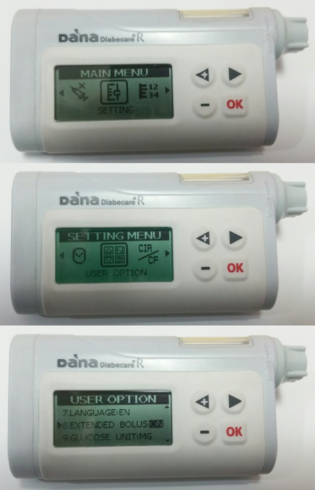

# DanaR 幫浦

*這些說明適用於配置該應用程式與 DanaR 幫浦。 如果你擁有 2017 年推出的 DanaRS，請讀取[DanaRS 胰島素幫浦](./DanaRS-Insulin-Pump.md)。*

* 在幫浦中進入主選單 > 設置 > 用戶選項
* 開啟「8. 延時注射」 延長注射

* 進入主選單 > 設置 > 探索
* 在手機設置中進入藍牙，掃描附近的設備，選擇你的 DanaR 序列號，並輸入你的密碼（配對密碼為 0000）。 如果 DanaR 未出現在掃描中，請重新啟動手機並將 DanaR 電池取出，重新安裝，然後再次開始這兩個步驟。

* 在 AAPS 中進入組態建置工具並選擇你擁有的 DanaR 型號（DanaR、DanaR 韓國版、DanaRv2）。

* 點擊右上角的三個點選擇選單。 選擇偏好設定。
* 選擇 DanaR 藍牙設備，然後點擊你的 DanaR 序列號。
* 選擇幫浦密碼，並輸入你的密碼。 （預設密碼為 1234）
* 如果你希望 AAPS 允許基礎速率超過 200%，啟用使用超過 200% 的延時注射。 注意，這意味著在使用延時注射進行用餐時，你無法使用高 TBR 循環。
* 在 DanaR 幫浦設定中的偏好設定裡，你可以更改預設的注射速度（12 秒每 1u、30 秒每 1u 或 60 秒每 1u）。
* 將幫浦的基礎速率步進設置為 0.01 U/h
* 將幫浦的注射步進設置為 0.1 U/h
* 啟用幫浦上的延時注射功能

## Dana R 幫浦的時區旅行

有關跨時區旅行的訊息，請參見[幫浦旅行時的時區](#timezone-traveling-danarv2-danars)。