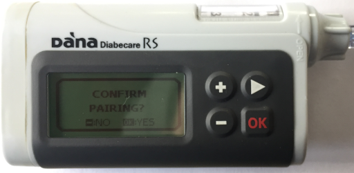
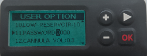

* * *

orphan: true

* * *

# DanaRS 和 Dana-i 幫浦

*這些說明適用於配置 2017 年之後的 DanaRS 或更新的 Dana-i 幫浦。 如果你擁有原始的 DanaR，請讀取[DanaR 胰島素幫浦](./DanaR-Insulin-Pump.md)。*

**Dana RS v3 韌體從 AAPS 版本 2.7 開始支援使用。**

**Dana-i 從 AAPS 版本 3.0 開始支援使用。**

* DanaRS/i 幫浦的「BASAL A」被應用程式使用，現有的資料會被覆蓋。

(DanaRS-Insulin-Pump-pairing-pump)=

## 幫浦配對

* 在 AAPS 主畫面上點擊左上角的選單，進入組態建置工具。
* 在幫浦部分選擇「Dana-i/RS」。
* 點擊齒輪圖示可以直接進入幫浦設置或返回主畫面。
    
    

* 進入「DANA-i/RS」標籤。

* 點擊右上角的三個點選擇選單。 
* 選擇「Dana-i/RS 偏好設定」。
* 點擊「選定的幫浦」。
* 在配對視窗中點擊你的幫浦項目。
    
    

* **你必須在幫浦上確認配對！** 這跟其他藍牙配對的方式一樣（例如手機與汽車音響）。
    
    

* 根據你的幫浦類型和韌體版本來執行配對過程：
    
    * DanaRS v1 中，在偏好設定裡選擇幫浦密碼並設置你的密碼。
    * DanaRS v3 中，你需要在 AAPS 配對對話框中輸入幫浦上顯示的兩段數字和字母序列。
    * Dana-i 中，會出現標準的 Android 配對對話框，你需要輸入幫浦上顯示的 6 位數字。

* 選擇注射速度來更改預設的注射速度（12 秒每 1u、30 秒每 1u 或 60 秒每 1u）。

* 使用醫生選單將幫浦上的基礎速率步進設置為 0.01 U/h（參見幫浦使用指南）。
* 使用醫生選單將幫浦上的注射步進設置為 0.05 U/h（參見幫浦使用指南）。
* 啟用幫浦上的延時注射功能

(DanaRS-Insulin-Pump-default-password)=

### 預設密碼

* 對於韌體版本 v1 和 v2 的 DanaRS，預設密碼為 1234。
* 對於韌體版本 v3 或 Dana-i，預設密碼來自製造日期，計算方式為 MMDD，其中 MM 是月份，DD 是製造日期（例如「0124」代表 1 月 24 日）。
    
    * 從主選單選擇「回顧」，然後從子選單打開「運送資訊」。
    * 第三個項目是製造日期。 
    * 對於 v3/i，該密碼僅用於鎖定幫浦選單。 這不會用於通訊，因此不需要在 AAPS 中輸入該密碼。

(DanaRS-Insulin-Pump-change-password-on-pump)=

## 更改幫浦密碼

* 按下幫浦上的「OK」按鈕
* 在主選單中選擇「選項」（按下箭頭按鈕多次向右移動）
    
    

* 在選項選單中選擇「用戶選項」
    
    

* 使用箭頭按鈕向下捲動至「11. 密碼」 密碼
    
    

* 按下「OK」進入舊密碼。

* 輸入 **舊密碼** (預設密碼請參閱 [上方](#DanaRS-Insulin-Pump-default-password)) 並按下 OK
    
    

* 如果此處輸入了錯誤的密碼，將不會顯示失敗訊息！

* 設置**新密碼**（使用 + 和 - 按鈕更改數字 / 使用箭頭按鈕向右移動）。
    
    

* 按下「OK」按鈕確認。

* 按下 OK 以儲存設定。
    
    

* 向下移動至「14. 退出」，然後按下 OK 以退出。
    
    

(DanaRS-Insulin-Pump-dana-rs-specific-errors)=

## Dana RS 特定錯誤

### 胰島素注射過程中的錯誤

如果在注射胰島素過程中 AAPS 與 Dana RS 之間的連線中斷（例如，你在 Dana RS 幫浦注射胰島素時走開手機），你將看到以下訊息並聽到警報聲。

* 大多數情況下，這只是通訊問題，正確劑量的胰島素已經注射完畢。
* 檢查幫浦歷史紀錄（在幫浦或透過 Dana 標籤 > 幫浦歷史 > 注射紀錄），確認正確的注射劑量。
* 如果你希望，請在 [治療選項卡](#screens-bolus-carbs) 中刪除錯誤的項目。
* 實際注射量會在下次連線時讀取並紀錄。 要強制此操作，請按下 Dana 標籤上的藍牙圖示，或等待下一次連線。

## 更換手機時的特別注意事項

更換新手機時，需要進行以下步驟：

* [在舊手機上匯出設定](../Maintenance/ExportImportSettings.md)
* 將設定從舊手機傳輸至新手機

### DanaRS v1

* **手動配對** Dana RS 與新手機
* 由於幫浦連線設定也會匯入，新手機上的 AAPS 已經「認識」幫浦，因此不會啟動藍牙掃描。 因此必須手動將新手機與幫浦配對。
* 在新手機上安裝 AAPS。
* [在新手機上匯入設定](../Maintenance/ExportImportSettings.md)

### DanaRS v3, Dana-i

* 開始配對程序，如上所述[以上](#DanaRS-Insulin-Pump-pairing-pump)。
* 有時可能需要透過長按 Dana-i/RS 標籤上的藍牙圖示來清除 AAPS 中的配對資訊。

## Dana RS 幫浦跨時區旅行

有關跨時區旅行的訊息，請參見[幫浦旅行時的時區](#timezone-traveling-danarv2-danars)。