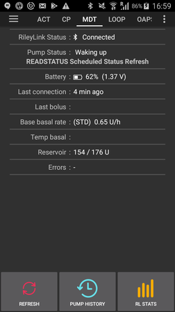

* * *

orphan: true

* * *

# 美敦力幫浦

此驅動程式不適用於任何新型號，包括所有以 G 結尾的型號（530G、600 系列 [630G、640G、670G]、700 系列 [770G、780G] 等）。

以下型號和韌體組合是相容的：

- 512/712（任何韌體版本）
- 515/715（任何韌體版本）
- 522/722（韌體 2.4A 或更低版本）
- 523/723（韌體 2.4A 或更低版本）
- 554/754 歐洲版本（韌體 2.6A 或更低版本）
- 554/754 加拿大版本（韌體 2.7A 或更低版本）

你可以查看如何在[OpenAPS 文件](https://openaps.readthedocs.io/en/latest/docs/Gear%20Up/pump.html#how-to-check-pump-firmware-check-for-absence-of-pc-connect)或[LoopDocs](https://loopkit.github.io/loopdocs/build/step3/#medtronic-pump-firmware)中檢查幫浦韌體。

## 硬體和軟體需求

- **手機：**此美敦力驅動程式應適用於所有支援藍牙連線的 Android 手機。 **重要提示：手機製造商的藍牙實作可能會有所不同，因此每個手機型號的行為可能會不同。 例如，一些手機在啟用/停用藍牙時的處理方式可能不同。 這可能會影響 AAPS 需要重新連線到你的 Rileylink 類型裝置時的使用體驗。**
- **RileyLink 相容裝置：**Android 手機無法與美敦力幫浦通信，除非使用單獨的裝置來處理通信。 此裝置將透過藍牙與你的手機連線，並透過相容的無線電連線與幫浦連線。 第一個此類裝置稱為 RileyLink，但現在已推出許多其他選項，提供更多功能。
    
    - RileyLink 可於[getrileylink.org](https://getrileylink.org/product/rileylink916)購買
    - Orangelink 可於[getrileylink.org](https://getrileylink.org/product/orangelink)購買
    - Emalink（多種型號可選）可於[github.com](https://github.com/sks01/EmaLink)購買
    - Gnarl（需要一些額外 DIY）詳情可見[github.com](https://github.com/ecc1/gnarl)

各種 Rileylink 相容裝置的比較圖表可以在 [getrileylink.org](https://getrileylink.org/rileylink-compatible-hardware-comparison-chart) 找到。

(MedtronicPump-configuration-of-the-pump)=

## 幫浦配置

為了讓 AAPS 遠端發送指令，應在幫浦上配置以下設定。 每個設定的步驟如下所示（適用於美敦力 715）。 具體步驟可能會根據幫浦類型和/或韌體版本有所不同。

- **啟用幫浦上的遠端模式**（在幫浦上按下 Act 並前往工具 -> 遠端選項，選擇開啟，並在下一個畫面中新增 ID，輸入任意隨機 ID，如 111111）。 遠端 ID 列表中至少需要一個 ID，幫浦才會接受遠端通訊。
- **設定最大基礎率**（在幫浦上按下 Act，然後前往基礎率，然後選擇最大基礎率）作為範例，將此數值設置為你最大標準基礎率的四倍，將允許 400% 的臨時基礎率。 幫浦允許的最大值為每小時 34.9 單位。
- **設定最大注射量**（在幫浦上按下 Act 並前往注射，然後選擇最大注射量）這是幫浦可接受的最大注射量。 幫浦允許的最大值為 25 單位。
- **設定設定檔為標準**。 （在幫浦上按下 Act 並前往基礎率，然後選擇模式）幫浦只需要一個設定檔，因為 AAPS 會在你的手機上管理不同的設定檔。 不需要其他模式。
- **設定臨時基礎率類型**（在幫浦上按下 Act 並前往基礎率，然後選擇臨時基礎率類型）。 選擇絕對值（不要選擇百分比）。

## 美敦力手機/AAPS 配置

- **不要在手機的藍牙選單中配對 RileyLink 相容裝置。**透過手機的藍牙選單配對將會阻止 AAPS 在你按照以下指示操作時看到你的 Rileylink 相容裝置。
- 停用手機上的自動螢幕旋轉。 在某些裝置上，自動螢幕旋轉會導致藍牙會話重新啟動，這將導致你的美敦力幫浦出現問題。 
- 有兩種方式可在 AAPS 中配置你的美敦力幫浦：

1. 使用全新安裝時的設置嚮導
2. 在組態建置工具中的幫浦選項旁選擇齒輪圖示以選擇美敦力選項

在使用設定嚮導配置美敦力幫浦時，可能因藍牙問題而無法完成設置（例如，無法成功連接到幫浦）。 如果發生這種情況，你應該選擇虛擬幫浦選項來完成配置，並使用選項 2 進行進一步問題排除。

在設置 AAPS 與你的美敦力幫浦協作時，你需要設置以下項目：（請參閱上方圖片）

- **幫浦序列號**：顯示在幫浦背面，以 SN 開頭。 您應該只輸入顯示的 6 位數字，沒有任何字母字符（例如：123456）。
- **幫浦型號**：你使用的幫浦型號（例如 522）。 
- **幫浦頻率**：有兩個選項，根據你的幫浦最初發行的地區。 如果你不確定選擇哪個選項，請檢查[常見問題解答](#MedtronicPump-faq)： 
    - 美國和加拿大使用的頻率為 916 Mhz
    - 全球其他地區使用的頻率為 868 Mhz
- **幫浦最大基礎率（U/h）**：這需要與你的幫浦上設置的設定相符（請參閱上方的幫浦配置）。 再次提醒，此設定必須謹慎選擇，因為他將決定 AAPS 可透過你的基礎率提供的胰島素量。 這將有效地設置最大臨時基礎率。 作為範例，將此數值設置為你最大標準基礎率的四倍，將允許 400% 的臨時基礎率。 幫浦允許的最大值為每小時 34.9 單位。
- **幫浦最大注射量（U）**（每小時）：這需要與你的幫浦上設置的設定相符（請參閱上方的幫浦配置）。 此設定應謹慎考慮，因為他決定了 AAPS 可設置的最大注射量。
- **注射啟動前的延遲時間（秒）**：注射發出後到實際發送指令到幫浦的時間（以秒為單位）。 這段時間允許使用者在錯誤發送注射指令時取消注射。 無法取消已透過 AAPS 啟動的注射。 取消已開始的注射的唯一方法是手動暫停幫浦，然後再重新啟動。
- **美敦力編碼**：決定是否執行美敦力編碼。 首選選擇硬體編碼（即由 Rileylink 相容裝置執行），因為這樣會減少傳送的資料量。 如果經常發生連線中斷，選擇軟體編碼（即由 AAPS 執行）可能會有所幫助。 如果你的 Rileylink 裝置使用 0.x 版韌體，則此設定將被忽略。
- **電池類型（電力檢視）**：為了正確判斷剩餘的電池電量，你應選擇正在使用的 AAA 電池類型。 當選擇了非簡單檢視的值時，AAPS 將顯示剩餘的計算電池百分比和電壓。 以下選項可用：
    
    - 未選擇（簡單檢視）
    - 鹼性電池（擴展檢視）
    - 鋰電池（擴展檢視）
    - 鎳鋅電池（擴展檢視）
    - 鎳氫電池（擴展檢視）
- **注射/治療除錯**：根據需求選擇開啟或關閉。

- **RileyLink 配置**：此選項允許你找到並配對你的 Rileylink 相容裝置。 選擇此選項將顯示附近的所有 Rileylink 相容裝置及其訊號強度。
- **使用掃描**：在連線 Rileylink 相容裝置之前啟用藍牙掃描。 這應能提高與裝置連線的可靠性。
- **顯示 OrangeLink/EmaLink/DiaLink 回報的電池電量**：此功能僅支援較新型的連線裝置，如 EmaLink 或 OrangeLink。 數值將顯示在 AnroidAPS 的美敦力標籤頁中。 
- **設置中性臨時基礎率**：預設情況下，美敦力幫浦在有臨時基礎率時，每小時會發出嗶聲。 啟用此選項可以通過在小時變更時中斷臨時基礎來減少聽到的嗶聲數量。

## 美敦力（MDT）標籤

 當 AAPS 配置為使用美敦力幫浦時，螢幕頂部的標籤列表中會顯示 MDT 標籤。 此標籤顯示目前幫浦的狀態資訊以及一些美敦力特有的操作。

- **RileyLink 狀態**：手機與 Rileylink 相容裝置之間連線的目前狀態。 此狀態應始終顯示為已連線。 任何其他狀態可能需要使用者介入。 
- **RileyLink 電池**：顯示 EmaLink 或 OrangeLink 裝置的目前電池電量。 取決於是否在美敦力幫浦配置選單中選擇了“顯示 OrangeLink/EmaLink/DiaLink 裝置回報的電池電量”。
- **幫浦狀態**：幫浦連線的目前狀態。 由於幫浦不會始終保持連線，主要會顯示睡眠圖示。 還有許多其他可能的狀態，例如當 AAPS 嘗試發送指令時顯示“正在喚醒”，或其他可能的幫浦指令，如“獲取時間”、“設置 TBR”等。
- **電池**：根據在美敦力幫浦配置選單中選擇的電池類型（電力檢視）顯示電池狀態。 
- **最後連線：**最後一次成功的幫浦連線距今有多久。
- **最後注射：**最後一次成功的注射距今有多久。
- **基礎基礎率**：這是目前小時內幫浦運作的基礎基礎率，根據你的活動設定檔設定。
- **臨時基礎率**：目前正在輸送的臨時基礎率，可以為每小時 0 單位。
- **儲液筒**：顯示儲液筒中的胰島素量（至少每小時更新一次）。
- **錯誤**：如果有問題，則顯示錯誤文字（主要顯示配置中的錯誤）。

螢幕底部有三個按鈕：

- **重新整理**：用於重新整理幫浦的目前狀態。 此功能應僅在連線長時間中斷時使用，因為這將需要完整的資料重新整理（檢索歷史紀錄、獲取/設置時間、獲取設定檔、獲取電池狀態等）。
- **幫浦歷史**：顯示幫浦歷史（見[下文](#MedtronicPump-pump-history)）
- **RL 狀態**：顯示 RL 狀態（見[下文](#MedtronicPump-rl-status-rileylink-status)）

(MedtronicPump-pump-history)=

## 幫浦歷史紀錄

幫浦歷史紀錄每 5 分鐘檢索一次並存儲在本地。 僅存儲過去 24 小時的歷史紀錄。 這提供了一種方便的方式來查看幫浦的行為，若需要的話。 存儲的項目僅限於 AAPS 相關的資料，並不包括任何無關的配置功能。

(MedtronicPump-rl-status-rileylink-status)=

## RL 狀態（RileyLink 狀態）

 

RL 狀態對話框有兩個標籤：

- **設定**：顯示有關 Rileylink 相容裝置的設定：已配置的地址、連線裝置、連線狀態、連線錯誤和 Rileylink 韌體版本。 裝置類型始終為美敦力幫浦，型號為你的型號，序列號為已配置的序列號，幫浦頻率顯示你使用的頻率，最後使用的頻率為上次使用的頻率。
- **歷史**：顯示通訊歷史，RileyLink 的項目顯示狀態變更，美敦力顯示發送給幫浦的指令。

## 操作

當使用美敦力驅動程式時，操作標籤中會添加兩個額外操作：

- **喚醒並調整**：如果 AAPS 長時間未能連線到你的幫浦（應每 5 分鐘連線一次），你可以強制進行調整。 這將嘗試透過搜尋幫浦使用的所有可能無線電頻率來聯繫幫浦。 若成功連線，則成功頻率將設置為預設值。
- **重置 RileyLink 配置**：如果你重置了 Rileylink 相容裝置，則可能需要使用此操作，以便可以重新配置裝置（設置頻率、設置頻率類型、配置編碼）。

## 重要提示

### 在 NS 配置中需要特別注意

AAPS 使用序列號進行同步，序列號會公開到 NS。 因為了解舊美敦力幫浦的序列號可以用來遠端控制幫浦，所以請特別注意強化 NS 網站以防止洩露你的幫浦序列號。 請參閱 https://nightscout.github.io/nightscout/security/

### OpenAPS 用戶

OpenAPS 用戶應注意，AAPS 與美敦力的使用方式與 OpenAPS 完全不同。 使用 AAPS 時，主要與幫浦互動的方法是透過手機。 在正常的使用情境下，可能唯一需要使用幫浦選單的時刻是更換儲液筒時。 這與使用 OpenAPS 時非常不同，因為至少部分注射通常是透過快速注射按鈕完成的。 如果使用幫浦手動輸送注射，而 AAPS 同時嘗試輸送注射，可能會出現問題。 在這種情況下有檢查機制來防止問題發生，但仍應盡量避免。

### 日誌紀錄

如果您需要排除美敦力幫浦的功能問題，請選擇螢幕左上角的選單圖示，然後選擇維護和日誌設定。 要對美敦力問題進行問題排除，應檢查幫浦、PumpComm、PumpBTComm。

### 美敦力 CGM

目前不支援美敦力 CGM。

### 手動使用幫浦

你應避免手動注射或設置臨時基礎率。 所有此類指令應透過 AAPS 發送。 如果使用手動指令，兩者之間必須至少有 3 分鐘的延遲，以降低問題風險。

### 時區變更與夏令時間（DST）或攜帶美敦力幫浦和 AAPS 旅行

當你的手機切換到新時間時，AAPS 將自動偵測時區變更並更新幫浦的時間。

向東旅行意味著你將增加目前時間的小時數（例如從 GMT+0 到 GMT+2），不會出現問題，因為不會重疊（例如，不可能出現相同的小時兩次）。 然而，向西旅行會導致問題，因為你實際上是在倒退時間，這可能會導致錯誤的 IOB 資料。 開發人員已知向西旅行時出現的問題，正在努力尋找解決方案。

請參閱 https://github.com/andyrozman/RileyLinkAAPS/issues/145 了解更多細節。 目前，請注意此問題可能會發生，並在更改時區時仔細監控。 目前請注意，這個問題可能會發生，並在更改時區時仔細監控。

### GNARL 是否為完全相容的 Rileylink 相容裝置？

GNARL 代碼完全支援 AAPS 美敦力驅動程式使用的所有功能，這意味著他是完全相容的。 重要的是要注意，這將需要額外的工作，因為您需要尋找相容的硬體，然後將 GNARL 代碼載入該裝置上。

**作者提醒：**請注意，GNARL 軟體仍處於實驗階段，測試較少，不應被視為與 RileyLink 一樣安全。

(MedtronicPump-faq)=

## 常見問題

(MedtronicPump-what-to-do-if-i-loose-connection-to-rileylink-and-or-pump)=

### 如果我失去與 RileyLink 和/或幫浦的連線該怎麼辦？

有多種選項可以嘗試解決連線問題。

- 在 ACT 標籤中使用“喚醒並調整”按鈕，具體詳情如上所述。
- 停用手機上的藍牙，等待 10 秒鐘，然後重新啟用。 這將強制 Rileylink 裝置重新連線到手機。
- 重置 Rileylink 裝置。 然後必須在 ACT 標籤中使用“重置 Rileylink 配置”按鈕。
- 其他使用者發現，當其他方法無效時，以下步驟能有效恢復連線： 
    1. 重新啟動手機
    2. *同時* 重新啟動 Rileylink 裝置
    3. 打開 AAPS 並允許恢復連線

### 如何確定我的幫浦使用哪個頻率

你可以在幫浦背面找到一行詳細描述你的型號號碼以及一個特殊的三字母代碼。 前兩個字母決定頻率類型，最後一個字母決定顏色。 以下是頻率的可能值：

- NA - 北美（在頻率選擇中需要選擇“美國和加拿大（916 MHz）”）
- CA - 加拿大（在頻率選擇中需要選擇“美國和加拿大（916 MHz）”）
- WW - 全球（在頻率選擇中需要選擇“全球（868 MHz）”）