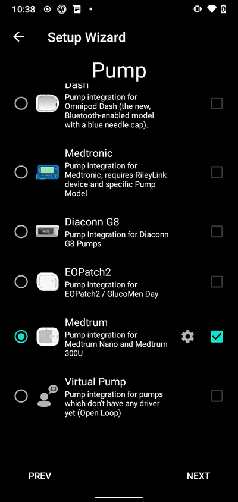
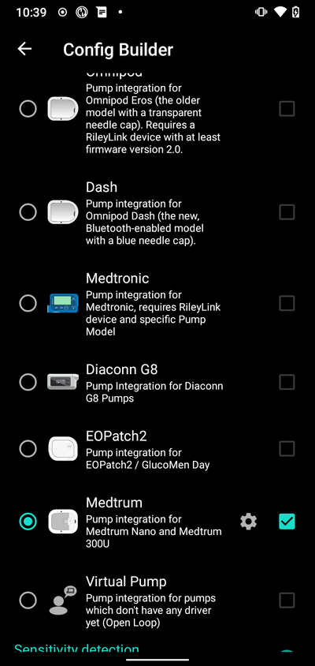
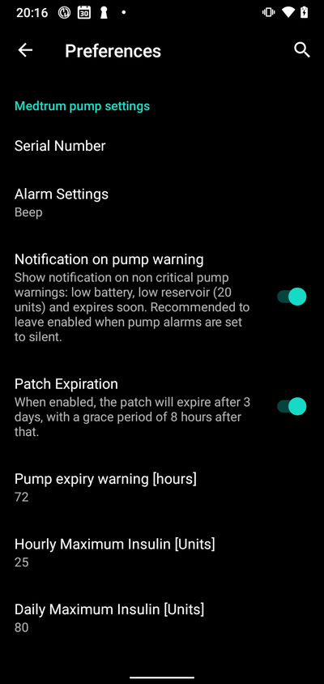
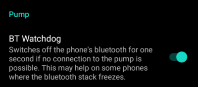
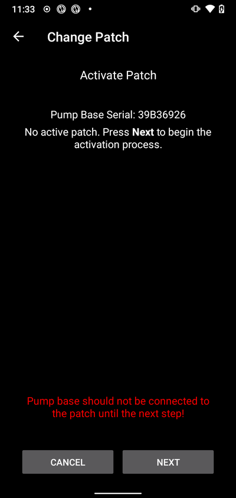
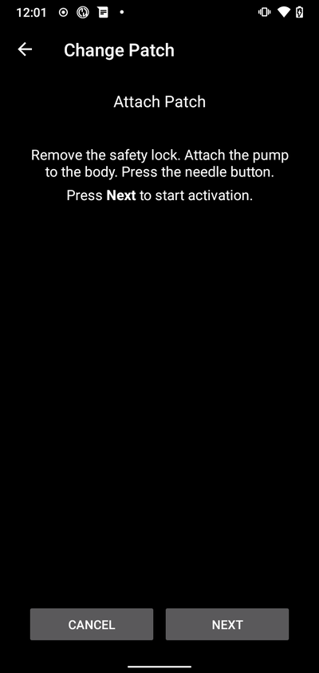
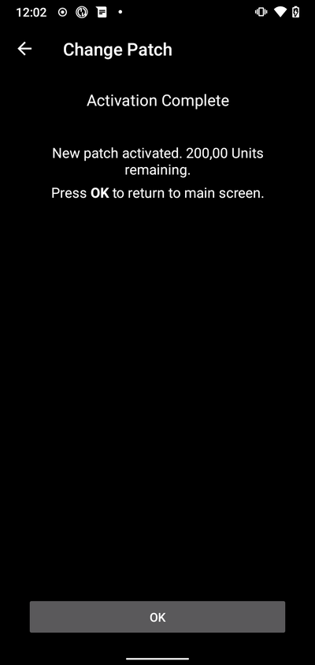
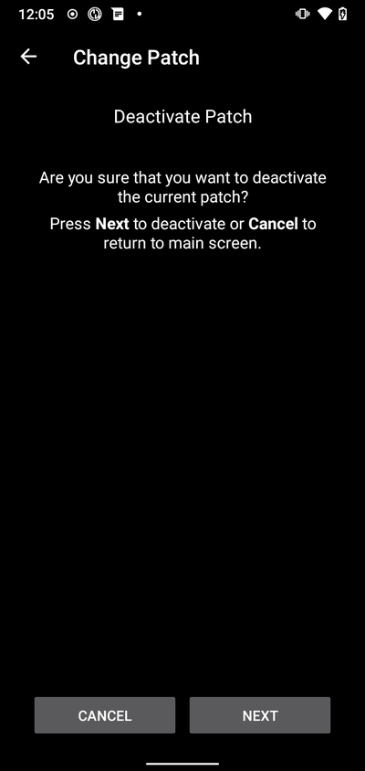
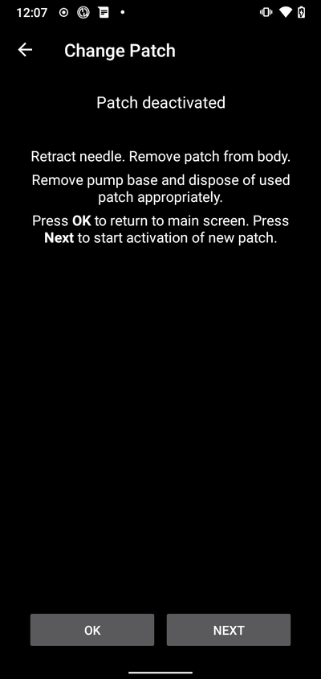
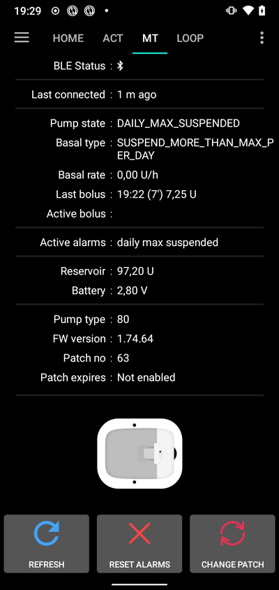

- - -
orphan: true
- - -

# Medtrum Nano / 300U

這些是配置Medtrum胰島素幫浦的指導說明。

此軟體是 DIY 人工胰臟解決方案的一部分，並非產品，你需要閱讀、學習並了解系統，包括如何使用他。 你需要對自己使用的結果負完全責任。

```{contents} Table of contents
:depth: 1
:local: true
```

## 幫浦與AAPS的功能
* 支援所有循環功能（SMB、TBR等）
* 自動夏令時間（DST）與時區處理
* AAPS驅動不支援延長注射

## 硬體和軟體需求
* **與Medtrum幫浦基座及儲液瓶相容的修補版**
    - 目前支援：
        - Medtrum TouchCare Nano與幫浦基座參考：**MD0201**和**MD8201**。
        - Medtrum TouchCare 300U與幫浦基座參考：**MD8301**。
        - 如果你擁有不支援的型號，並願意捐贈硬體或協助測試，請透過discord與我們聯繫[這裡](https://discordapp.com/channels/629952586895851530/1076120802476441641)。
* **版本 3.2.0.0 或更新的 AAPS 以[建構 APK](../SettingUpAaps/BuildingAaps.md) 說明進行構建和安裝。**
* **相容的 Android 手機** 需具備 BLE 藍牙連線
    - 請參見 AAPS [發行說明](../Maintenance/ReleaseNotes.md)
* [**連續血糖監測儀（CGM）**](../Getting-Started/CompatiblesCgms.md)

## 開始之前

**安全第一** 不要在無法修復錯誤的環境中進行此過程（需要備用修補版、胰島素和幫浦控制裝置）。

**PDM與Medtrum App將無法與AAPS啟動的修補版一起運作。** 之前你可能使用PDM或Medtrum App向你的幫浦發送指令。 基於安全考量，你只能使用與啟動該修補版的裝置或App。

*這並不意味著你應該丟棄PDM。 建議將他放在安全的地方作為備用，以防緊急情況發生，例如手機遺失或AAPS無法正常運作。*

**你的幫浦在未連線至AAPS時不會停止輸送胰島素** 預設的基礎率已經在幫浦上設定，並在目前啟動的設定檔中定義。 只要AAPS運作正常，他將發送臨時基礎率指令，最多持續120分鐘。 如果由於任何原因幫浦未接收到新指令（例如由於幫浦與手機距離過遠導致通訊中斷），當臨時基礎率結束時，幫浦將回到預設的基礎率。

**AAPS 不支援 30 分鐘基礎率設定檔。** **AAPS 設定檔不支援 30 分鐘的基礎率時間框架** 如果你是 AAPS 新手並首次設置基礎率設定檔，請注意，基礎率從半小時開始的設定不被支援，你需要調整你的基礎率設定檔以從整點開始。 例如，如果你的基礎率為 1.1 單位，並於 09:30 開始，持續時間為 2 小時，於 11:30 結束，這將無法正常工作。 你需要將此 1.1 單位的基礎率更改為 9:00-11:00 或 10:00-12:00 的時間範圍。 儘管Medtrum幫浦硬體本身支援30分鐘基礎率增量，但AAPS目前無法在其算法中考慮這些增量。

**AAPS不支援0U/h的設定檔基礎率** 儘管Medtrum幫浦支援零基礎率，但AAPS使用設定檔基礎率的倍數來確定自動治療，因此無法使用零基礎率。 可以透過“中斷幫浦”功能或停用循環/臨時基礎率或暫停循環/臨時基礎率的組合來實現臨時的 0 單位基礎率。

## 設定

注意：當使用AAPS啟動修補版時，**必須**停用所有其他可與Medtrum幫浦基座通訊的裝置。 例如，啟動的PDM與Medtrum App。 請確保你已準備好幫浦基座及其序號，進行新修補版的啟動。

### 步驟1：選擇Medtrum幫浦

#### 選項 1：新安裝

如果你是首次安裝AAPS，**安裝嚮導**將引導你完成AAPS的安裝過程。 當你到達幫浦選擇時，請選擇「Medtrum」。

如果有疑問，你也可以選擇「虛擬幫浦」，並在設置完成後選擇「Medtrum」（見選項2）。



#### 選項 2：組態建置工具

在現有安裝中，可以在[組態建置工具 > 幫浦](#Config-Builder-pump)中選擇**Medtrum**幫浦：

在左上角的**漢堡選單**中選擇**組態建置工具**\ ➜\ **幫浦**\ ➜\ **Medtrum**，選擇**啟用按鈕**標題為**Medtrum**。

勾選**齒輪圖示**旁的**複選框**，將允許Medtrum總覽顯示在AAPS介面中的標籤中，標題為**Medtrum**。 勾選此框將便於你在使用AAPS時存取Medtrum指令，非常建議如此設置。



### 步驟2：變更Medtrum設置

點擊組態建置工具中Medtrum模組的**齒輪圖示**進入Medtrum設置。



#### 序號：

在此輸入幫浦基座上的序號。 請確保序號正確且沒有空格（可使用大寫或小寫字母）。

注意：此設置只能在無活動修補版時更改。

#### 警報設置

***預設：嗶聲。***

此設置更改當幫浦出現警告或錯誤時的警示方式。

- 嗶聲 > 當出現警報或警告時，修補版會發出嗶聲聲
- 靜音 > 當出現警報或警告時，修補版將不發出任何聲音

注意：在靜音模式下，AAPS仍會根據手機音量設置發出警報。 如果你未回應警報，修補版最終會開始嗶聲。

#### 幫浦警告通知

***預設：已啟用。***

這個設定改變了 AAPS 對非關鍵幫浦警告的通知顯示方式。 啟用後，當幫浦出現警告時，手機上會顯示通知，包括：
    - 電池電量低
    - 儲液瓶電量低（20單位）
    - 修補版即將過期警告

無論如何，這些警告也會顯示在Medtrum總覽畫面中的[活動警報](#medtrum-active-alarms)下。

(medtrum-patch-expiration)=
#### 修補版過期

***預設：已啟用。***

此設置更改修補版的行為。 啟用後，修補版將在3天後過期，並在開啟聲音警告時發出聲音。 在3天8小時後，修補版將停止運作。

如果停用此設置，修補版將不會發出警告，並將繼續運作，直到修補版電池或儲液瓶耗盡。

#### 幫浦過期警告

***預設：72小時。***

此設置更改過期警告的時間，當[修補版過期](#medtrum-patch-expiration)啟用時，AAPS將在啟動後的設定小時內發送通知。

#### 每小時最大胰島素輸送量

***預設：25U。***

此設置更改每小時最多輸送的胰島素量。 如果此限制被超過，修補版將暫停並發出警報。 可以透過點擊總覽選單中的重置按鈕來重置此警報，請參閱[重置警報](#nano-reset-alarms)。

根據你的胰島素需求，設置一個合適的值。

#### 每日最大胰島素輸送量

***預設：80U。***

此設置更改每日最多輸送的胰島素量。 如果此限制被超過，修補版將暫停並發出警報。 可以透過點擊總覽選單中的重置按鈕來重置此警報，請參閱[重置警報](#nano-reset-alarms)。

根據你的胰島素需求，設置一個合適的值。

#### 連線錯誤時掃描

***預設：關閉。***

位於**進階設定**下。

僅在有連線問題時啟用。 如果啟用，驅動程式在嘗試重新連線到幫浦之前，會再次掃描幫浦。 確保你的位置權限設置為「始終允許」。

### 步驟2b：AAPS警報設置

進入偏好設定

#### 幫浦：

##### 藍牙監控

進入偏好設定並選擇**幫浦**：



##### 藍牙監控

此設置將嘗試解決任何BLE問題。 當連線中斷時，他將嘗試重新連線至幫浦。 當幫浦無法使用一段時間後，他也會嘗試重新連線。

如果你的幫浦經常遇到連線問題，請啟用此設置。

#### 本地警報：

進入偏好設定並選擇**本地警報**：


##### 當幫浦無法使用時發出警報

***預設：已啟用。***

當啟用Medtrum驅動時，此設置強制啟用。 當幫浦無法使用時，將提醒你。 這可能發生在幫浦超出範圍或幫浦因修補版或幫浦基座故障而無法回應，例如當水滲入幫浦基座與修補版之間時。

出於安全考量，此設置無法停用。

##### 幫浦無法使用的門檻值 [分鐘]

***預設：30分鐘。***

此設置更改AAPS發出幫浦無法使用警報的時間。 這可能發生在幫浦超出範圍或幫浦因修補版或幫浦基座故障而無法回應，例如當水滲入幫浦基座與修補版之間時。

此設定可在使用Medtrum幫浦時更改，但建議出於安全理由設為30分鐘。

### 步驟3：啟動修補版

**在繼續之前：**
- 準備好你的Medtrum Nano幫浦基座與儲液瓶修補版。
- 確保 AAPS 正確設置，並且已啟動[配置](../DailyLifeWithAaps/ProfileSwitch-ProfilePercentage.md)。
- 停用其他可與Medtrum幫浦連線的裝置（PDM與Medtrum App）

#### 從Medtrum總覽標籤啟動修補版

在AAPS介面中導航至[Medtrum標籤](#nano-overview)，然後按下右下角的**更換修補版**按鈕。

如果修補版已啟動，系統將提示你先停用該修補版。 請參閱[停用修補版](#nano-deactivate-patch)。

按照提示填充並啟動新的修補版。 請注意——只有在系統提示時才應將幫浦基座連線到儲液瓶修補版。 **你應在系統提示啟動過程時（填充完成後）才將幫浦放在身體上並插入套管。**

##### 開始啟動



在此步驟，請仔細檢查你的序號，並確保幫浦基座尚未連線至修補版。

按**下一步**繼續。

##### 填充修補版


當偵測到貼片並填充至少 70 單位的胰島素後，會出現「按下 **下一步**」的提示。

##### 填充修補版


不要移除安全鎖，並按下修補版上的針頭按鈕。

按**下一步**開始填充


填充完成後，按**下一步**繼續。

##### 連線修補版



清潔皮膚，撕下貼紙並將修補版附著在身體上。 移除安全鎖，並按下修補版上的針頭按鈕插入套管。

按**下一步**啟動修補版。

(medtrum-activate-patch)=
##### 啟動修補版


啟動完成後，將顯示以下畫面



按**確定**返回主畫面。

(nano-deactivate-patch)=

### 停用修補版

要停用目前啟動的修補版，請前往AAPS介面中的[Medtrum標籤](#nano-overview)，然後按下**更換修補版**按鈕。



系統將提示你確認是否希望停用目前的修補版。 **請注意，這個操作是不可逆的。** 當停用完成後，您可以按**下一步**來繼續激活新補丁的過程。 如果你尚未準備好啟動新修補版，請按下**取消**返回主畫面。


如果Android APS無法停用修補版（例如因為幫浦基座已從儲液瓶修補版中移除），你可以按下**丟棄**以忘記目前修補版會話，並啟動新修補版。



停用完成後，按**確定**返回主畫面，或按**下一步**繼續啟動新修補版的過程。

(nano-resume-interrupted-activation)=

### 恢復中斷的啟動過程

如果貼片註冊過程被中斷，例如因為手機電池耗盡，您可以在 AAPS 介面中進入 [Medtrum 頁籤](#nano-overview)，然後按下 **更換貼片**


按**下一步**繼續啟動過程。 按**丟棄**丟棄目前修補版會話，並啟動新修補版。


驅動將嘗試確定目前的修補版啟動狀態。 如果成功，他將進入目前步驟的啟動進度。

(nano-overview)=

## 首頁總覽

總覽顯示了Medtrum修補版的目前狀態。 他還包含更換修補版、重置警報和重新整理狀態的按鈕。


### 藍牙狀態：

這顯示了目前與幫浦基座的藍牙連線狀態。

### 上次連線：

這顯示了幫浦上次連線至AAPS的時間。

### 幫浦狀態：

這顯示了幫浦的目前狀態。 例如：
    - 啟動中：幫浦已啟動並正常運作
    - 停止：修補版未啟動

### 基礎率類型：

這顯示了目前的基礎率類型。

### 基礎率：

這顯示了目前的基礎率。

### 上次注射：

這顯示了上次輸送的注射量。

### 目前注射：

這顯示了目前正在輸送的注射量。

(medtrum-active-alarms)=
### 目前警報：

這顯示了目前活動中的警報。

### 儲液瓶：

這顯示了目前的儲液瓶液量。

### 電池：

這顯示了修補版的目前電池電壓。

### 幫浦類型：

這顯示了目前的幫浦類型編號。

### 韌體版本：

這顯示了修補版的目前韌體版本。

### 修補版編號：

這顯示了啟動的修補版序列號。 每次啟動新修補版時，這個號碼會遞增。

### 修補版過期：

這顯示了修補版過期的日期和時間。

### 重新整理：

此按鈕將重新整理修補版的狀態。

### 更換修補版：

此按鈕將啟動更換修補版的過程。 詳情請參見 [啟用藥匣](#medtrum-activate-patch)。

(nano-reset-alarms)=

### 重置警報

當有可重置的警報時，警報按鈕將顯示在總覽畫面中。 按下此按鈕將重置警報，並在修補版因警報暫停時恢復胰島素輸送。 例如： 當因每天最大胰島素輸送量警報而暫停時。



按下**重置警報**按鈕以重置警報並恢復正常運作。

## 切換手機，匯出/匯入設定

更換新手機時，需要進行以下步驟：
* [在舊手機上匯出設定](../Maintenance/ExportImportSettings.md)
* 將設定從舊手機轉移到新手機，並匯入到 AAPS 中

匯入的設定檔必須與你目前使用的修補版本相同，否則無法連線。

在完成設置匯入後，驅動程式會與幫浦同步歷史資料，這可能會根據設置的檔案需要一些時間。

從 AAPS 版本 3.3.0.0 開始，同步進度將顯示在主畫面： 

## 問題排除

### 連線問題

如果你遇到連線逾時或其他連線問題：
- 在 AAPS 的 Android 應用程式設置中：將定位權限設置為「始終允許」。

### 啟動中斷

如果啟動過程被中斷，例如手機電量耗盡或手機當機。 你可以前往更換修補版畫面，並按照[恢復中斷的啟動](#nano-resume-interrupted-activation)中的步驟繼續啟動過程。

### 防止修補版故障

修補版可能會出現多種錯誤。 為防止頻繁的錯誤：
- 確保幫浦基座正確安裝在修補版中，且沒有可見的間隙。
- 填充修補版時，請勿對活塞施加過大的力量。 不要嘗試填充超過適用於你的型號的最大容量。

## 如何尋求協助

所有Medtrum驅動的開發工作均由社群**志願者**完成；請記住這一點，並在請求協助之前，遵循以下指導原則：

-  **等級 0：** 閱讀此文件的相關部分，以確保你了解遇到困難的功能應如何工作。
-  **第一層：**如果你仍遇到無法透過此文件解決的問題，請前往**Discord**上的*#Medtrum*頻道，使用[此邀請連結](https://discord.gg/4fQUWHZ4Mw)。
-  **第二層：**搜尋現有問題，看看你的問題是否已在[問題頁面](https://github.com/nightscout/AAPS/issues)中報告 如果存在，請確認/評論/添加你的問題資訊。 如果沒有，請建立一個[新問題](https://github.com/nightscout/AndroidAPS/issues)並附上[你的日誌文件](../GettingHelp/AccessingLogFiles.md)。
-  **保持耐心——我們社群中的大多數成員都是善良的志願者，解決問題通常需要使用者和開發者雙方的時間和耐心。**