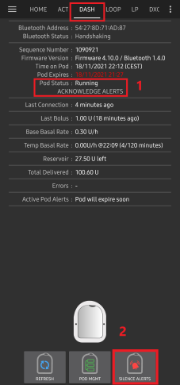

- - -
orphan: true
- - -

# Omnipod DASH

這些說明適用於配置 **Omnipod DASH** 世代幫浦**（不包括 Omnipod Eros）**。 Omnipod 驅動程式可在 AAPS 3.0 版中使用。

**此軟體是 DIY 人工胰臟解決方案的一部分，並非產品，你需要閱讀、學習並了解系統，包括如何使用他。 你需要對自己使用的結果負完全責任。**

## Omnipod DASH 規格

以下是 **Omnipod DASH** 與 **Omnipod EROS** 的區別：

* DASH Pods 具有藍色針蓋（EROS 則有透明針蓋）。 Pod 在物理尺寸上是相同的。
* 不需要單獨的 Omnipod 到 BLE 連線/橋接裝置（不需要 RileyLink、OrangeLink 或 EmaLink）。
* 僅在需要時進行藍牙連線，發送指令後即中斷連線！
* 不再出現“無法連線到連線裝置/Pod”的錯誤
* AAPS 會等到幫浦可用後再發送指令。
* 在啟動時，AAPS 將尋找並連線新的 DASH Pod。
* 預期範圍：5-10 公尺（實際效果可能有所不同）

## 硬體/軟體要求

* 一個新的 **Omnipod DASH Pod**（以藍色針蓋為標識）

* **相容的 Android 手機** 需具備 BLE 藍牙連線
   -  並非所有手機硬體和 Android 版本都能保證工作。 請查看 [**DASH 測試手機**](#Phones-list-of-tested-phones)，或者直接試試你的手機並告訴我們結果（手機型號及地區、Android 版本、運作良好/有些困難/無法使用）。
   - **重要提示：使用舊版韌體 3.XX.X 的 Pod 時，曾有多起永久、不可恢復的連線損失案例。 使用這些舊 Pod 時請小心，尤其是當其他藍牙裝置連線到你的手機時！** 請注意，AAPS Omnipod Dash 驅動程式每次發送指令時都會透過藍牙連線到 Dash POD，並在隨後立即中斷連線。 藍牙連線可能會受到連線到運作 AAPS 手機的其他裝置（例如耳機等）的干擾（在某些手機型號中，這可能會導致連線問題或 Pod 註冊期間或之後的錯誤/遺失），或者被他們干擾。
   -  **使用[**Build APK**](../SettingUpAaps/BuildingAaps.md)指示構建和安裝的 AAPS 版本 3.0 或更高版本**。
* [**連續血糖監測儀（CGM）**](../Getting-Started/CompatiblesCgms.md)

這些說明假設你正在開始新的幫浦使用。如果不是這樣，請耐心等待，並在下一次更換幫浦時再進行。

## 在你開始之前

**安全第一** - 請勿在無法從錯誤中恢復的環境中嘗試此過程（必須準備額外的 Pod、胰島素和手機裝置）。

**你的 Omnipod Dash PDM 在 AAPS Dash 驅動程式啟動 Pod 後將無法再使用。** 以前，你使用 Dash PDM 對 Dash Pod 發送指令。 Dash Pod 只允許一個裝置發送指令與其通訊。 從那時起，成功啟動 Pod 的裝置將是唯一能夠與其通訊的裝置。 這意味著，你透過 AAPS Dash 驅動程式在 Android 手機上啟動了一個 Dash Pod，**你將無法再使用 PDM 與該 Pod 進行通訊**。 你 Android 手機上的 AAPS Dash 驅動程式現在是你的 PDM。

*這並不意味著你應該丟棄 PDM，建議將其留作備用和應急使用，例如手機遺失或 AAPS 無法正常工作時。*

**當 Pod 未連線到 AAPS 時，Pod 不會停止輸送胰島素**。 預設的基礎速率會在 Pod 啟用時，根據目前啟用的設定檔寫入 Pod 中 只要 AAPS 正常運作，他將發送持續時間最多為 120 分鐘的基礎率指令。 當因某些原因 Pod 未接收到任何新指令（例如，因 Pod 與手機的距離過遠而失去連線）時，Pod 會自動恢復為預設基礎率。

**AAPS 不支援 30 分鐘基礎率設定檔。** **AAPS 設定檔不支援 30 分鐘的基礎率時間框架** 如果你是 AAPS 新手並首次設置基礎率設定檔，請注意，基礎率從半小時開始的設定不被支援，你需要調整你的基礎率設定檔以從整點開始。 例如，如果你的基礎率為 1.1 單位，並於 09:30 開始，持續時間為 2 小時，於 11:30 結束，這將無法正常工作。 你需要將此 1.1 單位的基礎率更改為 9:00-11:00 或 10:00-12:00 的時間範圍。 儘管 Omnipod Dash 硬體本身支援 30 分鐘基礎率設定檔，但 AAPS 的演算法目前無法考慮這些增量。

**AAPS 不支援 0 單位/小時的設定檔基礎率** 雖然 DASH Pods 支援 0 單位基礎率，但由於 AAPS 使用基礎率設定檔的倍數來確定自動治療，因此無法處理 0 單位基礎率。 可以透過“中斷幫浦”功能或停用循環/臨時基礎率或暫停循環/臨時基礎率的組合來實現臨時的 0 單位基礎率。

## 在 AAPS 中啟用 Dash 驅動程式

你可以透過**兩種方式**在 AAPS 中啟用 Dash 驅動程式：

### 選項 1：新安裝

當你首次安裝 AAPS 時，**設置嚮導**將引導你完成 AAPS 的安裝。 當達到幫浦選擇時，選擇“DASH”。

如有疑問，你還可以選擇“虛擬幫浦”，並在設置 AAPS 後選擇“DASH”（參見選項 2）。

### 選項 2：組態建置工具

在現有安裝中，你可以從組態建置工具中選擇**DASH**幫浦：

在左上角的**漢堡選單**中，選擇**組態建置工具（1）**\ ➜\ **幫浦**\ ➜\ **Dash**\ ➜\ 選擇**Dash**的**設置齒輪（3）**旁的**選項按鈕（2）**。

選擇**設置齒輪（3）**旁的**複選框（4）**，將允許 DASH 選單作為 AAPS 介面中的一個標籤顯示，標題為**DASH**。 勾選此框將有助於你在使用 AAPS 時查看 DASH 指令。

**注意：**可以在本文件的 Dash 設定部分找到更快速讀取[**Dash 設定**](#dash-settings)的方法。

### 驗證 Omnipod 驅動程式選擇

要驗證你是否已在 AAPS 中啟用了 Dash 驅動程式，勾選該框（4）後，**從** **首頁首頁總覽**標籤**向左滑動**，你將看到一個**DASH**標籤。 如果你沒有勾選該框，你會在左上角的漢堡選單中找到 DASH 標籤。

## Dash 配置

請**向左滑動**到**DASH**標籤，在那裡你將能管理所有 Pod 功能（在沒有註冊 Pod 會話的情況下，某些功能將不可用或不可見）：

 重新整理 Pod 連線和狀態，能夠在 Pod 發出嗶聲時靜音 Pod 警報

 Pod 管理（註冊、停用、播放測試嗶聲和 Pod 歷史紀錄）

(OmnipodDASH-activate-pod)=

### 註冊 Pod

1. 導航至**DASH**標籤，點擊**POD 管理（1）**按鈕，然後點擊**註冊 Pod（2）**。

​

2. 顯示**填充 Pod**畫面。 將至少 80 單位的胰島素注入新的 Pod，等聽到兩聲嗶聲，表示 Pod 準備就緒並可續繼將胰島素輸入完。 計算 3 天所需的胰島素總量時，請考慮 Pod 本身的排空會占用約 3-10 單位。

    

確保新 Pod 和要運作 AAPS 的手機兩者在附近，然後點擊**下一步**按鈕。

**注意**：如果出現以下錯誤訊息，不要驚慌，這是可能發生的。 點擊 **重試** 按鈕。 在大多數情況下，註冊將繼續成功進行。

3. 在 **初始化 Pod** 畫面上，Pod 將開始排空（你會聽到點擊聲，接著是連續的滴答聲，表明 Pod 正在自我排空）。  排空成功後會顯示綠色勾號，並且 **下一步** 按鈕將變為可用狀態。 點擊 **下一步** 按鈕，完成 Pod 排空初始化並顯示 **連線 Pod** 畫面。

    

4. 接下來，準備新 Pod 的注射部位。 移除 Pod 的塑膠針蓋。 如果你看到 Pod 有突出的部分，請取消流程並從新的 Pod 開始。 如果一切正常，撕下黏貼物的白色襯紙，並將 Pod 貼在你選定的身體部位。 完成後，點擊 **下一步** 按鈕。

5. 現在會出現 **連線 Pod** 對話框。 **只有在你準備好插入針管時才點擊 OK 按鈕**。

6. 按下 **OK** 後，可能需要一些時間，Dash Pod 才會回應並插入針管（最多 1-2 分鐘），請耐心等待。

 *注意：在插入針管之前，最好輕捏針管插入點附近的皮膚。 這有助於針頭順利插入，並減少堵塞的機會。*

    

7. 針管成功插入後會顯示綠色勾號，並且 **下一步** 按鈕將變為可用狀態。 點擊 **下一步** 按鈕。

9. 顯示 **Pod 已註冊** 畫面。 點擊綠色 **完成** 按鈕。 恭喜！ 你已經開始了新的 Pod 使用階段。

10. 現在 **Pod 管理** 選單畫面應顯示 **註冊 Pod (1)** 按鈕為 *停用*，並顯示 **停用 Pod (2)** 按鈕為 *啟用*。 這是因為目前有一個 Pod 處於啟用狀態，必須先停用目前啟用的 Pod 才能註冊另一個 Pod。

    點擊手機上的返回按鈕，返回到 **DASH** 標籤畫面，該畫面現在會顯示你的啟用 Pod 的資訊，包括目前基礎率、Pod 儲液量、輸送的胰島素、Pod 錯誤和警報。

    有關顯示的訊息的更多詳細資訊，請轉到本文件的[**DASH 標籤**](#dash-tab)部分。

​

在註冊 Pod 後匯出設置是一個好習慣。 每次更換 Pod 時都應執行此操作，每月一次，將匯出的文件複製到你的網路磁碟。 請見[**匯出設定文件**](../Maintenance/ExportImportSettings.md)。

(OmnipodDASH-deactivate-pod)=

### 停用 Pod

在正常情況下，Pod 的預期壽命為三天（72 小時），並且在 Pod 過期警告後還有額外的 8 小時，總共可以使用 80 小時。

要停用 Pod（不論是過期還是 Pod 故障）：

1. 進入 **DASH** 標籤，點擊 **POD 管理 (1)** 按鈕，然後在 **Pod 管理** 畫面中點擊 **停用 Pod (2)** 按鈕。

​

2. 在 **停用 Pod** 畫面上，點擊 **下一步** 按鈕開始停用 Pod 的流程。 你會收到來自 Pod 的確認嗶聲，表明停用成功。

 

3. 停用成功後會顯示綠色勾號。 點擊 **下一步** 按鈕以顯示 Pod 停用畫面。 你現在可以移除 Pod，因為該使用階段已停用。

4. 點擊綠色按鈕返回 **Pod 管理** 畫面。

5. 現在你已進入 **Pod 管理** 選單；按下手機上的返回按鈕返回 **DASH** 標籤。 確認 **Pod 狀態：** 欄位顯示 **無可用的 Pod** 訊息。

 

(OmnipodDASH-resuming-insulin-delivery)=

### 恢復胰島素輸送

**注意**：在切換設定檔期間，Dash 必須暫停輸送，然後設置新的基礎率設定檔。 如果兩個指令之間的通訊失敗，則可能會暫停輸送。 在問題排除部分閱讀[**暫停交付**](#delivery-suspended)以獲取更多詳細資訊。

使用此指令指示目前暫停的活動 Pod 恢復胰島素輸送。 指令成功處理後，胰島素將根據目前時間並使用活動基礎率設定檔恢復正常輸送。 Pod 將再次接受注射、TBR 和 SMB 的指令。

1. 進入 **DASH** 標籤，確認 **Pod 狀態 (1)** 欄位顯示 **已暫停**，然後按下 **恢復輸送 (2)** 按鈕以開始流程，指示目前的 Pod 恢復正常的胰島素輸送。 訊息 **恢復輸送** 將顯示在 **Pod 狀態 (3)** 欄位中。

   

2. 當恢復輸送指令成功後，確認對話框將顯示訊息 **胰島素輸送已恢復**。 點擊 **OK** 以確認並繼續。

3. **DASH** 標籤將更新 **Pod 狀態 (1)** 欄位，顯示 **運作中**，並且將不再顯示恢復輸送按鈕。

### 靜音 Pod 警報

*注意 - 僅當觸發 Pod 過期或低儲液量警報時，**靜音警報** 按鈕才會在 **DASH** 標籤上顯示。 如果未顯示靜音警報按鈕且你聽到 Pod 的嗶聲，請嘗試“重新整理 Pod 狀態”。*

以下流程將向你展示當 Pod 的使用時間接近72小時（3天）到期的警告時，如何確認並關閉 Pod 的嗶聲。 此警告時間限制定義在 **距關閉時間的時數** Dash 警報設置中。 Pod 的最大使用壽命為 80 小時（3 天 8 小時），但 Insulet 建議不要超過 72 小時（3 天）限制。

1. 當達到定義的 **距關閉時間的時數** 警告時間限制時，Pod 會發出警告嗶聲，通知你即將過期並需要更換 Pod。 你可以在 **DASH** 標籤上進行驗證，**Pod 過期：** 欄位將顯示 Pod 的確切過期時間（註冊後 72 小時），且文字會在此時間過後變為 **紅色**。 在 **啟用 Pod 警報 (2)** 欄位下，狀態訊息會顯示 **Pod 即將過期**。 這也會觸發顯示 **靜音警報 (3)** 按鈕。

2. 進入 **DASH** 標籤並按下 **靜音警報 (2)** 按鈕。 AAPS 會向 Pod 發送指令以停用 Pod 過期警告嗶聲，並將 **Pod 狀態 (1)** 欄位更新為 **確認警報**。

3. **成功停用**警報後，啟用 Pod 將發出**兩聲嗶聲**，並且確認對話框將顯示訊息**註冊警報已靜音**。 點擊 **OK** 按鈕以確認並關閉對話框。

4. 進入 **DASH** 標籤。 在 **啟用 Pod 警報** 欄位下，警告訊息將不再顯示，且活動 Pod 將不再發出 Pod 過期警告嗶聲。

(OmnipodDASH-view-pod-history)=

### 查看 Pod 歷史紀錄

本節將向你展示如何查看你的活動 Pod 歷史紀錄，並根據不同的操作類別進行篩選。 Pod 歷史工具允許你查看在其三天（72 - 80 小時）使用壽命期間提交到目前活動 Pod 的操作和結果。

此功能有助於驗證發送到 Pod 的注射劑量、臨時基礎率和基礎指令。 其餘類別對於排除故障和確定發生失敗前的事件順序很有幫助。

*注意：* **只有最後一個指令可能是不確定的**。 在**最後的“不確定”指令被“確認”或“拒絕”**之前，*不會發送新的指令*。 “修復”不確定指令的方法是按下 **“重新整理 Pod 狀態”**。

1. 進入 **DASH** 標籤，按下 **POD 管理 (1)** 按鈕以進入 **Pod 管理** 選單，然後按下 **Pod 歷史紀錄 (2)** 按鈕以進入 Pod 歷史紀錄畫面。

 

2. 在 **Pod 歷史紀錄** 畫面中，顯示預設類別 **全部 (1)**，以逆序顯示所有 Pod **操作 (3)** 和 **結果 (4)** 的 **日期和時間 (2)**。 使用手機的 **返回按鈕按兩次** 以返回主 AAPS 介面中的 **DASH** 標籤。

 

(OmnipodDASH-dash-tab)=

## DASH 標籤

以下是主 AAPS 介面中 **DASH** 標籤的佈局說明及圖示和狀態欄位的含義。

*注意：如果 **DASH** 標籤的狀態欄位中顯示 (不確定)，則你需要按下重新整理按鈕來清除此訊息並重新整理 Pod 狀態。*

### 欄位

* **藍牙地址：** 顯示目前連線 Pod 的藍牙地址。
* **藍牙狀態：** 顯示目前的連線狀態。
* **序列號：** 顯示目前啟用的 Pod 序列號。
* **韌體版本：** 顯示目前連線的韌體版本。
* **Pod 上的時間：** 顯示 Pod 上的目前時間。
* **Pod 過期時間：** 顯示 Pod 的過期日期和時間。
* **Pod 狀態：** 顯示 Pod 狀態。
* **上次連線：** 顯示與 Pod 的最後一次通訊時間。

   - *片刻前* - 少於 20 秒前。
   - *不到一分鐘前* - 超過 20 秒但少於 60 秒前。
   - *1 分鐘前* - 超過 60 秒但少於 120 秒（2 分鐘）。
   - *XX 分鐘前* - 超過 2 分鐘，具體由 XX 的值定義。

* **上次注射：** 顯示發送到活動 Pod 的最後一次注射的劑量以及他是多長時間前發出的（以括號顯示）。
* **基礎率：** 顯示基礎率設定檔中目前時間的基礎率設定。
* **臨時基礎率：** 以以下格式顯示目前運作的臨時基礎率。

   - {每小時單位數} @{TBR 開始時間} ({運作分鐘數}/{TBR 總運作分鐘數})
   - *示例：* 0.00U/h @18:25 ( 90/120 分鐘)

* **儲液量：** 當儲液量超過 50 單位時顯示 50+ 單位。 當儲液量低於 50 單位時，顯示確切的單位數。
* **總輸送量：** 顯示從儲液中輸送的胰島素總單位數。 這包含已使用和排空的胰島素。
* **錯誤：** 顯示遇到的最後一個錯誤。 檢查[Pod 歷史](#view-pod-history)和日誌檔案以獲取過去錯誤的詳細資訊和更多訊息。
*  **啟用 Pod 警報：** 保留目前啟用 Pod 上運作的警報。

### 按鈕

 ：向啟用的 Pod 發送重新整理指令以更新通訊。

   * 用於重新整理 Pod 狀態並消除顯示 (不確定) 訊息的狀態欄位。
   * 請參閱下面的問題排除部分以獲取更多訊息。

 ：導航到 Pod 管理選單。

 ：按下此按鈕可停用 Pod 警報嗶聲和通知（過期、儲液量低等）。

   * 該按鈕僅在 Pod 過期警告時間已過時顯示。
   * 成功解除後，此圖示將不再顯示。

 ：恢復目前暫停的活動 Pod 胰島素輸送。

### Pod 管理選單

以下是通過按下**POD MGMT (1)**按鈕從**DASH**選單進入的**Pod 管理**菜單中圖示的含義。

 

* 2 - [**激活 Pod**](#activate-pod)：對新的 Pod 進行灌注並激活。
* 3 - [**停用 Pod**](#deactivate-pod)：停用目前啟用的 Pod。
* 4 - **播放測試嗶聲** ：按下時播放 Pod 的單次測試嗶聲。
* 5 - [**Pod 歷史**](#view-pod-history)：顯示當前 Pod 的活動歷史紀錄。

(DanaRS-Insulin-Pump-dash-settings)=

## Dash 設定

你可以從左上角 **漢堡選單** 下的 **組態建置工具 (1)**\ ➜\ **幫浦**\ ➜\ **Dash**\ ➜\ **設定齒輪 (3)** 中進行 Dash 驅動設定，方法是選擇標題為 **Dash** 的 **單選按鈕 (2)**。 選擇**設置齒輪（3）**旁的**複選框（4）**，將允許 DASH 選單作為 AAPS 介面中的一個標籤顯示，標題為**DASH**。

**注意：** 查看 **Dash 設定** 的更快方式是查看 **DASH** 標籤右上角的 **三點選單 (1)** 並從下拉選單中選擇 **Dash 偏好設定 (2)**。

下方列出了設定組；大多數項目可透過切換開關啟用或停用：

*注意：星號 (\*) 表示預設為啟用。*

### 確認嗶聲提示

提供來自藥筒的確認聲音提示，用於注射、基礎輸注、SMB以及TBR輸送和變更。

* **啟用注射嗶聲：** 啟用或停用注射時的確認嗶聲。
* **啟用基礎率嗶聲：** 啟用或停用設置新基礎率、取消啟用的基礎率或更改目前基礎率時的確認嗶聲。
* **啟用 SMB 嗶聲：** 啟用或停用當 SMB 被送達時的確認嗶聲。
* **啟用 TBR 嗶聲：** 啟用或停用設置或取消 TBR 時的確認嗶聲。

### 警報

提供 AAPS 警報，包括 Pod 到期、關閉、儲液量低，根據定義的門檻值單位觸發。

*請注意，Pod 觸發警報後，AAPS 通知將始終發出。 解除通知不會取消警報，除非啟用了自動確認 Pod 警報功能。 若要手動解除警報，你必須進入 **DASH** 標籤，並按下 **靜音警報按鈕**。*

* **啟用到期提醒：** 啟用或停用在達到設定的到期時間前的 Pod 到期提醒。
* **關閉前的時數：** 定義 Pod 關閉前的幾小時，這將觸發到期提醒警報。
* **啟用儲液量低警報：** 當 Pod 剩餘的單位達到定義的數量時，啟用或停用儲液量低警報。
* **單位數：** 定義觸發 Pod 儲液量低警報的單位數量。

### 通知

提供 AAPS 通知和手機提示音，當 TBR、SMB 或注射的事件是否成功無法確定時發出。

*注意：這些僅是通知，沒有嗶聲警報。*

* **啟用不確定 TBR 通知音效：** 啟用或停用此設定，以在 AAPS 不確定 TBR 是否成功設置時觸發提示音和視覺通知。
* **啟用不確定 SMB 通知音效：** 啟用或停用此設定，以在 AAPS 不確定 SMB 是否成功送達時觸發提示音和視覺通知。
* **啟用不確定注射通知音效：** 啟用或停用此設定，以在 AAPS 不確定注射是否成功送達時觸發提示音和視覺通知。
* **啟用暫停輸送通知音效：** 啟用或停用此設定，以在暫停輸送成功送達時觸發提示音和視覺通知。

## 手動操作 (ACT) 標籤

此標籤已在主 AAPS 文件中有詳細說明，但此處有一些 Omnipod Dash Pod 與管路幫浦的差異，特別是在應用新 Pod 的過程後。

1. 進入主 AAPS 介面中的 **手動操作 (ACT)** 標籤。

2. 在 **照護入口(Careportal) (1)** 部分下，**胰島素** 和 **套管** 欄位會在每次更換 Pod 後自動重置為 0 天和 0 小時。 這是根據 Omnipod 幫浦的設計和運作方式所設。 由於 Pod 直接將套管插入應用 Pod 的皮膚上，因此 Omnipod 幫浦不使用傳統的管路。 *因此，在更換 Pod 後，這些數值的時間將自動重置為零。* **幫浦電池時間** 不會被報告，因為 Pod 中的電池壽命始終比 Pod 的最大壽命（80 小時）長。 每個 Pod 內都包含 **幫浦電池** 和 **胰島素儲液器**。

### 等級

**胰島素等級**

顯示的胰島素等級是 Omnipod DASH 回報的數量。 然而，Pod 僅在儲液器低於 50 單位時報告實際的胰島素儲液量。 在此之前，會顯示「超過 50 單位」。 報告的數量並不精準：當 Pod 報告「空」時，大多數情況下儲液器仍有一些剩餘的胰島素單位。 Omnipod DASH 首頁總覽標籤將顯示如下所述：

  * **超過 50 單位** - Pod 報告儲液器中還有超過 50 單位。
  * **少於 50 單位** - Pod 報告的儲液器中剩餘的胰島素量。

附加說明：
  * **SMS** - 短訊回報數值為 50+ 單位。
  * **Nightscout** - 當超過 50 單位時，向 Nightscout 上傳數值為 50（版本 14.07 及更早版本）。  更新版本將在超過 50 單位時報告數值為 50+。

## 問題排除

(OmnipodDASH-delivery-suspended)=

### 輸送暫停

  * 現在已無暫停按鈕。 如果你想「暫停」 Pod，你可以設置0U/h臨時基礎率(TBR) 數分鐘。
  * 在設定檔切換期間，Dash 必須在設置新的基礎率設定檔之前暫停輸送。 如果兩個指令之間的通訊失敗，則輸送可能會保持暫停。 當這種情況發生時：
     - 將不會有胰島素輸送，包括基礎率、SMB、手動注射等。
     - 可能會通知某個指令未確認：這取決於失敗發生的時間。
     - AAPS 將每 15 分鐘嘗試設置新的基礎率設定檔。
     - 如果輸送仍然暫停（恢復輸送失敗），AAPS 將每 15 分鐘發送通知，通知輸送已暫停。
     - 如果使用者選擇手動重新開始給藥，[**重新開始給藥**](#resuming-insulin-delivery)按鈕將會啟用。
     - 如果 AAPS 自行恢復輸送失敗（這發生在 Pod 無法到達、聲音靜音等情況下），Pod 將每分鐘發出 4 次嗶聲，持續 3 分鐘，然後在輸送暫停超過 20 分鐘後每 15 分鐘重複一次。
  * 對於未確認的指令，「重新整理 Pod 狀態」應能確認/否認他們。

<**注意：** 當你聽到 Pod 發出嗶聲時，不要假設胰島素會繼續注射而不檢查手機，注射可能已暫停，**所以一定要檢查！**

### Pod 故障

Pod 會因多種問題偶爾發生故障，包括 Pod 本身的硬體問題。 最佳做法是不要向 Insulet 報告，因為 AAPS 並非經過認證的使用情況。 一份故障代碼列表可在 [**這裡找到**](https://github.com/openaps/openomni/wiki/Fault-event-codes)，以幫助確定原因。

### 防止 49 號錯誤 Pod 故障

此故障與指令的 Pod 狀態不正確或胰島素輸送指令中的錯誤有關。 這是當驅動程式和 Pod 對實際狀態存在分歧時發生的情況。 Pod（出於內建的安全措施）會以無法恢復的錯誤代碼 49（0x31）反應，最終會變成所謂的「尖叫機」：只能透過在 Pod 背面適當位置打孔來停止的長時間刺耳嗶聲。 「49 Pod 故障」的確切原因通常難以追溯。 在某些情況下，這種故障可能發生（例如應用程式崩潰、運作開發版本或重新安裝）。

### 幫浦無法連線警報

當無法在預設的時間內與 Pod 建立通訊時，將會發出「無法到達幫浦」的警報。 可透過進入右上角的三點選單，選擇 **偏好設定**\ ➜\ **本地警報**\ ➜\ **無法到達幫浦的門檻值 [分鐘]** 來配置無法到達幫浦的警報。 建議設置的值是**120** 分鐘後提醒。

### 匯出設定

匯出 AAPS 設定使你能夠恢復所有設定，更重要的是，恢復所有目標。 你可能需要在卸載/重新安裝 AAPS 後或手機遺失後，在新手機上重新安裝時恢復設定為「最後一次的工作狀態」。

注意：匯出的設定中包含啟用的 Pod 資訊。 如果你匯入了「舊」的匯出檔案，你的目前 Pod 會「失效」。 沒有其他選擇。 在某些情況下（例如 _計劃中的_ 換手機），你可能需要使用匯出的檔案來恢復 AndroisAPS 設定**，同時保持目前啟用的 Pod**。 在這種情況下，重要的是需要包含目前啟用 Pod 的最新匯出設定檔案。

**啟動 Pod 後立即匯出是一種好習慣**。 這樣，你在遇到問題時，隨時都可以恢復目前啟用的 Pod。 例如，當你更換備用手機時。

定期將匯出的設定檔案複製到安全的地方（例如雲端硬碟），這樣在需要時，任何手機都能存取（例如手機遺失或實際手機的出廠重置情況下）。

### 匯入設定

**警告** 請注意，匯入設定可能會匯入過時的 Pod 狀態。 結果會是失去已啟用的 Pod ！ （參見 **匯出設定**）。 最好僅在沒有其他選擇時才嘗試這樣做。

當匯入具有啟用的 Pod 設定時，請確保匯出是在目前啟用的 Pod 下進行的。

**在有啟用 Pod 的情況下匯入：**（你有失去 Pod 的風險！）

1. 確保你匯入的設定是最近在目前啟用 Pod 下匯出的。
2. 匯入你的設定。
3. 檢查所有偏好設定。

**匯入（沒有啟用的 Pod 連線）**

1. 匯入任何最近的匯出應該可以工作（見上文）。
2. 匯入你的設定。
3. 檢查所有偏好設定。
4. 如果匯入的設定中包含任何啟用的 Pod 資料，你可能需要**停用**「不存在」的 Pod。

### 匯入包含非活動 Pod 狀態的設定

當匯入包含已不再啟用的 Pod 資料時，AAPS 將嘗試與其連線，這顯然會失敗。 在這種情況下，你無法啟動新 Pod。

若要移除舊的 Pod 會話，請「嘗試」停用該 Pod。 停用將失敗。 選擇「重試」。 在第二次或第三次重試後，你將獲得移除 Pod 的選項。 移除舊的 Pod，你將能夠啟動新 Pod。

### 重新安裝 AAPS

當卸載 AAPS 時，你將失去所有設定、目標和目前的 Pod 連線。 為了恢復他們，請確保有一個最近匯出的設定檔案可用！

當有活動 Pod 時，請務必確保你有目前 Pod 會話的匯出，否則在匯入舊設定時，你將失去目前啟用的 Pod。

1. 匯出你的設定並將副本存儲在安全的地方。
2. 卸載 AAPS 並重新啟動手機。
3. 安裝新版本的 AAPS。
4. 匯入你的設定。
5. 驗證所有偏好設定（可選地再次匯入設定）。
6. 啟動新 Pod。
7. 完成後：匯出目前設定。

### 更新 AAPS 至新版本

在大多數情況下，無需卸載。 你可以透過啟動新版本的安裝進行「就地」安裝。 這在啟用 Pod 在使用期間也是可以的。

1. 匯出你的設定。
2. 安裝新版本的 AAPS。
3. 驗證安裝是否成功。
4. 繼續使用 Pod 或啟動新 Pod。
5. 完成後：匯出目前設定。

### Omnipod 驅動程式警報

請注意，Omnipod Dash 驅動程式會在**首頁總覽標籤**中顯示各種獨特的警報，其中大多數是資訊性的，可以忽略，而有些會提供使用者解決觸發警報原因的操作。 你可能會遇到的主要警報總結如下：

* 沒有啟用的 Pod 未偵測到啟用的 Pod 使用。 按下**稍後提醒**可以暫時忽略此警報，但只要未啟動新 Pod，他就會持續觸發。 當此警報啟動後，會自動靜音。
* Pod 暫停 Pod 已暫停的資訊性警報。
* 設定基礎率設定檔失敗：輸送可能已暫停！ 請手動從 Omnipod 標籤中重新整理 Pod 狀態並在需要時恢復輸送。 Pod 基礎率設定失敗的資訊性警報，你需要按下 Omnipod 標籤上的*重新整理*按鈕。
* 無法確認 SMB 注射是否成功。 如果你確定注射未成功，應手動從治療中刪除 SMB 項目。 警報提示無法確認 SMB 注射指令的成功，你需要檢查 DASH 標籤上的*最後一次注射*欄位以查看 SMB 注射是否成功，如果未成功，則從治療標籤中刪除該項目。
* 不確定「任務注射/TBR/SMB」是否完成，請手動確認是否成功。

## 在哪裡尋求 Omnipod DASH 驅動程式的幫助

Omnipod DASH 驅動程式的所有開發工作都是由社群志願者完成的；我們請你記住這一點，並在尋求幫助前遵循以下指南：

-  **等級 0：** 閱讀此文件的相關部分，以確保你了解遇到困難的功能應如何工作。
-  **等級 1：** 如果你仍然遇到無法解決的問題，請使用[此邀請鏈接](https://discord.gg/4fQUWHZ4Mw)進入**Discord**的*#AAPS* 頻道。
-  **等級 2：** 搜尋現有問題，以查看你的問題是否已被報告，請在[問題](https://github.com/nightscout/AndroidAPS/issues)中確認/評論/添加有關你的問題的訊息。 如果沒有，請建立一個[新問題](https://github.com/nightscout/AndroidAPS/issues)並附上[您的日誌文件](../GettingHelp/AccessingLogFiles.md)。
-  **保持耐心——我們社群中的大多數成員都是善良的志願者，解決問題通常需要使用者和開發者雙方的時間和耐心。**
