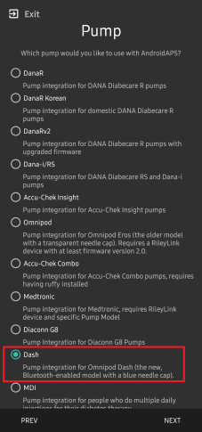
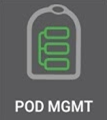
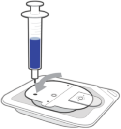
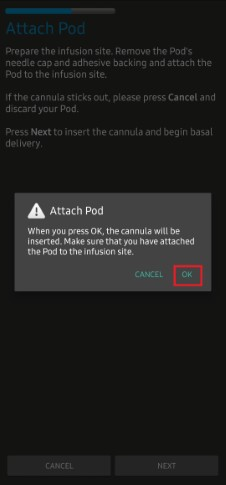

- - -
orphan: true
- - -

# Omnipod DASH

這些指示是用於設定**Omnipod DASH**世代幫浦**(不適用於 Omnipod Eros)**，可作為**AAPS**版本 3.0的一部分。

## Omnipod DASH 規格

以下是**Omnipod DASH**（簡稱「DASH」）的規格，以及它與**Omnipod EROS**（簡稱「EROS」）的區別：

* DASH Pods 具有藍色針蓋（EROS 則有透明針蓋）。 這兩種 Pod 在物理尺寸上是相同的。
*  DASH 不需要 BLE 連結/橋接設備（無需 RileyLink、OrangeLink 或 EmaLink）。
* DASH 的藍牙連線僅在需要時使用，並在發送指令後立即中斷連線！
* 使用DASH時再也不會出現「無法連線到連結設備/ Pod 」的錯誤。
* **AAPS**將等候 Pod 的可讀取性以發送指令。
* Pod 啟動時，**AAPS**將尋找並連接到新的DASH Pod 。
* 預期範圍：5-10公尺（依個人情況而異）。

```{admonition} Android 15
:class: warning

There are currently reported Bluetooth connection issues with the following combination of **AAPS**: DASH + Android 15.
Please refrain from upgrading your phone to Android 15 unless you have checked the following [**list**](https://docs.google.com/spreadsheets/u/1/d/e/2PACX-1vScCNaIguEZVTVFAgpv1kXHdsHl3fs6xT6RB2Z1CeVJ561AvvqGwxMhlmSHk4J056gMCAQE02sAWJvT/pubhtml?gid=683363241&amp;single=true) and verified that your phone is not a known reported issue.
If you experience frequent disconnection; try to enable Bond BT as described in: [**Bluetooth Issues**](../GettingHelp/GeneralTroubleshooting.md). 
```

## 硬體/軟體要求

* DASH以藍色針頭蓋識別。


* **相容的Android手機**需要具備 BLE 藍牙連線  
  請注意，**AAPS** Omnipod Dash 驅動程式在每次發送命令時會透過藍牙連接 DASH，並在之後中斷連線。 藍牙連接可能會受到與運行**AAPS**的手機連接的其他藍牙設備的干擾，例如耳機等等（這可能會在少數情況下導致連線問題或 Pod 在啟動或之後出現錯誤/遺失），或被其干擾。
   -  **使用 [**Build APK**](../SettingUpAaps/BuildingAaps.md) 指示構建和安裝的 AAPS 版本 3.0 或更高版本**。
* [**連續血糖監測儀（CGM）**](../Getting-Started/CompatiblesCgms.md)

The instructions below explain how to activate a new pod session. Wait to close to expiry of a current pod session before trying to connect **AAPS** with a new pod. Once a pod is is cancelled it cannot reused and the disconnection will be final.

## 在你開始之前

**SAFETY FIRST** - you should not try to connect **AAPS** to a pod for the first time without having access to extra pods, insulin, and phone devices are a must have.

**Your Omnipod Dash PDM will become redundant after the AAPS Dash driver activates your pod.** Previously a user may have operated a PDM to send commands to your DASH. A DASH will only faciiliate a single device to send commands to communicate with it. The device that successfully activates the pod is the only device allowed to communicate with it from that point forward. This means that once you activate a DASH with your Android phone through the **AAPS**, **you will no longer be able to use your PDM with that pod**. The **AAPS** Dash driver in your Android phone is now your acting PDM.

*This does NOT mean you should throw away your PDM, it is recommended to keep it around as a backup and for emergencies, for instance when your phone gets lost or AAPS is not working correctly.*

**Your pod will not stop delivering insulin when it is not connected to AAPS**. Default basal rates are programmed on the pod on activation as defined in the current active **Profile**. As long as **AAPS** is operational it will send basal rate commands that run for a maximum of 120 minutes. When for some reason the pod does not receive any new commands (for instance because communication was lost due to Pod - phone distance) the pod will automatically fall back to default basal rates.

**AAPS Profile does not support a 30 minute basal rate time frame** If you are new to **AAPS** and are setting up your basal rate **Profile** for the first time, please be aware that basal rates starting on a half-hour basis are not supported, and programmes on an hourly basis. For example, if you have a basal rate of 1.1 units which starts at 09:30 and has a duration of 2 hours ending at 11:30, it is not possible replicate this im **AAPS**. You will need to change this 1.1 unit basal rate to a time range of either 9:00-11:00 or 10:00-12:00. Even though the DASH hardware itself supports the 30 minute basal rate **Profile** increments, **AAPS** does support this feature.

**0U/h profile basal rates are NOT supported in AAPS** While the DASH does support a zero basal rate, since **AAPS** uses multiples of the user's **Profile** basal rate to determine automated treatment; it cannot function with a zero basal rate. A temporary zero basal rate can be achieved through the "Disconnect pump" function or through a combination of Disable Loop/Temp Basal Rate or Suspend Loop/Temp Basal Rate. The lowest basal rate allowed in **AAPS** is 0.05U/h.

## 在AAPS中選擇DASH

There are **two ways**:

### 選項 1：新安裝

When installing **AAPS** for the first time, the **Setup Wizard** will guide new users through key features and installation requirements for **AAPS**. Select “DASH” when you reach Pump selection.



When in doubt you can also select “Virtual Pump” and select “DASH” later, after setting up **AAPS** (see option 2).

### 選項 2：組態建置工具

On an existing installation you can select the **DASH** pump from the Config builder:

On the top-left hand corner **hamburger menu** select **Config Builder (1)**\ ➜\ **Pump**\ ➜\ **Dash**\ ➜\ **Settings Gear (3)** by selecting the **radio button (2)** titled **Dash**.

Selecting the **checkbox (4)** next to the **Settings Gear (3)** will allow the DASH menu to be displayed as a tab in the **AAPS** interface titled **DASH**. Checking this box will facilitate your access to the DASH commands when using **AAPS**.

**NOTE:** A faster way to access the [**Dash settings**](#dash-settings) can be found below in the DASH settings section of this document.


### 驗證 Omnipod 驅動程式選擇

To verify that you have selected the DASH in **AAPS**, if you have checked the box (4), **swipe to the left** from the **Overview** tab, where you will now see a **DASH** tab on **AAPS**. If this box is left unchecked, you’ll find the DASH tab in the hamburger menu upper left.


## Dash 配置

Please **swipe left** to the **DASH** tab where you will be able to manage all pod functions (some of these functions are not enabled or visible without an active pod session):

 'Refresh' pod connectivity and status, be able to silence pod alarms when the pod beeps

 'Pod Management' (Activate, Deactivate, Play test beep, and Pod history)


### 註冊 Pod

1. 導航至**DASH**標籤，點擊**POD 管理（1）**按鈕，然後點擊**註冊 Pod（2）**。


​    

2. 顯示**填充 Pod**畫面。 將至少 80 單位的胰島素注入新的 Pod，等聽到兩聲嗶聲，表示 Pod 準備就緒並可續繼將胰島素輸入完。 計算 3 天所需的胰島素總量時，請考慮 Pod 本身的排空會占用約 3-10 單位。

    

Ensure that the new pod and the phone running **AAPS** are within close proximity of each other and click the **Next** button.

**NOTE**: if the  error message below pops up _'Could not find an available pod for activation'_ (this can happen), do not panic. Click on the **Retry** button. In most situations activation will continue successfully.


3. 在 **初始化 Pod** 畫面上，Pod 將開始排空（你會聽到點擊聲，接著是連續的滴答聲，表明 Pod 正在自我排空）。  排空成功後會顯示綠色勾號，並且 **下一步** 按鈕將變為可用狀態。 點擊 **下一步** 按鈕，完成 Pod 排空初始化並顯示 **連線 Pod** 畫面。

    

4. 接下來，準備好輸注部位以接收新的 Pod 。 洗手以避免任何感染風險。 使用肥皂和水或酒精濕巾清潔輸注部位，消毒後讓皮膚完全自然乾燥，再繼續進行。 移除 Pod 的藍色塑料針頭蓋。 如果你看到 Pod 有任何突出或不尋常的情況，請取消過程並使用新的 Pod 。 如果一切正常，請將粘性白色紙背面撕掉，並將 Pod 貼到你身體上選擇的位置。 完成後，點擊 **下一步** 按鈕。


5. 現在會出現 **連線 Pod** 對話框。 **只有在你準備好插入針管時才點擊 OK 按鈕**。



6. 按下**確定**後，DASH可能需要一些時間才能響應並插入導管（最多1-2分鐘）。 請耐心等候。

 *注意：在插入針管之前，最好輕捏針管插入點附近的皮膚。 這有助於針頭順利插入，並減少堵塞的機會。*

    

7. 針管成功插入後會顯示綠色勾號，並且 **下一步** 按鈕將變為可用狀態。 點擊 **下一步** 按鈕。


9. 顯示 **Pod 已註冊** 畫面。 點擊綠色 **完成** 按鈕。 恭喜！ 你現在已經開始一個新的藥量會話。


10. 現在 **Pod 管理** 選單畫面應顯示 **註冊 Pod (1)** 按鈕為 *停用*，並顯示 **停用 Pod (2)** 按鈕為 *啟用*。 這是因為目前有一個 Pod 處於啟用狀態，必須先停用目前啟用的 Pod 才能註冊另一個 Pod。

    點擊手機上的返回按鈕，返回到 **DASH** 標籤畫面，該畫面現在會顯示你的啟用 Pod 的資訊，包括目前基礎率、Pod 儲液量、輸送的胰島素、Pod 錯誤和警報。

    有關顯示的訊息的更多詳細資訊，請轉到本文件的[**DASH 標籤**](#dash-tab)部分。


​    

It is good practice to export settings AFTER activating the pod. Export settings should be done at each pod change and once a month, copy the exported file to your internet drive. see [**Export settings Doc**](../Maintenance/ExportImportSettings.md).


(OmnipodDASH-deactivate-pod)=

### 停用 Pod

Under normal circumstances, the expected lifetime of a pod is three days (72 hours) and an additional 8 hours after the pod expiration warning for a total of 80 hours of pod usage.

To deactivate a pod (either from expiration or from a pod failure):

1. 進入 **DASH** 標籤，點擊 **POD 管理 (1)** 按鈕，然後在 **Pod 管理** 畫面中點擊 **停用 Pod (2)** 按鈕。


​    

2. 在 **停用 Pod** 畫面上，點擊 **下一步** 按鈕開始停用 Pod 的流程。 你會收到來自 Pod 的確認嗶聲，表明停用成功。


 


3. 停用成功後會顯示綠色勾號。 點擊 **下一步** 按鈕以顯示 Pod 停用畫面。 你現在可以移除 Pod，因為該使用階段已停用。


4. 點擊綠色按鈕返回 **Pod 管理** 畫面。


5. 現在你已進入 **Pod 管理** 選單；按下手機上的返回按鈕返回 **DASH** 標籤。 確認 **Pod 狀態：** 欄位顯示 **無可用的 Pod** 訊息。


 

### 恢復胰島素輸送

**Note**: During **Profile Switches**, DASH must suspend delivery before setting the new basal **Profile** as delivery can be suspended. Read [**Delivery suspended**](#delivery-suspended) in the troubleshooting section for more details.

Use this command to instruct the active, currently suspended pod to resume insulin delivery. After the command is successfully processed, insulin will resume normal delivery using the current basal rate based on the current time from the active basal **Profile**. The pod will again accept commands for bolus, **TBR**, and **SMB**.

1. 進入 **DASH** 標籤，確認 **Pod 狀態 (1)** 欄位顯示 **已暫停**，然後按下 **恢復輸送 (2)** 按鈕以開始流程，指示目前的 Pod 恢復正常的胰島素輸送。 訊息 **恢復輸送** 將顯示在 **Pod 狀態 (3)** 欄位中。

   

2. 當恢復輸送指令成功後，確認對話框將顯示訊息 **胰島素輸送已恢復**。 點擊 **OK** 以確認並繼續。


3. **DASH** 標籤將更新 **Pod 狀態 (1)** 欄位，顯示 **運作中**，並且將不再顯示恢復輸送按鈕。


### 靜音 Pod 警報

*NOTE - The SILENCE ALERTS button is only available on the **DASH** tab when the pod expiration or low reservoir alert has been triggered. If the SILENCE ALERTS button is not visible and you hear beep sounds from the pod, try to 'Refresh pod status'.*

The process below will show you how to acknowledge and dismiss pod beeps when the active pod time reaches the warning time limit before the pod expiration of 72 hours (3 days). This warning time limit is defined in the **Hours before shutdown** Dash alerts setting. The maximum life of a pod is 80 hours (3 days 8 hours), however Insulet recommends not exceeding the 72 hours (3 days) limit.

1. 當達到定義的 **距關閉時間的時數** 警告時間限制時，Pod 會發出警告嗶聲，通知你即將過期並需要更換 Pod。 你可以在 **DASH** 標籤上進行驗證，**Pod 過期：** 欄位將顯示 Pod 的確切過期時間（註冊後 72 小時），且文字會在此時間過後變為 **紅色**。 在 **啟用 Pod 警報 (2)** 欄位下，狀態訊息會顯示 **Pod 即將過期**。 這也會觸發顯示 **靜音警報 (3)** 按鈕。


2. 進入 **DASH** 標籤並按下 **靜音警報 (2)** 按鈕。 **AAPS** 發送命令給藥量以停用藥量過期警告嗶聲，並更新**藥量狀態 (1)**字段為**確認警報**。


3. **成功停用**警報後，啟用 Pod 將發出**兩聲嗶聲**，並且確認對話框將顯示訊息**註冊警報已靜音**。 點擊 **OK** 按鈕以確認並關閉對話框。


4. 進入 **DASH** 標籤。 在 **啟用 Pod 警報** 欄位下，警告訊息將不再顯示，且活動 Pod 將不再發出 Pod 過期警告嗶聲。

(OmnipodDASH-view-pod-history)=

### 查看 Pod 歷史紀錄

This section explains how to review your active pod history and filter by different action categories. The pod history tool allows you to view the actions and results committed to your currently active pod during its three days (72 - 80 hours) life.

This feature is helpful in verifying boluses, TBRs and basal commands that were sent to the pod. The remaining categories are useful for troubleshooting issues and determining the order of events that occurred leading up to a failure.

*NOTE:* **Only the last command can be uncertain**. New commands *will not be sent* until the **last 'uncertain' command becomes 'confirmed' or 'denied'**. The way to 'fix' uncertain commands is to **'refresh pod status'**.

1. 進入 **DASH** 標籤，按下 **POD 管理 (1)** 按鈕以進入 **Pod 管理** 選單，然後按下 **Pod 歷史紀錄 (2)** 按鈕以進入 Pod 歷史紀錄畫面。


 


2. 在 **Pod 歷史紀錄** 畫面中，顯示預設類別 **全部 (1)**，以逆序顯示所有 Pod **操作 (3)** 和 **結果 (4)** 的 **日期和時間 (2)**。 使用你的手機的**返回按鈕 2 次**返回主**AAPS**介面的**DASH**標籤。


 

(OmnipodDASH-dash-tab)=

## DASH 標籤

Below is an explanation of the layout and meaning of the icons and status fields on the **DASH** tab in the main AAPS interface.

*NOTE: If any message in the **DASH** tab status fields report (uncertain), then you will need to press the Refresh button to clear it and refresh the pod status.*


### 欄位

* **藍牙地址：** 顯示目前連線 Pod 的藍牙地址。
* **藍牙狀態：** 顯示目前的連線狀態。
* **序列號：** 顯示目前啟用的 Pod 序列號。
* **韌體版本：** 顯示目前連線的韌體版本。
* **Pod 上的時間：** 顯示 Pod 上的目前時間。
* **Pod 過期時間：** 顯示 Pod 的過期日期和時間。
* **Pod 狀態：** 顯示 Pod 狀態。
* **上次連線：** 顯示與 Pod 的最後一次通訊時間。

   - *片刻前* - 少於 20 秒前。
   - *不到一分鐘前* - 超過 20 秒但少於 60 秒前。
   - *1 分鐘前* - 超過 60 秒但少於 120 秒（2 分鐘）。
   - *XX 分鐘前* - 超過 2 分鐘，具體由 XX 的值定義。

* **上次注射：** 顯示發送到活動 Pod 的最後一次注射的劑量以及他是多長時間前發出的（以括號顯示）。
* **基礎率：** 顯示基礎率設定檔中目前時間的基礎率設定。
* **臨時基礎率：** 以以下格式顯示目前運作的臨時基礎率。

   - {每小時單位數} @{TBR 開始時間} ({運作分鐘數}/{TBR 總運作分鐘數})
   - *示例：* 0.00U/h @18:25 ( 90/120 分鐘)

* **儲液量：** 當儲液量超過 50 單位時顯示 50+ 單位。 當儲液量低於 50 單位時，顯示確切的單位數。
* **總輸送量：** 顯示從儲液中輸送的胰島素總單位數。 這包含已使用和排空的胰島素。
* **錯誤：** 顯示遇到的最後一個錯誤。 檢查[Pod 歷史](#view-pod-history)和日誌檔案以獲取過去錯誤的詳細資訊和更多訊息。
*  **啟用 Pod 警報：** 保留目前啟用 Pod 上運作的警報。

### 按鈕


 : Sends a refresh command to the active pod to update communication.

   * 用於重新整理 Pod 狀態並消除顯示 (不確定) 訊息的狀態欄位。
   * 請參閱下面的問題排除部分以獲取更多訊息。

 : Navigates to the Pod management menu.

 : When pressed this will disable the pod alerts beeps and notifications (expiry, low reservoir..).

   * 該按鈕僅在 Pod 過期警告時間已過時顯示。
   * 成功解除後，此圖示將不再顯示。

 : Resumes the currently suspended insulin delivery in the active pod.

### Pod 管理選單

Below is the meaning of the icons on the **Pod Management** menu accessed by pressing **POD MGMT (1)** button from the **DASH** tab.


 

* 2 - [**啟動 Pod**](#activate-pod)：對新的 Pod 進行灌注並啟動。
* 3 - [**停用 Pod**](#deactivate-pod)：停用目前啟用的 Pod。
* 4 - **播放測試嗶聲** ：按下時播放 Pod 的單次測試嗶聲。
* 5 - [**Pod 歷史**](#view-pod-history)：顯示當前 Pod 的活動歷史紀錄。

(DanaRS-Insulin-Pump-dash-settings)=

## Dash 設定

The Dash driver settings are configurable from the top-left hand corner **hamburger menu** under **Config Builder (1)**\ ➜\ **Pump**\ ➜\ **Dash**\ ➜\ **Settings Gear (3)** by selecting the **radio button (2)** titled **Dash**. Selecting the **checkbox (4)** next to the **Settings Gear (3)** will allow the Dash menu to be displayed as a tab in the **AAPS** interface titled **DASH**.


**NOTE:** A faster way to access the **Dash settings** is by accessing the **3 dot menu (1)** in the upper right hand corner of the **DASH** tab and selecting **Dash preferences (2)** from the dropdown menu.


The settings groups are listed below; you can enable or disable via a toggle switch for most entries described below:

*NOTE: An asterisk (\*) denotes the default setting is enabled.*

### 確認嗶聲提示


Provides confirmation beeps from the pod for bolus, basal, SMB, and TBR delivery and changes.

* **啟用注射嗶聲：** 啟用或停用注射時的確認嗶聲。
* **啟用基礎率嗶聲：** 啟用或停用設置新基礎率、取消啟用的基礎率或更改目前基礎率時的確認嗶聲。
* **啟用 SMB 嗶聲：** 啟用或停用當 SMB 被送達時的確認嗶聲。
* **啟用 TBR 嗶聲：** 啟用或停用設置或取消 TBR 時的確認嗶聲。

### 警報


Provides **AAPS** alerts for pod expiration, shutdown, low reservoir based on the defined threshold units.

*Note an AAPS notification will ALWAYS be issued for any alert after the initial communication with the pod since the alert was triggered. Dismissing the notification will NOT dismiss the alert UNLESS automatically acknowledge Pod alerts is enabled. To MANUALLY dismiss the alert you must visit the **DASH** tab and press the **Silence ALERTS button**.*

* **啟用到期提醒：** 啟用或停用在達到設定的到期時間前的 Pod 到期提醒。
* **關閉前的時數：** 定義 Pod 關閉前的幾小時，這將觸發到期提醒警報。
* **啟用儲液量低警報：** 當 Pod 剩餘的單位達到定義的數量時，啟用或停用儲液量低警報。
* **單位數：** 定義觸發 Pod 儲液量低警報的單位數量。

### 通知


The Notification section allows the user to so select their preferred notifications and audible phone alerts when it is uncertain if TBR, SMB, or bolus, and delivery suspended events were successful.

*NOTE: These are notifications only, no audible beep alerts are made.*

* **已啟用不確定 TBR 通知的音效：** 啟用或停用此設定，以在 **AAPS** 無法確定 TBR 是否成功設定時觸發音訊提醒和視覺通知。
* **已啟用不確定 SMB 通知的音效：** 啟用或停用此設定，以在 **AAPS** 無法確定 SMB 是否成功輸送時觸發音訊提醒和視覺通知。
* **已啟用不確定注射通知的音效：** 啟用或停用此設定，以在 **AAPS** 無法確定注射是否成功輸送時觸發音訊提醒和視覺通知。
* **啟用暫停輸送通知音效：** 啟用或停用此設定，以在暫停輸送成功送達時觸發提示音和視覺通知。

## 手動操作 (ACT) 標籤

This tab is well documented in the main**AAPS**documentation but there are a few items on this tab that are specific to how the DASH differs from tube based pumps, especially after the processes of applying a new pod.

1. 前往主**AAPS**介面的**操作 (ACT)**標籤。

2. 在**照護入口 (1)**部分，**胰島素**和**導管**字段將在**每次更換藥量後**其**時間重置**為0天和0小時。 這是根據 Omnipod 幫浦的設計和運作方式所設。 由於 Pod 直接將套管插入應用 Pod 的皮膚上，因此 Omnipod 幫浦不使用傳統的管路。 *因此，在更換 Pod 後，這些數值的時間將自動重置為零。* **幫浦電池時間** 不會被報告，因為 Pod 中的電池壽命始終比 Pod 的最大壽命（80 小時）長。 每個 Pod 內都包含 **幫浦電池** 和 **胰島素儲液器**。


### 等級

**Insulin Level**

Insulin level displayed is the amount reported by DASH. However, the pod only reports the actual insulin reservoir level when it is below 50 units. Until then “Above 50 units” will be displayed. The amount reported is not exact: when the pod reports ‘empty’ in most cases the reservoir will still have some additional units of insulin left. The DASH overview tab will display as described the below:

  * **超過 50 單位** - 藥量報告目前儲存庫中有超過 50 單位。
  * **少於 50 單位** - Pod 報告的儲液器中剩餘的胰島素量。

Additional note:
  * **SMS** - 短訊回報數值為 50+ 單位。
  * **Nightscout** - 當超過 50 單位時，向 Nightscout 上傳數值為 50（版本 14.07 及更早版本）。  更新版本將在超過 50 單位時報告數值為 50+。

## 問題排除

### 輸送暫停

  * 現在已無暫停按鈕。 如果你想要「暫停」藥量，你可以將 TBR 設置為零，持續 x 分鐘。
  * 在**設定檔切換**期間，DASH 必須在設置新的基礎**設定檔**之前暫停送藥。 如果兩個指令之間的通訊失敗，則輸送可能會保持暫停。 當這種情況發生時：
     - 將不會有胰島素輸送，包括基礎率、SMB、手動注射等。
     - 可能會通知某個指令未確認：這取決於失敗發生的時間。
     - **AAPS** 每 15 分鐘嘗試設置新的基礎設定檔。
     - **AAPS** 每 15 分鐘將顯示一則通知，告知送藥已暫停，如果送藥仍然暫停（恢復送藥失敗）。
     - 如果使用者選擇手動重新開始給藥，[**重新開始給藥**](#resuming-insulin-delivery)按鈕將會啟用。
     - 如果**AAPS**無法自行恢復送藥（如果藥量無法連線、聲音被靜音等情況會發生），藥量每分鐘將發出 4 次嗶聲，持續 3 分鐘，然後如果送藥暫停超過 20 分鐘將每 15 分鐘重複這個過程。
  * 對於未確認的指令，「重新整理 Pod 狀態」應能確認/否認他們。

**Note:** When you hear beeps from the pod, do not assume that delivery will continue without checking the phone, delivery might stay suspended, **so you need to check !**

### Pod 故障

Pods fail occasionally due to a variety of issues, including hardware issues with the Pod itself. It is best practice not to call these into Insulet, since AAPS is not an approved use case. A list of fault codes can be [**found here**](https://github.com/openaps/openomni/wiki/Fault-event-codes) to help determine the cause.

### 防止 49 號錯誤 Pod 故障

This failure is related to an incorrect pod state for a command or an error during an insulin delivery command. This is when the driver and Pod disagree on the actual state. The Pod (out of a built-in safety measure) then reacts with an unrecoverable error code 49 (0x31) ending up with what is know as a “screamer”: the long irritating beep that can only be stopped by punching a hole at the appropriate location at the back of the Pod. The exact origin of a “49 pod failure” often is hard to trace. In situations that are suspected for this failure to occur (for instance on application crashes, running a development version or re-installation).

### 幫浦無法連線警報

When no communication can be established with the pod for a preconfigured time a “Pump unreachable” alert will be raised. Pump unreachable alerts can be configured by going to the top right-hand side three-dot menu, selecting **Preferences**\ ➜\ **Local Alerts**\ ➜\ **Pump unreachable threshold [min]**. Recommended value is alerting after **120** minutes.

### 匯出設定

Exporting **AAPS** settings enables you to restore all your settings, and maybe more importantly, all your Objectives. You may need to restore settings to the “last known working situation” or after uninstalling/reinstalling **AAPS** or in case of phone loss, reinstalling on the new phone.

Note: The active pod information is included in the exported settings. If you import an "old" exported file, your actual pod will "die". There is no other alternative. In some cases (like a _programmed_ phone change), you may need to use the exported file to restore **AAPS'** settings **while keeping the current active Pod**. In this case it is important to only use the recently exported settings file containing the pod currently active.

**It is good practice to do an export immediately after activating a pod**. This way you will always be able to restore the current active pod in case of a problem. For instance when moving to another backup phone.

Regularly copy your exported settings to a safe place (as a cloud drive) that can be accessible by any phone when needed (e.g. in case of a phone loss or factory reset of the actual phone).

### 匯入設定

**WARNING** Please note that importing settings will possibly import an outdated Pod status. As a result, there is a risk of losing the active Pod! (see **Exporting Settings**). It is better to only try it when no other options are available.

When importing settings with an active Pod, make sure the export was done with the currently active pod.

**Importing while on an active Pod:** (you risk losing the Pod!)

1. 確保你匯入的設定是最近在目前啟用 Pod 下匯出的。
2. 匯入你的設定。
3. 檢查所有偏好設定。

**Importing (no active Pod session)**

1. 匯入任何最近的匯出應該可以工作（見上文）。
2. 匯入你的設定。
3. 檢查所有偏好設定。
4. 如果匯入的設定包含任何活動的 Pod 資料，您可能需要**停用**「不存在」的 Pod。

### 匯入包含非活動 Pod 狀態的設定

When importing settings containing data for a Pod that is no longer active, AAPS will try to connect with it, which will obviously fail. You can not activate a new Pod in this situation.

To remove the old pod session “try” to de-activate the Pod. The de-activation will fail. Select “Retry”. After the second or third retry you will get the option to remove the pod. Once the old pod is removed you will be able to activate a new pod.

### 重新安裝 AAPS

When uninstalling**AAPS** you will lose all your settings, objectives and the current Pod session. To restore them make sure you have a recent exported settings file available!

When on an active Pod, make sure that you have an export for the current pod session or you will lose the currently active pod when importing older settings.

1. 匯出你的設定並將副本存儲在安全的地方。
2. 卸載**AAPS**並重新啟動你的手機。
3. 安裝新的**AAPS**版本。
4. 匯入你的設定。
5. 驗證所有偏好設定（選擇性地再次匯入設置）。
6. 啟動新的藥量。
7. 完成後：匯出目前設定。

### 更新 AAPS 至新版本

In most cases there is no need to uninstall. You can do an “in-place” install by starting the installation for the new version. This is also possible when on an active Pod  session.

1. 匯出你的設定。
2. 安裝新的**AAPS**版本。
3. 驗證安裝是否成功。
4. 恢復藥量或啟動新的藥量。
5. 完成後：匯出目前設定。

### Omnipod 驅動程式警報

Please note that the Omnipod Dash driver presents a variety of unique alerts on the **Overview tab**, most of them are informational and can be dismissed while some provide the user with an action to take to resolve the cause of the triggered alert. A summary of the main alerts that you may encounter is listed below:

* 未偵測到啟動的幫浦會話。 按下**稍後提醒**可以暫時忽略此警報，但只要未啟動新 Pod，他就會持續觸發。 當此警報啟動後，會自動靜音。
* 藥量已暫停 資訊警報，藥量已被暫停。
* 設置基礎**設定檔**失敗：送藥可能已被暫停！ 請手動從 Omnipod 標籤中重新整理 Pod 狀態並在需要時恢復輸送。 資訊警報，藥量基礎**設定檔**設置失敗，你需要在 Omnipod 標籤上點擊*重新整理*。
* 無法驗證**SMB**注射是否成功。 如果你確定注射未成功，應手動從治療中刪除 SMB 項目。 警報：無法驗證**SMB**注射指令成功與否，你需要在 DASH 標籤上確認*最後一次注射*字段，以查看**SMB**注射是否成功，如果沒有，請從治療標籤中移除該條目。
* 不確定「任務注射/TBR/SMB」是否完成，請手動確認是否成功。

## 有關 DASH 的幫助資訊

All of the development work for the DASH is done by the community on a **volunteer** basis; please keep this in mind and use the following guidelines before requesting assistance:

-  **等級 0：** 閱讀此文件的相關部分，以確保你了解遇到困難的功能應如何工作。
-  **等級 1：** 如果你仍然遇到無法解決的問題，請使用[此邀請鏈接](https://discord.gg/4fQUWHZ4Mw)進入**Discord**的*#AAPS* 頻道。
-  **等級 2：** 搜尋現有問題，以查看你的問題是否已被報告，請在[問題](https://github.com/nightscout/AndroidAPS/issues)中確認/評論/添加有關你的問題的訊息。 如果沒有，請建立一個[新問題](https://github.com/nightscout/AndroidAPS/issues)並附上[你的日誌文件](../GettingHelp/AccessingLogFiles.md)。
-  **保持耐心——我們社群中的大多數成員都是善良的志願者，解決問題通常需要使用者和開發者雙方的時間和耐心。**
