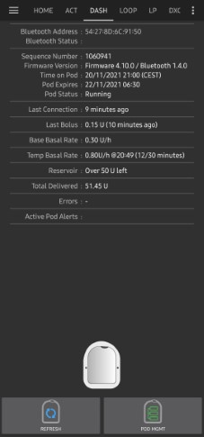

# Omnipod DASH

These instructions are for configuring the **Omnipod DASH** generation pump **(NOT Omnipod Eros)**, available in **AAPS** from version 3.0.

## Omnipod DASH 規格

以下是**Omnipod DASH**（簡稱「DASH」）的規格，以及它與**Omnipod EROS**（簡稱「EROS」）的區別：

- The DASH pods are identified by a **blue needle cap** (EROS has a clear needle cap). 這兩種 Pod 在物理尺寸上是相同的。
- DASH 不需要 BLE 連結/橋接設備（無需 RileyLink、OrangeLink 或 EmaLink）。
- The DASH's Bluetooth connection is used only when sending a command (e.g a Bolus), and disconnects right after issuing the command.
- 使用DASH時再也不會出現「無法連線到連結設備/ Pod 」的錯誤。
- **AAPS**將等候 Pod 的可讀取性以發送指令。
- Pod 啟動時，**AAPS**將尋找並連接到新的DASH Pod 。
- Expected range from phone: 5-10 meters (YMMV).

(#omnipod-dash-constraints)=

## Omnipod DASH known AAPS constraints/issues
- Android 16 requires **AAPS** version 3.3.2.1 or later.
- General advice is to run **AAPS** on Android 14 or 16. Android 15 has many reported [issues](https://github.com/nightscout/AndroidAPS/issues/3471) from the community. However, if you do run on Android 15 you will likely need to enable Bluetooth Bonding to successfully activate and use Pods, see [General Troubleshooting](../GettingHelp/GeneralTroubleshooting.md) for more info on the Bonding settings.
- Too frequent basal updates may cause basal insulin delivery [problems](https://github.com/nightscout/AndroidAPS/issues/4158) with Omnipod Dash. When using **SMB**, limit the interval to 5 minutes minimum to avoid this issue.
- Dash only supports basal rate in 0.05 U/h steps. If you try to set basal with 0.01 steps in your **AAPS profile**, AAPS will not give a warning even though the pod will round up the rate into 0.05 steps. If you view POD MGMT/Pod History it will display that 0.05 basal was set. This also means the lowest basal rate allowed by the DASH in **AAPS** is 0.05U/h.
- The activation status of a Pod is stored in the settings file, if you export a settings file with an active pod. Then change to a new pod, then restore the settings from your previous export you will have now restored the old pod activation and removed the new pod activation. This is why we recommend to export settings after each pod activation to allow a restore of that pods activation state if something happens to your rig.
- When setting a new basal profile, DASH will suspend delivery before setting the new basal **Profile**. If there is a communication interruption or error, the basal profile won't automatically re-start. See section [Resuming Insulin Delivery](#omnipod-dash-resuming-insulin-delivery) for details.
- If alerts are configured, and the pod is about to expire, the pod will keep beeping until alerts are silenced, see [Silencing Pod Alerts](#omnipod-dash-silencing-pod-alerts) for details.
- There are a number of known issues with Bluetooth which can cause pod activation problems. See [Troubleshooting](#troubleshooting) for advice on Bluetooth issues, specifically the [Bluetooth related issues](#omnipod-dash-bluetooth-related-issues) section.

(hardware-software-requirements)=

(omnipod-dash-hardware-software-requirements)=
## 硬體/軟體要求

- Omnipod DASH is identified by the blue needle cap.

- **A Compatible Android phone** with a Bluetooth Low Energy (BLE) (see [Phones](../Getting-Started/Phones.md) for more info), additionally the following information will help guide you on other key considerations around successfully activating and using the DASH on a compatible phone:
    -  The **AAPS** Omnipod Dash driver connects with the DASH Pod using Bluetooth.  
      **AAPS** will automatically establish a new Bluetooth connection to the Pod every time it needs to send a command (e.g a Bolus), after sending the command the Bluetooth connection is immediately disconnected.
       - **注意：**
         - The Bluetooth connection can be interrupted/disturbed by other Bluetooth devices linked to the phone that is running **AAPS**, like earbuds etc... Devices like this can cause connection errors or pod activation issues on some models of phones. It's a good idea to review the [tested hardware setups](https://docs.google.com/spreadsheets/u/1/d/e/2PACX-1vScCNaIguEZVTVFAgpv1kXHdsHl3fs6xT6RB2Z1CeVJ561AvvqGwxMhlmSHk4J056gMCAQE02sAWJvT/pubhtml?gid=683363241&single=true) list for known working configurations before committing to a new rig built around Omnipod DASH.
         - There are a number of known issues with Bluetooth which can cause pod activation problems (See [Troubleshooting](#troubleshooting) for advice on other Bluetooth issues) specifically the [Bluetooth related issues](#omnipod-dash-bluetooth-related-issues) section.
    - For **Android 15** or below: You **MUST** use **Version 3.0 or newer of AAPS** using the [**Build APK**](../SettingUpAaps/BuildingAaps.md) instructions, however it's advisable to run the latest released version.
    - For **Android 16**: you **MUST** use **Version 3.3.2.1 or newer of AAPS** using the [**Build APK**](../SettingUpAaps/BuildingAaps.md) instructions, due to Android 16 changing how its Bluetooth works. Any version earlier than 3.3.2.1 will likely cause pod failures and/or activation [issues](https://github.com/nightscout/AndroidAPS/issues/3471).
- A supported [**Continuous Glucose Monitor (CGM)**](../Getting-Started/CompatiblesCgms.md)

The instructions below explain how to activate a new pod session using **AAPS**. You should wait for your current Pod to be close expiry, as you will need to activate a new Pod with **AAPS**. Once a pod is de-activated it cannot be reused/re-activated, the de-activation is final.

## 在你開始之前

Ensure you have read and understand this whole guide, have read and understand the **Before You Begin** section, as well as  **[Omnipod and AAPS Constraints and Issues](#omnipod-dash-constraints)** to avoid running into a known problem.

#### **SAFETY FIRST** - You **SHOULD NOT** try to connect **AAPS** to a pod for the first time without having access to all of the following:
1. Extra pods (3 or more spare)
2. Spare Insulin and MDI equipment
3. A working Omnipod PDM (In case **AAPS** fails)
4. Supported Phones are a must! (See [Hardware/Software Requirements](#hardware-software-requirements))
5. Correct version of AAPS built and installed

#### **Your Omnipod Dash PDM will become redundant after the AAPS Dash driver activates your pod.**
- Before using **AAPS** you or your care giver would have had to manage the Pod using the Omnipod PDM (or in some regions a Phone app) to send commands to your DASH (e.g a Bolus).
- The DASH can only facilitate a single Bluetooth device (e.g PDM or Phone) connection to manage and send commands.
- The device that successfully activates the pod is the only device allowed to communicate with that Pod from that point forward. This means that once you activate a DASH with your Android phone using **AAPS**, **you will no longer be able to use your PDM with that pod!** For the time that Pod is active the **AAPS** Dash driver running on your Android phone is now the new PDM for your pod.
- **DO NOT Throw away your PDM!** It is recommended to keep it around as a backup and for emergencies, for instance when your phone gets lost or **AAPS** is not working correctly.

#### Your pod **WILL NOT** stop delivering insulin when it is not connected to AAPS.
Default basal rates are programmed on the pod on activation as defined in the current active [**Profile**](../SettingUpAaps/YourAapsProfile.md).  
As long as **AAPS** is operational it will send basal rate adjustment commands that run for a maximum of 120 minutes.  
When for some reason the pod does not receive any new commands (for instance because communication was lost due to Pod ➜ phone distance) the pod will automatically fall back to default basal rates as defined in your [**Profile**](../SettingUpAaps/YourAapsProfile.md).

#### **AAPS Profile(s) do not support 30 minute basal rate time frames**
If you are new to **AAPS** and are setting up your basal rate [**Profile**](../SettingUpAaps/YourAapsProfile.md) for the first time, please be aware that basal rates starting on a half-hour basis are not supported. For example, on your Omnipod PDM, if you have a basal rate of 1.1 units which starts at 09:30 and has a duration of 2 hours ending at 11:30, it is not possible replicate this exact basil **Profile** in **AAPS**.  
You will need to change this 1.1 unit basal rate to a time range of either 9:00-11:00 or 10:00-12:00. Even though the DASH hardware itself supports the 30 minute basal rate **Profile** increments, **AAPS** does NOT support this feature.

#### **0U/h Profile basal rates are NOT supported in AAPS**
While the DASH does support a zero basal rate, **AAPS** uses multiples of the user's **Profile** basal rate to determine automated treatment; it cannot function with a zero basal rate.  
Instead a temporary zero basal rate can be achieved through the "Disconnect pump" function, or through a combination of Disable Loop/Temp Basal Rate or Suspend Loop/Temp Basal Rate.  
**NOTE:** The lowest basal rate allowed by the DASH in **AAPS** is 0.05U/h.

## 在AAPS中選擇DASH

There are **two** available options to configure Omnipod in **AAPS**:

### 選項 1：新安裝

When installing **AAPS** for the first time, the **Setup Wizard** will guide new users through key features and installation requirements for **AAPS**.  
Select “DASH” when you reach Pump selection.

When in doubt you can also select “Virtual Pump” and select “DASH” later, after setting up **AAPS** (See Option 2).

(omnipod-dash-option-2-config-builder)=
### 選項 2：組態建置工具

在現有安裝中，你可以從組態建置工具中選擇**DASH**幫浦：

On the top-left hand corner **hamburger menu** select **Config Builder (1)** ➜ **Pump** ➜ **Dash** ➜ **Settings Gear (3)** by selecting the **radio button (2)** titled **Dash**.

選中**設定齒輪(3)**旁邊的**復選框(4)**將使DASH選單顯示為**AAPS**介面的標籤**DASH**。 勾選此框將方便你在使用**AAPS**時訪問DASH指令。

**注意：** 有一個更快速的方式可以在本文件的DASH設定部分中找到，訪問[**Dash設定**](#omnipod-dash-settings)。

### 驗證 Omnipod 驅動程式選擇

To verify that you have selected the DASH in **AAPS**, if you have **checked the box (4)**, **swipe to the left** from the **Overview** tab, where you will now see a **DASH** tab on **AAPS**. 如果此框未勾選，則DASH標籤將位於左上角的漢堡選單中。

## Dash 配置

**Swipe left** to the [**DASH tab**](#omnipod-dash-tab) where you will be able to manage all pod functions (some of these functions are not enabled or visible without an active pod session):

 “重新整理” Pod 的連接性和狀態，能夠靜音 Pod 在發出嗶聲時的警報。

   “ Pod 管理”（啟動、停用、播放測試嗶聲及 Pod 歷史）

(omnipod-dash-activate-pod)=

### 註冊 Pod

1. 導航至**DASH**標籤，點擊**POD 管理（1）**按鈕，然後點擊**註冊 Pod（2）**。

   

   

2. 顯示**填充 Pod**畫面。 Fill a new pod with **at least 80 units** of insulin and listen for two beeps indicating that the pod is ready to be primed.

   ***NOTE:** When calculating the total amount of insulin you need for 3 days, please take into account that priming the pod will use about 3-10 units.*

   

   

   確保新的 Pod 與運行**AAPS**的手機處於近距離內，然後單擊**下一步**按鈕。

   ***注意**: 如果出現錯誤提示_“找不到可用的 Pod 以進行啟動”_（這可能會發生），請不要驚慌。 點擊 **重試** 按鈕。 在大多數情況下，註冊將繼續成功進行。*

   

3. On the **Initialize Pod** screen, the pod will begin priming (you will hear a click followed by a series of ticking sounds as the pod primes itself).  
   A green checkmark will be shown upon successful priming, and the **Next** button will become enabled. 點擊 **下一步** 按鈕，完成 Pod 排空初始化並顯示 **連線 Pod** 畫面。

       

4. 接下來，準備好輸注部位以接收新的 Pod 。 洗手以避免任何感染風險。 Clean the infusion site by either using soap and water or an alcohol wipe to disinfect and let the skin air dry completely before proceeding.   
   If you get skin irritation from the adhesive consider using a Barrier Wipe or Barrier Spray.

   移除 Pod 的藍色塑料針頭蓋。 If you see something that sticks out of the pod or it looks unusual, **STOP** the process and start with a new pod. If everything looks **OK**, proceed to take off the white paper backing from the adhesive and stick the pod to the selected site on your body.

   完成後，點擊 **下一步** 按鈕。

   

6. 現在會出現 **連線 Pod** 對話框。 **click on the OK button ONLY if you are ready to deploy the cannula!**

   

7. 按下**確定**後，DASH可能需要一些時間才能響應並插入導管（最多1-2分鐘）。 **Be patient!**

   ***NOTE:** Before the cannula is inserted, it is good practice to pinch the skin near the cannula insertion point. 這有助於針頭順利插入，並減少堵塞的機會。*

       

8. A green checkmark is shown on the screen, and the **Next** button becomes available to select upon successful cannula insertion.   
   Click on the **Next** button.

   

1. 顯示 **Pod 已註冊** 畫面。

   點擊綠色 **完成** 按鈕。

   恭喜！ 你現在已經開始一個新的藥量會話。

   

2. 現在 **Pod 管理** 選單畫面應顯示 **註冊 Pod (1)** 按鈕為 *停用*，並顯示 **停用 Pod (2)** 按鈕為 *啟用*。 這是因為目前有一個 Pod 處於啟用狀態，必須先停用目前啟用的 Pod 才能註冊另一個 Pod。

    點擊手機上的返回按鈕，返回到 **DASH** 標籤畫面，該畫面現在會顯示你的啟用 Pod 的資訊，包括目前基礎率、Pod 儲液量、輸送的胰島素、Pod 錯誤和警報。

    ***NOTE:** For more details on the information displayed go to the [**DASH Tab**](#omnipod-dash-tab) section of this document.*

   

   

   ***NOTE:** It is good practice to export settings AFTER activating the pod. Settings should be exported after each pod change and once a month, ensure you copy the exported settings file to a cloud storage location (e.g. Google Drive) or somewhere off your phone in case you loose your phone (see [**Export settings**](../Maintenance/ExportImportSettings.md)).*

(omnipod-dash-deactivate-pod)=

### 停用 Pod

Under normal circumstances, the expected lifetime of a pod is three days (72 hours) and an additional 8 hours after the pod expiration warning for a total of 80 hours of total pod usage.

要停用 Pod（不論是過期還是 Pod 故障）：

1. Go to the **DASH** tab, click on the **POD MGMT (1)** button, on the **Pod Management** screen click on the **Deactivate Pod (2)** button.

   

   

2. 在 **停用 Pod** 畫面上，點擊 **下一步** 按鈕開始停用 Pod 的流程。

   你會收到來自 Pod 的確認嗶聲，表明停用成功。

   

   

3. A green checkmark will be displayed upon successful deactivation. 點擊 **下一步** 按鈕以顯示 Pod 停用畫面。

   你現在可以移除 Pod，因為該使用階段已停用。

   

4. 點擊綠色按鈕返回 **Pod 管理** 畫面。

   

5. 現在你已進入 **Pod 管理** 選單；按下手機上的返回按鈕返回 **DASH** 標籤。

   確認 **Pod 狀態：** 欄位顯示 **無可用的 Pod** 訊息。

   

   

(omnipod-dash-resuming-insulin-delivery)=

### 恢復胰島素輸送

**NOTE**: During **Profile Switches**, like when using the PDM, AAPS must suspend delivery on the Pod before setting the new basal **Profile**. If communication fails between the suspend and resume commands, then delivery can stay suspended, Read [**Delivery suspended**](#omnipod-dash-delivery-suspended) in the troubleshooting section for more details.

When insulin delivery is suspended you will need to issue a command to instruct the active, currently suspended pod to resume insulin delivery. 命令成功處理後，胰島素將根據當前時間從活動的基礎**設定檔**恢復正常送藥。 藥量將再次接受注射、**TB** 和**SMB**的命令。

1. 進入 **DASH** 標籤，確認 **Pod 狀態 (1)** 欄位顯示 **已暫停**，然後按下 **恢復輸送 (2)** 按鈕以開始流程，指示目前的 Pod 恢復正常的胰島素輸送。 訊息 **恢復輸送** 將顯示在 **Pod 狀態 (3)** 欄位中。

      

2. 當恢復輸送指令成功後，確認對話框將顯示訊息 **胰島素輸送已恢復**。 點擊 **OK** 以確認並繼續。

   

3. **DASH** 標籤將更新 **Pod 狀態 (1)** 欄位，顯示 **運作中**，並且將不再顯示恢復輸送按鈕。

   

(omnipod-dash-silencing-pod-alerts)=

### 靜音 Pod 警報

以下流程將向你展示當 Pod 的使用時間接近72小時（3天）到期的警告時，如何確認並關閉 Pod 的嗶聲。 此警告時間限制定義在 **距關閉時間的時數** Dash 警報設置中。 Pod 的最大使用壽命為 80 小時（3 天 8 小時），但 Insulet 建議不要超過 72 小時（3 天）限制。

***NOTE**: The **SILENCE ALERTS (3)** button is only available on the **DASH** tab when the pod expiration or low reservoir alert has been triggered. If the **SILENCE ALERTS** button is not visible and you hear beep sounds from the pod, try to 'Refresh pod status'.*

1. When the defined **Hours before shutdown** warning time limit is reached, the pod will issue warning beeps to inform you that it is approaching its expiration time and a pod change will be required soon.  
   You can verify this on the **DASH** tab, the **Pod expires: (1)** field will show the exact time the pod will expire (72 hours after activation), and the text will turn **red** after this time has passed.  
   Under the **Active Pod alerts (2)** field the status message **Pod will expire soon** is displayed. 這也會觸發顯示 **靜音警報 (3)** 按鈕。

   

2. Go to the **DASH** tab and press the **SILENCE ALERTS (2)** button. **AAPS** 發送命令給藥量以停用藥量過期警告嗶聲，並更新**藥量狀態 (1)**字段為**確認警報**。

   

3. **成功停用**警報後，啟用 Pod 將發出**兩聲嗶聲**，並且確認對話框將顯示訊息**註冊警報已靜音**。 點擊 **OK** 按鈕以確認並關閉對話框。

   

4. 進入 **DASH** 標籤。 在 **啟用 Pod 警報** 欄位下，警告訊息將不再顯示，且活動 Pod 將不再發出 Pod 過期警告嗶聲。

(omnipod-dash-view-pod-history)=

### 查看 Pod 歷史紀錄

本節解釋如何檢視你的活動藥量歷史，並按不同操作類別進行篩選。 Pod 歷史工具允許你查看在其三天（72 - 80 小時）使用壽命期間提交到目前活動 Pod 的操作和結果。

此功能有助於驗證發送到 Pod 的注射劑量、臨時基礎率和基礎指令。 其餘類別對於排除故障和確定發生失敗前的事件順序很有幫助。

***NOTE:** **Only the last command can be uncertain**. New commands *will not be sent* until the **last 'uncertain' command becomes 'confirmed' or 'denied'**. The way to 'fix' uncertain commands is to **'refresh pod status'**.*

1. 進入 **DASH** 標籤，按下 **POD 管理 (1)** 按鈕以進入 **Pod 管理** 選單，然後按下 **Pod 歷史紀錄 (2)** 按鈕以進入 Pod 歷史紀錄畫面。

     
   

2. 在 **Pod 歷史紀錄** 畫面中，顯示預設類別 **全部 (1)**，以逆序顯示所有 Pod **操作 (3)** 和 **結果 (4)** 的 **日期和時間 (2)**。 使用你的手機的**返回按鈕 2 次**返回主**AAPS**介面的**DASH**標籤。

    

(omnipod-dash-tab)=

## DASH 標籤

以下是主 AAPS 介面中 **DASH** 標籤的佈局說明及圖示和狀態欄位的含義。

***NOTE:** If any message in the **DASH** tab status fields report (uncertain), then you will need to press the Refresh button to clear it and refresh the pod status.*

### 欄位

- **藍牙地址：** 顯示目前連線 Pod 的藍牙地址。

- **Bluetooth Status:**  Displays the current connection status.

- **序列號：** 顯示目前啟用的 Pod 序列號。

- **韌體版本：** 顯示目前連線的韌體版本。

- **Pod 上的時間：** 顯示 Pod 上的目前時間。

- **Pod 狀態：** 顯示 Pod 狀態。

- **上次連線：** 顯示與 Pod 的最後一次通訊時間。

  - *片刻前* - 少於 20 秒前。

  - *不到一分鐘前* - 超過 20 秒但少於 60 秒前。

  - *1 分鐘前* - 超過 60 秒但少於 120 秒（2 分鐘）。

  - *XX 分鐘前* - 超過 2 分鐘，具體由 XX 的值定義。

- **上次注射：** 顯示發送到活動 Pod 的最後一次注射的劑量以及他是多長時間前發出的（以括號顯示）。

- **基礎率：** 顯示基礎率設定檔中目前時間的基礎率設定。

- **臨時基礎率：** 以以下格式顯示目前運作的臨時基礎率。
  - {每小時單位數} @{TBR 開始時間} ({運作分鐘數}/{TBR 總運作分鐘數})

  - Example:* 0.00U/h @18:25 ( 90/120 minutes)

- **儲液量：** 當儲液量超過 50 單位時顯示 50+ 單位。 當儲液量低於 50 單位時，顯示確切的單位數。

- **總輸送量：** 顯示從儲液中輸送的胰島素總單位數。 這包含已使用和排空的胰島素。

- **錯誤：** 顯示遇到的最後一個錯誤。 檢閱 [Pod 歷史](#omnipod-dash-view-pod-history) 和日誌檔案以了解過去的錯誤和更詳細的資訊。

- **啟用 Pod 警報：** 保留目前啟用 Pod 上運作的警報。

### 按鈕

 Sends a refresh command to the active pod to update communication.

  - *用於重新整理 Pod 狀態並消除顯示 (不確定) 訊息的狀態欄位。*

  - *See the [Troubleshooting](#omnipod-dash-troubleshooting) section below for additional information.*

   Navigates to the Pod management menu.

 When pressed this will disable the pod alerts beeps and notifications (expiry, low reservoir..).

  - *該按鈕僅在 Pod 過期警告時間已過時顯示。*
  -  *成功解除後，此圖示將不再顯示。*

    Resumes the currently suspended insulin delivery in the active pod.

### Pod 管理選單

Below is describes the purpose of each icon on the **Pod Management** menu, accessed by pressing **POD MGMT (1)** button from the **DASH** tab.

**The table below describes each button and it's function:**

| Button | Function                                                                                      |
| ------ | --------------------------------------------------------------------------------------------- |
| 1      | Access the Pod Mgmt settings                                                                  |
| 2      | [**Activate Pod**](#omnipod-dash-activate-pod): Primes and activates a new pod.               |
| 3      | [**Deactivate Pod**](#omnipod-dash-deactivate-pod): Deactivates the currently active pod.     |
| 4      | **Play Test Beep** : Plays a single test beep on the pod when pressed.                        |
| 5      | [**Pod history**](#omnipod-dash-view-pod-history) : Displays the active pod activity history. |

(omnipod-dash-settings)=

## Dash 設定

The Dash driver settings are configurable from the top-left hand corner **hamburger menu** under **Config Builder (1)** ➜ **Pump**  **Dash** ➜ **Settings Gear (3)** by selecting the **radio button (2)** titled **Dash**. 選擇**選框 (4)**旁邊的**設置齒輪 (3)**將允許 Dash 菜單在**AAPS**介面中作為標籤顯示，標題為**DASH**。

***注意：** 查看 **Dash 設定** 的更快方式是查看 **DASH** 標籤右上角的 **三點選單 (1)** 並從下拉選單中選擇 **Dash 偏好設定 (2)**。*

下方列出了設定組；大多數項目可透過切換開關啟用或停用：

***NOTE:** An asterisk (\*) denotes the default setting is enabled.*

### 確認嗶聲提示

提供來自藥筒的確認聲音提示，用於注射、基礎輸注、SMB以及TBR輸送和變更。

**Bolus beeps enabled:**    Enable or disable confirmation beeps when a bolus is delivered.

**Basal beeps enabled:**    Enable or disable confirmation beeps when a new basal rate is set, active basal rate is canceled or current basal rate is changed.

**SMB beeps enabled:**  Enable or disable confirmation beeps when a SMB is delivered.

**TBR beeps enabled:**  Enable or disable confirmation beeps when a TBR is set or canceled.

### 警報

提供**AAPS**的藥量過期、關閉、低藥量的警報，根據所定義的門檻值單位。

***NOTE:** an AAPS notification will ALWAYS be issued for any alert after the initial communication with the pod since the alert was triggered. 解除通知不會取消警報，除非啟用了自動確認 Pod 警報功能。 若要手動解除警報，你必須進入 **DASH** 標籤，並按下 **靜音警報按鈕**。*

**Expiration reminder enabled:**    Enable or disable the pod expiration reminder set to trigger when the defined number of hours before shutdown is reached.

**Hours before shutdown:**  Defines the number hours before the active pod shutdown occurs, which will then trigger the expiration reminder alert.

**Low reservoir alert enabled:**    Enable or disable an alert when the pod's remaining units low reservoir limit is reached as defined in the Number of units field.

**Number of units:**    The number of units at which to trigger the pod low reservoir alert.

### 通知

The Notification section allows the user to select their preferred notifications and audible phone alerts when AAPS is uncertain about the status of TBR, SMB, or bolus, and when delivery suspended events were successful.

***NOTE:** These are notifications only, no audible beep alerts are made.*

**Sound for uncertain TBR notifications enabled:**  Enable or disable this setting to trigger an audible alert and visual notification when **AAPS** is uncertain if a TBR was successfully set.

**Sound for uncertain SMB notifications enabled:**  Enable or disable this setting to trigger an audible alert and visual notification when **AAPS** is uncertain if an SMB was successfully delivered.

**Sound for uncertain bolus notifications enabled:**    Enable or disable this setting to trigger an audible alert and visual notification when **AAPS** is uncertain if a bolus was successfully delivered.

**Sound when delivery suspended notifications enabled:**    Enable or disable this setting to trigger an audible alert and visual notification when suspend delivery was successfully delivered.

## 手動操作 (ACT) 標籤

This tab is well documented in the main **AAPS** documentation but there are a few items on this tab that are specific to how the DASH differs from tube based pumps, especially after the processes of applying a new pod.

1. Go to the **Actions (ACT)** tab in the main **AAPS** interface.

2. 在**照護入口 (1)**部分，**胰島素**和**導管**字段將在**每次更換藥量後**其**時間重置**為0天和0小時。 這是根據 Omnipod 幫浦的設計和運作方式所設。 由於 Pod 直接將套管插入應用 Pod 的皮膚上，因此 Omnipod 幫浦不使用傳統的管路。 *因此，在更換 Pod 後，這些數值的時間將自動重置為零。* **幫浦電池時間** 不會被報告，因為 Pod 中的電池壽命始終比 Pod 的最大壽命（80 小時）長。 每個 Pod 內都包含 **幫浦電池** 和 **胰島素儲液器**。

   

### 等級

**胰島素等級**

顯示的胰島素水平是 DASH 報告的數量。 然而，Pod 僅在儲液器低於 50 單位時報告實際的胰島素儲液量。 在此之前，會顯示「超過 50 單位」。 報告的數量並不精準：當 Pod 報告「空」時，大多數情況下儲液器仍有一些剩餘的胰島素單位。

DASH 概覽標籤將顯示如下所述：

  * **超過 50 單位** - 藥量報告目前儲存庫中有超過 50 單位。
  * **少於 50 單位** - Pod 報告的儲液器中剩餘的胰島素量。

附加說明：
  * **SMS** - 短訊回報數值為 50+ 單位。
  * **Nightscout** - 當超過 50 單位時，向 Nightscout 上傳數值為 50（版本 14.07 及更早版本）。  更新版本將在超過 50 單位時報告數值為 50+。

(omnipod-dash-troubleshooting)=

## 問題排除

(omnipod-dash-delivery-suspended)=

This section covers common known issues and solutions for Omnipod DASH use with AAPS. There is also [General Troubleshooting](../GettingHelp/GeneralTroubleshooting.md) section in the documentation that should be reviewed as it covers relevant topics for some Pod issues too.

---

(omnipod-dash-bluetooth-related-issues)=

### Bluetooth related issues

Some members of the community have been running into issues with Pod activation failures and other pod errors related to Bluetooth. Many of these issues can be traced to one of the following issues:

#### **Android 16**

- Android 16 needs at a minimum **AAPS** version 3.3.2.1, as this versions has fixes added to specifically address [known problems](../GettingHelp/GeneralTroubleshooting.md#cannot-start-omnipod-with-android-16) introduced in Android 16 for Omnipod.

#### **Apps that use the "Nearby devices" Android permission**

Android allows you to control what each app is able to do or access on your phone via a permission model. For each app installed you can choose to allow or deny specific permissions, e.g. access files on the device, access to bluetooth, scan for nearby devices etc.

**AAPS** requires a number of specific permission to function, one which is required ensure that Pods work is the "Nearby devices" permission. There are many other applications which also require this permission, the community is finding that a number of applications when they are granted this permission can cause issues with activating new Pods on some devices.

#### **Apps that use "Nearby device" permissions and are known to have caused problems:**

Apps in this list have been discussed in one or more places in the community as causing problems for Omnipod DASH devices. Any advice and links to the information found will be in this table.

***NOTE:** If you wish to update any info in this table please ping @XiTatiON on #omnipod-dash Discord channel.*

**myBMW**   MyBMW interrupted Medtrum Nano and Omnipod DASH. The MyBMW app prompts regarding permission for "find nearby devices" only once, if you don't grant it, it still works absolutely OK

**Amazon Alexa**    Removing "Nearby devices" for Alexa app resolved problem for some people but will break the ability to pair Matter IOT devices

**MINI app**    Appears the app is based on myBMW app and might mirror it's behavior as a result

#### **How to revoke "Nearby device" permissions for other apps:**
If you are facing issues activating a new Pod and you are running on the correct supported version of **AAPS** for your version of Android. It may be necessary to revoked the permission for other apps while activating a new Pod.

Follow this procedure to revoked the "Nearby device" permission for all apps except **AAPS**:

***NOTE:** The screenshots and instructions in this guide are from a Vanilla Android 16 install on Google Pixel 8 Pro. Other manufactures and devices will likely not exactly match these menus and settings descriptions, adjust the steps to suit the device you have and if you are stuck see [Where to get help for dash](#omnipod-dash-where-to-get-help-for-dash) section on how to reach out to the community for support.*

1. Open Android settings on your phone, scroll down and press on **Security and privacy (1)**.

    

2. Scroll down and press on **Privacy controls (1)**.

   

3. Press on **Permission manager (1)**.

   

3. Scroll down and press on **Nearby devices (1)**.

   

4. Browse the list of apps and press on the app you wish to revoke **Nearby devices** permissions for.

   In this guide **Android Auto (1)** is the app we will revoke the permission on.

   To avoid bricking more pods we advise everyone initially to revoke the permission on all apps except **AAPS**.

   ***NOTE:** If you are unsure which app is causing you an issue, disable them all (remember to check the list of known problem apps too and start with those) and if you can spare a few bricked pods on the way, enable the permission on one new app before every new Pod activation, until you can narrow down which app specifically causes your Pod issues. If you do identify new problematic apps please let us know on the #omnipod-dash Discord channel.*

   

5. To revoke the permission Press on **Don't allow (1)**, then Press on **Don't allow anyway (2)**. If done correctly you should see **Don't allow (3)** as the selected Toggle option. You can now go back to the **Nearby device** menu by pressing the **Back arrow (4)** and change this setting on other apps if required.

      

#### **How to re-enable "Nearby device" permissions for system apps and other apps:**

1. If required Reference the **"How to revoke "Nearby device" permissions for other apps"** section on how to get to the app privacy settings, then once in the **Nearby device** configuration proceed to 2.

2. Browse the list of apps and press on the app you wish to allow **Nearby devices** permissions for.

   In this guide **Android Auto (1)** is the app we will allow the permission on.

   You will notice that **Android Auto (1)** is missing in the app list after the permission is revoked. This is because the **Android Auto** app is a **System app** and by default system apps are hidden.

   

3. To show hidden system apps Press on the **Three Dotted Lines (Hamburger) (1)**, then Press on **"Show System (1)"**. You should now be able to see the hidden system app in the list **Android Auto (3)**.

   ***NOTE:** If an app is revoked you will need to scroll down until you see the list of revoked apps lower down in the list.*

     

5. Follow the guidance in **"How to revoke "Nearby device" permissions for other apps"** in reverse to re-enable permissions for each app.

---
### 輸送暫停

  - 現在已無暫停按鈕。 如果你想要「暫停」藥量，你可以將 TBR 設置為零，持續 x 分鐘。
  - 在**設定檔切換**期間，DASH 必須在設置新的基礎**設定檔**之前暫停送藥。 如果兩個指令之間的通訊失敗，則輸送可能會保持暫停。 當這種情況發生時：
     - 將不會有胰島素輸送，包括基礎率、SMB、手動注射等。
     - 可能會通知某個指令未確認：這取決於失敗發生的時間。
     - **AAPS** 每 15 分鐘嘗試設置新的基礎設定檔。
     - **AAPS** 每 15 分鐘將顯示一則通知，告知送藥已暫停，如果送藥仍然暫停（恢復送藥失敗）。
     - 如果使用者選擇手動恢復供給，[**恢復供給**](#omnipod-dash-resuming-insulin-delivery)按鈕將會啟用。
     - 如果**AAPS**無法自行恢復送藥（如果藥量無法連線、聲音被靜音等情況會發生），藥量每分鐘將發出 4 次嗶聲，持續 3 分鐘，然後如果送藥暫停超過 20 分鐘將每 15 分鐘重複這個過程。
  - 對於未確認的指令，「重新整理 Pod 狀態」應能確認/否認他們。

*****NOTE:** When you hear beeps from the pod, do not assume that delivery will continue without checking the phone, delivery might stay suspended, ***so you need to check !******

---
### Pod 故障

- Pod 會因多種問題偶爾發生故障，包括 Pod 本身的硬體問題。
- It is best practice not to raise support / replacement cases with Insulet, since AAPS is not an approved method of using the Pods.
- 一份故障代碼列表可在 [**這裡找到**](https://github.com/openaps/openomni/wiki/Fault-event-codes)，以幫助確定原因。

---
### 防止 49 號錯誤 Pod 故障

此故障與指令的 Pod 狀態不正確或胰島素輸送指令中的錯誤有關。 這是當驅動程式和 Pod 對實際狀態存在分歧時發生的情況。 Pod（出於內建安全措施）隨後對不可恢復的錯誤代碼 49（0x31）作出反應，最終產生所謂的「尖叫聲」：那聲長且令人惱怒的嗶聲，只有在在 Pod 背面適當位置打個洞才能停止。 「49 Pod 故障」的確切原因通常難以追溯。 在某些情況下，這種故障可能發生（例如應用程式崩潰、運作開發版本或重新安裝）。

---

### 幫浦無法連線警報

When no communication can be established with the pod for a pre-configured time a “Pump unreachable” alert will be raised. Pump unreachable alerts can be configured by going to the top right-hand side three-dot menu, selecting **Preferences** ➜ **Local Alerts** ➜ **Pump unreachable threshold [min]**. 建議設置的值是**120** 分鐘後提醒。

---
### 匯出設定

匯出**AAPS**設置可讓你恢復所有設置，可能更重要的是，恢復所有目標。 你可能需要將設置恢復至「最後一次正常運作的狀況」，或在卸載/重新安裝**AAPS**後，或在手機遺失的情況下，在新手機上重新安裝。

***NOTE:** The active pod information is included in the exported settings. 如果你匯入了「舊」的匯出檔案，你的目前 Pod 會「失效」。 沒有其他選擇。 在某些情況下（如_程式化_的手機更換），你可能需要使用匯出的檔案來恢復**AAPS'**設置**同時保持當前活動的藥量**。 在這種情況下，重要的是需要包含目前啟用 Pod 的最新匯出設定檔案。*

**啟動 Pod 後立即匯出是一種好習慣**。 這樣，你將能夠在發生問題時恢復當前活動的藥量。 例如，當你更換備用手機時。

Regularly (after each export preferably) copy your exported settings to a safe place (a cloud drive e.g. Google Drive) that is accessible by any phone when needed. This allows you to restore to a phone from anywhere in case of a phone loss or factory reset of your phone while you are not at home.

---
### 匯入設定

**WARNING**: Please note that importing settings will possibly import an outdated Pod status (depending when you made the last export/backup).  
As a result, there is a **risk of losing the active Pod!** (see **Exporting Settings**).
1. Only try an import when no other options are available.
2. 當匯入具有啟用的 Pod 設定時，請確保匯出是在目前啟用的 Pod 下進行的。

**在有啟用 Pod 的情況下匯入：**（你有失去 Pod 的風險！）

1. **Make sure you are importing settings that were recently exported with the currently active Pod!**
2. 匯入你的設定。
3. 檢查所有偏好設定。

**匯入（沒有啟用的 Pod 連線）**

1. 匯入任何最近的匯出應該可以工作（見上文）。
2. 匯入你的設定。
3. 檢查所有偏好設定。
4. 如果匯入的設定包含任何活動的 Pod 資料，您可能需要**停用**「不存在」的 Pod。

---
### 匯入包含非活動 Pod 狀態的設定

當匯入包含已不再啟用的 Pod 資料時，AAPS 將嘗試與其連線，這顯然會失敗。 在這種情況下，你無法啟動新 Pod。

To remove the old pod session:
1. “try” to de-activate the Pod. The de-activation will likely fail.
2. 選擇「重試」。
3. 在第二次或第三次重試後，你將獲得移除 Pod 的選項。
4. 一旦舊藥量被移除，你將能夠啟動新的藥量。

---
### 重新安裝 AAPS

When uninstalling **AAPS** you will lose all your settings, objectives and the current Pod session. **To restore them make sure you have a recent exported settings file available!**

當在活動藥量中時，請確保你有當前藥量會話的匯出，否則在匯入舊設置時將失去目前的活動藥量。

1. Export your settings and store a copy in a safe place (e.g Google Drive).
2. 卸載**AAPS**並重新啟動你的手機。
3. 安裝新的**AAPS**版本。
4. 匯入你的設定。
5. 驗證所有偏好設定（選擇性地再次匯入設置）。
6. 啟動新的藥量。
7. 完成後：匯出目前設定。

---
### 更新 AAPS 至新版本

在大多數情況下，無需卸載。 你可以透過啟動新版本的安裝進行「就地」安裝。 This is also possible when on an active Pod session.

1. 匯出你的設定。
2. 安裝新的**AAPS**版本。
3. 驗證安裝是否成功。
4. 恢復藥量或啟動新的藥量。
5. 完成後：匯出目前設定。

---
### Omnipod 驅動程式警報

The Omnipod Dash driver presents a variety of unique alerts on the **Overview tab**, most of them are informational and can be dismissed while some provide the user with an action requiring their input to resolve the cause of the triggered alert.

你可能會遇到的主要警報總結如下：

- 未偵測到啟動的幫浦會話。 按下**稍後提醒**可以暫時忽略此警報，但只要未啟動新 Pod，他就會持續觸發。 當此警報啟動後，會自動靜音。
- 藥量已暫停 資訊警報，藥量已被暫停。
- 設置基礎**設定檔**失敗：送藥可能已被暫停！ 請手動從 Omnipod 標籤中重新整理 Pod 狀態並在需要時恢復輸送。 資訊警報，藥量基礎**設定檔**設置失敗，你需要在 Omnipod 標籤上點擊*重新整理*。
- 無法驗證**SMB**注射是否成功。 如果你確定注射未成功，應手動從治療中刪除 SMB 項目。 警報：無法驗證**SMB**注射指令成功與否，你需要在 DASH 標籤上確認*最後一次注射*字段，以查看**SMB**注射是否成功，如果沒有，請從治療標籤中移除該條目。
- 不確定「任務注射/TBR/SMB」是否完成，請手動確認是否成功。

(omnipod-dash-where-to-get-help-for-dash)=

## 有關 DASH 的幫助資訊

所有 DASH 的開發工作都是由社區以**志願者**的身份進行的；請記住這一點，在要求協助之前使用以下準則：

-  **等級 0：** 閱讀此文件的相關部分，以確保你了解遇到困難的功能應如何工作。
-  **等級 1：** 如果你仍然遇到無法解決的問題，請使用[此邀請鏈接](https://discord.gg/4fQUWHZ4Mw)進入**Discord**的*#AAPS* 頻道。 There are also numerous Facebook and other groups you can ask in too (see [**Getting Help**](../GettingHelp/WhereCanIGetHelp.md))
-  **等級 2：** 搜尋現有問題，以查看你的問題是否已被報告，請在[問題](https://github.com/nightscout/AndroidAPS/issues)中確認/評論/添加有關你的問題的訊息。 如果沒有，請建立一個[新問題](https://github.com/nightscout/AndroidAPS/issues)並附上[你的日誌文件](../GettingHelp/AccessingLogFiles.md)。
-  **保持耐心——我們社群中的大多數成員都是善良的志願者，解決問題通常需要使用者和開發者雙方的時間和耐心。**

When requesting help come prepared with the following information to help those in the community with your specific questions and problems:
- Android phone make and model
- Android OS version (e.g 15 or 16)
  - Did you recently upgrade your Android OS version?
- The version of **AAPS** you are running
- Plain english description of the problem you are facing considering some of the following things
   - Was it working before now?
   - When did it work or not work?
   - Did you make any changes to configuration or profile settings?
   - Did you pair a new bluetooth device?
   - Did you upgrade or install a new app?
   - How long was it working before it stopped working?
