- - -
orphan: true
- - -

# AAPS Omnipod 胰島素幫浦驅動程式文件

以下是配置 Omnipod Eros 代幫浦的說明（**不包括 Omnipod Dash**）。 從 AAPS 2.8 版本開始，AAPS 支援 Omnipod 驅動程式。

**此軟體是 DIY 人工胰臟解決方案的一部分，並非產品，你需要閱讀、學習並了解系統，包括如何使用他。 你需要對自己使用的結果負完全責任。**

```{contents}
:backlinks: entry
:depth: 2
```

## 硬體和軟體需求

- **Pod 通訊裝置**

> 將你的 AAPS 啟用手機與 Eros 世代的 Pod 通訊的組件。
> 
> > -   [OrangeLink 官網](https://getrileylink.org/product/orangelink)
> > -  [433MHz RileyLink](https://getrileylink.org/product/rileylink433)
> > -   [Emalink 官網](https://github.com/sks01/EmaLink) - [聯絡資訊](mailto:getemalink@gmail.com)
> > -   DiaLink - [聯絡資訊](mailto:Boshetyn@ukr.net)
> > -   [LoopLink 官網](https://www.getlooplink.org/) - [聯絡資訊](https://jameswedding.substack.com/) - 尚未測試

-   **行動電話裝置**

> 運作 AAPS 並向 Pod 通訊裝置發送控制指令的組件。
> 
> > - 支援[Omnipod 驅動的 Android 手機](#Phones-list-of-tested-phones)，並配置有 AAPS 2.8 及相關元件。

-   **胰島素輸送裝置**

> 將從 Pod 通訊裝置接收到的指令進行解釋的組件，該指令來自於你的 AAPS 啟用手機。
> 
> > - 新的 Omnipod pod（Eros 世代 - **不包括 DASH**）

這些說明假定你正在啟動新的 pod 會話；如果不是這種情況，請耐心等待，並嘗試在下次更換 pod 時開始此過程。

## 在你開始之前

**安全第一** - 不要在無法從錯誤中恢復的環境中嘗試此過程（必備項包括額外的 pod、胰島素、已充電的 RileyLink 和手機設備）。

**當 AAPS Omnipod 驅動程式啟用你的 pod 後，你的 Omnipod PDM 將無法再運作**。 以往你使用 Omnipod PDM 向 Omnipod Eros pod 發送指令。 Omnipod Eros pod 只允許單一裝置向其發送通訊。 從那時起，成功啟動 Pod 的裝置將是唯一能夠與其通訊的裝置。 這意味著你透過 AAPS Omnipod 驅動程式和 RileyLink 啟用了 Omnipod Eros pod，**你將無法再使用你的 PDM 與 pod 通訊**。 AAPS Omnipod 驅動程式與 RileyLink 現在是你的替代 PDM。 *這並不意味著你應該丟掉你的 PDM，建議保留他作為備用並在 AAPS 運作不正常時使用。*

**你可以配置多個 RileyLink，但一次只能選擇一個 RileyLink 與 pod 通訊。** AAPS Omnipod 驅動程式支援在 RileyLink 配置中添加多個 RileyLink，但一次只能選擇一個 RileyLink 用來發送和接收通訊。

**當 RileyLink 超出範圍時，你的 pod 不會關閉。** 當你的 RileyLink 超出範圍或信號被阻擋無法與活動 pod 通訊時，你的 pod 將繼續輸送基礎胰島素。 啟用 pod 時，在 AAPS 中定義的基礎設定檔將會被編程到新的 pod 中。 如果你失去與 pod 的連線，他會恢復到此基礎設定檔。 在 RileyLink 返回範圍並重新建立連線之前，你將無法發出新的指令。

**AAPS 不支援30 分鐘基礎速率設置。** 如果你是 AAPS 新手並且首次設定基礎速率設置，請注意以半小時為間隔的基礎速率設置是不可支援的，你將需要調整基礎速率設置到整點開始。 例如，如果你有一個 1.1 個單位的基礎速率，他從 09:30 開始並持續 2 小時，結束於 11:30，這將無法運作。  你需要將這 1.1 單位的基礎速率更新為 9:00-11:00 或 10:00-12:00 的時間範圍。  儘管 Omnipod 硬件本身支援半小時基礎速率設置，AAPS 目前無法在其演算法中考慮到這些設置。

## 在 AAPS 中啟用 Omnipod 驅動程式

你可以透過 **兩種方法** 在 AAPS 中啟用 Omnipod 驅動程式：

### 選項1：設置嚮導

安裝新版本的 AAPS 後，**設置嚮導** 將自動啟動。  在地進行升級時也會發生這種情況。  如果你已經從以前的安裝中匯出了你的設置，你可以退出設置嚮導並匯入舊的設置。  對於新的安裝，請繼續以下操作。

透過位於右上角 **三點選單（1）** 的 **AAPS 設置嚮導 (2)** 並繼續透過嚮導選單，直到你到達 **幫浦** 設置畫面。 然後選擇 **Omnipod 單選按鈕 (3)**。

>   

在同一畫面上，在幫浦選擇下方顯示 **Omnipod 驅動程式設置**，在 **RileyLink 設置** 中按下**未設置**文字添加你的 RileyLink 設備。

在 **RileyLink 選擇** 畫面上按下 **掃描** 按鈕，並透過掃描所有可用的藍牙設備從列表中選擇你的 RileyLink。 當正確選擇後，你將返回幫浦驅動程式選擇畫面，顯示 Omnipod 驅動程式設定及你所選擇的 RileyLink 和其 MAC 地址。

按下 **下一步** 按鈕繼續完成其餘的 **設定嚮導。** 選擇 RileyLink 後，初始化可能需時達一分鐘，此時 **下一步** 按鈕會變為可點擊狀態。

有關如何設置你的藥囊通訊設備的詳細步驟列示於[RileyLink 設置部分](#OmnipodEros-rileylink-setup)。

**或者**

### 選項 2：組態建置工具

透過左上角的 **漢堡選單** 進入 **組態建置工具 (1)** ➜**幫浦** ➜**Omnipod**，選擇標為 **Omnipod** 的 **單選按鈕 (2)**。 勾選 **設定齒輪圖示 (3)** 旁邊的 **勾選框(4)**， Omnipod 選單將會以標籤的形式顯示在 AAPS 界面中，標題為 **POD**。 此處在文件中被稱為 **Omnipod (POD)** 標籤。

> **注意：** 可以在本文件的[Omnipod 設置部分](#OmnipodEros-omnipod-settings)中找到更快速讀取**Omnipod 設置**的方法。
> 
> 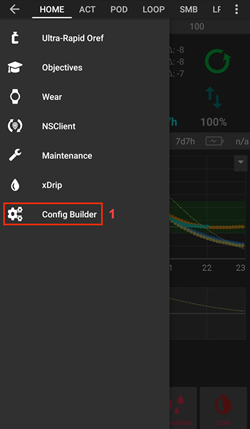 

### 驗證 Omnipod 驅動程式選擇

*注意：如果你在未選擇 RileyLink 的情況下提前退出設定嚮導，Omnipod 驅動程式已啟用，但你仍需要選擇你的 RileyLink。  你可能會看到 Omnipod (POD) 標籤顯示如下所示*

要驗證在 AAPS 中是否啟用了 Omnipod 驅動程式，請從 **首頁總覽** 標籤向左滑動，現在你會看到一個 **Omnipod** 或 **POD** 標籤。


## Omnipod 配置

請 **向左滑動** 到 **Omnipod (POD)** 標籤，在那裡你可以管理所有幫浦和 RileyLink 功能（在沒有啟動幫浦會話的情況下，有些功能是不啟用或可見的）：

>  重新整理幫浦連線和狀態
> 
>  幫浦管理（啟動，停用，播放測試嗶聲，RileyLink 狀態和幫浦歷史紀錄）

(OmnipodEros-rileylink-setup)=

### RileyLink 設定

如果你已經在設定嚮導或上述步驟中成功配對了你的 RileyLink，則繼續進入本文件下方的 [啟動幫浦部分](#OmnipodEros-activating-a-pod)。

*注意： RileyLink未連線的一個好視覺指示是 HOME 標籤中的胰島素和計算機按鈕將缺失。 這亦會發生在 AAPS 開始運作後的約莫30秒鐘，因為他正在積極連線至 RileyLink。*

1. 確保你的 RileyLink 已充滿電並開機。

2. 選擇 Omnipod 驅動程式後，從 **組態建置工具 (1)** ➜**幫浦** ➜**Omnipod** ➜**齒輪圖示（設定）(2)** ➜**RileyLink 配置 (3)** 中，按下 **未設定** 或 **MAC 地址（如存在）** 文字來選擇你的 RileyLink。

   > 確保你的 RileyLink 電池充滿電，並且它[放置在靠近](#OmnipodEros-optimal-omnipod-and-rileylink-positioning) (~30 公分以內) 你的手機附近，以便 AAPS 通過其 MAC 地址識別它。 選擇後，你可以進行你的第一個幫浦會話的啟動。 使用手機上的返回按鈕回到主 AAPS 界面。
   > 
   >  

3. 在 **RileyLink 選擇** 畫面上，按下 **掃描 (4)** 按鈕以啟動藍牙掃描。 **選擇你的 RileyLink (5)** 從可用的藍牙裝置列表中。

   >  

4. 成功選擇後，將返回 Omnipod 設定頁面，其中列出你**目前選擇的 RileyLink 的 MAC 地址 (6)。**

   > 

5. 驗證在 **Omnipod (POD)** 標籤中 **RileyLink 狀態 (1)** 顯示為 **已連線。** **幫浦狀態 (2)** 欄位應顯示 **無活動幫浦**；否則，請嘗試前一步驟或退出 AAPS 看是否重新整理連線。

   > 

(OmnipodEros-activating-a-pod)=

### 啟動幫浦

在你可以啟動幫浦之前，請確保你已正確配置並連線你的 RileyLink 在 Omnipod 設定中

*提醒：幫浦的配對通訊範圍有限，是由於安全保護措施所致。 配對前幫浦無線電信號較弱，但在成功配對後他將以全信號功率運作。 在這些步驟中，請確保你的藥囊[位於靠近](#OmnipodEros-optimal-omnipod-and-rileylink-positioning) (~30 公分以內) 的範圍內，但不要放在 RileyLink 的上面或緊鄰其旁邊。\*</p>

01. 導航到 **Omnipod (POD)** 標籤，點擊 **幫浦管理 (1)** 按鈕，然後點擊 **啟動幫浦 (2)**。

    >  

02. 顯示**填充 Pod**畫面。 將至少 80 單位的胰島素注入新的 Pod，等聽到兩聲嗶聲，表示 Pod 準備就緒並可續繼將胰島素輸入完。 計算你3天所需的總胰島素量時，請考慮灌裝幫浦將使用12到15個單位。

    > 
    > 
    > 確保新幫浦和 RileyLink 在近距範圍內（約30厘米以內），然後點擊 **下一步** 按鈕。

03. 在 **初始化 Pod** 畫面上，Pod 將開始排空（你會聽到點擊聲，接著是連續的滴答聲，表明 Pod 正在自我排空）。 如果 RileyLink 超出啟動幫浦的範圍，你會收到一條錯誤訊息 **幫浦無回應**。 如果這種情況發生，[將 RileyLink 移得更近](#OmnipodEros-optimal-omnipod-and-rileylink-positioning) (~30 公分以內)，但不要放在 Pod 的上面或緊鄰其旁邊，然後點擊**重試 (1)**按鈕。

    >  

04. 成功灌裝後將顯示綠色勾號，**下一步** 按鈕將啟用。 點擊 **下一步** 按鈕，完成 Pod 排空初始化並顯示 **連線 Pod** 畫面。

    > 

05. 接下來，準備新 Pod 的注射部位。 取下幫浦的塑料針帽和膠粘劑上的白色紙張，在你平時選擇的身體部位處貼上幫浦。 完成後，點擊 **下一步** 按鈕。

    > 

06. 現在會出現 **連線 Pod** 對話框。 **僅當你已準備好部署套針時才按確定按鈕**。

    > 

07. 按下 **確定** 後，Omnipod 可能需要一段時間才會回應並插入套針（最多約1-2分鐘），請耐心等待。

    > 如果 RileyLink 超出啟動幫浦的範圍，你會收到一條錯誤訊息 **幫浦無回應**。 如果發生此情況，將 RileyLink 移得更近（約30厘米以內），但不要放在或緊靠幫浦旁邊，然後按下 **重試** 按鈕。
    > 
    > 如果 RileyLink 超出藍牙範圍或未與手機有活動連線，你會收到一條錯誤訊息 **RileyLink 無回應**。 如果發生此情況，將 RileyLink 移得更近手機，然後按下 **重試** 按鈕。
    > 
    > *注意：在插入針管之前，最好輕捏針管插入點附近的皮膚。 這有助於針頭順利插入，並減少堵塞的機會。*
    > 
    > 
    > 
    >  

08. 針管成功插入後會顯示綠色勾號，並且 **下一步** 按鈕將變為可用狀態。 點擊 **下一步** 按鈕。

    > 

09. 顯示 **Pod 已註冊** 畫面。 點擊綠色 **完成** 按鈕。 恭喜！ 你已經開始了新的 Pod 使用階段。

    > 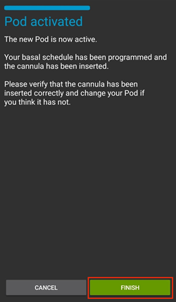

10. 幫浦管理選單畫面現在應顯示 **啟動幫浦 (1)** 按鈕 *已停用* 和 **停用幫浦 (2)** 按鈕 *已啟用*。 這是因為目前有一個 Pod 處於啟用狀態，必須先停用目前啟用的 Pod 才能註冊另一個 Pod。

    點擊手機上的返回按鈕返回 **Omnipod (POD)** 標籤畫面，現在會顯示你活動的幫浦會話資訊，包括目前基礎速率、幫浦儲庫數值、胰島素投放量、幫浦錯誤和警報。

    有關顯示訊息的更多詳細訊息，請參見本文件的[Omnipod (POD) 標籤](#OmnipodEros-omnipod-pod-tab)部分。

     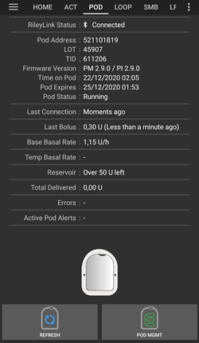

### 停用幫浦

在正常情況下，幫浦的壽命應為三天（72 小時），並在提示幫浦過期警告後額外持續8小時，總計80小時的幫浦使用。

要停用 Pod（不論是過期還是 Pod 故障）：

1. 轉到 **Omnipod (POD)** 標籤，點擊 **幫浦管理 (1)** 按鈕，在 **幫浦管理** 畫面上點擊 **停用幫浦 (2)** 按鈕。

   >  

2. 在 **停用幫浦** 畫面中，首先確保 RileyLink 在幫浦近距範圍內，但不要在或緊靠幫浦旁邊，然後點擊 **下一步** 按鈕以開始停用幫浦的過程。

   > 

3. 將顯示 **停用幫浦** 畫面，你會收到幫浦發出的停用成功確認嗶聲。

   > 
   > 
   > **如果停用失敗** 並且你未收到確認嗶聲，你可能會收到 **RileyLink 無回應** 或 **幫浦無回應訊息**。 請按 **重試 (1)** 按鈕再次嘗試停用。 如果停用持續失敗，請點擊 **丟棄幫浦 (2)** 按鈕遺棄幫浦。 你現在可以移除 Pod，因為該使用階段已停用。 如果你的幫浦發出尖叫警報，你可能需要手動將其靜音（使用別針或回形針），因為 **丟棄幫浦 (2)** 按鈕無法使其靜音。
   > 
   > >   

4. 停用成功後會顯示綠色勾號。 點擊 **下一步** 按鈕以顯示 Pod 停用畫面。 你現在可以移除 Pod，因為該使用階段已停用。

   > 

5. 點擊綠色按鈕返回至 **幫浦管理** 畫面。

   > 

6. 你現在返回到 **幫浦管理** 選單，按下手機上的返回按鈕回到 **Omnipod (POD)** 標籤。 驗證 **RileyLink 狀態：** 欄位顯示 **已連線** 和 **幫浦狀態：** 欄位顯示 **無活動幫浦** 訊息。

   >   

### 暫停與恢復胰島素輸送

以下過程將向你展示如何暫停和恢復胰島素幫浦的投放。

*注意 – 如果你未看到暫停按鈕*，那麼他尚未啟用在 Omnipod (POD) 標籤中顯示。 在[Omnipod 設置](#OmnipodEros-omnipod-settings)中啟用**Omnipod 標籤中的顯示暫停交付按鈕**設置。

#### 暫停胰島素投放

使用此指令將啟用的 POD 暫停。 在暫停狀態下， POD 將不再輸送任何胰島素。 此指令模擬原始 Omnipod PDM 發送給啟用 POD的暫停功能。

1. 進入**Omnipod（POD）**頁籤，並點擊**暫停（1）**按鈕。 暫停指令將由 RileyLink 發送到啟用 POD，並且**暫停（3）**按鈕將變灰。 ** POD 狀態（2）**將顯示**暫停輸送**。

   >  

2. 當 RileyLink 成功確認暫停指令時，確認對話框將顯示訊息**所有胰島素輸送已暫停**。 點擊 **OK** 以確認並繼續。

   > 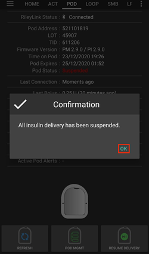

3. 你啟用的 POD 現已暫停所有胰島素輸送。 在**Omnipod（POD）**頁籤中，** POD 狀態（1）**將更新為**已暫停**。 **暫停**按鈕將更改為新的**恢復輸送（2）**按鈕。

   > 

#### 恢復胰島素輸送

使用此指令指示目前暫停的活動 Pod 恢復胰島素輸送。 指令成功處理後，胰島素將根據目前時間並使用活動基礎率設定檔恢復正常輸送。 Pod 將再次接受注射、TBR 和 SMB 的指令。

1. 進入**Omnipod（POD）**頁籤，確保** POD 狀態（1）**欄位顯示**已暫停**，然後按下**恢復輸送（2）**按鈕以啟動流程，指示目前 POD 恢復正常的胰島素輸送。 **恢復輸送**訊息將顯示在** POD 狀態（3）**欄位，表示 RileyLink 正在積極向暫停的 POD 發送指令。

   >  

2. 當 RileyLink 成功確認恢復輸送指令時，確認對話框將顯示訊息**胰島素輸送已恢復**。 點擊 **OK** 以確認並繼續。

   > 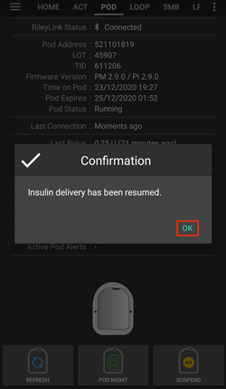

3. 在**Omnipod（POD）**頁籤中，** POD 狀態（1）**欄位將更新顯示**運作中**，並且**恢復輸送**按鈕將變回**暫停（2）**按鈕。

   > 

### 確認 POD 警報

*注意 - 如果你看不到「確認警報」按鈕，這是因為該按鈕僅在 POD 即將到期或低庫存警報觸發時在 Omnipod（POD）頁籤中有條件顯示。*

以下流程將告訴你如何確認並解除 POD 在達到 72 小時（3 天）過期警報時間限制前的警報聲。 此警報時間限制由**距關機的時數**設置在 Omnipod 警報設定中定義。 POD 的最長使用壽命為 80 小時（3 天 8 小時），然而 Insulet 建議不要超過 72 小時（3 天）限制。

*注意 - 如果你在 Omnipod 警報中啟用了「自動確認 POD 警報」設置，該警報在第一次出現後將自動處理，你不需要手動解除警報。*

1. 當達到定義的**距關機的時數**警報時間限制時， POD 將發出警報聲，告知你其即將到期，並且很快需要更換 POD 。 你可以在**Omnipod（POD）**頁籤上進行確認，** POD 到期時間：（1）**欄位將顯示 POD 的確切到期時間（註冊後 72 小時），並且在此時間過後，文字將變成**紅色**，在**啟用 POD警報（2）**欄位中顯示狀態訊息** POD 即將到期**。 此觸發將顯示**確認警報（3）**按鈕。 系統通知**（4）**也將通知你即將到期的 POD 。

   >  

2. 進入**Omnipod（POD）**頁籤並按下**確認警報（2）**按鈕（確認警報）。 RileyLink 將發送指令給 POD ，解除 POD 到期警報聲，並更新** POD 狀態（1）**欄位為**確認警報**。

   > 

3. 成功解除警報後，啟用 POD將發出**兩次警報聲**，並且確認對話框將顯示訊息**警報已確認**。 點擊 **OK** 按鈕以確認並關閉對話框。

   > 
   > 
   > 如果在處理確認警報指令時 RileyLink 不在 POD 的範圍內，則將顯示一條警告訊息，並提供兩個選項。 **靜音（1）**將靜音目前警報。 **確定（2）**將確認此警報，並允許用戶再次嘗試確認警報。
   > 
   > 

4. 進入**Omnipod（POD）**頁籤，在**啟用 POD警報**欄位下，警告訊息不再顯示，並且啟用 POD將不再發出 POD 到期警報聲。

(OmnipodEros-view-pod-history)=

### 查看 Pod 歷史紀錄

本節將向你展示如何查看你的活動 Pod 歷史紀錄，並根據不同的操作類別進行篩選。 POD 歷史工具允許你查看目前啟用 POD在其三天（72 - 80 小時）壽命期間執行的動作和結果。

此功能對於驗證注射、TBR 和已完成的基礎變更很有用，但你可能不確定他們是否完成。 其餘類別對於一般問題排除問題和確定故障前發生的事件順序也很有幫助。

*注意：* **不確定的**指令將出現在 POD 歷史中，但由於其性質，你無法保證其準確性。

1. 進入**Omnipod（POD）**頁籤並按下** POD 管理（1）**按鈕以查看** POD 管理**選單，然後按下** POD 歷史（2）**按鈕以查看 POD 歷史頁面。

   >  

2. 在** POD 歷史**頁面上，預設類別為**全部（1）**，顯示所有 POD 的**日期和時間（2）**以及**動作（3）**和**結果（4）**，按時間倒序排列。 使用你的手機**按兩次返回按鈕**返回主 AAPS 介面中的**Omnipod（POD）**頁籤。

   > 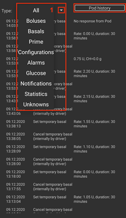 

### 查看 RileyLink 設定和歷史紀錄

本節將向你展示如何查看你啟用 POD和 RileyLink 的設定及其通訊歷史紀錄。 當進入此功能後，將分為兩個部分：**設定**和**歷史**。

此功能的主要用途是當你的 POD 通訊設備超出手機藍牙範圍且**RileyLink 狀態**報告**RileyLink 無法連線**。 主**Omnipod（POD）**頁籤上的**重新整理**按鈕將手動嘗試重新建立與 Omnipod 設定中目前配置的 RileyLink 的藍牙通訊。

如果主**Omnipod（POD）**頁籤上的**重新整理**按鈕未能恢復與 POD 通訊設備的連線，請按照下列附加步驟進行手動重新連線。

#### 手動重新建立 POD 通訊設備的藍牙通訊

1. 當**RileyLink 狀態：（1）**報告**RileyLink 無法連線**時，從**Omnipod（POD）**頁籤中按下** POD 管理（2）**按鈕以進入** POD 管理**選單。 在** POD 管理**選單中，你將看到正在積極搜索 RileyLink 連線的通知，按下**RileyLink 狀態（3）**按鈕以查看**RileyLink 設定**頁面。

   >  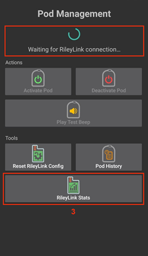

2. 在**RileyLink 設定（1）**頁面下的**RileyLink（2）**部分中，你可以在**連線狀態和錯誤：（3）**欄位確認藍牙連線狀態和錯誤。 *藍牙錯誤*和*RileyLink 無法連線*狀態應顯示在這裡。 按右下角的**重新整理（4）**按鈕啟動手動藍牙重新連線。

   > 
   > 
   > 如果在處理藍牙重新整理指令時 POD 通訊設備無法響應或超出手機範圍，則將顯示一條警告訊息，提供兩個選項。

   - **靜音（1）**將靜音目前警報。
   - **確定（2）**將確認此警告，並允許用戶再次嘗試重新建立藍牙連線。

   > 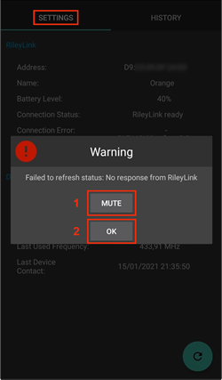

3. 如果**藍牙連線**無法重新建立，請嘗試手動關閉然後重新開啟手機上的**藍牙功能**。

4. 成功重新建立 RileyLink 藍牙連線後，**連線狀態：（1）**欄位應顯示**RileyLink 就緒**。 恭喜，你現在已將配置的 POD 通訊設備重新連線到 AAPS！

   > 

#### POD 通訊設備和啟用 POD設定

此頁面將提供目前配置的 POD 通訊設備和目前啟用的 Omnipod Eros  POD 的資訊、狀態和設定配置資訊。

1. 進入**Omnipod（POD）**頁籤並按下** POD 管理（1）**按鈕以查看** POD 管理**選單，然後按下**RileyLink 狀態（2）**按鈕以查看目前配置的**RileyLink（3）**和啟用 POD**設備（4）**設定。

   >  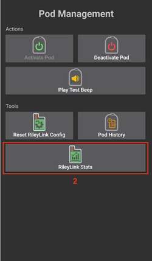
   > 
   > 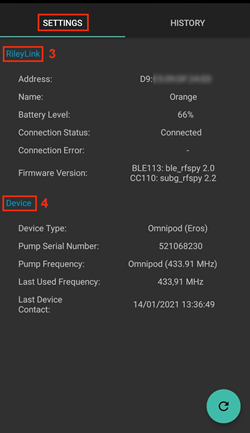

##### RileyLink（3）欄位

> - **地址：**在 Omnipod 設定中定義的所選 POD 通訊設備的 MAC 位址。
> - **名稱：**在手機藍牙設定中定義的所選 POD 通訊設備的藍牙識別名稱。
> - **電池電量：**顯示已連線的 POD 通訊設備的目前電池電量。
> - **已連線設備：**目前與 POD 通訊設備通訊的 Omnipod  POD 型號。
> - **連線狀態：** POD 通訊設備與運作 AAPS 的手機之間藍牙連線的目前狀態。
> - **連線錯誤：**如果 POD 通訊設備的藍牙連線存在錯誤，詳細訊息將顯示在此處。
> - **韌體版本：**目前連線的 POD 通訊設備上安裝的韌體版本。

##### 設備（4）欄位 - 與啟用 POD

> - **Device Type:** 與 POD 通訊設備通訊的設備類型 (Omnipod pod 幫浦)
> - **Device Model:** 與 POD 通訊設備連線的啟動設備型號 (Omnipod pod 目前型號為 Eros)
> - **Pump Serial Number:** 目前註冊 POD 的序列號
> - **Pump Frequency:**  POD 通訊設備調整的無線電通訊頻率，以啟用其與 POD 之間的通訊。
> - **Last Used frequency:**  POD 最後一次與通訊設備通訊時使用的無線電頻率。
> - **Last Device Contact:**  POD 最後一次與通訊設備接觸的日期和時間。
> - **Refresh button** 手動重新整理此頁面的設定。

(omnipod-eros-rileylink-and-active-pod-history)=
#### RileyLink 和啟動 Pod 歷史

此頁面按時間倒序提供 RileyLink 或目前連線的 POD 每個狀態或動作的訊息。 整個歷史紀錄僅適用於目前啟動的 POD ， POD 更換後，此歷史紀錄將被清除，並且僅顯示新註冊的 POD 的事件。

1. 進入 **Omnipod (POD)** 標籤頁，按下 **POD 管理 (1)** 按鈕以查看 **Pod Management** 選單，然後按下 **Pod History (2)** 按鈕以查看 **Settings** 和 **History** 頁面。 點擊 **HISTORY (3)** 文字以顯示 RileyLink 和目前啟動 POD 會話的全部歷史紀錄。

   >  
   > 
   > 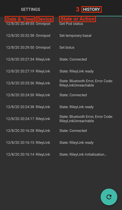

##### 欄位

> - **Date & Time**: 事件發生的時間戳，按時間倒序排列。
> - **Device:** 事件或狀態所涉及的設備。
> - **State or Action:** 設備目前執行的狀態或操作。

(OmnipodEros-omnipod-pod-tab)=

## Omnipod (幫浦) 分頁

以下是主要 AAPS 介面中 **Omnipod (幫浦)** 分頁的圖示與狀態欄位佈局及其含義的說明。

*注意：若 Omnipod (幫浦) 分頁中的任何訊息報告為 (不確定)，則需要按下重新整理按鈕以清除並更新幫浦狀態。*

> 

### 欄位

- **RileyLink 狀態：**顯示目前 RileyLink 的連線狀態

- *RileyLink 無法使用* - 幫浦連線裝置未在手機的藍牙範圍內、關閉電源或因故障導致無法進行藍牙通訊。
- *RileyLink 準備就緒* - 幫浦連線裝置開啟並正在初始化藍牙連線
- *已連線* - 幫浦連線裝置已開啟電源、連線並能夠透過藍牙進行通訊。

- **幫浦位址：**顯示目前參照的啟動幫浦位址

- **LOT：**顯示啟動幫浦的 LOT 號碼

- **TID：**顯示幫浦的序號。

- **韌體版本：**顯示啟動幫浦的韌體版本。

- **幫浦上的時間：**顯示啟動幫浦上的目前時間。

- **幫浦到期時間：**顯示啟動幫浦到期的日期和時間。

- **幫浦狀態：**顯示啟動幫浦的狀態。

- **最後連線時間：**顯示與啟動幫浦最後一次通訊的時間。

- *片刻前* - 少於 20 秒前。
- *不到一分鐘前* - 超過 20 秒但少於 60 秒前。
- *1 分鐘前* - 超過 60 秒但少於 120 秒（2 分鐘）。
- *XX 分鐘前* - 超過 2 分鐘，具體由 XX 的值定義。

- **最後一次注射：**顯示送至啟動幫浦的最後注射劑量及多久之前發送（括號中顯示時間）。

- **基礎率：** 顯示基礎率設定檔中目前時間的基礎率設定。

- **臨時基礎率：** 以以下格式顯示目前運作的臨時基礎率。

- 單位 / 小時 @ 發出 TBR 時（已執行的分鐘 / 總共執行的 TBR 分鐘）
- *示例：* 0.00U/h @18:25 ( 90/120 分鐘)

- **儲液量：** 當儲液量超過 50 單位時顯示 50+ 單位。 低於此值時，精準單位將以黃色文字顯示。

- **總輸送量：** 顯示從儲液中輸送的胰島素總單位數。 *注意，這是一個近似值，因為幫浦啟動和填充過程並不精準。*

- **錯誤：** 顯示遇到的最後一個錯誤。 檢查[藥囊歷史](#OmnipodEros-view-pod-history)、[RileyLink 歷史](#omnipod-eros-rileylink-and-active-pod-history)及日誌文件，以了解過去的錯誤及更多詳細訊息。

- **啟用 Pod 警報：** 保留目前啟用 Pod 上運作的警報。 通常在幫浦到期超過 72 小時且原生幫浦嗶聲警告運作時使用。

### 圖示

- **重新整理：**

  > 
  > 
  > 向啟動幫浦發送重新整理指令以更新通訊
  > 
  > 用於重新整理 Pod 狀態並消除顯示 (不確定) 訊息的狀態欄位。
  > 
  > 請參閱下面的[問題排除部分](#OmnipodEros-troubleshooting)以獲取額外訊息。

- **幫浦管理：**

  > 
  > 
  > 導航至幫浦管理選單

- **確認警告：**

  > 
  > 
  > 按下此按鈕將停用幫浦到期嗶聲和通知。
  > 
  > 此圖示僅在幫浦時間超過到期警告時間時顯示 成功解除後，該圖示將不再出現。

- **設定時間：**

  > 
  > 
  > 按下此按鈕將幫浦的時間更新為手機上的目前時間。

- **暫停：**

  > 
  > 
  > 暫停啟動幫浦

- **繼續注射：**

  > 
  > 
  > > 繼續目前已暫停的啟動幫浦

### Pod 管理選單

以下是從 **Omnipod (幫浦)** 分頁進入的 **幫浦管理** 選單中的圖示佈局及其含義的說明。

> 

- **註冊 Pod**

  > 
  > 
  > 幫浦啟動並註冊新幫浦

- **停用 Pod**

  > 
  > 
  > 停用目前啟動幫浦。
  > 
  > 部分配對的幫浦將忽略此指令。
  > 
  > 使用此指令停用發出錯誤 49 嚴重警告音的幫浦。
  > 
  > 如果按鈕被停用（顯示為灰色），請使用丟棄幫浦按鈕。

- **播放測試嗶聲**

  > 
  > 
  > 按下此按鈕時，幫浦將播放單次測試嗶聲聲。

- **丟棄幫浦**

  > 
  > 
  > 按下此按鈕將停用並丟棄無反應幫浦的狀態。
  > 
  > 此按鈕僅在滿足特定條件時顯示，因為無法進行正確停用：
  > 
  > > - 當 **幫浦未完全配對** 且因此忽略停用指令時。
  > > - 當 **幫浦卡住** 在配對過程的步驟之間時。
  > > - 當 **幫浦完全無法配對。**

- **幫浦歷史**

  > 
  > 
  > 顯示啟動幫浦的活動歷史

- **RileyLink 統計：**

  > 
  > 
  > 導航至 RileyLink 統計螢幕，顯示目前設置和 RileyLink 連線歷史
  > 
  > > - **設置** - 顯示 RileyLink 和啟動幫浦的設置資訊
  > > - **歷史** - 顯示 RileyLink 和幫浦連線歷史

- **重置 RileyLink 配置**

  > 
  > 
  > 按下此按鈕將重置目前連線的幫浦連線裝置配置。
  > 
  > > - 當通訊開始時，特定資料將發送至 RileyLink 並設置為 > - 記憶體暫存器已設置 > - 通訊協議已設置 > - 已設置調頻無線電頻率 
  > > - 請參見本表末尾的[附加說明](#OmnipodEros-reset-rileylink-config-notes)

- **讀取脈搏日誌：**

  > 
  > 
  > > 將啟動幫浦的脈搏日誌發送至剪貼簿

(OmnipodEros-reset-rileylink-config-notes)=

#### *重置 RileyLink 配置說明*

- 此功能的主要用途是當目前啟動的幫浦連線裝置無法響應且通訊處於卡住狀態時使用。
- 若幫浦連線裝置關閉再重新開啟，則需要按下 **重置 RileyLink 配置** 按鈕，以便在幫浦連線裝置配置中設置這些通訊參數。
- 若未完成此步驟，則 AAPS 需要在幫浦連線裝置電源循環後重新啟動。
- 此按鈕**無需**在不同幫浦連線裝置之間切換時按下。

(OmnipodEros-omnipod-settings)=

## Omnipod 設置

Omnipod 驅動程式設置可透過左上角的**漢堡選單**中的**設置生成器**➜**幫浦**➜**Omnipod**➜**齒輪圖示 (2)**進行配置，選擇**Omnipod**的**單選按鈕 (1)**。 勾選 **齒輪圖示 (2)**旁的**複選框 (3)**將允許 Omnipod 選單以 **OMNIPOD** 或 **幫浦** 的標題作為分頁顯示在 AAPS 介面中。 此處在文件中被稱為 **Omnipod (POD)** 標籤。


**注意：**快速查看 **Omnipod 設置** 的方式是透過 **Omnipod (幫浦)** 分頁右上角的 **三點選單 (1)** 並從下拉選單中選擇 **Omnipod 偏好設定 (2)**。

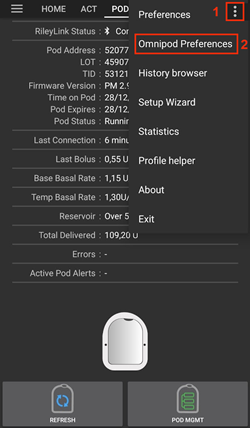

下方列出了設定組；大多數項目可透過切換開關啟用或停用：


*注意：星號（\*）表示預設設置為啟用狀態。*

### RileyLink

允許掃描幫浦連線裝置。 Omnipod 驅動程式一次只能選擇一個幫浦連線裝置。

- **顯示 OrangeLink/EmaLink/DiaLink 報告的電池電量：**報告 OrangeLink/EmaLink/DiaLink 的實際電池電量。 強烈建議所有 OrangeLink/EmaLink/DiaLink 使用者啟用此設置。

- 此設置**不支援**原始 RileyLink。
- 可能不支援 RileyLink 的替代品。
- 啟用 - 報告支援的幫浦連線裝置的目前電池電量。
- 停用 - 報告值為 n/a。

- **在動作中啟用電池更換紀錄：**若你啟用了此設置，且啟用了上方的電池報告設置，則在動作選單中將啟用電池更換按鈕。  部分幫浦連線裝置現在可以使用可更換的普通電池。  此選項允許你紀錄並重設電池壽命計時器。

### 確認嗶聲提示

提供來自藥筒的確認聲音提示，用於注射、基礎輸注、SMB以及TBR輸送和變更。

- **\*注射嗶聲啟用：**啟用或停用在注射送達時的確認嗶聲聲。
- **\*基礎率嗶聲啟用：**啟用或停用在設定新基礎率、取消啟動基礎率或更改目前基礎率時的確認嗶聲聲。
- **\*SMB 嗶聲啟用：**啟用或停用在送達 SMB 時的確認嗶聲聲。
- **啟用 TBR 嗶聲：** 啟用或停用設置或取消 TBR 時的確認嗶聲。

### 警報

根據設定的門檻值單位，提供 AAPS 警告和 Nightscout 通知以提示幫浦到期、關閉或低庫存。

*請注意，Pod 觸發警報後，AAPS 通知將始終發出。 解除通知不會取消警報，除非啟用了自動確認 Pod 警報功能。 要手動解除警告，你必須查看 Omnipod (幫浦) 分頁並按下確認警告按鈕。*

- **\*到期提醒啟用：**啟用或停用設定的幫浦到期提醒，當到達設定的關機時間前的幾個小時時觸發。
- **關閉前的時數：** 定義 Pod 關閉前的幾小時，這將觸發到期提醒警報。
- **\*低庫存警告啟用：**啟用或停用當幫浦剩餘單位的低庫存門檻值被觸發時的警告，門檻值定義於單位數欄位。
- **單位數：** 定義觸發 Pod 儲液量低警報的單位數量。
- **自動確認幫浦警告：**啟用後，將仍然發出通知，但在發出警告後的首次幫浦連線連線後，警告將被自動確認並解除。

### 通知

當不確定 TBR、SMB 或注射事件是否成功時，提供 AAPS 通知和手機警報。

*注意：這些僅是通知，沒有嗶聲警報。*

- **啟用不確定 TBR 通知音效：** 啟用或停用此設定，以在 AAPS 不確定 TBR 是否成功設置時觸發提示音和視覺通知。
- **\*不確定 SMB 通知聲音啟用：**啟用或停用此設置以在 AAPS 不確定 SMB 是否成功送達時觸發警報聲和視覺通知。
- **\*不確定注射通知聲音啟用：**啟用或停用此設置以在 AAPS 不確定注射是否成功送達時觸發警報聲和視覺通知。

### 其他

提供進階設定以協助除錯。

- **顯示暫停注射按鈕於 Omnipod 分頁：**隱藏或顯示 Omnipod (幫浦) 分頁中的暫停注射按鈕。
- **顯示脈搏日誌按鈕於幫浦管理選單：**隱藏或顯示幫浦管理選單中的脈搏日誌按鈕。
- **顯示 RileyLink 統計按鈕於幫浦管理選單：**隱藏或顯示幫浦管理選單中的 RileyLink 統計按鈕。
- **\*DST/時區自動偵測啟用：**允許自動偵測時區變化，適用於手機使用於觀察 DST（夏令時間）的地區時。

### 切換或移除啟動幫浦連線裝置 (RileyLink)

由於許多替代型號（如 OrangeLink 或 EmaLink）可供選擇，或者你需要多個備用版本的相同幫浦連線裝置（如 RileyLink），因此有必要從 Omnipod 設置配置中切換或移除所選的幫浦連線裝置 (RileyLink)。

以下步驟將展示如何**移除**現有的幫浦連線裝置 (RileyLink) 以及如何**新增**新的幫浦連線裝置。  執行**移除**和**新增**步驟將切換你的裝置。

1. 透過選擇 **Omnipod (幫浦)** 分頁右上角的**三點選單 (1)**，並從下拉選單中選擇**Omnipod 偏好設定 (2)**來進入 **RileyLink 選擇**選單。 在 **Omnipod 設置**選單中的**RileyLink 配置 (3)**下，按下**未設定**（如果未選擇裝置）或**MAC 地址**（如果已存在裝置）文本以開啟 **RileyLink 選擇**選單。

   >  

### 移除目前所選的幫浦連線裝置 (RileyLink)

此過程將展示如何從 Omnipod 驅動程式設置中移除目前所選的幫浦連線裝置 (RileyLink)。

1. 在 **RileyLink 配置**下，按下**MAC 地址 (1)**文本以開啟 **RileyLink 選擇**選單。

   > 

2. 在 **RileyLink 選擇**選單中，按下 **移除 (2)** 按鈕以移除**你目前所選的 RileyLink (3)**

   > 

3. 在確認提示中按下**是 (4)**以確認移除你的裝置。

   > 

4. 你將返回至 **Omnipod 設置**選單，其中**RileyLink 配置**下你將看到裝置顯示為**未設定 (5)**。  恭喜你，你已成功移除所選的幫浦連線裝置。

   > 

### 新增目前所選的幫浦連線裝置 (RileyLink)

此過程將展示如何將新的幫浦連線裝置新增至 Omnipod 驅動程式設置中。

1. 在 **RileyLink 配置**下，按下**未設定 (1)**文本以開啟 **RileyLink 選擇**選單。

   > 

2. 按下 **掃描 (2)** 按鈕以開始掃描所有可用的藍牙裝置。

   > 

3. 從可用裝置列表中選擇 **你的 RileyLink (3)**，然後你將返回至 **Omnipod 設置**選單，顯示你的新選擇裝置的 **MAC 地址 (4)**。  恭喜你，你已成功選擇你的幫浦連線裝置。

   >  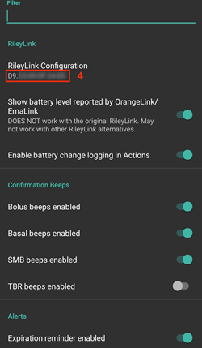

## 手動操作 (ACT) 標籤

此分頁在主要 AAPS 文件中有詳細說明，但該分頁中有一些項目是針對 Omnipod 幫浦與管式幫浦不同之處，特別是在應用新幫浦的過程後。

1. 進入主 AAPS 介面中的 **手動操作 (ACT)** 標籤。
2. 在 **照護入口 (1)** 部分下，以下 3 個欄位將在**每次更換幫浦後**將**年齡重設**為 0 天 0 小時：**胰島素** 和 **套管**。 這是根據 Omnipod 幫浦的設計和運作方式所設。 每個 Pod 內都包含 **幫浦電池** 和 **胰島素儲液器**。 由於 Pod 直接將套管插入應用 Pod 的皮膚上，因此 Omnipod 幫浦不使用傳統的管路。 *因此，在更換 Pod 後，這些數值的時間將自動重置為零。* **幫浦電池時間** 不會被報告，因為 Pod 中的電池壽命始終比 Pod 的最大壽命（80 小時）長。

> 

### 層級

**胰島素等級**

Omnipod Eros 幫浦中的胰島素量報告並不精準。  這是因為無法確定幫浦中實際注入了多少胰島素，只知道當填充幫浦時觸發了兩次嗶聲，這表示已注入超過 85 單位。 一個幫浦最多可容納 200 單位。 啟動過程也會引入一些變化，因為這並不是一個精準的過程。  考慮到這些因素，Omnipod 驅動程式已經編寫為盡可能準確地估算幫浦內剩餘的胰島素量。

> - **超過 50 單位** - 當幫浦中有超過 50 單位時，報告值為 50+ 單位。
> - **少於 50 單位** - 報告幫浦中剩餘胰島素的近似計算值。
> - **SMS** - 短訊回報數值為 50+ 單位。
> - **Nightscout** - 當超過 50 單位時，向 Nightscout 上傳數值為 50（版本 14.07 及更早版本）。  更新版本將在超過 50 單位時報告數值為 50+。

**電池電量**

電池電量報告是一個可以啟用的設置，當啟用時，將返回幫浦連線裝置（如 OrangeLink、EmaLink 或 DiaLink）的目前電池電量。  RileyLink 硬體無法報告其電池電量。  電池電量是在每次與幫浦連線後報告的，因此在充電時，可能不會觀察到線性的增長。  手動重新整理將更新目前電池電量。  當支援的幫浦連線裝置已中斷連線時，會報告 0% 的電量值。

> - **RileyLink 硬體無法報告電池電量**
> - **Omnipod 設置中**必須啟用** "顯示 OrangeLink/EmaLink/DiaLink 報告的電池電量" 設定才能報告電池電量值**
> - **電池電量報告**僅**適用於 OrangeLink、EmaLink 和 DiaLink 裝置**
> - **電池電量報告**可能**適用於其他裝置（不包括 RileyLink）**
> - **SMS** - 當有實際電量時，返回目前電池電量，否則將不返回 n/a 值
> - **Nightscout** - 當有實際電量時，報告電池電量，否則不會報告 n/a 值

(OmnipodEros-troubleshooting)=

## 問題排除

### Pod 故障

Pod 會因多種問題偶爾發生故障，包括 Pod 本身的硬體問題。 最佳做法是不要向 Insulet 報告，因為 AAPS 並非經過認證的使用情況。 你可以在[這裡](https://github.com/openaps/openomni/wiki/Fault-event-codes)找到錯誤代碼列表，以幫助確定原因。

### 防止 49 號錯誤 Pod 故障

此故障與指令的 Pod 狀態不正確或胰島素輸送指令中的錯誤有關。 我們建議使用者切換至 Nightscout 客戶端，並在**設置生成器**➜**一般**➜**NSClient**➜**齒輪圖示**➜**進階設定**中**僅上傳 (停用同步)**，以防止可能的故障。

### 幫浦無法連線警報

建議將幫浦無法使用警報設置為**120 分鐘**，方法是前往右上角的三點選單，選擇**偏好設定**➜**本地警報**➜**幫浦無法使用的門檻值 \[分鐘\]**，並將其設置為**120**。

(OmnipodEros-import-settings-from-previous-aaps)=
### 從先前的 AAPS 匯入設定

請注意，匯入設定可能會匯入過時的幫浦狀態。 因此，你可能會遺失啟動的幫浦。 因此，強烈建議你**不要在啟動的幫浦會話期間匯入設定**。

1. 停用你的幫浦會話。 確認你沒有啟動的幫浦會話。
2. 匯出你的設定並將副本存儲在安全的地方。
3. 卸載舊版本的 AAPS 並重新啟動手機。
4. 安裝新版本的 AAPS 並確認你沒有啟動的幫浦會話。
5. 匯入你的設定並註冊你的新幫浦。

### Omnipod 驅動程式警報

請注意，Omnipod 驅動程式在**首頁總覽分頁**中會呈現各種獨特的警報，其中大多數是資訊性的，可以忽略，然而有些會要求使用者採取行動以解決警報原因。 你可能會遇到的主要警報總結如下：

#### 沒有啟動幫浦

未偵測到啟動的幫浦會話。 按下**稍後提醒**可以暫時忽略此警報，但只要未啟動新 Pod，他就會持續觸發。 當此警報啟動後，會自動靜音。

#### 幫浦已暫停

此訊息警告幫浦已暫停。

#### 設置基礎率失敗。 注射可能已暫停！ 請手動從 Omnipod 標籤中重新整理 Pod 狀態並在需要時恢復輸送。

Pod 基礎率設定失敗的資訊性警報，你需要按下 Omnipod 標籤上的*重新整理*按鈕。

#### 無法確認 SMB 注射是否成功。 如果你確定注射未成功，應手動從治療中刪除 SMB 項目。

警報 SMB 注射成功無法驗證，你需要檢查 Omnipod 分頁中的*最後注射*欄位，確認 SMB 注射是否成功，若未成功，請從治療分頁中移除此項目。

#### 不確定「任務注射/TBR/SMB」是否完成，請手動確認是否成功。

由於 RileyLink 和 Omnipod 通訊的方式，可能會出現某些指令**不確定**是否已成功處理的情況。 因此，有必要通知使用者此不確定性。

以下是一些可能出現不確定通知的例子。

- **注射** - 不確定的注射無法自動驗證。 該通知將保持，直到下一次注射，但手動幫浦重新整理可清除訊息。 *預設情況下，針對此類通知類型啟用了警報嗶聲，因為使用者需要手動確認他們。*
- **TBR、幫浦狀態、設定檔切換、時間變更** - 手動幫浦重新整理可清除訊息。 預設情況下，此類通知類型的警報嗶聲被停用。
- **幫浦時間偏差 -** 當幫浦時間與手機時間偏差過大時，AAPS 循環功能將難以運作，並且做出精準的預測和注射建議。 如果幫浦和手機的時間偏差超過 5 分鐘，則 AAPS 會報告幫浦處於暫停狀態，並在幫浦狀態中顯示 "處理時間變更" 訊息。 一個額外的**設定時間**圖示將出現在 Omnipod (幫浦) 分頁的底部。 點擊 "設定時間" 將同步幫浦時間與手機時間，然後你可以點擊 "繼續注射" 按鈕以恢復正常幫浦操作。

## 最佳實踐

(OmnipodEros-optimal-omnipod-and-rileylink-positioning)=

### 最佳的Omnipod與RileyLink定位

RileyLink上用來與Omnipod通訊的天線是一個433 MHz的螺旋天線。 由於其結構特性，他會發射全向信號，形狀類似三維甜甜圈，而 z 軸則代表垂直站立的天線方向。 這意味著在特定的操作中，特別是啟動和停用幫浦時，RileyLink應放置於最佳位置。


> *(圖1。 螺旋天線在全向模式下的圖示*)

基於安全性與保全的考量，幫浦*註冊*必須在距離較近的範圍內完成（大約30公分內），比起其他操作如注射、設定臨時基礎率（TBR）或只是重新整理幫浦狀態。 由於RileyLink天線的信號傳輸特性，建議不要將幫浦直接放置在RileyLink的頂部或太靠近。

下方的圖片展示了在幫浦註冊和停用時如何將RileyLink放置於最佳位置。 幫浦可能會在其他位置啟動，但最好的成功率是使用下圖中的位置。

*注意：若在最佳位置下仍無法通訊，這可能是由於RileyLink的低電量，導致天線傳輸距離縮短。 為避免此問題，請確保RileyLink已充飽電或在此過程中直接連線至充電線。*


## 如何尋求Omnipod驅動的協助

所有Omnipod驅動的開發工作皆由社群志願者完成；當你請求協助時，請遵循以下指導原則：

- **等級 0：** 閱讀此文件的相關部分，以確保你了解遇到困難的功能應如何工作。
- **第一層：**如果你仍遇到無法解決的問題，請前往**Discord**上的*#androidaps*頻道，使用[此邀請連結](https://discord.gg/4fQUWHZ4Mw)。
- **等級 2:** 搜尋現有問題，以查看你的問題是否已經報告；如果沒有，請建立新的[問題](https://github.com/nightscout/AndroidAPS/issues)並附上[你的日誌文件](../GettingHelp/AccessingLogFiles.md)。
- **保持耐心——我們社群中的大多數成員都是善良的志願者，解決問題通常需要使用者和開發者雙方的時間和耐心。**
