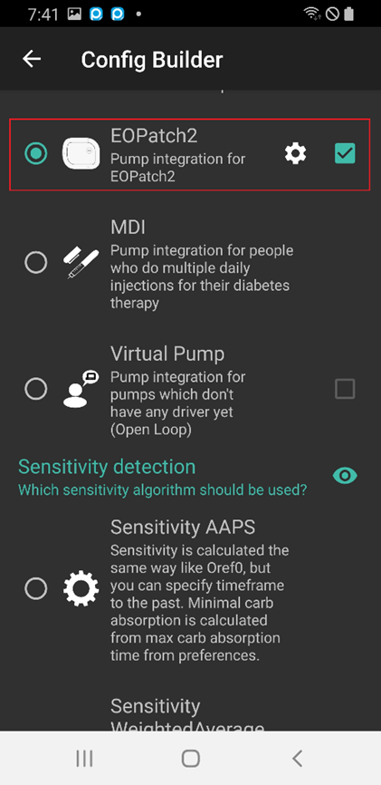
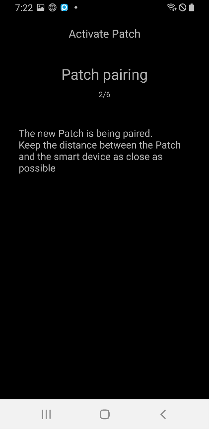
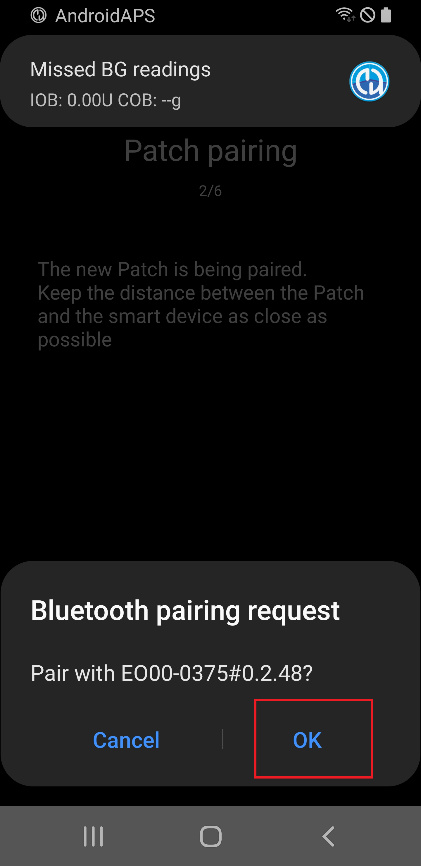
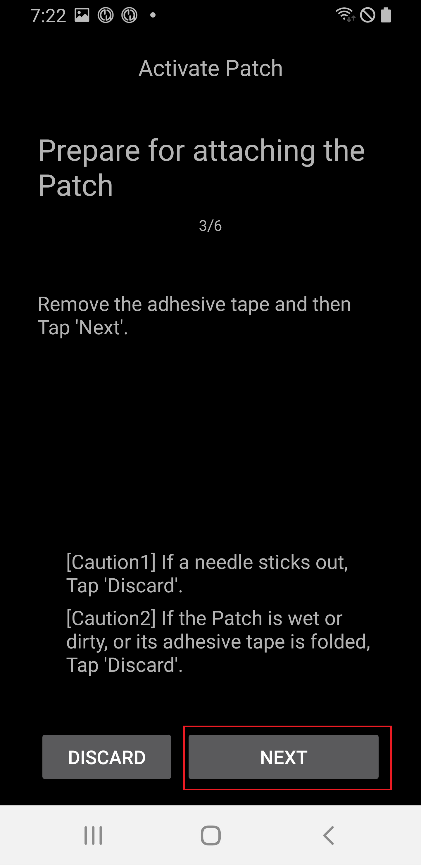
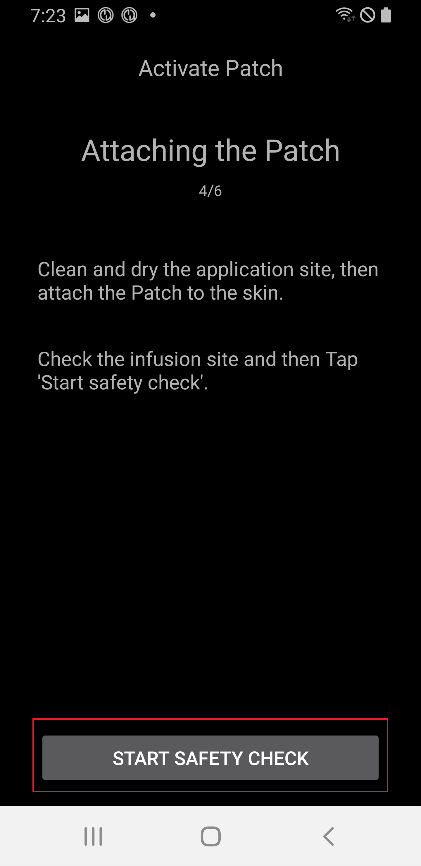
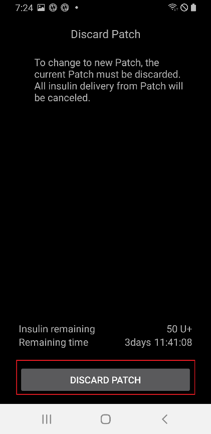
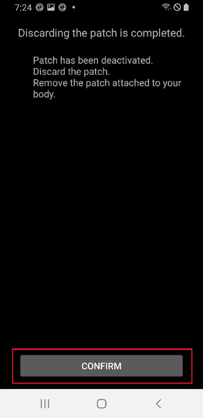
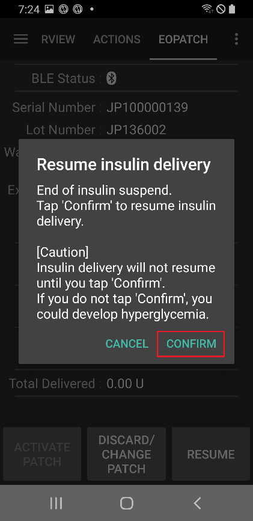

# EOPatch2 使用手冊

此貼片需使用速效 U-100 類型胰島素，例如 NovoRapid 或 Humalog。 依照醫生的處方，使用適合你的速效胰島素，並注射處方劑量。

使用此貼片時，最小可注射劑量為 0.05 U。因此，基礎速率（Profile BAS）應設置為至少 0.05 U/hr 或更多，並以 0.05 U/hr 的間隔調整，否則基礎速率與實際輸注量之間可能會出現誤差。 同樣地，注射劑量也必須設定並以最小輸注量 0.05 U 輸注。

## 幫浦設定
1. 在 AAPS 主畫面上，點擊左上角的漢堡選單，進入組態建置工具。
1. 在幫浦部分選擇「EOPatch2」。
1. 按返回鍵回到主畫面。

 

## 設定
在主畫面頂部選擇「EOPATCH2」，以進入「EOPATCH2」頁籤。

點擊右上角三個點，選擇「EOPatch2 偏好設定」選單。

「EOPatch2 偏好設定」選單提供三種通知的設定選項。

### 低儲存量警報
當使用貼片時，儲存量低於設定值時，會出現警告。 可設定範圍為 10 至 50U，並以 5U 的增量調整。

### 貼片到期提醒
此提醒功能會通知你目前貼片到期前的剩餘時間。 可設定範圍為 1 至 24 小時，並以 1 小時的增量調整。 預設值為 4 小時。

### 貼片嗶聲提醒
此為除基礎注射外的注射提醒功能。 如果你使用（延長）注射或臨時基礎注射，貼片在注射開始及完成時會發出嗶聲聲。 預設值為關閉。

## 連線貼片

### 進入貼片連線畫面。

在主畫面頂部選擇「EOPATCH2」，然後點擊左下角的「啟用貼片」按鈕。

### 連線貼片
將針筒插入貼片的胰島素入口，然後慢慢推動活塞注射胰島素。 當注射的胰島素超過 80U 時，貼片會發出啟動聲（1 次嗶聲），並啟動。 確認嗶聲聲後，點擊畫面上的「開始配對」按鈕。

[警告]

- 在指示之前，不要轉動針頭操作桿。 否則可能會在注射或安全檢查期間導致嚴重問題。
- 貼片可注射的胰島素量為 80～200U。 如果初次注射胰島素量少於 80U，貼片將無法運作。
- 將要注射進貼片的胰島素從冰箱中取出，並在室溫下靜置 15 至 30 分鐘。 注射的胰島素溫度必須至少為 10°C。

### 貼片配對
貼片配對畫面將顯示，並會自動嘗試配對。 如果通訊成功，藍牙配對請求通知將出現。 點擊「確定」，當第二次出現配對請求通知及驗證碼時，再次選擇「確定」。

[警告]

- 為了進行配對，貼片和智慧型手機之間必須保持在 30 公分內。
- 貼片啟動完成後，貼片每 3 分鐘會發出一次嗶聲聲，直到配對完成為止。
- 貼片啟動後，必須在 60 分鐘內完成貼片的應用程序。 如果在 60 分鐘內無法完成應用，則應丟棄貼片。

  

### 貼片準備
移除貼片的膠帶後，檢查針頭是否突出。 如果貼片無問題，點擊「下一步」。

### 貼片貼附
胰島素應注射在具有皮下脂肪但神經或血管較少的部位，因此建議將貼片貼附在腹部、手臂或大腿。 選擇貼片貼附位置，並對該位置進行消毒後貼上貼片。

[警告]

- 請確保貼片膠帶側面平整，使貼片完全貼合於皮膚。
- 如果貼片沒有完全貼合，貼片和皮膚之間可能會進入空氣，這可能會削弱貼片的黏合強度和防水效果。

### 安全檢查
貼附完成後，點擊「開始安全檢查」。 安全檢查完成後，貼片會發出一次嗶聲聲。

[警告]

- 為了安全使用，在安全檢查完成之前，請勿轉動針頭操作桿。

 

### 插入針頭
抓住貼片周圍，將針頭操作桿向上方超過 100° 轉動以插入針頭。 針頭正確插入時會發出嗶聲聲。 繼續順時針轉動針頭操作桿以鬆開操作桿。 點擊「下一步」。

[注意]

- 如果在沒有嗶聲聲的情況下進入下一步，將會出現針頭插入錯誤警告。

## 丟棄貼片
如果胰島素不足、使用期限到期或出現故障，需更換貼片。 每個貼片的建議使用期限為啟動後 84 小時內。

### 丟棄貼片
在主畫面頂部選擇「EOPATCH2」，並點擊底部的「丟棄/更換貼片」按鈕。 在下一個畫面中，點擊「丟棄貼片」按鈕。 確認對話框會再次顯示，若選擇「丟棄貼片」按鈕，則完成丟棄操作。

   

## 暫停與恢復胰島素輸送
暫停胰島素輸送會取消延長注射與臨時基礎速率。 恢復胰島素輸送時，已取消的延長注射與臨時基礎速率不會自動恢復。 胰島素輸送暫停時，貼片每 15 分鐘會發出聲響。

### 暫停胰島素輸送
在主畫面頂部選擇「EOPATCH2」，並點擊右下角的「暫停」按鈕。 在確認框中選擇「確認」，則會出現時間選擇框。 選擇時間後再點擊「確認」按鈕，胰島素輸送會暫停設定的時間。

  

### 恢復胰島素輸送
在主畫面頂部選擇「EOPATCH2」，並點擊右下角的「恢復」按鈕。 在確認對話框中選擇「確認」後，胰島素輸送將恢復。

 

## 警報/警告

### 警報

警報是針對最優先的緊急情況發出，並需要立即處理。 警報訊號不會消失或逾時，直到被確認為止。 當使用中的貼片出現問題時會發出警報，因此可能需要丟棄目前的貼片並更換新貼片。 警告會以對話框顯示，在處理完成之前無法切換至其他畫面。

 

以下說明不同類型的警報。

| 警報     | 說明                                                               |
| ------ | ---------------------------------------------------------------- |
| 儲存量已空  | 當貼片的儲存量用完時發生。                                                    |
| 貼片到期   | 當貼片使用時間已過期且無法進行更多胰島素注射時發生。                                       |
| 堵塞     | 當貼片的胰島素入口疑似堵塞時發生。                                                |
| 開機自檢失敗 | 當貼片在開機後自檢過程中發現意外錯誤時發生。                                           |
| 不適當的溫度 | 當貼片應用和使用過程中，貼片處於非正常工作溫度範圍內時發生。 要處理此警報，請將貼片移至適當的工作溫度（4.4 至 37°C）。 |
| 針頭插入錯誤 | 當貼片應用過程中，針頭插入不正常時發生。 檢查貼片的針頭插入邊緣與針頭啟動按鈕是否在同一直線上。                 |
| 貼片電池錯誤 | 當貼片內部電池即將耗盡並關機時發生。                                               |
| 貼片啟動錯誤 | 當應用程序無法在貼片啟動後 60 分鐘內完成貼片操作時發生。                                   |
| 貼片錯誤   | 當貼片在應用和使用過程中遇到意外錯誤時發生。                                           |

### 警告

警告發生於中等或低優先級情況。 當發生警告時，會在首頁總覽畫面中顯示為通知。

以下說明不同類型的警告。

| 警告       | 說明                                  |
| -------- | ----------------------------------- |
| 胰島素暫停結束  | 當使用者設定的暫停時間過後發生。                    |
| 儲存量過低    | 當貼片內剩餘的胰島素量低於設定值時發生。                |
| 貼片使用期限到期 | 當貼片使用期已過時發生。                        |
| 貼片即將到期   | 在貼片必須丟棄前 1 小時發生。                    |
| 貼片啟動不完整  | 當在配對完成後的階段，由於貼片應用過程中出現中斷超過 3 分鐘時發生。 |
| 貼片電池電量低  | 當貼片的電池電量不足時發生。                      |

