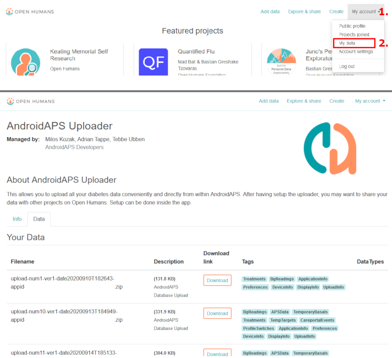

# Open Humans 上傳器

## 捐獻你的資料以促進科學研究

你可以透過捐贈你的資料來協助研究項目，幫助社群！ 這有助於科學家回饋社會，發展新的科學想法，並拓寬開放源代碼封閉環系統的開放思維。 AAPS 已準備好與 [Open Humans](https://www.openhumans.org) 平台同步資料，該平台允許你上傳、連線和存儲你的個人資料，例如基因、活動和健康資料。

你完全掌控你的資料，並可選擇你希望支援的研究項目，決定授予他們查看資料的權限。 根據你加入的項目，資料將以不同的方式和範圍被他們評估和使用。

以下資料將被上傳至你的 Open Humans 帳號：

- 葡萄糖數值
- 照護入口事件（不包括筆記）
- 延長注射
- 基礎速率切換
- 每日總劑量
- 臨時基礎速率
- 臨時目標
- 偏好設定
- 應用程式版本
- 裝置型號
- 螢幕尺寸

像是你的 Nightscout URL 或 API 秘鑰等秘密或私人資訊不會被上傳。

## 設定

1. 如果尚未建立帳號，請至 [Open Humans](https://www.openhumans.org) 建立帳號。 若你願意，你也可以使用現有的 Google 或 Facebook 帳號。
2. Enable the “Open Humans” plugin in [Config Builder](../SettingUpAaps/ConfigBuilder.md).
3. 透過齒輪按鈕開啟設定。 你可以限制只有在手機使用 Wi-Fi 和/或正在充電時進行上傳。
4. 打開 Open Humans 外掛（可透過 OH 頁籤或漢堡選單），然後點擊「登入」。

5. 仔細閱讀有關 Open Humans 上傳器的資訊和使用條款。
6. 勾選確認框並點擊「登入」。
7. Open Humans 網站將會開啟。 使用你的憑證登入。
8. 決定是否要隱藏你在 Open Humans 公開個人檔案中的 AAPS 上傳器會員身份。
9. 點擊「授權項目」按鈕。

10. 回到 AAPS 時，你會看到登入成功的提示。
11. 保持 Open Humans 上傳器外掛及手機開啟，直至設定完成。
12. 點擊關閉後，你會看到你的會員 ID。 隊列大小 > 0 表示仍有資料等待上傳。
13. 若要停止將資料上傳至 Open Humans，請點擊「登出」。
14. Android 會透過通知告知你上傳正在進行。

15. 你可以透過登入[Open Humans 網站](https://www.openhumans.org)來管理你的資料。

## 共享機會

### [「OPEN」項目](https://www.open-diabetes.eu/)

「OPEN」項目匯集了來自國際間各領域的患者創新者、臨床醫生、社會科學家、計算機科學家和患者倡導組織，以研究越來越多糖尿病患者使用的 DIY 人工胰臟系統（DIY APS）的各個方面。 更多詳情請參閱他們的[網站](https://www.open-diabetes.eu/)。

2020 年 9 月，「OPEN」項目啟動了一項[調查](https://survey.open-diabetes.eu/)，包括捐贈你上傳至 Open Humans 的資料選項。 一個[教程](https://open-diabetes.eu/en/open-survey/survey-tutorials/)，介紹如何將你的資料捐贈給「OPEN」項目，該教程可在其網站及調查中找到。

### [OpenAPS 資料公用](https://www.openhumans.org/activity/openaps-data-commons/)

OpenAPS 資料公用主要在為 DIYAPS 社群提供簡單的方法來共享資料集以供研究。 這些資料既可供傳統研究人員進行傳統研究，也可供社群中的團體或個人進行自己的研究項目。 OpenAPS 資料公用使用「Open Humans」平台，使人們能夠輕鬆上傳並共享來自 DIYAPS 的資料，包括 AAPS、Loop 和 OpenAPS。

你可以透過三種方式之一將你的資料匯入 Open Humans：

1. 使用 AAPS 上傳器選項將你的資料匯入 Open Humans
2. 使用 Nightscout 資料傳輸將你的資料匯入 Open Humans
3. 手動將資料檔案上傳至 Open Humans。

你建立帳號並讓你的資料進入 Open Humans，請務必加入 OpenAPS 資料公用，以便捐贈你的資料供研究使用（如果你選擇）。

## 使用條款

這是一個開源工具，將會把你的資料複製至[Open Humans](https://www.openhumans.org)。 我們不保留任何權利與第三方分享你的資料，除非你明確授權。 項目和應用程式接收到的資料是透過隨機用戶 ID 識別的，並且只有在你授權該過程後，資料才會安全地傳輸到 Open Humans 帳號。 你可以隨時停止上傳並刪除上傳的資料，透過[www.openhumans.org](https://www.openhumans.org)操作。 請注意，一些接收資料的項目可能不支援此操作。

另請參閱[Open Humans 使用條款](https://www.openhumans.org/terms/)。

## 資料隱私

Open Humans 透過為你分配一個數字 ID 來保護你的隱私，該 ID 用於每個項目。 這使項目可以識別你但無法確認你的身份。 AAPS 上傳的應用程式 ID 與此類似，僅用於資料管理。 更多資訊請參閱：

- [Open Humans 資料使用政策](https://www.openhumans.org/data-use/)
- [Open Humans GDPR](https://www.openhumans.org/gdpr/)
