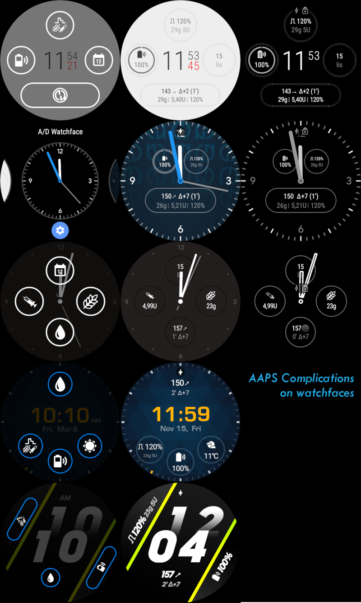
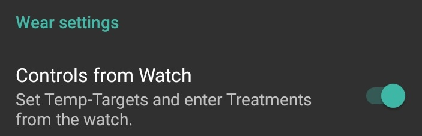
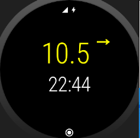
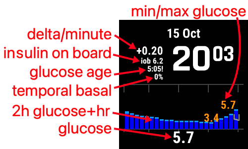

# Provoz AAPS prostřednictvím vaší chytré hodinky Wear OS

(Watchfaces-aaps-watchfaces)=

## Hodinky AAPS

Existuje několik ciferníků, ze kterých si můžete vybrat, které jsou součástí základní verze AAPS Wear APK. Tyto ciferníky zahrnují průměrný delta, IOB, aktuálně aktivní temp. bazální rychlost a bazální profily a graf měření CGM.

Ujistěte se, že notifikace z AAPS nejsou na hodinkách zablokované. Potvrzení akce (např. bolus, cílová teplota) přijde prostřednictvím notifikace, kterou je potřeba přejet a potvrdit.

Některé dostupné akce na cifernících jsou:

* Dvojitým tapnutím na BG přejdete do menu AAPS
* Dvojitým tapnutím na graf BG změníte časovou škálu grafu

## Změna na ciferník AAPS na vaší hodinkách WearOS

V standardní verzi AAPS Wear OS APK je k dispozici řada ciferníků. Jakmile nainstalujete AAPS Wear APK na své hodinky, budou k dispozici. Zde jsou kroky pro výběr jednoho:

1. Na hodinkách (předpokládejme WearOS) dlouze stiskněte svůj aktuální ciferník, aby se zobrazila obrazovka výběru ciferníků, a posuňte se úplně doprava, dokud neuvidíte tlačítko „Přidat ciferník“ a vyberte je

2. Posuňte se dolů na seznamu, dokud neuvidíte sekci „Stažené“ a najděte „AAPS (Custom)“ a klikněte na prostředek obrázku, abyste ho přidali do svého krátkého seznamu aktuálních ciferníků. Není třeba se obávat aktuálního vzhledu ciferníku „AAPS (Custom)“, v dalším kroku vybereme vaši preferovanou kůži.

3. Nyní otevřete AAPS na svém telefonu a přejděte na plugin pro Wear (povolte ho v Config Builderu (pod Synchronizací), pokud ho nevidíte ve svých aktuálních pluginech nahoře).

4. Klikněte na tlačítko „Načíst ciferník“ a vyberte ciferník, který se vám líbí

5. Zkontrolujte své hodinky, ciferník „AAPS (Custom)“ by nyní měl zobrazovat vybranou kůži. Dejte tomu několik sekund na obnovení. Nyní si můžete přizpůsobit komplikace atd. dlouhým stisknutím ciferníku a poté stisknutím tlačítka „Přizpůsobit“ na obrázku ciferníku.

## Dostupné ciferníky

(Watchfaces-new-watchface-as-of-AAPS-2-8)=

### Nový ciferník od verze AAPS 2.8

* Barvy, linky a kruhy jsou konfigurovatelné v nastavení menu na ozubeném kole ciferníka.

## Ciferník AAPSv2 - Legend

A - doba od posledního běhu smyčky

B - měření CGM

C - minuty od posledního měření CGM

D - změna ve srovnání s posledním měřením CGM (v mmol nebo mg/dl)

E - průměrná změna měření CGM za posledních 15 minut

F - baterie telefonu

G - bazální rychlost (zobrazena v U/h během standardní rychlosti a v % během TBR)

H - BGI (interakce s hladinou glukózy) -> míra, do jaké by BG „měla“ růst nebo klesat pouze na základě aktivity inzulínu.

I - sacharidy (sacharidy na palubě | e-sacharidy v budoucnu)

J - insulin na palubě (z bolusu | z bazálního)

## Přístup do hlavního menu AAPS

Pro přístup do hlavního menu AAPS můžete použít jednu z následujících možností:

* dvojitě klepněte na svou hodnotu BG
* vyberte ikonu AAPS v nabídce aplikací hodinkách
* klepněte na komplikaci AAPS (pokud je nakonfigurována pro menu)

## Nastavení (v nositelných hodinkách)

Pro přístup k nastavení ciferníku hodinek vstupte do hlavního menu AAPS, posuňte nahoru a vyberte "Nastavení".

Vyplněná hvězda je pro povolený stav (**Zapnuto**), a prázdná hvězda označuje, že nastavení je zakázáno (**Vypnuto**):

### Parametry AAPS companion

* **Vibrace při Bolusu** (výchozí `Zapnuto`):
* **Jednotky pro akce** (výchozí `mg/dl`): pokud je **Zapnuto**, jednotky pro akce jsou `mg/dl`, pokud je **Vypnuto**, jednotka je `mmol/l`. Používá se při nastavování TT z hodinek.

(Nastavení ciferníku-ciferník-nastavení)=

### Nastavení ciferníku

* **Zobrazit datum** (výchozí `Vypnuto`): pozor, datum není k dispozici na všech cifernících
* **Zobrazit IOB** (výchozí `Zapnuto`): Zobrazit nebo nezobrazit hodnotu IOB (nastavení pro podrobnou hodnotu je v AAPS wear parametrech)
* **Zobrazit COB** (výchozí `Zapnuto`): Zobrazit nebo nezobrazit hodnotu COB
* **Zobrazit Delta** (výchozí `Zapnuto`): Zobrazit nebo nezobrazit BG změnu za posledních 5 minut
* **Zobrazit AvgDelta** (výchozí `Zapnuto`): Zobrazit nebo nezobrazit průměrnou BG změnu za posledních 15 minut
* **Zobrazit baterii telefonu** (výchozí `Zapnuto`): Baterie telefonu v %. Červená, pokud je pod 30%.
* **Zobrazit baterii zařízení** (výchozí `Vypnuto`): Baterie zařízení je součtem baterie telefonu, baterie pumpy a baterie senzoru (obecně nejnižší z 3 hodnot)
* **Zobrazit bazální rychlost** (výchozí `Zapnuto`): Zobrazit nebo nezobrazit aktuální bazální rychlost (v U/h nebo v % pokud TBR)
* **Zobrazit stav smyčky** (výchozí `Zapnuto`): zobrazit, kolik minut uplynulo od posledního běhu smyčky (šipky kolem hodnoty se zbarví na červeno, pokud je nad 15').
* **Zobrazit BG** (výchozí `Zapnuto`): Zobrazit nebo nezobrazit poslední hodnotu BG
* **Zobrazit směr šipky** (výchozí `Zapnuto`): Zobrazit nebo nezobrazit šipku trendu BG
* **Zobrazit Ago** (výchozí `Zapnuto`): zobrazit, kolik minut uplynulo od posledního měření.
* **Tmavý** (výchozí `Zapnuto`): Můžete přepnout z černého pozadí na bílé pozadí (kromě ciferníku Cockpit a Steampunk)
* **Zvýraznit bazální** (výchozí `Vypnuto`): Zlepšit viditelnost bazální rychlosti a dočasných bazálních
* **Harmonizovaný oddělovač** (výchozí `Vypnuto`): Pro ciferníky AAPS, AAPSv2 a AAPS(Large), zobrazit kontrastní pozadí pro oddělovač (**Vypnuto**) nebo sladit oddělovač s barvou pozadí (**Zapnuto**)
* **Časový rámec grafu** (výchozí `3 hodiny`): můžete v podmenu vybrat maximální časový rámec vašeho grafu mezi 1 hodinou a 5 hodinami.

### Nastavení uživatelského rozhraní

* **Design vstupu**: s tímto parametrem můžete vybrat pozici tlačítek "+" a "-" při zadávání příkazů pro AAPS (TT, inzulín, sacharidy...)

### Specifické parametry ciferníku

#### Ciferník Steampunk

* **Delta granularita** (výchozí `Střední`)

#### Ciferník Circle WF

* **Velká čísla** (výchozí `Vypnuto`): Zvýšení velikosti písma pro lepší viditelnost
* **Historie kruhu** (výchozí `Vypnuto`): Zobrazit graficky historii BG s šedými kruhy uvnitř zeleného kruhu hodiny
* **Lehká historie kruhu** (výchozí `Zapnuto`): Historie kruhu je více diskrétní s tmavší šedou
* **Animace** (výchozí `Zapnuto`): Když je povoleno, na podporovaných hodinkách a ne v režimu úspory energie s nízkým rozlišením, bude ciferník hodinek animován

### Nastavení příkazů

* **Průvodce v menu** (výchozí `Zapnuto`): Umožnit rozhraní průvodce v hlavním menu pro zadání sacharidů a nastavení bolusu z hodinek
* **Prime v menu** (výchozí `Vypnuto`): Umožnit akci Prime / Fill z hodinek
* **Jednotný cíl** (výchozí `Zapnuto`):
  
  * `Zapnuto`: nastavíte jednu hodnotu pro TT
  * `Vypnuto`: nastavíte nízký a vysoký cíl pro TT

* **Procento průvodce** (výchozí `Vypnuto`): Umožňuje opravu bolusu podle průvodce (hodnota zadaná v procentech před potvrzovací notifikací)

(Hodinky-komplikace)=

## Komplikace

*Komplikace* je termín z tradičního hodinářství, který popisuje přídavek na hlavním ciferníku - jako další malé okno nebo sub-ciferník (s datem, dnem v týdnu, fázi měsíce atd.). Wear OS 2.0 přináší tento metaforu, aby bylo možné přidávat vlastního poskytovatele dat, jako jsou počasí, notifikace, fitness počítadla a další - k jakýmkoliv ciferníkům, které podporují komplikace.

AAPS Wear OS aplikace podporuje komplikace od verze `2.6` a umožňuje jakémukoli třetímu dodavateli ciferníků, který podporuje komplikace, konfigurovat zobrazení údajů souvisejících s AAPS (BG s trendem, IOB, COB atd.).

Komplikace také slouží jako **zkratka** k funkcím AAPS. Klepnutím na ně můžete otevřít menu a dialogy související s AAPS (v závislosti na typu komplikace a konfiguraci).

### Typy komplikací

AAPS Wear OS aplikace poskytuje pouze surová data, podle předem definovaných formátů. Na třetím dodavateli ciferníků záleží, kde a jak zobrazit komplikace, včetně jejich rozložení, okrajů, barev a písma. Z mnoha typů komplikací dostupných v systému Wear OS AAPS používá:

* `KRÁTÝ TEXT` - Obsahuje dva řádky textu, 7 znaků každý, někdy označovaný jako hodnota a štítek. Obvykle se zobrazuje uvnitř kruhu nebo malého pilulky - jeden pod druhým, nebo vedle sebe. Je to velmi prostorově omezená komplikace. AAPS se snaží odstranit zbytečné znaky, aby se vešly: zaokrouhlením hodnot, odstraněním předních a zadních nul z hodnot atd.
* `DLOUHÝ TEXT` - Obsahuje dva řádky textu, přibližně 20 znaků každý. Obvykle se zobrazuje uvnitř obdélníku nebo dlouhé pilulky - jeden pod druhým. Používá se pro podrobnosti a textový stav.
* `ROZSAHOVÁ HODNOTA` - Používá se pro hodnoty z předdefinovaného rozsahu, jako je procento. Obsahuje ikonu, štítek a obvykle se zobrazuje jako kruhový pokrokový ukazatel.
* `VELKÝ OBRAZ` - Vlastní pozadí, které může být použito (pokud je podporováno ciferníkem) jako pozadí.

### Nastavení komplikací

Chcete-li přidat komplikaci k ciferníku, nakonfigurujte ji dlouhým stisknutím a kliknutím na ikonu ozubeného kola níže. V závislosti na tom, jak konkrétní ciferník je nakonfigurován - buď klikněte na zástupné symboly, nebo vstupte do nastavení ciferníku pro komplikace. Komplikace AAPS jsou seskupeny pod položkou menu AAPS.

Při konfiguraci komplikací na ciferníku představí Wear OS a filtruje seznam komplikací, které mohou být přizpůsobeny pro zvolené místo komplikace na ciferníku. Pokud nelze konkrétní komplikace najít na seznamu, pravděpodobně to souvisí s tím, že jejich typ nemůže být použit pro dané místo.

### Komplikace poskytované AAPS

AAPS poskytuje následující komplikace:

* **BR, CoB & IoB** (`KRÁTÝ TEXT`, otevírá *Menu*): Zobrazuje *Bazální sazbu* na prvním řádku a *Carbs na palubě* a *Inzulin na palubě* na druhém řádku.
* **Hladina glukózy v krvi** (`KRÁTÝ TEXT`, otevírá *Menu*): Zobrazuje hodnotu *Hladiny glukózy v krvi* a šipku *trendu* na prvním řádku a *věk měření* a *BG delta* na druhém řádku.
* **CoB & IoB** (`KRÁTÝ TEXT`, otevírá *Menu*): Zobrazuje *Carbs na palubě* na prvním řádku a *Inzulin na palubě* na druhém řádku.
* **CoB Podrobně** (`KRÁTÝ TEXT`, otevírá *Průvodce*): Zobrazuje aktuální aktivní *Carbs na palubě* na prvním řádku a plánované (budoucí, eCarbs) Carbs na druhém řádku.
* **CoB Ikona** (`KRÁTÝ TEXT`, otevírá *Průvodce*): Zobrazuje hodnotu *Carbs na palubě* s statickou ikonou.
* **Úplný stav** (`DLOUHÝ TEXT`, otevírá *Menu*): Zobrazuje většinu dat najednou: hodnotu *Hladiny glukózy v krvi* a šipku *trendu*, *BG delta* a *věk měření* na prvním řádku. Na druhém řádku *Carbs na palubě*, *Inzulin na palubě* a *Bazální sazba*.
* **Úplný stav (převrácený)** (`DLOUHÝ TEXT`, otevírá *Menu*): Stejná data jako pro standardní *Úplný stav*, ale řádky jsou převráceny. Může být použito na cifernících, které ignorují jeden z dvou řádků v `DLOUHÝ TEXT`
* **IoB Podrobně** (`KRÁTÝ TEXT`, otevírá *Bolus*): Zobrazuje celkový *Inzulin na palubě* na prvním řádku a podíl *IoB* na *Bolus* a *Bazální* část na druhém řádku.
* **IoB Ikona** (`KRÁTÝ TEXT`, otevírá *Bolus*): Zobrazuje hodnotu *Inzulin na palubě* s statickou ikonou.
* **Baterie Uploader/Telefonu** (`ROZSAHOVÁ HODNOTA`, otevírá *Status*): Zobrazuje procento baterie AAPS telefonu (uploader), jak je uvedeno AAPS. Zobrazeno jako procentuální měřič s ikonou baterie, která odráží hlášenou hodnotu. Nemusí být aktualizováno v reálném čase, ale když se změní jiné důležité údaje AAPS (obvykle: každých ~5 minut s novým měřením *Hladiny glukózy v krvi*).

Kromě toho existují tři komplikace typu `VELKÝ OBRAZ`: **Tmavá tapeta**, **Šedá tapeta** a **Světla tapeta**, zobrazující statickou AAPS tapetu.

### Nastavení související s komplikacemi

* **Akce po klepnutí na komplikaci** (default `Výchozí`): Rozhoduje, která dialogové okno se otevře, když uživatel tapne na komplikaci: 
  * *Výchozí*: akce specifická pro typ komplikace *(viz seznam výše)*
  * *Menu*: hlavní menu AAPS
  * *Čaroděj*: bolusový čaroděj - kalkulačka bolusu
  * *Bolus*: přímý vstup hodnoty bolusu
  * *eCarb*: dialog pro konfiguraci eCarb
  * *Status*: podmenu stavu
  * *Žádný*: Zde deaktivuje akci tapnutí na komplikacích AAPS
* **Unicode v komplikacích** (výchozí `Zapnuto`): Když je `Zapnuto`, komplikace použije Unicode znaky pro symboly jako `Δ` Delta, `⁞` vertikální tečka oddělovač nebo `⎍` symbol bazální sazby. Zobrazení závisí na písmu a to může být velmi specifické pro ciferník. Tato volba umožňuje přepínání Unicode symbolů `Vypnuto`, pokud je to potřeba - pokud písmo používané vlastním ciferníkem tyto symboly nepodporuje - aby se předešlo grafickým chybám.

## Ciferníky Wear OS

Ciferníky Wear OS poskytují snadný přístup k informacím a akcím uživatelů pro splnění úkolů. Ciferníky jsou k dispozici pouze na chytrých hodinkách s Androidem běžících na verzi Wear OS 2.0 a vyšší.

Ciferníky umožňují rychlý přístup k akcím na aplikaci AAPS bez procházení menu ciferníku. Ciferníky jsou volitelné a mohou být přidány a nakonfigurovány uživatelem.

Ciferníky se používají "vedle" jakéhokoli ciferníku. Pro přístup k ciferníku, když je povolen, přejeďte prstem zprava doleva na ciferníku, abyste je zobrazili.

Poznámka; ciferníky nezobrazují aktuální stav aplikace AAPS na telefonu a pouze provedou požadavek, který musí být potvrzen na hodinkách, než bude aplikován.

## Jak přidat Ciferníky

Před použitím ciferníků musíte zapnout "Ovládání z hodinek" v nastavení "Wear OS" aplikace Android APS.

V závislosti na vaší verzi Wear OS, značce a smartphonu existují dva způsoby, jak povolit ciferníky:

1. Na hodinkách, z ciferníku; - Přejeďte zprava doleva, dokud nedosáhnete "+ Přidat ciferníky" - Vyberte jeden z ciferníků.
2. Na telefonu otevřete aplikaci pro společníka pro vaše hodinky. - Pro Samsung otevřete "Galaxy Wearable", nebo pro jiné značky "Wear OS" 
  * Klikněte na sekci "Ciferníky", následované tlačítkem "+ Přidat"
  * Najděte ciferník AAPS, který chcete přidat, jeho výběrem. 你可以透過拖放來更改 Tiles 的順序

Obsah ciferníků lze přizpůsobit dlouhým stiskem ciferníku a kliknutím na tlačítko "Upravit" nebo "ikona ozubeného kola".

### APS (Akce) Ciferník

Akční ciferník může obsahovat 1 až 4 uživatelsky definované akční tlačítka. Chcete-li nakonfigurovat, dlouze stiskněte ciferník, což zobrazí možnosti konfigurace. Podobné akce jsou také k dispozici prostřednictvím standardního menu hodinek.

Akce podporované v akčním ciferníku mohou požadovat aplikaci AAPS na telefonu pro:

* **Výpočet**; provést výpočet bolusu na základě příjmu sacharidů a případně procenta [1]
* **Inzulin**; požádat o dodání inzulínu zadáním jednotky inzulínu
* **Ošetření**; požádat o dodání inzulínu a přidat sacharidy
* **Sacharidy**; přidat (rozšířené) sacharidy
* **TempT**; nastavit vlastní dočasný cíl a dobu trvání

[1] Prostřednictvím menu Wear OS nastavte volbu "Procento kalkulátoru" na "ZAPNUTO", aby se zobrazilo procento vstupu v kalkulačce bolusu. Výchozí procento je založeno na nastavení telefonu v sekci "Přehled" ["Dodat tuto část výsledku bolusového čaroděje %"](Config-Builder.html#advanced-settings) Když uživatel neposkytne procento, použije se výchozí hodnota z telefonu. Nakonfigurujte další parametry pro kalkulačku bolusu v aplikaci telefonu prostřednictvím "Preference" "Nastavení čaroděje".

### AAPS (Dočasný cíl) Ciferník

Dočasný cíl Ciferník může požádat o dočasný cíl na základě přednastavení telefonu AAPS. Nakonfigurujte přednastavený čas a cíle prostřednictvím nastavení aplikace telefonu přechodem do "Preference", "Přehled", ["Výchozí dočasné cíle"](Config-Builder.html#default-temp-targets) a nastavte trvání a cíle pro každé přednastavení. Nakonfigurujte viditelné akce na ciferníku prostřednictvím nastavení ciferníku. Dlouze stiskněte ciferník, abyste zobrazili možnosti konfigurace a vyberte 1 až 4 možnosti:

* **Aktivita**; pro sport
* **Hypo**; zvýšit cíl během léčby hypoglykémie
* **Jíst brzy**; snížit cíl pro zvýšení hladiny inzulínu v oběhu
* **Manuální**; nastavit vlastní dočasný cíl a trvání
* **Zrušit**; zastavit aktuální dočasný cíl

### Dlaždice AAPS(QuickWizard)

Dlaždice QuickWizard může mít 1 až 4 tlačítka rychlého kouzelníka, definovaná pomocí aplikace na telefonu. Viz [QuickWizard](Config-Builder.html#quickwizard-settings). Můžete nastavit standardní jídla (sacharidy a metodu výpočtu bolusu), která se zobrazí na dlaždici podle času dne. Ideální pro nejběžnější jídla/ svačiny, které během dne jíte. Můžete specifikovat, zda se tlačítka rychlého kouzelníka zobrazí na telefonu, hodinkách nebo obojím. Vezměte prosím na vědomí, že telefon může zobrazit pouze jedno tlačítko rychlého kouzelníka najednou. Nastavení rychlého kouzelníka také může specifikovat vlastní procento inzulínu pro bolus. Vlastní procento vám umožňuje měnit, například svačinu na 120%, pomalu vstřebatelné snídaně na 80% a cukrovou svačinu na léčbu hypoglykémie na 0%

[2] Wear OS omezuje frekvenci aktualizace dlaždic pouze na jednou za 30 sekund. Když si všimnete, že změny na vašem telefonu se neprojeví na dlaždici, zvažte; počkat 30 sekund, použít tlačítko "Znovu odeslat všechna data" z části Wear OS AAPS, nebo odstranit dlaždici a přidat ji znovu. Chcete-li změnit pořadí tlačítek QuickWizard, přetáhněte položku nahoru nebo dolů.

## Vždy zapnuto

Dlouhá životnost baterie pro chytré hodinky s Android Wear OS je výzvou. Některé chytré hodinky vydrží až 30 hodin, než je potřeba je nabít. Pro optimální úsporu energie by měl být displej vypnutý, když se nepoužívá. Většina hodinek podporuje displej "Vždy zapnuto".

Od verze AAPS 3 můžeme používat "Zjednodušené UI" během režimu vždy zapnuto. Toto UI obsahuje pouze hladinu glukózy v krvi, směr a čas. Toto zjednodušené UI je optimalizováno pro úsporu energie s méně častými aktualizacemi, zobrazuje méně informací a osvětluje méně pixelů pro úsporu energie na OLED displejích.

Režim zjednodušeného UI je dostupný pro ciferníky: AAPS, AAPS V2, Home Big, Digital Style, Steampunk a Cockpit. Zjednodušené UI je volitelné a je nastaveno prostřednictvím nastavení ciferníku. (dlouze stiskněte ciferník a klikněte na "úpravy" nebo ikonu ozubeného kola) Vyberte konfiguraci "Zjednodušení UI" a nastavte ji na "Vždy zapnuto" nebo "Vždy zapnuto a nabíjení".

### Noční režim

Během nabíjení by bylo užitečné, kdyby displej mohl zůstat "vždy zapnutý" a zobrazovat vaši hladinu glukózy v noci. Nicméně, standardní ciferníky jsou příliš jasné a obsahují příliš mnoho informací, a detaily se špatně čtou se spícími očima. Proto jsme přidali možnost pro ciferník zjednodušit UI pouze během nabíjení, pokud je nastaveno v konfiguraci.

Režim zjednodušeného UI je dostupný pro ciferníky: AAPS, AAPS V2, Home Big, Digital Style, Steampunk a Cockpit. Zjednodušené UI je volitelné a je nastaveno prostřednictvím nastavení ciferníku. (dlouze stiskněte ciferník a klikněte na "úpravy" nebo ikonu ozubeného kola) Vyberte konfiguraci "Zjednodušení UI" a nastavte ji na "Během nabíjení" nebo "Vždy zapnuto a nabíjení"

Možnosti pro vývojáře Android umožňují, aby vaše hodinky zůstaly aktivní během nabíjení. Abyste zpřístupnili možnosti pro vývojáře, podívejte se na [oficiální dokumentaci](https://developer.android.com/training/wearables/get-started/debugging). Nastavte "Zůstat aktivní při nabíjení" na "zapnuto" v nastaveních pro vývojáře.

Poznámka: ne všechny displeje dokážou dobře fungovat v režimu vždy zapnuto. Může to způsobit burn-in displeje, zejména u starších OLED displejů. Hodinky obvykle ztlumí displej, aby se zabránilo burn-inu; prosím, zkontrolujte příručku k obsluze, výrobce nebo internet pro radu.

## Zkratka pro odložení upozornění

Je možné vytvořit zkratku pro odložení upozornění/ budíku AAPS. Ztlumení zvuku přes hodinky je pohodlné a rychlejší než sahání po telefonu. Poznámka; stále musíte zkontrolovat zprávu o budíku na svém telefonu a jednat podle ní, ale to můžete zkontrolovat později. Když vaše hodinky mají dvě tlačítka, můžete přiřadit klávesu k programu `AAPS Snooze Alert`.

Chcete-li propojit tlačítko na Samsung Watch 4, přejděte na `Nastavení > Pokročilé funkce > Přizpůsobit tlačítka > Dvojité stisknutí > AAPS Snooze Alert`

### Odložení xDrip

Pokud používáte xDrip a máte nainstalovaný xDrip na hodinkách, zkratka 'AAPS Snooze Alert' také odloží jakýkoli alarm xDrip.

## Tipy pro výkon a životnost baterie

Hodinky s Wear OS jsou zařízení s velice omezenou spotřebou energie. Velikost pouzdra hodinek omezuje kapacitu dodávané baterie. I přes nedávné pokroky jak v hardwaru, tak v softwaru, vyžadují hodinky Wear OS každodenní nabíjení.

Pokud má zkušenost s výdrží baterie kratší než jeden den (od soumraku do úsvitu), zde jsou některé tipy, jak problémy vyřešit.

Hlavní oblasti náročné na baterii jsou:

* Aktivní displej s podsvícením zapnutým (pro LED) nebo v režimu plné intenzity (pro OLED)
* Zobrazování na obrazovce
* Rádiová komunikace přes Bluetooth

Jelikož nemůžeme kompromitovat komunikaci (potřebujeme aktuální data) a chceme mít nejnovější data zobrazená, většina optimalizací může být provedena v oblasti *času zobrazení*:

* Výchozí ciferníky jsou obvykle lépe optimalizované než vlastní, stažené z obchodu.
* Lepší je používat ciferníky, které omezují množství vykreslených dat v neaktivním / tlumeném režimu.
* Buďte opatrní při kombinování dalších komplikací, jako jsou widgety počasí od třetích stran nebo jiná data z externích zdrojů.
* Začněte s jednoduššími ciferníky. Přidávejte jednu komplikaci po druhé a sledujte, jak ovlivňují výdrž baterie.
* Zkuste používat **tmavé** téma pro AAPS ciferníky a [**odpovídající oddělovač**](Watchfaces-watchface-settings). Na OLED zařízeních to omezí počet rozsvícených pixelů a omezí vyhoření.
* Zkontrolujte, co lépe funguje na vašich hodinkách: výchozí ciferníky AAPS nebo jiné ciferníky s komplikacemi AAPS.
* Sledujte to několik dní s různými profily aktivity. Většina hodinek aktivuje displej při pohledu, pohybu a dalších uživatelských spouštěčích.
* Zjistěte své globální systémové nastavení, která ovlivňují výkon: oznámení, časový limit podsvícení/aktivního displeje, když je GPS aktivováno.
* Zkontrolujte [seznam testovaných telefonů a hodinek](Phones-list-of-tested-phones) a [zeptejte se komunity](../Where-To-Go-For-Help/Connect-with-other-users.md) na zkušenosti ostatních uživatelů a hlášenou životnost baterie.
* **Nemůžeme zaručit, že data zobrazovaná na ciferníku nebo komplikaci jsou aktuální**. Nakonec je na Wear OS, aby rozhodlo, kdy aktualizovat ciferník nebo komplikaci. I když aplikace AAPS žádá o aktualizaci, systém může rozhodnout aktualizace odložit nebo ignorovat, aby šetřil baterii. Když máte pochybnosti a baterie na hodinkách je nízká - vždy znovu zkontrolujte hlavní aplikaci AAPS na telefonu.

(錶盤-故障排除-Wear-app)=

## Odstraňování problémů s aplikací Wear:

* Někdy pomůže znovu synchronizovat aplikace s hodinkami, protože může být trochu pomalé to udělat samo: Android Wear > Ikona ozubeného kola > Název hodinek > Znovu synchronizovat aplikace.
* Povolte ADB debugging v Možnostech vývojáře (na hodinkách), připojte hodinky přes USB a spusťte aplikaci Wear jednou v Android Studiu.
* Pokud komplikace neaktualizuje data - nejdříve zkontrolujte, zda AAPS ciferníky vůbec fungují.

## Garmin

在[Garmin ConnectIQ 商店](https://apps.garmin.com/en-US/search?keyword=glucose&device=&deviceLimit=&appType=&sort=&start=0&count=30)上，有幾款與 xDrip 或 Nightscout 整合的 Garmin 手錶面。

AAPS Glucose Watch 可直接與 AAPS 整合。 他顯示循環狀態資料（活性胰島素、臨時基礎率），除了顯示血糖讀取值外，還會將心率讀取值發送到 AAPS。 他可在 ConnectIQ 商店中取得，所需的 AAPS 外掛從 AAPS 3.2 版本起提供。

 

## Další vlastní AAPS ciferníky jsou také k dispozici

你可以在此下載由其他用戶建立的自訂錶盤 Zip 檔：

Pokud chcete vytvořit vlastní ciferník, řiďte se [tímto průvodcem](../Usage/Custom_Watchface_Reference.md).

Jakmile vytvoříte vlastní ciferník, můžete sdílet své vlastní **AAPS** vlastní ciferník s ostatními, zip-soubor může být nahrán do složky "ExchangeSiteCustomWatchfaces" prostřednictvím Pull Request do Githubu. Při sloučení pull requestu dokumentační tým extrahuje soubor CustomWatchface.png a prefixuje ho názvem zip-souboru.