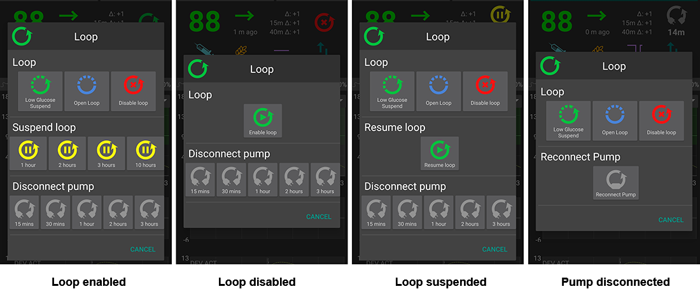
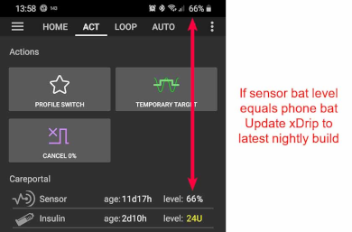
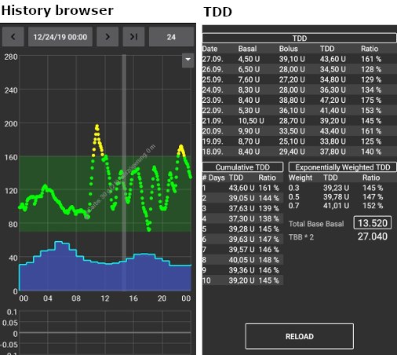
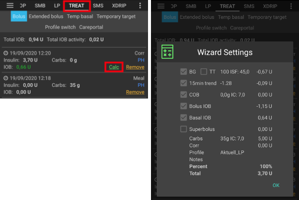
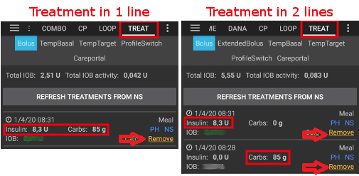

# AAPS 螢幕畫面

## 主畫面

這是你打開 AAPS 時會遇到的第一個畫面，他包含了日常所需的大部分資訊。

### A 區 - 分頁

* 在各個 AAPS 模組頁籤之間導覽。
* 你還可以透過向左或向右滑動來更換螢幕。
* 顯示的標籤可以在[配置生成器](../SettingUpAaps/ConfigBuilder.md#tab-or-hamburger-menu)中選擇。

### B 區 - 設定檔 & 目標

#### 目前的設定檔

* 目前的設定檔顯示在左側欄位。
* 點一下設定檔欄位查看設定檔詳細資訊
* 長按設定檔欄以[切換不同的設定檔](../DailyLifeWithAaps/ProfileSwitch-ProfilePercentage.md#profile-switch--profile-percentage)。
* 如果設定檔切換進行中，括號中將顯示剩餘時間（以分鐘為單位）。

#### 目標

* 目前的目標血糖值顯示在右側欄位。
* 短按目標欄以設置[臨時目標](../DailyLifeWithAaps/TempTargets.md)。
* 如果設置了臨時目標，欄位將變為黃色，括號中顯示剩餘時間（以分鐘為單位）。

#### 動態目標調整的可視化

* 如果你使用 SMB 演算法，AAPS 可以根據敏感度動態調整你的目標。
* 啟用以下[一種或兩種選項](../SettingUpAaps/Preferences.md#openaps-smb-settings) 
   * "敏感度提高目標" 
   * "阻力降低目標" 
* 如果 AAPS 偵測到阻力或敏感度，目標將從設定檔中的設定值改變。 
* 當目標血糖值變更時，背景會變成綠色。

### C 區 - 血糖 & 循環狀態

#### 目前血糖值

* 最新的 CGM 血糖讀取值顯示在左側。
* BG 值的顏色反映狀態符合定義的[範圍](../SettingUpAaps/Preferences.md#range-for-visualization)。 
   * 綠色 = 在範圍內
   * 紅色 = 低於範圍
   * 黃色 = 高於範圍
* 中間的灰色區塊顯示自上次讀取值以來的分鐘數以及過去 15 和 40 分鐘內的變化。

#### 循環狀態

* 新圖示顯示循環狀態：
   
   * 綠色圓圈 = 循環運作中
   * 綠色圓圈帶虛線 = [低血糖暫停 (LGS)](../SettingUpAaps/CompletingTheObjectives.md#objective-6-starting-to-close-the-loop-with-low-glucose-suspend)
   * 紅色圓圈 = 循環已停用（永久不起作用）
   * 黃色圓圈 = 循環暫停（暫時暫停但將給予基礎胰島素）- 圖示下方顯示剩餘時間
   * 灰色圓圈 = 幫浦已中斷（暫時無胰島素劑量）- 圖示下方顯示剩餘時間
   * 橙色圓圈 = 超級注射進行中 - 圖示下方顯示剩餘時間
   * 藍色圓圈帶虛線 = 開放循環

* 點一下或長按圖示以打開循環對話框來切換循環模式（關閉、低血糖暫停、開放或停用），暫停/重新啟動循環或中斷/重新連線幫浦。
   
   * 如果點一下循環圖示，選擇後需要進行驗證。
   
   

#### 血糖警告標誌

從 Android 3.0 開始，你可能會在主螢幕上的血糖數字下方看到警告信號。

*注意*：AAPS 計算會考慮到長達 30 小時的資料。 因此，即使你解決了問題，黃三角標誌可能會在最後一次不規則間隔發生後大約 30 小時內消失。

要立即刪除他，你需要從 Dexcom/xDrip+ 標籤中手動刪除幾個項目。

然而，當有很多重複項目時，可能更容易

* [備份您的設定](../Maintenance/ExportImportSettings.md)，
* 在維護選單中重置你的資料庫，然後
* [再次匯入您的設定](../Maintenance/ExportImportSettings.md)

##### 紅色警告標誌：重複的血糖資料

紅色警告標誌表示你需要立即採取行動：你正在接收重複的血糖資料，這會阻止循環正常工作。 因此，你的循環將被停用，直到問題解決為止。

你需要找出為什麼會收到重複的血糖資料：

* 你的 NS 網站上是否啟用了 Dexcom 橋接功能？ 透過進入 heroku（或任何其他託管提供商），編輯 "enable" 變數，並刪除其中的 "bridge" 部分來停用橋接功能。 （有關 heroku 的[詳細資訊可以在此找到](https://nightscout.github.io/troubleshoot/troublehoot/#heroku-settings)。）
* 是否有多個來源將你的血糖資料上傳到 NS？ 如果你使用 BYODA 應用程式，請在 AAPS 中啟用上傳功能，但不要在 xDrip+ 中啟用他，如果你使用的是該應用程式。
* 是否有追蹤者接收了你的血糖資料，但又將其重新上傳到你的 NS 網站？
* 最後的手段：在 AAPS 中，進入你的 NS 客戶端設定，選擇同步設定並停用“接受來自 NS 的 CGM 資料”選項。

##### 黃色警告標誌

* 黃色警告信號表示你的血糖資料到達的時間不規則或某些血糖資料丟失。
   
   

* 通常你不需要採取任何行動。 閉環會繼續運作！

* 由於傳感器更換會中斷血糖資料的連續傳輸，更換傳感器後的黃色警告標誌是正常現象，無需擔心。
* 對於 Libre 使用者的特別注意事項：
   
   * 每個 Libre 感應器每隔幾小時都會慢個一兩分鐘，這意味著你永遠無法獲得完美的定期血糖間隔。
   * 跳動的讀取值也會中斷連續資料傳輸。
   * 因此，對於 Libre 使用者來說，黃色警告標誌將“始終存在”。

### D 區 - 胰島素、碳水化合物、基礎率與自動敏感性

* 針筒圖示：活性胰島素（IOB）- 體內尚有作用的胰島素數量
   
   * 如果僅運作標準基礎率，且沒有先前注射的胰島素剩餘，則 IOB 為零。 
   * 如果最近有減少的基礎率，IOB 可能為負值。
   * 按圖示可查看注射胰島素與基礎胰島素的分配情況。

* 穀物: [尚未吸收的碳水化合物 (COB)](CobCalculation) - 您之前食用的尚未吸收的碳水化合物 -> 當需要碳水化合物時圖示會閃爍

* 紫線：基礎率 - 圖示隨基礎率的暫時變化而改變（在 100% 時保持不變）。 
   * 按圖示可查看基礎基礎率和任何臨時基礎率的詳細資訊（包括剩餘時間）。
* 上下箭頭: 顯示當前[自動感知](KeyAapsFeatures#autosens)狀態（啟用或停用）並且值顯示在圖示下方

#### 需要碳水化合物

* 當系統偵測到需要碳水化合物時，會提供碳水化合物建議。
* 當 oref 演算法無法透過臨時基礎設置為0來避免低血糖時，會提示你將需要碳水化合物來解決問題。
* 碳水化合物的通知會比注射計算機的通知更為精準。 你可能會看到碳水化合物建議，而注射計算機未顯示缺少的碳水化合物。
* 如果有需要，碳水化合物需求通知可以推送到 Nightscout，屆時會顯示並廣播公告。

### E 區 - 狀態指示燈

* 狀態指示燈為以下情況提供視覺警告： 
   * 輸注針頭的使用時間
   * 胰島素的使用時間（儲液罐使用的天數）
   * 儲液罐的剩餘容量（單位）
   * 傳感器使用時間
   * 電池使用時間及電量（百分比）
* 如果超過警告門檻值，數值將顯示為黃色。
* 如果超過危急門檻值警告，數值將顯示為紅色。
* 設定可以在[偏好設定](../SettingUpAaps/Preferences.md#status-lights)中進行。

### F 區 - 主圖表

* 圖表顯示你的血糖（BG），資料來自你的連續血糖監測儀（CGM）。 
* 在操作標籤中輸入的筆記（如手指校準和碳水化合物輸入）以及設定檔切換也會顯示在此處。 
* 長按圖表可更改時間範圍。 你可以選擇 6、12、18 或 24 小時。
* 綠色區域反應你的目標範圍。 可以在[偏好設定](../SettingUpAaps/Preferences.md#range-for-visualization)中配置。
* 藍色三角形顯示[微量注射 (SMB)](KeyAapsFeatures#super-micro-bolus-smb) - 如果在[偏好設定](../SettingUpAaps/Preferences.md#openaps-smb-settings)中啟用。
* 可選資訊：
   
   * 預測
   * 基礎率
   * 活動 - 胰島素活動曲線

#### 啟用可選資訊

* 單擊主圖表右側的三角形，選擇要顯示在主圖表中的資訊。
* 對於主圖表，只有位於 "\---\---- 圖表 1 \---\----" 以上的三個選項可用。
   
   

(Screenshots-prediction-lines)=

#### 預測線

* **橙色**線: [尚未吸收的碳水化合物 (COB)](CobCalculation)（顏色通常用來表示 COMB 和碳水化合物）
   
   預測線顯示根據目前幫浦設置以及假設碳水化合物吸收偏差保持不變的情況下，你的血糖將如何變化。 此線僅在有已知的 COB 時出現。

* **深藍色**線：IOB（顏色通常用來表示 IOB 和胰島素）
   
   預測線顯示僅在胰島素的影響下會發生什麼。 例如，如果你輸入了一些胰島素，但未食用任何碳水化合物。

* **淺藍色**線：零基礎率（如果設置了 0% 的臨時基礎率，預測血糖會怎麼變化）
   
   預測線顯示如果幫浦停止所有胰島素輸送（0% TBR），血糖 軌跡線將如何變化。
   
   *這條線僅在使用[SMB](../SettingUpAaps/Preferences.md#advanced-meal-assist-ama-or-super-micro-bolus-smb)算法時顯示。*

* **深黃色**線: [未公告餐 (UAM)](../DailyLifeWithAaps/SensitivityDetectionAndCob.md#sensitivity-oref1)
   
   未輸入的餐點(UAM)表示偵測到由於用餐、腎上腺素或其他影響導致的血糖顯著上升。 預測線類似於橙色 COB 線，但他假設偏差將以恆定速度逐漸減少（透過延長目前的減少速度）。
   
   *這條線僅在使用[SMB](../SettingUpAaps/Preferences.md#advanced-meal-assist-ama-or-super-micro-bolus-smb)算法時顯示。*

* **深橙色**線：aCOB（加速碳水化合物吸收）
   
   類似於 COB，但假設碳水化合物吸收率為每 5 分鐘 10 mg/dL（-0.555 mmol/l/5 分鐘）。 已棄用，實用性有限。
   
   *這條線僅在使用較舊的[AMA](../SettingUpAaps/Preferences.md#advanced-meal-assist-ama-or-super-micro-bolus-smb)算法時顯示。*

通常你的實際血糖曲線最終會位於這些線之間，或接近最符合你情況的假設。

#### 基礎率

* 一條**實心藍色**線顯示你的幫浦基礎胰島素輸送，並反應實際的輸送時間。
* 一條**虛線藍色**線顯示如果沒有暫時的基礎率調整（TBR），基礎率會是什麼。
* 在標準基礎率給定的時間內，曲線下方的區域顯示為深藍色。
* 當基礎率暫時調整（增加或減少）時，曲線下方的區域顯示為淺藍色。

#### 活動

* 一條**細黃色**線顯示胰島素的活動。 
* 他基於胰島素在系統中的預期血糖降低，如果沒有其他因素（如碳水化合物）存在。

### G 區 - 其他圖表

* 你可以在主圖表下啟用最多四個其他圖表。
* 要開啟額外圖表的設定，點擊[主圖表](#section-f---main-graph)右側的三角形並向下滾動。

* 要添加其他圖表，請選中其名稱左側的框（即 \---\---- 圖表 1 \---\----）。

#### 絕對胰島素

* 活動中的胰島素，包括注射**和基礎率**。

#### 活性胰島素(IOB)

* 顯示你體內的胰島素（= 體內的活動胰島素）。 包括注射胰島素和臨時的基礎率（**但不包括你設定檔中的基礎率**）。
* 如果在DIA期間沒有任何[SMB](KeyAapsFeatures#super-micro-bolus-smb)、沒有注射和沒有TBR，則這將為零。
* 如果沒有剩餘注射且長時間設置為零/低基礎率，IOB 可能為負值。
* 衰減取決於您的[DIA和胰島素個人設定](../SettingUpAaps/ConfigBuilder.md#local-profile)。 

#### 活性碳水化合物(COB)

* 顯示你體內的碳水化合物（= 活動中的，但尚未衰減的碳水化合物）。 
* 衰減取決於演算法偵測到的偏差。 
* 如果他偵測到碳水化合物吸收率高於預期，將注射胰島素，這將增加 IOB（多或少，取決於你的安全設置）。 

#### 偏差

* **灰色**長條圖顯示由於碳水化合物引起的偏差。 
* **綠色**長條圖顯示血糖高於演算法預期。 綠色條用來增加[自動感知](KeyAapsFeatures#autosens)的抵抗力。
* **紅色**長條圖顯示血糖低於演算法預期。 紅色條用來增加[自動感知](KeyAapsFeatures#autosens)的敏感度。
* **黃色**長條圖顯示由於未輸入的餐點(UAM)引起的偏差。
* **黑色**長條圖顯示未考慮敏感性的輕微偏差。

#### 敏感性

* 顯示[自動感知](KeyAapsFeatures#autosens)檢測到的敏感度。 
* 敏感性是運動、荷爾蒙等導致的對胰島素的敏感性計算結果。

#### 活動

* 顯示由你的胰島素設定檔計算出的胰島素活動（這不是從體內胰島素剩餘量計算出來的）。 
* 胰島素越接近峰值時間，值越高。
* 當 IOB 減少時，他將是負值。 

#### 偏差斜率

* 演算法中使用的內部值。

### H 區 - 按鈕

* 胰島素、碳水化合物和計算器的按鈕幾乎總是處於「啟用」狀態。
   
   * 如果與幫浦的連線中斷，胰島素按鈕將不會顯示。

* 其他按鈕必須在[偏好設定](../SettingUpAaps/Preferences.md#buttons)中設置。

#### 胰島素

* 在不使用[注射計算器](#bolus-wizard)的情況下給予一定量的胰島素。
* 勾選此框，即可自動啟動您的[即將用餐的臨時目標](../SettingUpAaps/Preferences.md#default-temp-targets)。
* 如果你不想透過幫浦進行注射，只想記錄注射劑量的話（已透過針筒注射胰島素），請勾選「不注射，只紀錄」。

#### 碳水化合物

* 記錄碳水化合物而不進行注射。
* 某些[預設的臨時目標](../SettingUpAaps/Preferences.md#default-temp-targets)可以直接通過勾選框來設置。
* 時間偏移：你將在何時/何時食用碳水化合物（以分鐘計）。
* 持續時間: 用於[「延伸碳水化合物」](ExtendedCarbs)
* 你可以使用按鈕快速增加碳水化合物量。
* 資料將上傳到Nightscout - 取決於您的[NS客戶端](../SettingUpAaps/Preferences.md#nsclient)設定。

#### 計算機

* 參見注射計算器[下方的部分](#bolus-wizard)

#### 校準

* 發送校準至 xDrip+ 或打開 Dexcom 校準對話框。
* 必須在[偏好設定](../SettingUpAaps/Preferences.md#buttons)中啟用。

#### CGM

* 開啟 xDrip+。
* 按返回鍵返回 AAPS。
* 必須在[偏好設定](../SettingUpAaps/Preferences.md#buttons)中啟用。

#### 快速嚮導

* 輕鬆輸入碳水化合物數量並設置計算基礎。
* 詳細資訊在[偏好設定](../SettingUpAaps/Preferences.md#quick-wizard)中設置。

## 注射嚮導

當你需要進行餐前注射時，通常會從這裡開始操作。

### I 區

* 血糖 欄位通常會自動填充最新的 CGM 讀取值。 如果你沒有使用中的 CGM，則該欄位將保持空白。 
* 在碳水化合物欄位中，你可以添加你想要進行注射的碳水化合物數量或等效值。 
* 如果你出於某些原因希望修改最終胰島素劑量，則可以使用修正欄位。
* 碳水化合物時間欄位是為了提前注射，因此你可以告訴系統，碳水化合物需要等待一段時間才會生效。 如果你是為之前的碳水化合物進行注射，你可以在此欄位中輸入負數。

(Screenshots-eating-reminder)=

#### 用餐提醒

* 針對稍後才要吃的碳水化合物，可以勾選鬧鐘警報選項（當輸入未來的時間時，該選項會預設勾選鬧鐘圖示），這樣你可以在未來的指定時間內收到提醒，告知你何時應攝取你在 AAPS 中輸入的碳水化合物，避免忘記，造成低血糖。
   
   

### J 區

* 超級注射是將接下來兩小時的基礎胰島素添加到即時注射中，並發出 0% 臨時基礎率（TBR），以收回額外的胰島素。 該選項僅在「啟用[超注射](../SettingUpAaps/Preferences.md#superbolus)於嚮導中」在[偏好設定概覽](../SettingUpAaps/Preferences.md#overview)中設置時顯示。
* 其目的是更快地注射胰島素，希望減少血糖高峰。
* 詳情請查看[diabetesnet.com](https://www.diabetesnet.com/diabetes-technology/blue-skying/super-bolus/)。

### K 區

* 顯示計算出的注射劑量。 
* 如果活性胰島素（IOB）的量已超過計算出的注射劑量，那麼他只會顯示仍然需要的碳水化合物數量。
* 資料將上傳到Nightscout - 取決於您的[NS客戶端](../SettingUpAaps/Preferences.md#nsclient)設定。

### L 區

* 注射嚮導的詳細計算方式。
* 你可以取消選中任何不想包括的項目，但通常不會這麼做。
* 出於安全原因，如果你希望注射嚮導基於現有的臨時目標進行計算，則**必須手動勾選 TT 框**。

#### COB 和 IOB 的組合及其含義

* 出於安全原因，當 COB 框勾選時，IOB 框無法取消勾選，因為這樣做可能會導致過多的胰島素，因為 AAPS 未計算已經注射的劑量。
* 如果你勾選 COB 和 IOB，未被胰島素覆蓋的未吸收碳水化合物 + 所有透過 TBR 或 SMB 注射的胰島素都將被計入。
* 如果你僅勾選 IOB 而未勾選 COB，AAPS 將計算已經注射的胰島素，但不會將其與仍需吸收的碳水化合物對比。 這會導致“缺少碳水化合物”的提示。
* 如果你在餐後注射胰島素後，為了**額外食物**（如額外的甜點）再進行注射，最好取消勾選所有選項。 這樣只會加入新增的碳水化合物，因為主餐不一定會立刻被吸收，因此餐後的 IOB 和 COB 不會馬上精確匹配。

(Screenshots-wrong-cob-detection)=

#### 錯誤的 COB 偵測

* 如果你在使用注射嚮導後看到上述警告，則表示 AAPS 偵測到計算的 COB 值可能有誤。
* 因此，如果你在上一餐有 COB 後再次注射，請注意可能會過量注射！ 
* 詳細資訊請參見[COB計算頁面](CobCalculation#detection-of-wrong-cob-values)上的提示。

(Screenshots-action-tab)=

## 操作標籤

### 操作 - M 區

* 按鈕[個人設定切換](../DailyLifeWithAaps/ProfileSwitch-ProfilePercentage.md#profile-switch--profile-percentage)作為點擊[主螢幕上當前個人設定](#section-b---profile--target)的替代選擇。
* 按鈕[臨時目標](../DailyLifeWithAaps/TempTargets.md)作為點擊[主螢幕上當前目標](#section-b---profile--target)的替代選擇。
* 啟動或取消臨時基礎率的按鈕。 請注意，當設置了臨時基礎率時，按鈕將從“TEMPBASAL”變為“CANCEL x%”。
* 儘管[延伸注射](ExtendedCarbs#extended-bolus-and-why-they-wont-work-in-closed-loop-environment)在封閉循環環境中實際上無法運作，但有些人還是要求提供使用延伸注射的選項。
   
   * 此選項僅適用於 Dana RS 和 Insight 幫浦。 
   * 閉環將自動停止並切換為開環模式，以運作延長注射。
   * 在使用此選項之前，務必閱讀[詳細資訊](ExtendedCarbs)。

(Screenshots-careportal-section-n)=

### 護理入口 - N 區

* 顯示以下資訊
   
   * 傳感器使用時間及電量（百分比）
   * 胰島素使用時間及數量（單位）
   * 導管使用時間
   * 幫浦電池使用時間及電量（百分比）

* 如果使用了[低解析度外觀](../SettingUpAaps/Preferences.md#skin)，將顯示較少的資訊。

(Screenshots-sensor-level-battery)=

#### 傳感器電量（電池）

* 需要 xDrip+ 2020 年 12 月 10 日或更新版本的夜間建置。 適用於具有額外發射器（如 MiaoMiao 2）的 CGM。
* （技術上，傳感器必須將電池電量資訊發送至 xDrip+。） （技術上，傳感器必須將電量資訊傳送至 xDrip+。）
* 閾值可以在[偏好設定](../SettingUpAaps/Preferences.md#status-lights)中設置。
* 如果傳感器電量與手機電池電量相同，則說明你的 xDrip+ 版本可能過舊，需進行更新。
   
   

### 護理入口 - O 區

* BG檢查、預備/填充、傳感器插入和幫浦電池更換是[N部分](#careportal---section-n)中顯示資料的基礎。
* 填充/注入允許你記錄幫浦部位和胰島素筒的更換。
* O 區反應了 Nightscout 的護理入口功能。 因此，運動、公告和問題是特別的筆記形式。

### 工具 - P 區

#### 歷史瀏覽器

* 允許你查看 AAPS 的歷史記錄。

#### 每日總劑量(TDD)

* 每日總劑量 = 每日的注射量 + 基礎率
* 一些醫生（尤其是新使用幫浦者）使用 50:50 的基礎-注射比例。 
* 因此該比例計算為 TDD / 2 * TBB（總基礎率 = 24 小時內基礎率的總和）。 
* 其他人則更喜歡 TDD 的 32% 至 37% 範圍作為 TBB。 
* 如同大多數此類經驗法則，這種方法的實際有效性有限。 注意：每個人的糖尿病狀況都不同！

(Screenshots-insulin-profile))=

## 胰島素設定檔

* 這顯示您在[配置建構器](../SettingUpAaps/ConfigBuilder.md#insulin)中選擇的胰島素的活動特徵。 
* 紫色線顯示注射後胰島素隨時間衰減的情況，藍色線顯示其活性。
* 需要注意的重要一點是，衰減有一個長尾。 
* 如果你習慣於手動操作幫浦，你可能習慣於認為胰島素會在大約 3.5 小時內衰減完畢。 
* 然而，當你使用閉環系統時，這種長尾很重要，因為計算更為精準，這些微量的胰島素在 AAPS 演算法中的遞歸計算會積累起來。

有關不同類型的胰島素、他們的活性設定檔以及為什麼這些很重要的更多詳細討論，你可以閱讀這篇文章[暸解基於指數活性曲線的新 IOB 曲線](https://openaps.readthedocs.io/en/latest/docs/While%20You%20Wait%20For%20Gear/understanding-insulin-on-board-calculations.html#understanding-the-new-iob-curves-based-on-exponential-activity-curves)

你還可以在這裡閱讀一篇出色的部落格文章：[我們經常在使用的胰島素作用時間（DIA）上出錯的原因以及為什麼這很重要...](https://www.diabettech.com/insulin/why-we-are-regularly-wrong-in-the-duration-of-insulin-action-dia-times-we-use-and-why-it-matters/)

更多資訊請查看：[指數胰島素曲線 + Fiasp](https://seemycgm.com/2017/10/21/exponential-insulin-curves-fiasp/)

## 幫浦狀態

* 顯示幫浦狀態的不同資訊。 顯示的資訊取決於你的幫浦型號。
* 詳情請參見[幫浦頁面](../Getting-Started/CompatiblePumps.md)。

## 護理入口

護理入口複製了你在 Nightscout 螢幕上的“+”圖示下找到的功能，該圖示允許你向記錄中添加筆記。

### 審查碳水化合物計算

* 如果您使用[注射計算器](#bolus-wizard)來計算胰島素劑量，您可以稍後在其選項卡中查看此計算。
* 只需按下綠色的 Calc 鏈接。 （根據幫浦的不同，胰島素和碳水化合物也可能在 ts 中顯示為單行。）

(Screenshots-carb-correction)=

### 碳水化合物修正

可以使用治療標籤來修正錯誤的碳水化合物輸入（即你高估或低估了碳水化合物）。

1. 在主畫面檢查並記住實際的 COB 和 IOB。
2. 根據幫浦的不同，在治療標籤中碳水化合物可能與胰島素一起顯示在同一行，或作為單獨的項目顯示（如 Dana RS）。
3. 移除碳水化合物數量錯誤的項目。 (最新版本在治療螢幕上有垃圾桶圖示。 按一下垃圾桶圖示，選擇要刪除的行，然後再次按垃圾桶圖示以完成刪除。)
4. 再次檢查主畫面上的 COB 以確保成功移除了碳水化合物。
5. 如果治療標籤中包含碳水化合物和胰島素的條目是單行的，請對 IOB 執行相同操作。
   
   -> 如果碳水化合物未按預期移除，並且你按此處解釋（6.）添加了額外的碳水化合物，COB 會過高，這可能會導致胰島素輸送過量。

6. 透過主畫面的碳水化合物按鈕輸入正確的碳水化合物數量，並確保設置正確的事件時間。

7. 如果治療標籤中包含碳水化合物和胰島素的條目是單行的，你還必須添加胰島素的數量。 確保設置正確的事件時間，並在確認新條目後檢查主畫面上的 IOB。

## 閉環、AMA / SMB

* 這些標籤顯示了演算法的計算詳細資訊以及 AAPS 執行操作的原因。
* 每次系統從 CGM 獲取新讀取值時都會進行計算。
* 有關更多詳細資訊，請參見[配置建構器頁面的APS部分](../SettingUpAaps/ConfigBuilder.md#aps)。

## 設定檔

* 設定檔包含有關你個人糖尿病設定的資訊：
   
   * DIA（胰島素作用持續時間）
   * IC 或 I:C：胰島素與碳水化合物的比率
   * ISF：胰島素敏感性因數
   * 基礎率
   * 目標：你希望 AAPS 尋求的血糖水平

(Screenshots-treatment)=

## 治療

以下治療的歷史記錄：

* 注射與碳水化合物 -> 選擇[移除項目](#carb-correction)以糾正歷史
* [延長注射](ExtendedCarbs#extended-bolus-and-switch-to-open-loop---dana-and-insight-pump-only)
* 臨時基礎率
* [臨時目標](../DailyLifeWithAaps/TempTargets.md)
* [設定檔切換](../DailyLifeWithAaps/ProfileSwitch-ProfilePercentage.md)
* 照護入口 - 通過操作標籤輸入的註解和對話中的註解

## 血糖來源 - xDrip+、BYODA...

* 根據你的血糖來源設定，此標籤名稱不同。
* 顯示 CGM 讀取值的歷史記錄，並提供在讀取值出錯時刪除讀取值的選項（例如壓力性低血糖）。

## NSClient

* 顯示與 Nightscout 網站的連線狀態。
* 設定在[偏好設定](../SettingUpAaps/Preferences.md#nsclient)中進行。 你可以透過點擊螢幕右上角的齒輪圖示打開相應的部分。
* 如遇故障，請參考此[頁面](../GettingHelp/TroubleshootingNsClient.md)。