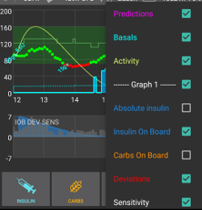

# AAPS 螢幕畫面

```{contents}
:backlinks: entry
:depth: 2
```

(AapsScreens-the-homescreen)=

## 主畫面


這是你打開**AAPS**後會看到的第一個螢幕，裡面包含了你每天所需的大部分資訊。

### A 區 - 分頁

* 在各個**AAPS**模組之間進行導覽。
* 你還可以透過向左或向右滑動來更換螢幕。
* 顯示的選項卡可以在 [組態建置工具](#Config-Builder-tab-or-hamburger-menu) 中選擇。

(aaps-screens-profile--target)=

### B 區 - 設定檔 & 目標

#### 目前的設定檔

目前的設定檔顯示在左側欄位。

點一下設定檔欄位查看設定檔詳細資訊. 長按設定檔欄以[切換不同的設定檔](../DailyLifeWithAaps/ProfileSwitch-ProfilePercentage.md)。


1. 平時顯示已啟用的標準設定檔。
2. 設定檔切換剩餘時間為 59 分鐘。
3. 設定檔切換特定百分比為 120%。
4. 設定檔切換特定百分比為 80% 且剩餘時間為 59 分鐘。
5. 設定檔切換時區偏移為 -1 小時。
6. 設定檔切換特定百分比為 120%、時區偏移 1 小時，剩餘時間為 59 分鐘。

#### 目標


目前的目標血糖值顯示在右側欄位。

點一下目標欄位，可以設定**[臨時目標](../DailyLifeWithAaps/TempTargets.md)**。

如果設定了臨時目標，目標欄位的底色會以黃色顯示，並會在括號中顯示剩餘時間（以分鐘為單位）。

(AapsScreens-visualization-of-dynamic-target-adjustment)=

#### 動態目標調整的可視化


當使用[SMB 演算法](#Config-Builder-aps)和[自動感應](#Open-APS-features-autosens)功能時，**AAPS**可以根據敏感度動態調整你的目標。

在[偏好設定 > OpenAPS SMB 設定](#Preferences-openaps-smb-settings)中，啟用下方任一選項：

* "敏感度提高目標" 
* "阻力降低目標" 

如果**AAPS**檢測到阻力或敏感度，目標將會從設定檔中變更。 當它變更目標血糖時，底色顏色會變為綠色。

(AapsScreens-section-c-bg-loop-status)=

### C 區 - 血糖 & 循環狀態

#### 目前血糖值

你的 CGM 最近的血糖讀取顯示在左側。

血糖值的顏色反映了對定義的[範圍](#Preferences-range-for-visualization)的狀態。

* 綠色 = 在範圍內
* 紅色 = 低於範圍
* 黃色 = 高於範圍 


中間的區塊顯示：

1. 距上一次 **CGM** 讀取的分鐘數
2. 與最後讀取的差異：Δ，以及與最後 15 和 40 分鐘的平均值 (Δ15 和 Δ40)。  
    長期變化量是過去的變化量的平均值，顯示平均變化情況。

(AapsScreens-loop-status)=

#### 循環狀態


在右側，一個圖示顯示了循環狀態：

1. 綠色圓圈 = 循環運作中
2. 綠色圓圈帶虛線 = [低血糖暫停 (LGS)](#objectives-objective6)
3. 紅色圓圈 = 循環已停用（永久無法運作）
4. 紅色圓圈 = 循環已暫停（暫時暫停，但基礎胰島素仍會輸送）- 剩餘時間顯示於圖示下方
5. 灰色圓圈 = 幫浦中斷連線（暫時不給予任何胰島素劑量） - 剩餘時間顯示在圖示下方
6. 橙色圓圈 = 超級注射進行中 - 圖示下方顯示剩餘時間
7. 藍色圓圈帶虛線 = 開放循環

點一下或長按圖示以打開循環對話框來切換循環模式（關閉、低血糖暫停(LGS)、開放或停用），暫停/重新啟動循環或中斷/重新連線幫浦。

* 如果點一下循環圖示，選擇後需要進行驗證。
    
    

(aaps-screens-bg-warning-sign)=

#### 血糖警告標誌

如果**AAPS**接收到的血糖讀取有任何問題，你將在主螢幕的血糖數字下方收到警告信號。

##### 紅色警告標誌：重複的血糖資料

紅色警告標誌表示你應立即採取行動：你正在接收**重複的血糖資料**，這會妨礙循環正常運作。 因此，你的循環將會被停用，直到問題解決為止。

    {admonition} 你的循環尚未運行
    :class: note
    在解決此問題之前，你的循環不會運行！


你需要找出為什麼會收到重複的血糖資料：

* 你的 Nightscout 網站上是否啟用了 Dexcom 橋接？ 通過進入 Nightscout 實例的管理面板，編輯 "enable" 變數並刪除其中的 "bridge" 來停用橋接。 （有關 heroku 的[詳細資訊可以在此找到](https://nightscout.github.io/troubleshoot/troublehoot/#heroku-settings)。）
* 是否有多個來源將你的血糖上傳到 Nightscout？ 如果你使用 BYODA 應用程式，請在 **AAPS** 中啟用上傳，但不要在 xDrip+ 中啟用。
* 你是否有任何會接收你的血糖，並再次上傳到你的 Nightscout 網站的追蹤者？
* 最後的手段：在 **AAPS** 中，請前往 [偏好設定 > NSClient](#Preferences-nsclient)，選擇同步設定並停用 "接受來自 NS 的 CGM 資料" 選項。

要立即移除警告並重新啟動循環，你需要手動刪除 Dexter/xDrip+ 標籤中的幾個項目。

然而，當有很多重複項目時，下面的作法也許更容易排除警告

* [備份你的設定](../Maintenance/ExportImportSettings.md)，
* 在維護選單中重置你的資料庫，然後
* [再次匯入你的設定](../Maintenance/ExportImportSettings.md)

##### 黃色警告標誌

黃色警告標誌表示你的血糖資料接收不規則，可能是時間間隔不規則或某些血糖資料遺失。 按壓標誌時，訊息顯示「使用了重新計算的資料」。


通常你不需要採取任何行動。 閉環會繼續運作！

由於傳感器的更換會中斷血糖資料的接收，因此在傳感器更換後出現黃色警告標誌是正常的，無需擔心。

Libre 使用者的特殊注意事項：

* 每個 Libre 傳感器每隔幾小時都會慢個一兩分鐘，所以你永遠無法得到一個穩定的血糖接收間隔。
* 此外，數值的波動會中斷連續資料的流動。
* 因此，對於 Libre 使用者來說，黃色警告標誌將「永遠存在」。

*注意*: 在 **AAPS** 計算中，最多讀取近 30 小時的資料。 因此，即使你解決了問題，黃三角標誌可能會在最後一次不規則間隔發生後大約 30 小時內消失。

#### 簡易模式

右上角有一個兒童面孔的圖示表示你正在使用 [簡單模式](#preferences-simple-mode)。


### D 區 - 胰島素、碳水化合物、基礎率與自動敏感性


1. **針筒**：體內的胰島素量（IOB） - 你體內活性胰島素的數量  
    如果僅有標準的基礎胰島素在運行，且沒有來自之前注射的胰島素剩餘，則體內的胰島素量為零。
    
    * 如果最近有減少的基礎率，IOB 可能為負值。
    * 按圖示可查看注射胰島素與基礎胰島素的分配情況。

2. **碳水化合物**: [體內碳水化合物 (COB)](../DailyLifeWithAaps/CobCalculation.md) - 你先前已進食，但尚未吸收的碳水化合物 如果需要碳水化合物，圖示呈紅色閃爍（請參閱[下方](#aaps-screens-carbs-required)）

3. **紫色線**: 當前的基礎率。 圖示會根據基礎率的臨時變化而改變（維持在 100%） 
    * 按圖示可查看基礎基礎率和任何臨時基礎率的詳細資訊(包括剩餘時間)。
4. **上下箭頭**：顯示動態敏感度特徵狀態（[Autosens](#Open-APS-features-autosens) 或 [DynamicISF](#Open-APS-features-DynamicISF)）：啟用或停用。 本部分可能顯示幾個值： 
    * AS：Autosens 值。 即使在 Autosens 停用時也會顯示（僅供參考）。 當 DynISF 啟用時也會顯示，儘管它並不會產生影響。
    * Alg：DynamicISF 值（基於 TDD）。 有關最後一行的更多資訊，請參見[DynamicISF](#Open-APS-features-DynamicISF) 頁面。

(aaps-screens-carbs-required)=

#### 需要碳水化合物


當系統偵測到需要碳水化合物時，會提供碳水化合物建議。

當 oref 演算法認為無法透過零基礎補救時，你需要碳水化合物來修正。

碳水化合物的通知會比注射計算機的通知更為精準。 你可能會看到碳水化合物建議，而注射計算機未顯示缺少的碳水化合物。

如果有需要，碳水化合物需求通知可以推送到 Nightscout，屆時會顯示並廣播公告。

### E 區 - 狀態指示燈


狀態指示燈為以下情況提供視覺警告：

* 針頭的使用時間
* 胰島素的使用時間（儲液罐使用的天數）
* 儲液罐的剩餘容量（單位）
* 傳感器使用時間
* 電池使用時間及電量（百分比）

如果超過警告門檻值，數值將顯示為黃色。

如果超過危急門檻值警告，數值將顯示為紅色。

可以在 [偏好設定 > 首頁總覽 > 狀態燈](#Preferences-status-lights) 中更改設置。

根據你使用的幫浦，你可能不會擁有所有這些圖示。

(aaps-screens-main-graph)=

### F 區 - 主圖表


圖表顯示你的血糖 (BG)，從你的血糖傳感器 (CGM) 讀取。

在操作標籤中輸入的筆記（如手指校準和碳水化合物輸入）以及設定檔切換也會顯示在此處。

使用圖表左上方的選單或在圖表上長按任意位置以更改時間尺度。 你可以選擇 6、12、18 或 24 小時。

綠色區域反應你的目標範圍。

如果在 [偏好設定 > OpenAPS SMB](#Preferences-openaps-smb-settings) 中啟用，將會有藍色三角形顯示 [微量注射 (SMB)](#Open-APS-features-super-micro-bolus-smb) 

(AapsScreens-activate-optional-information)=

#### 啟用可選資訊

在主圖表上，你可以開啟這些線圖資訊：

* 預測
* 治療
* 基礎率
* 活動 - 胰島素活動曲線

要顯示這些資訊，請點擊主圖表右側的三角形。 對於主圖表，只有 "Graph 1 2 3 4" 以上的四個選項可用。



(aaps-screens-prediction-lines)=

#### 預測線

* **橘色**線: [碳水化合物在體內 (COB)](CobCalculation)（顏色一般用於代表 COB 和碳水化合物）
    
    此預測線顯示了在目前**設定檔**下，假設碳水吸收的偏差保持不變，你的血糖（而非碳水本身）將會走向的趨勢。 此線僅在有輸入 COB 時才會顯示。

* **深藍色**線: IOB（顏色一般用於代表 IOB 和胰島素）
    
    此預測線顯示在僅受胰島素影響下會發生什麼。 例如，如果你調整了一些胰島素，然後沒有吃任何碳水化合物。

* **淺藍色**線：零基礎率（如果設置了 0% 的臨時基礎率，預測血糖會怎麼變化）
    
    此預測線顯示如果幫浦停止所有胰島素輸送（0% TBR），血糖軌跡線將如何改變。
    
    *這條線僅在使用[SMB](#Config-Builder-aps)算法時顯示。*

* **深黃色**線: [未公告餐點 (UAM)](#SensitivityDetectionAndCob-sensitivity-oref1)
    
    未輸入的餐點(UAM)表示偵測到由於用餐、腎上腺素或其他影響導致的血糖顯著上升。 預測線類似於**橘色的 COB 線**，但它假設偏差會以恆定速率減少（延長當前減少的速率）。
    
    *這條線僅在使用[SMB](#Config-Builder-aps)算法時顯示。*

* **深橙色**線：aCOB（加速碳水化合物吸收）
    
    類似於 COB，但假設碳水化合物吸收率為每 5 分鐘 10 mg/dL（-0.555 mmol/l/5 分鐘）。 因實用性有限，所以已棄用。
    
    *這條線僅在使用較舊的[AMA](#Config-Builder-aps)算法時顯示。*

通常你的實際血糖曲線會落在這些線的中間，或者接近某一條最符合你目前狀況的線

#### 基礎率

一條**實心藍色**線顯示你的幫浦基礎胰島素輸送，並反應實際的輸送時間。

一條**虛線藍色**線顯示如果沒有暫時的基礎率調整（TBR），基礎率會是什麼。

當提供標準基礎率時，曲線下方的區域以深藍色顯示。 當基礎率臨時調整（增加或減少）時，曲線下方的區域會以淺藍色顯示。

#### 活動

一條**細黃色**線顯示胰島素的活動。

這是基於你體內胰島素預期降低血糖的效果，假設沒有其他因素（如碳水化合物）影響。

(AapsScreens-section-g-additional-graphs)=

### 區域 G - 額外圖表

你可以在主圖表下啟用最多四個其他圖表。 當在 [簡單模式](#preferences-simple-mode) 時，額外圖表是預設的，無法更改。 如果要設定自己的額外圖表組態，請關閉 **簡單模式**。

To open settings for additional graphs click the triangle on the right side of the [main graph](#aaps-screens-main-graph) and scroll down.


要配置額外圖表，請勾選你希望在每個圖表上查看的資料對應的方框。

大多數使用者發現以下附加圖表配置足夠：

* 圖表 1 包含 IOB、COB、敏感度變更
* 圖表 2 包含偏差和 BGI。

#### 絕對胰島素(Absolute insulin)

活動中的胰島素，包括注射**和基礎率**。

#### 活性胰島素(IOB)

顯示你體內的胰島素（= 體內的活動胰島素）。 包括注射胰島素和臨時的基礎率（**但不包括你設定檔中的基礎率**）。

如果在DIA期間沒有任何[SMB](#Open-APS-features-super-micro-bolus-smb)、沒有額外注射並且沒有臨時基礎率(TBR)的情況下，這個值會為零。

如果沒有剩餘的劑量，且長時間處於零或低臨時基礎速率，則體內胰島素活性（IOB）可能會變為負值

衰減取決於你的[DIA和胰島素設定檔](../SettingUpAaps/YourAapsProfile.md)。

#### 活性碳水化合物(COB)

顯示你體內的碳水化合物（= 活動中的，但尚未衰減的碳水化合物）。

衰減取決於 [演算法檢測的偏差](../DailyLifeWithAaps/CobCalculation.md)。

如果他偵測到碳水化合物吸收率高於預期，將注射胰島素，這將增加 IOB（多或少，取決於你的安全設置）。

#### 敏感度變化

顯示[自動敏感度調整](#Open-APS-features-autosens)檢測到的敏感度。

敏感度是運動、荷爾蒙等導致的對胰島素的敏感度計算結果。

請注意，你需要在[目標 8](#objectives-objective8)中，以便讓敏感度檢測/[自動敏感調整](#Open-APS-features-autosens)所提供的胰島素量。 在達到該目標之前，你的圖表中的線條僅顯示為資訊。

### 可變敏感度

顯示由 [DynamicISF](../DailyLifeWithAaps/DynamicISF.md) 計算出的敏感度。 僅在您使用此功能時填入。

(screen-heart-rate-steps)=

#### 心率＆步數

當使用 [Wear 智慧型手錶](../WearOS/WearOsSmartwatch.md) 時，這些資料可能會可以顯示。 可在**AAPS** Wear 應用程式中啟用它們並授權健康資料。

#### 偏差(Deviations)

* **灰色**條顯示因碳水化合物引起的偏差。 
* **綠色**條顯示血糖高於演算法預期的範圍。 綠色條用來增加[自動敏感度調整](#Open-APS-features-autosens)的抵抗力。
* **紅色**條顯示血糖低於演算法預期的範圍。 紅色條用來增加[自動敏感度調整](#Open-APS-features-autosens)的敏感度。
* **黃色**條顯示因用餐而引起的偏差。
* **黑色**條顯示未考慮敏感度的小偏差

#### 血糖變化(BGI - Blood Glucose Impact)

這條線顯示基於胰島素活動，血糖應該上升或下降的程度。


將此線與偏差條一起顯示是個不錯的組合。 它們共用相同的刻度，但這個刻度與其他可選資料不同，因此建議將它們顯示在單獨的圖表上，如上所示 比較血糖影響(BGI)線和偏差條是另一種暸解**血糖(BG)**波動的方式。 在標記**1**的時間，此時偏差條大於血糖影響(BGI)線，表示血糖正在上升。 再後面一點時，在標記為 **2** 的幾小時中，血糖影響(BGI)和偏差幾乎持平，表示血糖穩定。

### H 區 - 按鈕


胰島素和碳水化合物的按鈕通常一直顯示。 如果與幫浦的連線中斷，計算機按鈕將不會顯示。

其他按鈕可以在 [偏好設定 > 首頁總覽 > 按鈕](#Preferences-buttons) 中設定。

關於使用胰島素、碳水化合物和計算機按鈕：如果在 [偏好設定 > 首頁總覽](#Preferences-show-notes-field-in-treatments-dialogs) 中啟用，**註記**欄位允許你輸入將顯示在主圖表上的文本，並可能根據你的 NS 客戶端設定上傳到 Nightscout。

(aaps-screens-buttons-insulin)=

#### 胰島素


To give a certain amount of insulin without using the [bolus calculator](#aaps-screens-bolus-wizard).

透過勾選 **即將用餐(臨時目標)**方框，你可以自動啟動你的 [即將進餐的臨時目標](#TempTargets-eating-soon-temp-target)。

如果你不想透過幫浦注射，但想紀錄一次胰島素注射（例如：使用筆注射的胰島素），請勾選「不注射，僅紀錄」的方框。 勾選此方框時，你將獲得一個額外欄位「時間偏移」，可用來紀錄過去進行的胰島素注射。

你可以使用按鈕快速增加胰島素的量。 每個按鈕的值可以在 [偏好設定 > 首頁總覽 > 按鈕](#Preferences-buttons) 中更改。

當幫浦處於暫停狀態時也可以使用胰島素按鈕，即用於記錄用筆注射的胰島素。 在此情況下，標題將顯示為黃色，復選框“請勿注射，只記錄”將無法取消勾選。


#### 碳水化合物


紀錄碳水化合物而不進行注射。

某些[預設的臨時目標](#TempTargets-hypo-temp-target)可以直接通過勾選框來設置。

**時間偏移**: 你曾經吃過碳水化合物（以分鐘計）。

**持續時間**: 用於 [“延長碳水化合物”](ExtendedCarbs)

你可以使用按鈕快速增加碳水化合物的量。 每個按鈕的值可以在 [偏好設定 > 首頁總覽 > 按鈕](#Preferences-buttons) 中更改。

#### 計算機

See Bolus Wizard [section below](#aaps-screens-bolus-wizard).

#### 校準

發送校準至 xDrip+ 或打開 Dexcom 校準對話框。

必須在 [偏好設定 > 首頁總覽 > 按鈕](#Preferences-buttons) 中註冊。

#### CGM

開啟 xDrip+。

返回按鈕將返回到 **AAPS**。

必須在 [偏好設定 > 首頁總覽 > 按鈕](#Preferences-buttons) 中註冊。

#### 快速嚮導

輕鬆輸入碳水化合物數量並設置計算基礎。

詳細訊息在 [偏好設定 > 首頁總覽 > 快速嚮導設定](#Preferences-quick-wizard) 中設置。

(aaps-screens-bolus-wizard)=

## 注射嚮導


當你想要進行餐前注射時，通常會從此處發起。

### I 區

顯示計算出的注射劑量。

如果活性胰島素（IOB）的量已超過計算出的注射劑量，那麼他只會顯示仍然需要的碳水化合物數量。

(AapsScreens-section-j)=

### J 區

血糖欄位通常會自動填充最新的 CGM 讀取值。 如果你沒有使用中的 CGM，則該欄位顯示空白。

在**碳水化合物**欄位中，你可以添加你估算的碳水化合物數量或等效值，以進行注射。

如果你想基於某些理由修改最終劑量，請使用 **Corr** 欄位。

**碳水化合物時間**欄位用於預先注射，讓系統知道在預期碳水化合物之前會有延遲。 如果你是為之前的碳水化合物進行注射，你可以在此欄位中輸入負數。

**進食提醒** : 對於未來的碳水化合物，可以選擇啟用鬧鐘警報（當輸入一個未來時間時會預設勾選啟用），以便你可以在指定的時間受到提醒，提醒你進食已輸入到**AAPS**中的碳水化合物，應該開始用餐。


### K 區

**設定檔**允許你選擇與當前不同的設定檔，以計算所需的胰島素。 此設定檔的選擇，僅適用於目前的注射，不會變更設定檔。

**超級注射** 是指將未來兩小時的基礎胰島素加到即時的注射中，並在接下來的兩小時內發出零臨時基礎率來回收額外的胰島素。 該選項僅在「啟用超注射於嚮導中」在 [偏好設定 > 首頁總覽 > 進階設定](#Preferences-advanced-settings-overview) 中設置時顯示。 其目的是更快地注射胰島素，希望減少血糖高峰。

詳情請查看[diabetesnet.com](https://www.diabetesnet.com/diabetes-technology/blue-skying/super-bolus/)。

### L 區

嚮導的注射計算詳細訊息。

你可以取消選擇不想包括的項目，但通常你不會這樣做。

基於安全理由，如果你想讓注射嚮導根據現有的臨時目標進行計算，**臨時目標必須手動勾選**。

#### COB 和 IOB 的組合及其含義

* 基於安全理由，當 COB 盒已勾選時，無法取消勾選 IOB 盒，因為這樣可能會導致胰島素過多，這會讓 **AAPS** 未將已注射的胰島素納入考慮。
* 如果你同時勾選 COB 和 IOB，未被胰島素覆蓋的碳水化合物 + 所有作為臨時基礎率或微量注射給予的胰島素都會被考慮在內。
* 如果你勾選 IOB 而不勾選 COB，**AAPS** 只會考慮已注射的胰島素，不會計算體內還沒吸收的碳水化合物。 這會導致出現“缺少碳水化合物”的提示。
* 如果你在餐後注射胰島素後，為了**額外食物**（如額外的甜點）再進行注射，最好取消勾選所有選項。 這樣只會加入新增的碳水化合物，因為主餐不一定會立刻被吸收，所以餐後追加的 IOB 和 COB 可能會對應不太起來。


眼睛圖示旁邊的框允許你在詳細視圖（每個項目進行計算的數字）和簡單視圖（圖示）之間進行選擇。 按一下圖示將啟用/停用該項目從計算中。

(AapsScreens-wrong-cob-detection)=

#### 錯誤的 COB 偵測


如果你在使用注射嚮導後看到上述警告，**AAPS** 已檢測到計算的 COB 值可能是錯誤的。 因此，如果你想在之前的進食後再次注射 COB，你應該小心注射過量！

有關詳細訊息，請參見[COB計算頁面](#CobCalculation-detection-of-wrong-cob-values)上的提示。

(screens-action-tab)=

## 手動操作標籤


### 操作 - M 區

Button **[Profile switch](../DailyLifeWithAaps/ProfileSwitch-ProfilePercentage.md)** as an alternative to pressing the [current profile](#aaps-screens-profile--target) on homescreen.

Button **[Temporary target](../DailyLifeWithAaps/TempTargets.md)** as an alternative to pressing the [current target](#aaps-screens-profile--target) on homescreen.

啟動或取消臨時基礎率的按鈕。 請注意，當設置了臨時基礎率時，按鈕將從「臨時基礎速度」變為「取消 x.xx U/H」。

Even though [extended boluses](#extended-bolus-and-why-they-wont-work-in-closed-loop-environment) do not really work in a closed loop environment some people were asking for an option to use extended bolus anyway.

* 此選項僅適用於 Dana RS 和 Insight 幫浦。 
    * 閉環將自動停止並切換為開環模式，以運作延長注射。
    * 在使用此選項之前，務必閱讀[詳細資訊](../DailyLifeWithAaps/ExtendedCarbs.md)。

(aaps-screens-careportal)=

### 護理入口 - N 區

顯示以下資訊:

* 傳感器使用時間及電量（百分比）
* 胰島素使用時間及數量（單位）
* 導管使用時間
* 幫浦電池使用時間及電量（百分比）

如果使用**低解析度外觀**，將顯示較少資訊（[偏好設定 > 一般 > 外觀](#Preferences-skin)）。

(screens-sensor-level-battery)=

#### 傳感器電量（電池）

適用於具有額外發射器的 CGM，例如 MiaoMiao 2。 （技術上，傳感器必須將電量資訊傳送至 xDrip+。）

門檻值可以在 [偏好設定 > 首頁總覽 > 狀態燈](#Preferences-status-lights) 中設置。

### 護理入口 - O 區

BG check, prime/fill, sensor insert and pump battery change are the base for the data displayed in [section N](#aaps-screens-careportal).

填充/注入允許你紀錄幫浦部位和胰島素筒的更換。

O 區反應了 Nightscout 的護理入口功能。 因此，運動、公告和問題是特別的筆記形式。

### 工具 - P 區

#### 歷史瀏覽器

讓你在**AAPS**中回顧[歷史](../Maintenance/Reviewing.md)。

#### 每日總劑量(TDD)

每日總劑量 = 每日的注射量 + 基礎率

一些醫生（尤其是新使用幫浦者）使用 50:50 的基礎-注射比例。

因此，比例計算為 TDD / 2 * TBB（總基礎胰島素 = 24小時內基礎速率之和）。

其他人則更喜歡 TDD 的 32% 至 37% 範圍作為 TBB。

如同大多數此類經驗法則，這種方法的實際有效性有限。 注意：每個人的糖尿病狀況都不同！

(AapsScreens-insulin-profile)=

## 胰島素設定檔


這顯示你在 [組態建置工具 > 胰島素](#Config-Builder-insulin) 中選擇的胰島素的活動檔案。 曲線將根據[DIA](#your-aaps-profile-duration-of-insulin-action) 和達到高峰的時間而有所不同。

**紫色** 線顯示在注射後胰島素量隨時間衰減的情況，**藍色**線顯示其活性狀態。

請參閱 [你的 AAPS 設定檔 > 胰島素作用持續時間](#your-aaps-profile-duration-of-insulin-action) 以了解更多資訊以及如何設定。

## 幫浦狀態


* 顯示幫浦狀態的不同資訊。 顯示的資訊取決於你的幫浦型號。
* 詳情請參見[幫浦頁面](../Getting-Started/CompatiblePumps.md)。

## 閉環、AMA / SMB

這些選項卡顯示有關算法計算的詳細訊息，以及**AAPS** 為何這樣運作。

每次系統從 CGM 獲取新讀取值時，計算都會運行。

有關更多詳細資訊，請參見[組態建置工具頁面的APS部分](#Config-Builder-aps)。

(aaps-screens-profile)=

## 設定檔


設定檔包含你個別糖尿病設定的資訊，請參閱詳細的**[設定檔](../SettingUpAaps/YourAapsProfile.md)**頁面以獲取更多資訊。

## 自動化

請參閱專門的頁面 [這裡](../DailyLifeWithAaps/Automations.md)。

## NSClient


此頁面顯示與你的 Nightscout 網站的連線狀態。

設定可以在 [偏好設定 > NS 客戶端](#Preferences-nsclient) 中進行更改。

如遇故障，請參閱此[頁面](../GettingHelp/TroubleshootingNsClient.md)。

## 血糖來源 - xDrip+、BYODA...


根據你的血糖資料來源設定，此標籤的名稱會有所不同。

顯示 CGM 讀取的歷史紀錄並提供選項刪除失敗或重複讀取情況下的值。

(aaps-screens-treatments)=

## 治療

可以通過按下選單右側的 3 個點來讀取此視圖，然後選擇「治療」。 無法通過組態建置工具在主選單中顯示它。 在此視圖中，你可以查看和修改以下治療的歷史紀錄：

* 注射與碳水化合物
* [延長注射](#Extended-Carbs-extended-bolus-and-switch-to-open-loop-dana-and-insight-pump-only)
* 臨時基礎率
* [臨時目標](../DailyLifeWithAaps/TempTargets.md)
* [設定檔切換](../DailyLifeWithAaps/ProfileSwitch-ProfilePercentage.md)
* 照護入口：通過動作標籤輸入的筆記和對話中的筆記
* 用戶輸入：其他未發送至 Nightscout 的筆記

在最後一欄中，每行的資料來源以藍色顯示。 它可以是：

* NS 表示 Nightscout：資料來自或已紀錄到 Nightscout
* PH 表示幫浦歷史：資料已由幫浦處理

(screens-bolus-carbs)=

### 注射與碳水化合物


在此標籤中，你可以查看注射和碳水化合物的紀錄。 每次注射（第**1**行和**4**行）在胰島素數量旁邊顯示相關的剩餘 IOB。 注射的來源可以是：

* 餐前（通過胰島素、快速嚮導或注射嚮導按鈕手動輸入）
* 當使用 SMB 功能時的 SMB

碳水化合物（第**2**行）僅存儲在 Nightscout 中。 If you have used the [Bolus Wizard](#aaps-screens-bolus-wizard) to calculate insulin dosage, you can press the “Calc” text (line **3**) to show the details of how the bolus was calculated.

根據使用的幫浦，胰島素和碳水化合物可以顯示在一行中，或者會導致多行顯示：一行顯示計算詳細訊息，一行顯示碳水化合物，一行顯示注射本身。

治療標籤可以用來修正錯誤的碳水化合物輸入（例如：你高估或低估了碳水化合物）。 請注意，無法編輯現有的輸入，你需要遵循以下過程：

1. 在主畫面檢查並記住實際的 COB 和 IOB。
2. 根據幫浦的不同，在治療標籤中碳水化合物可能與胰島素一起顯示在同一行，或作為單獨的項目顯示（如 Dana RS）。
3. 移除碳水化合物數量錯誤的項目。 (最新版本在治療螢幕上有垃圾桶圖示。 按一下垃圾桶圖示，選擇要刪除的行，然後再次按垃圾桶圖示以完成刪除。)
4. 再次檢查主畫面上的 COB 以確保成功移除了碳水化合物。
5. 如果治療標籤中包含碳水化合物和胰島素的項目是單行的，請對 IOB 執行相同操作。
    
    → 如果碳水化合物未按照預期移除，並且你如這裡所述（6.）添加額外碳水化合物，COB 將過高，這可能導致胰島素給藥過量。

6. 透過主畫面的碳水化合物按鈕輸入正確的碳水化合物數量，並確保設置正確的事件時間。

7. 如果治療標籤中包含碳水化合物和胰島素的項目是單行的，你還必須添加胰島素的數量。 確保設置正確的事件時間，並在確認新項目後檢查主畫面上的 IOB。

### 臨時基礎速率


循環應用的**臨時基礎**在此顯示。 當某個輸入的 IOB 仍有影響時，資訊會以綠色顯示。 它可以是：

* 正 IOB 如果臨時基礎高於設定檔中的基礎（第**2**行）
* 負 IOB 針對零臨時或如果臨時基礎低於設定檔中的基礎（第 **1**行）

刪除輸入僅影響你在 Nightscout 的報告，並可能影響你的實際 IOB - 不建議這樣做。

在行的左側，紅色 S 代表「暫停」：當基礎目前未給藥時會發生。 例如，這在更換藥囊過程中是一個正常情況。

### 臨時目標


臨時目標的歷史可以在這裡查看。

### 設定檔切換


設定檔切換的歷史可以在這裡查看。 每次切換設定檔時，你可能會看到多條項目：第**1**行，存儲在 Nightscout 中但不在幫浦歷史中，對應於用戶進行的設定檔切換請求。 第**2**行，存儲在 NS 和 PH 中，對應於實際切換。

刪除輸入僅影響你在 Nightscout 的報告，永遠不會實際更改當前的設定檔。

你可以使用第**1**行中顯示的**複製**按鈕來製作**設定檔切換**的副本。 有關更多資訊，請參閱 [你的 AAPS 設定檔 > 管理你的設定檔](#your-aaps-profile-clone-profile-switch)。

### 照護入口


此標籤顯示所有在 Nightscout 中紀錄的筆記和警報。

## 歷史瀏覽器

可以通過按下選單右側的 3 個點然後選擇「歷史」來讀取此視圖。 無法通過組態建置工具在主選單中放入它。 It can also be accessed through a button at the bottom of the [Action tab](#screens-action-tab).

允許你查詢在 **AAPS** 中的歷史紀錄。 請參閱專門頁面 [檢視你的資料 > 歷史瀏覽器](../Maintenance/Reviewing.md)。

## 統計資料

這個視圖可通過點擊選單右側的三個點來進入，然後選擇統計資料。 無法通過組態建置工具在主選單中放入它。

提供你有關你在範圍內的時間和每日總劑量的統計資料。 請參閱專門頁面 [檢視你的資料 > 統計資料](#reviewing-statistics)。

(aaps-screens-profile-helper)=

## 設定檔助手

此視圖可以通過按下選單右側的 3 個點然後選擇「設定檔助手」來讀取。 無法通過組態建置工具在主選單中放入它。 設定檔助手 可以幫助你：

* [從零開始為小孩建立設定檔](#your-aaps-profile-profile-from-scratch-for-a-kid)
* [比較兩個設定檔](#your-aaps-profile-compare-profiles)