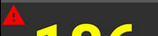
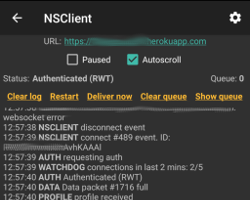

# AAPS 螢幕畫面

```{contents} Table of Contents :depth: 2

    <br />## The Homescreen
    
    
    
    This is the first screen you will come across when you open **AAPS**, and it contains most of the information that you will need day to day.
    
    ### Section A - Tabs
    
    * Navigate between the various **AAPS** modules.
    * Alternatively you can change screens by swiping left or right.
    * Displayed tabs can be selected in [config builder](../SettingUpAaps/ConfigBuilder.md#tab-or-hamburger-menu).
    
    ### Section B - Profile & target
    
    #### Current Profile
    
    The current profile is displayed in the left bar. 
    
    Short press profile bar to view profile details. Long press profile bar to [switch between different profiles](../DailyLifeWithAaps/ProfileSwitch-ProfilePercentage.md#profile-switch--profile-percentage).
    
    
    
    1. Regular display with a standard profile activation.
    2. Profile switch with a remaining duration of 59mn.
    3. Profile switch with a specific percentage of 120%.
    4. Profile switch with a specific percentage of 80% and a remaining duration of 59 mn.
    5. Profile switch with a time shift of -1 hour.
    6. Profile switch with a specific percentage of 120%, time shift of 1 hour, and a remaining duration of 59mn.
    
    #### Target
    
    
    
    Current target blood glucose level is displayed in the right bar.
    
    Short press target bar to set a **[Temporary Target](../DailyLifeWithAaps/TempTargets.md)**.
    
    If a temp target is set, the bar turns yellow and the remaining time in minutes is shown in brackets.
    
    #### Visualization of Dynamic target adjustment
    
    
    
    When using the [SMB algorithm](../SettingUpAaps/ConfigBuilder.md#aps) and [Autosens](../DailyLifeWithAaps/KeyAapsFeatures.md#autosens) functionality, **AAPS** can dynamically adjust your target based on sensitivity. 
    
    Enable either one or both of the following options in [Preferences > OpenAPS SMB settings](../SettingUpAaps/Preferences.md#openaps-smb-settings):
    
       * "sensitivity raises target" and/or 
       * "resistance lowers target" 
    
    If **AAPS** detects resistance or sensitivity, the target will change from what is set from profile. When it alters the target glucose, the background will change to green.
    
    ### Section C - BG & loop status
    
    #### Current blood glucose
    The latest blood glucose reading from your CGM is shown on the left side.
    
    The color of the BG value reflects the status to the defined [range](../SettingUpAaps/Preferences.md#range-for-visualization).
    
       * green = in range
       * red = below range
       * yellow = above range 
    
    The greyish block in the middle shows minutes since last reading and changes since last reading, in the last 15 and 40 minutes.
    
    #### Loop status
    
    
    
    On the right side, an icon shows the loop status:
    
    * Green circle = loop running
    * Green circle with dotted line = [low glucose suspend (LGS)](../SettingUpAaps/CompletingTheObjectives.md#objective-6-starting-to-close-the-loop-with-low-glucose-suspend)
    * Red circled = loop disabled (not working permanently)
    * Yellow circle = loop suspended (temporarily paused but basal insulin will be given) - remaining time is shown below icon
    * Grey circle = pump disconnected (temporarily no insulin dosage at all) - remaining time is shown below icon
    * Orange circle = super bolus running - remaining time is shown below icon
    * Blue circle with dotted line = open loop
    
    Short press or Long press the icon to open the Loop dialog to switch loop mode (Close, Low Glucose Suspend, Open or Disable), suspend / re-enable loop or disconnect / reconnect pump.
    
       * If short press on Loop icon, a validation is required after selection in Loop Dialog
    
       
    
    #### BG warning sign
    
    If for any reason, there are issues in the BG readings **AAPS** receives, you will get a warning signal beneath your BG number on the main screen.
    
    ##### Red warning sign: Duplicate BG data
    
    The red warning sign is signaling you to get active immediately: You are receiving **duplicate BG data**, which does avoid the loop to do its work right. Therefore, your loop will be disabled until it is resolved.
    
    ```{admonition} Your loop is not running
    :class: note
    Your loop is not running until you solve this issue !
    



你需要找出為什麼會收到重複的血糖資料：

* Is Dexcom bridge enabled on your Nightscout site? Disable the bridge by going to the administration panel of your Nightscout instance, edit the "enable" variable and remove the "bridge" part there. （有關 heroku 的[詳細資訊可以在此找到](https://nightscout.github.io/troubleshoot/troublehoot/#heroku-settings)。）
* Do multiple sources upload your BG to Nightscout? If you use the BYODA app, enable the upload in **AAPS** but do not enable it in xDrip+, if you use that.
* Do you have any followers that might receive your BG but do also upload it again to your Nightscout site?
* Last resort: In **AAPS**, go to [Preferences > NSClient](../SettingUpAaps/Preferences.md#nsclient), select the sync settings and disable the "Accept CGM data from NS" option.

To remove the warning immediately and get to loop running again, you need to manually delete a couple of entries from the Dexcom/xDrip+ tab.

然而，當有很多重複項目時，可能更容易

* [備份您的設定](../Maintenance/ExportImportSettings.md)，
* 在維護選單中重置你的資料庫，然後
* [再次匯入您的設定](../Maintenance/ExportImportSettings.md)

##### 黃色警告標誌

The yellow warning signal is indicating that your BG arrived in irregular time intervals or that some BGs are missing. When pressing the sign, the message indicates “Recalculated data used”.


通常你不需要採取任何行動。 閉環會繼續運作！

As a sensor change is interrupting the constant flow of BG data, a yellow warning sign after sensor change is normal and nothing to worry about.

Special note for Libre users:

* 每個 Libre 感應器每隔幾小時都會慢個一兩分鐘，這意味著你永遠無法獲得完美的定期血糖間隔。
* Also, jumpy readings interrupt the continuous flow.
* Therefore, the yellow warning sign will be 'always on' for Libre users.

*Note*: Up to 30h hours are taken into accord for **AAPS** calculations. 因此，即使你解決了問題，黃三角標誌可能會在最後一次不規則間隔發生後大約 30 小時內消失。

### D 區 - 胰島素、碳水化合物、基礎率與自動敏感性


**Syringe**: insulin on board (IOB) - amount of active insulin inside your body

* 如果僅運作標準基礎率，且沒有先前注射的胰島素剩餘，則 IOB 為零。 
* 如果最近有減少的基礎率，IOB 可能為負值。
* 按圖示可查看注射胰島素與基礎胰島素的分配情況。

* **Grain**: [carbs on board (COB)](CobCalculation) - yet unabsorbed carbs you have eaten before The icon pulses red if carbs are required (see [below](#carbs-required))

* **Purple line**: current basal rate. The icon changes to reflect temporary changes in basal rate (flat at 100%) 
   * 按圖示可查看基礎基礎率和任何臨時基礎率的詳細資訊（包括剩餘時間）。
* **Arrows up & down**: indicating actual [Autosens](KeyAapsFeatures#autosens) status (enabled or disabled) and value is shown below icon

#### 需要碳水化合物


當系統偵測到需要碳水化合物時，會提供碳水化合物建議。

This is when the oref algorithm thinks it can't rescue you by zero-temping, and you will need carbs to fix.

碳水化合物的通知會比注射計算機的通知更為精準。 你可能會看到碳水化合物建議，而注射計算機未顯示缺少的碳水化合物。

如果有需要，碳水化合物需求通知可以推送到 Nightscout，屆時會顯示並廣播公告。

### E 區 - 狀態指示燈


狀態指示燈為以下情況提供視覺警告：

* 輸注針頭的使用時間
* 胰島素的使用時間（儲液罐使用的天數）
* 儲液罐的剩餘容量（單位）
* 傳感器使用時間
* 電池使用時間及電量（百分比）

如果超過警告門檻值，數值將顯示為黃色。

如果超過危急門檻值警告，數值將顯示為紅色。

Settings can be changed in [Preferences > Overview > Status lights](../SettingUpAaps/Preferences.md#status-lights).

Depending on the pump you use, you may not have all of these icons.

### F 區 - 主圖表


The graph shows your blood glucose (BG) as read from your glucose monitor (CGM).

在操作標籤中輸入的筆記（如手指校準和碳水化合物輸入）以及設定檔切換也會顯示在此處。

Long press on the graph to change the timescale. 你可以選擇 6、12、18 或 24 小時。

綠色區域反應你的目標範圍。

Blue triangles show [SMB](KeyAapsFeatures#super-micro-bolus-smb) - if enabled in [Preferences > OpenAPS SMB](../SettingUpAaps/Preferences.md#openaps-smb-settings).

#### 啟用可選資訊

On the main graph, you can switch on these optional information:

* 預測
* 基礎率
* 活動 - 胰島素活動曲線

To show this information, click the triangle on the right side of the main graph. 對於主圖表，只有位於 "\---\---- 圖表 1 \---\----" 以上的三個選項可用。

    
    

#### 預測線

* **Orange** line: [COB](CobCalculation) (color is used generally to represent COB and carbs)
   
   This prediction line shows where your BG (not where COB itself!) will go based on the current **Profile** settings, assuming that the deviations due to carb absorption remain constant. 此線僅在有已知的 COB 時出現。

* **Dark blue** line: IOB (color is used generally to represent IOB and insulin)
   
   This prediction line shows what would happen under the influence of insulin only. For example if you dialed in some insulin and then didn’t eat any carbs.

* **淺藍色**線：零基礎率（如果設置了 0% 的臨時基礎率，預測血糖會怎麼變化）
   
   This prediction line shows how the BG trajectory line would change if the pump stopped all insulin delivery (0% TBR).
   
   *This line appears only when the [SMB](../SettingUpAaps/ConfigBuilder.md#aps) algorithm is used.*

* **深黃色**線: [未公告餐 (UAM)](../DailyLifeWithAaps/SensitivityDetectionAndCob.md#sensitivity-oref1)
   
   未輸入的餐點(UAM)表示偵測到由於用餐、腎上腺素或其他影響導致的血糖顯著上升。 Prediction line is similar to the **orange COB line**, but it assumes that the deviations will taper down at a constant rate (by extending the current rate of reduction).
   
   *This line appears only when the [SMB](../SettingUpAaps/ConfigBuilder.md#aps) algorithm is used.*

* **深橙色**線：aCOB（加速碳水化合物吸收）
   
   類似於 COB，但假設碳水化合物吸收率為每 5 分鐘 10 mg/dL（-0.555 mmol/l/5 分鐘）。 已棄用，實用性有限。
   
   *This line appears only when the older [AMA](../SettingUpAaps/ConfigBuilder.md#aps) algorithm is used.*

通常你的實際血糖曲線最終會位於這些線之間，或接近最符合你情況的假設。

#### 基礎率

一條**實心藍色**線顯示你的幫浦基礎胰島素輸送，並反應實際的輸送時間。

一條**虛線藍色**線顯示如果沒有暫時的基礎率調整（TBR），基礎率會是什麼。

When the standard basal rate is given, the area under the curve is shown in dark blue. When the basal rate is temporarily adjusted (increased or decreased), the area under the curve is shown in light blue.

#### 活動

一條**細黃色**線顯示胰島素的活動。

他基於胰島素在系統中的預期血糖降低，如果沒有其他因素（如碳水化合物）存在。

### G 區 - 其他圖表

你可以在主圖表下啟用最多四個其他圖表。

要開啟額外圖表的設定，點擊[主圖表](#section-f---main-graph)右側的三角形並向下滾動。


To add another graph check the box on the left side of its name (i.e. \---\---- Graph 1 \---\----).

Most users find the following configuration of additional graphs to be adequate :

* Graph 1 with IOB, COB, Sensitivity
* Graph 2 with Deviations and BGI.

#### 絕對胰島素

活動中的胰島素，包括注射**和基礎率**。

#### 活性胰島素(IOB)

顯示你體內的胰島素（= 體內的活動胰島素）。 包括注射胰島素和臨時的基礎率（**但不包括你設定檔中的基礎率**）。

如果在DIA期間沒有任何[SMB](KeyAapsFeatures#super-micro-bolus-smb)、沒有注射和沒有TBR，則這將為零。

如果沒有剩餘注射且長時間設置為零/低基礎率，IOB 可能為負值。

Decaying depends on your [DIA and insulin profile settings](../SettingUpAaps/YourAapsProfile.md).

#### 活性碳水化合物(COB)

顯示你體內的碳水化合物（= 活動中的，但尚未衰減的碳水化合物）。

Decaying depends on the [deviations the algorithm detects](../DailyLifeWithAaps/CobCalculation.md).

如果他偵測到碳水化合物吸收率高於預期，將注射胰島素，這將增加 IOB（多或少，取決於你的安全設置）。

#### 敏感性

顯示[自動感知](KeyAapsFeatures#autosens)檢測到的敏感度。

敏感性是運動、荷爾蒙等導致的對胰島素的敏感性計算結果。

#### Heart rate

This data may be available when using a [Garmin smartwatch](../UsefulLinks/WearOsSmartwatch.md#garmin).

#### 偏差

* **Grey** bars show a deviation due to carbs. 
* **Green** bars show that BG is higher than the algorithm expected it to be. 綠色條用來增加[自動感知](KeyAapsFeatures#autosens)的抵抗力。
* **Red** bars show that BG is lower than the algorithm expected. 紅色條用來增加[自動感知](KeyAapsFeatures#autosens)的敏感度。
* **Yellow** bars show a deviation due to UAM.
* **Black** bars show small deviations not taken into account for sensitivity

#### Blood Glucose Impact

This line shows the degree to which BG ‘should’ rise or fall based on insulin activity alone.


It is a good combination to display this line along with the Deviation bars. They share the same scale, but it is a different one than the other optional data, so it is a good idea to display them on a separate graph, as shown above. Comparing the BGI line and the Deviation bars is another way to understand how **BG** fluctuates. Here, at the time marked **1**, the Deviation bars are greater than the BGI line, indicating that BG is rising. Later, during the hours marked **2**, BGI and DEV are pretty much in line, indicating that BG is stable.

### H 區 - 按鈕


Buttons for Insulin, Carbs and Calculator are almost always visible. If the connection to the pump is lost, the insulin button will not be visible.

Other Buttons can be setup in [Preferences > Overview > Buttons](../SettingUpAaps/Preferences.md#buttons).

About using the Insulin, Carbs and Calculator buttons : If enabled in the [Preferences > Overview](../SettingUpAaps/Preferences.md#show-notes-field-in-treatments-dialogs), the **Notes** field allows you to enter text that will show on the main graph, and may be uploaded to Nightscout - depending on your settings for NS client.

#### 胰島素


To give a certain amount of insulin without using the [bolus calculator](#bolus-wizard).

By checking the box **Start eating soon TT**, you can automatically start your [eating soon temp target](../DailyLifeWithAaps/TempTargets.md#eating-soon-temp-target).

If you do not want to bolus through the pump but record an insulin amount (i.e. insulin given by pen) check the corresponding box. When checking this box, you get an additional field “Time offset”, that you can use to record an insulin injection made in the past.

You can use the buttons to quickly increase the insulin quantity. The increment values can be changed in the [Preferences > Overview > Buttons](../SettingUpAaps/Preferences.md#buttons).

#### 碳水化合物


記錄碳水化合物而不進行注射。

Certain [pre-set temporary targets](../DailyLifeWithAaps/TempTargets.md#hypo-temp-target) can be set directly by checking the box.

**Time offset**: When will you / have you been eaten carbs (in minutes).

**Duration**: To be used for ["extended carbs"](ExtendedCarbs)

You can use the buttons to quickly increase the carb amount. The increment values can be changed in the [Preferences > Overview > Buttons](../SettingUpAaps/Preferences.md#buttons).

#### 計算機

See Bolus Wizard [section below](#bolus-wizard).

#### 校準

發送校準至 xDrip+ 或打開 Dexcom 校準對話框。

Must be activated in [Preferences > Overview > Buttons](../SettingUpAaps/Preferences.md#buttons).

#### CGM

開啟 xDrip+。

Back button returns to **AAPS**.

Must be activated in [Preferences > Overview > Buttons](../SettingUpAaps/Preferences.md#buttons).

#### 快速嚮導

輕鬆輸入碳水化合物數量並設置計算基礎。

Details are set up in [Preferences > Overview > QuickWizard settings](../SettingUpAaps/Preferences.md#quick-wizard).

## 注射嚮導


When you want to make a meal bolus, this is where you will normally make it from.

### I 區

顯示計算出的注射劑量。

如果活性胰島素（IOB）的量已超過計算出的注射劑量，那麼他只會顯示仍然需要的碳水化合物數量。

### J 區

血糖 欄位通常會自動填充最新的 CGM 讀取值。 如果你沒有使用中的 CGM，則該欄位將保持空白。

In the **Carbs** field, you add your estimate of the amount of carbs - or equivalent - that you want to bolus for.

The **Corr** field is if you want to modify the end dosage for some reason.

The **Carb time** field is for pre-bolusing so you can tell the system that there will be a delay before the carbs are to be expected. 如果你是為之前的碳水化合物進行注射，你可以在此欄位中輸入負數。

**Eating reminder** : For carbs in the future, the alarm checkbox can be selected (and is by default when a time in the future is entered) so that you can be reminded at the given time, when to eat the carbs you have input into **AAPS**.


### K 區

**Profile** allows you to select a different profile than the current one, to make the calculation for the insulin required. This profile selection applies only for the current bolus, it is not a profile change.

**Super Bolus** is where the basal insulin for the next two hours is added to the immediate bolus and a zero TBR is issued for the following two hours to take back the extra insulin. The option only shows when "Enable Superbolus in wizard" is set in the [Preferences > Overview > Advanced Settings](../SettingUpAaps/Preferences.md#advanced-settings-overview). 其目的是更快地注射胰島素，希望減少血糖高峰。

詳情請查看[diabetesnet.com](https://www.diabetesnet.com/diabetes-technology/blue-skying/super-bolus/)。

### L 區

Details of the wizard's bolus calculation.

You can deselect any that you do not want to include, but you normally wouldn't want to.

For safety reasons the **TT box must be ticked manually**, if you want the bolus wizard to calculate based on an existing temporary target.

#### COB 和 IOB 的組合及其含義

* For safety reasons, the IOB box cannot be unticked when COB box is ticked as you might run the risk of too much insulin as **AAPS** is not accounting for what’s already given.
* If you tick COB and IOB, unabsorbed carbs that are not already covered with insulin + all insulin that has been delivered as TBR or SMB will be taken into account.
* If you tick IOB without COB, **AAPS** takes account of already delivered insulin but won’t cover that off against any carbs still to be absorbed. 這會導致“缺少碳水化合物”的提示。
* 如果你在餐後注射胰島素後，為了**額外食物**（如額外的甜點）再進行注射，最好取消勾選所有選項。 這樣只會加入新增的碳水化合物，因為主餐不一定會立刻被吸收，因此餐後的 IOB 和 COB 不會馬上精確匹配。


The box near the eye allows you to choose between the detailed view, with the numbers entering the calculation for each item, or the simple view with icons. Pressing on an icon will enable / disable this entry from the calculation.

#### 錯誤的 COB 偵測


If you see the warning above after using bolus wizard, **AAPS** has detected that the calculated COB value may be wrong. So, if you want to bolus again after a previous meal with COB, you should be aware of overdosing!

For details, see the hints on [COB calculation page](CobCalculation#detection-of-wrong-cob-values).

## 操作標籤


### 操作 - M 區

Button **[Profile switch](../DailyLifeWithAaps/ProfileSwitch-ProfilePercentage.md#profile-switch--profile-percentage)** as an alternative to pressing the [current profile](#section-b---profile--target) on homescreen.

Button **[Temporary target](../DailyLifeWithAaps/TempTargets.md)** as an alternative to pressing the [current target](#section-b---profile--target) on homescreen.

啟動或取消臨時基礎率的按鈕。 請注意，當設置了臨時基礎率時，按鈕將從“TEMPBASAL”變為“CANCEL x%”。

儘管[延伸注射](ExtendedCarbs#extended-bolus-and-why-they-wont-work-in-closed-loop-environment)在封閉循環環境中實際上無法運作，但有些人還是要求提供使用延伸注射的選項。

* 此選項僅適用於 Dana RS 和 Insight 幫浦。 
   * 閉環將自動停止並切換為開環模式，以運作延長注射。
   * 在使用此選項之前，務必閱讀[詳細資訊](ExtendedCarbs)。

### 護理入口 - N 區

Displays information on:

    * sensor age & level (battery percentage)
    * insulin age & level (units)
    * cannula age
    * pump battery age & level (percentage
    

Less information will be shown if **low resolution skin** is used ([Preferences > General > Skin](../SettingUpAaps/Preferences.md#skin)).

#### 傳感器電量（電池）

Works for CGM with an additional transmitter such as MiaoMiao 2. （技術上，傳感器必須將電量資訊傳送至 xDrip+。）

Thresholds can be set in [Preferences > Overview > Status lights](../SettingUpAaps/Preferences.md#status-lights).

If the sensor level is the same as the phone battery level, your xDrip+ version is probably too old and needs an update. (Needs xDrip+ nightly build Dec. 10, 2020 or newer.)

    
    

### 護理入口 - O 區

BG檢查、預備/填充、傳感器插入和幫浦電池更換是[N部分](#careportal---section-n)中顯示資料的基礎。

填充/注入允許你記錄幫浦部位和胰島素筒的更換。

O 區反應了 Nightscout 的護理入口功能。 因此，運動、公告和問題是特別的筆記形式。

### 工具 - P 區

#### 歷史瀏覽器

Allows you to ride back in **AAPS** history.

#### 每日總劑量(TDD)

每日總劑量 = 每日的注射量 + 基礎率

一些醫生（尤其是新使用幫浦者）使用 50:50 的基礎-注射比例。

Therefore, ratio is calculated as TDD / 2 * TBB (Total base basal = sum of basal rate within 24 hours).

其他人則更喜歡 TDD 的 32% 至 37% 範圍作為 TBB。

如同大多數此類經驗法則，這種方法的實際有效性有限。 注意：每個人的糖尿病狀況都不同！


## 胰島素設定檔


這顯示您在[配置建構器](../SettingUpAaps/ConfigBuilder.md#insulin)中選擇的胰島素的活動特徵。

The **purple** line shows how much insulin remains after it has been injected as it decays with time and the **blue** line shows how active it is. The important thing to note is that the decay has a **long tail**. If you have been used to manual pumping, you have probably been used to assuming that insulin decays over about 3.5 hours. However, when you are looping, the long tail matters as the calculations are far more precise and these small amounts add up when they are subjected to the recursive calculations in the **AAPS** algorithm.

有關不同類型的胰島素、他們的活性設定檔以及為什麼這些很重要的更多詳細討論，你可以閱讀這篇文章[暸解基於指數活性曲線的新 IOB 曲線](https://openaps.readthedocs.io/en/latest/docs/While%20You%20Wait%20For%20Gear/understanding-insulin-on-board-calculations.html#understanding-the-new-iob-curves-based-on-exponential-activity-curves)

你還可以在這裡閱讀一篇出色的部落格文章：[我們經常在使用的胰島素作用時間（DIA）上出錯的原因以及為什麼這很重要...](https://www.diabettech.com/insulin/why-we-are-regularly-wrong-in-the-duration-of-insulin-action-dia-times-we-use-and-why-it-matters/)

And even more at: [Exponential Insulin Curves + Fiasp](https://web.archive.org/web/20220630154425/http://seemycgm.com/2017/10/21/exponential-insulin-curves-fiasp/)

## 幫浦狀態


* 顯示幫浦狀態的不同資訊。 顯示的資訊取決於你的幫浦型號。
* 詳情請參見[幫浦頁面](../Getting-Started/CompatiblePumps.md)。

## 閉環、AMA / SMB

These tabs show details about the algorithm's calculations and why **AAPS** acts the way it does.

Calculations are run each time the system gets a fresh reading from the CGM.

有關更多詳細資訊，請參見[配置建構器頁面的APS部分](../SettingUpAaps/ConfigBuilder.md#aps)。

## 設定檔


設定檔包含有關你個人糖尿病設定的資訊：

    * DIA (Duration of Insulin Action)
    * IC or I:C: Insulin to Carb ratio
    * ISF: Insulin Sensitivity Factor
    * Basal rate
    * Target: Blood glucose level that you want **AAPS** to be aiming for
    

See the detailed **[Profile](../SettingUpAaps/YourAapsProfile.md)** page for more information.

## 自動化

See the dedicated page [here](../DailyLifeWithAaps/Automations.md).

## NSClient



This page displays the status of the connection with your Nightscout site.

Settings can be changed in [Preferences > NS Client](../SettingUpAaps/Preferences.md#nsclient).

如遇故障，請參考此[頁面](../GettingHelp/TroubleshootingNsClient.md)。

## 血糖來源 - xDrip+、BYODA...


Depending on your BG source settings, this tab is named differently.

Shows history of CGM readings and offers option to remove reading in case of failure (i.e. compression low) or duplicate readings.

## 治療

This view can be accessed by pressing the 3 dots on the right of the menu, then Treatments. It is not possible to show it in the main menu through the Config Builder. In this view, you can view and alter the history of the following treatments:

* Bolus & carbs
* [延長注射](../DailyLifeWithAaps/ExtendedCarbs.md#extended-bolus-and-switch-to-open-loop---dana-and-insight-pump-only)
* 臨時基礎率
* [臨時目標](../DailyLifeWithAaps/TempTargets.md)
* [設定檔切換](../DailyLifeWithAaps/ProfileSwitch-ProfilePercentage.md)
* Careportal: notes entered through action tab and notes in dialogues
* User entry: other notes that are not sent to Nightscout

In the last column, the data source for each line is displayed in blue. It can be :

* NS for Nightscout : the data comes from or has been recorded to Nightscout
* PH for Pump History : the data has been processed by the pump

### Bolus & carbs


On this tab you can view the bolus and carbs log. Each bolus (line **1** and **4**) shows the remaining associated IOB next to the insulin amount. The origin of the bolus can be either :

* Meal (manually entered though the Insulin, Quick Wizard or Bolus Wizard buttons)
* SMB, when using the SMB Functionnality

The carbs (line **2**) are only stored in Nightscout. If you have used the [Bolus Wizard](#bolus-wizard) to calculate insulin dosage, you can press the “Calc” text (line **3**) to show the details of how the bolus was calculated.

Depending on the pump used, insulin and carbs can be shown in one single line, or will result in multiple lines: one for the calculation detail, one for the carbs, one for the bolus itself.

The treatment tab can be used to correct faulty carb entries (*i.e.* you over- or underestimated carbs). Note that it is not possible to edit an existing entry, you need to follow the following process:

1. 在主畫面檢查並記住實際的 COB 和 IOB。
2. 根據幫浦的不同，在治療標籤中碳水化合物可能與胰島素一起顯示在同一行，或作為單獨的項目顯示（如 Dana RS）。
3. 移除碳水化合物數量錯誤的項目。 (最新版本在治療螢幕上有垃圾桶圖示。 按一下垃圾桶圖示，選擇要刪除的行，然後再次按垃圾桶圖示以完成刪除。)
4. 再次檢查主畫面上的 COB 以確保成功移除了碳水化合物。
5. 如果治療標籤中包含碳水化合物和胰島素的條目是單行的，請對 IOB 執行相同操作。
   
   → If carbs are not removed as intended, and you add additional carbs as explained here (6.), COB will be too high and that might lead to too high insulin delivery.

6. 透過主畫面的碳水化合物按鈕輸入正確的碳水化合物數量，並確保設置正確的事件時間。

7. 如果治療標籤中包含碳水化合物和胰島素的條目是單行的，你還必須添加胰島素的數量。 確保設置正確的事件時間，並在確認新條目後檢查主畫面上的 IOB。

### Temp Basal


The **temp basals** applied by the loop are shown here. When there is still an impact on the IOB for an entry, the information is shown in green. It can be:

* Positive IOB if the temp basal was higher than the one set in the Profile (line **2**)
* Negative IOB for a zero-temp or if the temp basal was lower than the one set in the Profile (line **1**)

Deleting the entries only affects your reports in Nightscout and will probably tamper your real IOB - it is not recommended.

On the left of a line, a red S means “Suspend” : it happens when basal is not currently delivered. This is a normal situation when in the process of changing a pod, for example.

### 臨時目標


The history of temporary targets can be seen here.

### Profile Switch


The history of profile switches can be seen here. You may see multiple entries each time you switch profile : line **1**, stored in Nightscout but not in Pump History, corresponds to the request of a profile switch made by the user. Line **2**, stored both in NS and PH, correspond to the actual switch.

Deleting the entries only affects your reports in Nightscout and will never actually change the current profile.

### Care portal


This tab shows all notes and alerts recorded in Nightscout.

## 歷史瀏覽器

This view can be accessed by pressing the 3 dots on the right of the menu, then History. It is not possible to put in the main menu through the Config Builder. It can also be accessed through a button at the bottom of the [Action tab](#action-tab).

Allows you to ride back in **AAPS** history.

## 設定檔助手

This view can be accessed by pressing the 3 dots on the right of the menu, then Profile Helper. It is not possible to put in the main menu through the Config Builder. The [Profile Helper](../SettingUpAaps/ProfileHelper.md) can help you:

* 從零開始為小孩建立個人設定
* 比較兩個設定檔
* 複製一份個人設定