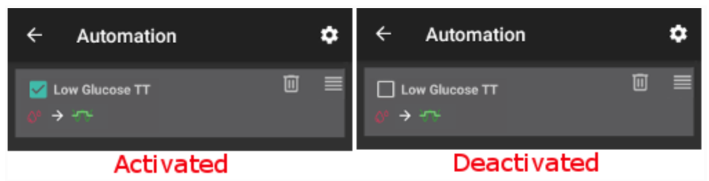
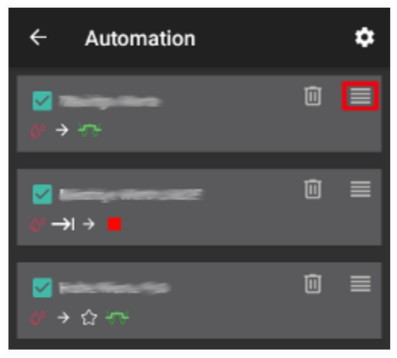

# 自動化

## 什麼是自動化？

「**自動化**」是 **AAPS** 的一項功能，他可以透過自動調整胰島素的供應來簡化使用者的糖尿病管理。 **自動化**允許**AAPS**根據個別使用者的需求進行高度個人化的設定。

一個**自動化**會根據一個或多個條件或觸發器來指示**AAPS**執行特定操作。 這可以是非經常性事件，例如低血糖或高血糖，一定量的負 IOB。 也可以是定期事件，例如在一天中的特定時間進行用餐或運動，或當使用者位於 GPS 位置或 Wi-Fi SSID 區域內。

有多種自動化選項，建議使用者在 **AAPS** 應用程式的自動化部分仔細研究。 你也可以在 **AAPS** 用戶群組（如**Facebook** 和 **Discord**）搜尋來自其他用戶的自動化範例。

## 自動化如何幫助你

1. **減少決策疲勞：** **自動化**的主要優勢是減輕使用者在 **AAPS** 中進行手動介入的負擔。 [研究](https://www.ncbi.nlm.nih.gov/pmc/articles/PMC6286423/#ref4)估計，1型糖尿病患者每天需要做出額外的180個決策。 **自動化**可以減輕心理負擔，釋放使用者的精神能量來處理生活中的其他事務。

1. **潛在改善血糖控制：**例如，**自動化**可以確保**臨時目標**在需要時自動設置，即使在忙碌或忘記的時候也能執行。 例如，如果一名患有糖尿病的孩子每週二上午10點和週四下午2點在學校有運動課程，並且這些活動開始前30分鐘需要執行高臨時目標，這些動作可以透過自動化來完成。

1. **讓 AAPS 高度自訂化**，以在特定情況下根據使用者偏好調整攻擊性。 例如，若在半夜出現負**IOB**，表明現有的設定過強，可以啟動臨時減少的個人化設定來解決。

以下範例說明了如何透過**自動化**來簡化步驟。 使用者已設置**自動化**，在清晨5點觸發「運動臨時目標」，以確保他們的**血糖**和**IOB**在6點運動前達到最佳狀態：


## 開始使用自動化前的關鍵考慮因素

1. 在設定**自動化**之前，你應該對**AAPS**有合理的血糖控制。 **自動化**不應用來補償次優的基礎胰島素、ISF 或 ICR 設定（在下文進一步討論）。 避免設置自動**檔案切換**來補償由於食物引起的血糖上升，這類情況應該用其他策略（如 SMBs 等）處理。

1. 與任何技術一樣，**CGM**、**幫浦**和**手機**都可能發生故障：技術問題或感測器錯誤可能會中斷**自動化**行動，並且可能需要手動介入。

1. **隨著日常習慣的變化，自動化需求也可能改變**。 當工作、學校或假期期間變更時，請在日曆中設置提醒，檢查目前啟動的自動化（他們很容易啟動和停用）。 例如，如果你外出度假，不再需要為學校運動或日常運動設定的自動化，或需要調整時間。

1. 自動化可能會相互衝突，建議在安全環境中仔細審查新的自動化設定，並暸解為什麼自動化可能未如預期啟動。

1. 如果使用 Autosense，請盡量使用**臨時目標**而非**檔案切換**。 **臨時目標**不會將 Autosens 重置為 0。 **檔案切換**會重置 Autosens。

1. 大多數自動化應僅設置為**有限的時間持續**，之後**AAPS**可以重新評估並在必要時重複自動化，如果條件仍然符合的話。 例如，「啟動 7.0 mmol/l 的臨時目標持續 30 分鐘」或「啟動 110% 檔案持續 10 分鐘」_和_「啟動 5.0 mmol/l 的臨時目標持續 10 分鐘」。 使用自動化來創造永久變更（如更強的%檔案）可能會增加低血糖風險。

## 何時可以開始使用自動化？

當你開始第10個目標時。

## AAPS 中的自動化在哪裡？

Depending on your [config builder](../SettingUpAaps/ConfigBuilder.md) settings, **Automation** is located either in the ‘hamburger’ menu or as a tab with **AAPS**.

## 如何設置自動化？

要設置**自動化**，請按照以下步驟在**AAPS**中建立一個「規則」：

* 為你的「規則」命名；
* 選擇至少一個「條件」；
* 選擇一個「動作」；
* 勾選正確的框以啟動**自動化**事件：


要停用**自動化**規則，請取消勾選**自動化**名稱左側的框。 以下範例顯示一個名為‘低血糖臨時目標’的**自動化**已啟動（勾選）或停用（未勾選）。




設置自動化時，你可以先透過啟動「通知」選項進行測試。 這會觸發**AAPS**首先顯示通知，而不是實際自動執行動作。 當你確認通知在正確的時間/條件下觸發時，可以更新**自動化**規則，將「通知」替換為「動作」。


```{admonition} Important note
:class: note

當循環被禁用時，自動化仍然是活躍的！
```


## 安全限制

針對**自動化**設置了安全限制：

* 血糖值必須介於 72 到 270 mg/dl（或 4 到 15 mmol/l）之間。
* 檔案百分比必須介於 70% 到 130% 之間。
* 自動化執行間隔必須至少 5 分鐘（包括首次執行）。

## 正確使用負值

```{admonition} Warning
:class: warning

在自動化中選擇負值時請小心
```

在**自動化**中的「條件」選擇‘小於’這類負值時，請務必謹慎。 例如：


**範例 1：**建立條件**「小於」**“-0.1”將：

觸發**自動化**，當任何數字**嚴格**小於-0.1時。 這包括如-0.2、-0.3、-0.4等數值。 請記住，-0.1 本身**不**包含在此條件內。 （條件「小於或等於 -0.1」_將會_包含 -0.1）。

**範例 2：**建立條件「大於 -0.1」將：

觸發**自動化**，當任何數字**大於**-0.1時。 這包括如 0、0.2、0.4 和任何其他正數。

在選擇這些條件和數值時，仔細考慮你的**自動化**的具體意圖非常重要。

## 自動化條件

使用者可以選擇多種「條件」。 以下列表並不完整：

**條件：**連線條件

**選項：**

多個條件可以透過以下方式鏈接：
* “和”
* “或”
* “互斥或”（這意味著如果只有一個條件成立，動作將會發生）

**條件：**時間與循環時間

**選項：**

* 時間 = 單次事件
* 循環時間 = 經常發生的事件（例如每週一次、每個工作日等）

**條件：**位置

**選項：**

* 在**組態建置工具**（自動化）中，使用者可以選擇所需的位置服務。

**條件：**位置服務

**選項：**

* 使用被動位置：**AAPS** 只會在其他應用程式請求位置時獲取位置。
* 使用網路位置：WiFi 的位置。
* 使用 GPS 定位（注意！ 這可能會導致過多的電池消耗！

## 動作

**動作：**啟動**臨時目標**

**選項：**

* **血糖**必須在 72 mg/dl 和 270 mg/dl（4 mmol/l 和 15 mmol/l）之間
* **臨時目標**只有在沒有前一個臨時目標時才能工作

**動作：**停止**臨時目標**

**選項：**

無

**動作：****檔案**百分比

**選項：**

* **檔案**必須在 70% 和 130% 之間
* 僅當之前的百分比是 100% 時工作

添加了「動作」後，應透過點擊並調整預設值將預設數值更改為所需的數字。


## 列表中的自動化順序很重要
 **AAPS**將根據偏好的順序，自**自動化**列表的頂部開始執行建立的規則。 例如，如果‘低血糖’**自動化**是最重要的**自動化**，那麼他應該位於使用者**自動化**列表的頂部，如下所示：


要重新排列**自動化**規則，請按住螢幕右側的四行按鈕。 透過移動規則上下來重新排序**自動化**。



## 如何刪除自動化規則

要刪除**自動化**規則，請點擊垃圾桶圖示。


## 自動化範例

以下是**自動化**範例。 在 Facebook 討論群組或 Discord 上，可以找到更多有關**自動化**的討論，以及用戶如何個性化他們的**自動化**。 以下範例不應被複製，除非使用者對**自動化**的運作方式有充分暸解。

### 低血糖臨時目標

這個**自動化**會在血糖低於特定門檻時自動觸發‘低血糖臨時目標’。


### 午餐時間臨時目標（包含「位置」）


這個**自動化**是為一名每天在工作時於相同時間吃午餐的用戶設置的，但僅在用戶位於設定的‘位置’時才觸發。  因此，如果某天用戶不在工作場所，則此自動化將被啟動。

這個**自動化**會在13:00設定低臨時目標（即將用餐），使血糖降至90mg（或5 mmol/l），以準備午餐。

透過輸入經緯度 GPS 座標來設置‘觸發’位置，如下所示：


由於‘和’連線，只有在‘選擇的時間’並且使用者位於設定位置時，**自動化**才會發生。

這個**自動化**不會在其他時間於該位置或在該時間超過設定100米 GPS 範圍內觸發。

### WIFI SSID 位置自動化

使用 WIFI SSID 是在特定 wifi 網路範圍內觸發**自動化**的良好選項（與 GPS 相比），其相對精準、耗電少，並且在 GPS 和其他位置服務可能無法使用的室內空間中也能正常運作。

這裡有另一個範例，設定工作日早餐前的**臨時目標**。


這個**自動化**將於週一至週五的上午 5:30 觸發 (2)  
當連線到家庭 wifi 網路時（3）。


然後將設置 75mg/dl 的**臨時目標**，持續 30 分鐘 (4)。 加入位置的好處之一是，如果用戶外出度假，則不會觸發此自動化。


以下是詳細的**自動化**觸發截圖：

1) 主「和」（兩個條件都需要滿足才能觸發） 1) 循環時間 = 週一至週五 上午 5:30  
1) WIFI SSID = My_Home_Wifi_Name


## 自動化日誌

**AAPS**會在螢幕底部的**自動化**標籤下顯示最近觸發的**自動化**日誌。

以下範例中，日誌顯示：

（1）凌晨 01:58，「低血糖觸發臨時低血糖檔案」被註冊
* 血糖值低於 75mg/dl；
* delta 是負值（即：血糖正在下降）；
* 時間範圍在凌晨 01:00 到 06:00 之間。

**自動化**將會：
* 設定**臨時目標**為 110mg/dl，持續 40 分鐘；
* 啟動 50% 的**臨時檔案**，持續 40 分鐘。

（2）凌晨 03:38，觸發了「夜間低血糖後高碳水化合物」自動化
* 時間範圍在凌晨 01:05 到 06:00 之間；
* 血糖值高於 110mg/dl。

**自動化**將會：
* 將**檔案**切換為 LocalProfile1（即：取消任何臨時檔案設定）
* 停止**臨時目標**（如果有的話）


## Troubleshooting

* 問題：__我的自動化沒有被 AAPS 觸發嗎？__

檢查**自動化**事件右側的框是否勾選，以確保規則已啟用。


* 問題：__我的自動化順序被錯誤地觸發了。__

檢查你的規則優先順序，如上所述。

## 自動化的替代方案

對於進階使用者，還有其他選擇，例如使用 IFTTT 或第三方 Android 應用程式 Automate 來自動化任務。 

