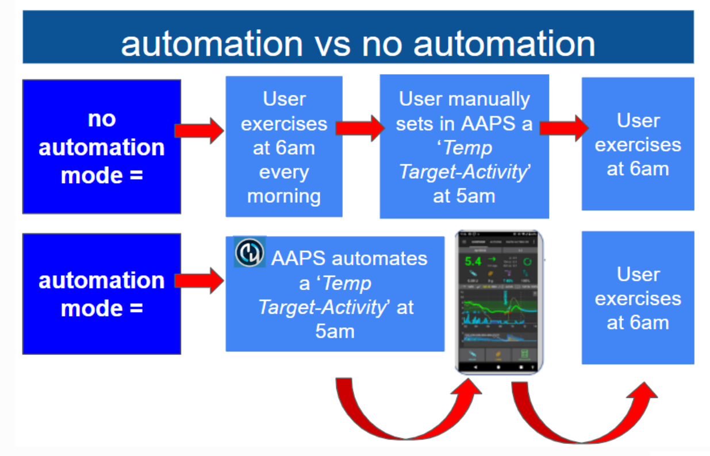

# 自動化

## 什麼是自動化？

"**自動化**" 是可自動執行 AAPS 任務的功能。

自動化根據一個或多個條件或觸發執行特定操作。 觸發可以包括不規則事件，如低或高血糖 (BG) 水準，或設定的負胰島素量 (IOB)。 自動化也可以處理定期事件，如某些時間的用餐或運動，或當使用者在特定 GPS 位置或 WIFI SSID 區域的特定距離內。 自動化可以根據時間表或每次 Pod 變更執行 AAPS 設定備份。

自動化規則可從自動化標籤中建立和修改。 每個規則由兩個屬性定義：

- 一個或多個開始行動的條件或“觸發”。

    思考某個時間表、一個事件或 AAPS 中的屬性值

- 一個或多個要執行的動作。

    例如鬧鐘、設定設定檔百分比或在 Pod 變更時匯出 AAPS 設定。


有各種各樣的自動化選項，鼓勵用戶在 AAPS 應用中的自動化進行研究。 你還可以在  和  上搜尋 AAPS 使用者群組，以獲得其他用戶的自動化範例。

## 自動化如何幫助你

1. **自動化定期任務：** 無需使用者互動自動執行程式化動作。

1. **減少決策疲勞：****自動化**的主要好處是使用戶免於在 **AAPS** 中進行手動干預的負擔。 [研究](https://www.ncbi.nlm.nih.gov/pmc/articles/PMC6286423/#ref4)估計，1型糖尿病患者每天需要做出額外的180個決策。 **自動化**可以減輕心理負擔，釋放使用者的精神能量來處理生活中的其他事務。

1. **潛在改善血糖控制：** 例如，即使在繁忙的行程或忘記時，**自動化**可以確保在需要時候設置 **臨時目標**。 例如，如果一位糖尿病兒童在每週二上午 10 點和每週四下午 2 點有校內體育活動，需要在活動前 30 分鐘執行高**臨時目標**('TT')，則可以通過**自動化**來啟動**臨時目標</0>。 </p></li>

1

**使 AAPS 可以高度自訂** ，並根據用戶的偏好，在特定情況下變得更積極或保守。 例如，在半夜出現負 **IOB** 時觸發一個暫時降低的 **設定檔** %，表示現有的 **設定檔** 可能過強。 </ol>

以下範例說明了如何透過**自動化**來簡化步驟。

用戶每天早上六點鍛鍊：他需要在早上五點在 AAPS 中手動設置 “臨時目標-活動”。


用戶已設置一個**自動化**，以在早上五點觸發“臨時目標-活動”，確保他們的**血糖**和**體內胰島素**處於最佳狀態，以備下午六點的鍛鍊：



## 開始使用自動化前的關鍵考慮因素

1. 在設置某些自動化之前，你應該對**BG**擁有合理的控制。 自動化不應用於彌補不理想的基礎胰島素量、**ISF** 或 **CR** 設置（稍後將進一步討論）。 避免設置自動**設定檔切換**來補償， _例如_ 食物引起的**血糖**升高，這些應透過其他策略處理（如 SMBs 等）。

1. 與任何技術一樣，**CGM**'s、**幫浦** 和手機都可能故障：技術問題或傳感器錯誤可能會干擾 **自動化** 動作，並可能需要手動干預。

1. **自動化的要求可能會隨著例行活動而變化**。 當在工作/學校/假期之間變換時，請在日曆中設置提醒，以便查看目前哪些**自動化**活動（這些活動易於啟用和停用）。 例如，如果你去度假，且不再需要為學校體育或日常運動設置的自動化，或需要調整時間。

1. **自動化** 之間可能會互相衝突，建議在安全的環境中仔細檢查任何新的**自動化**設定，並瞭解為什麼某個**自動化**可能未如你預期的方式觸發。

1. 如果使用 Autosens，請嘗試使用 **臨時目標** 而不是 **設定檔切換**。 **臨時目標**不會將 Autosens 重置為 0， 而**設定檔切換**會重置 Autosens。

1. 大多數**自動化**應僅設置為**有限時間**，之後 **AAPS** 可以重新評估並在必要時重複 **自動化**，如果條件仍然滿足。 例如，“設定 7.0 mmol/l 的臨時目標 30 分鐘”或“設定 **設定檔** 110% 10 分鐘”_和_ “設定 5.0 mmol/l 的臨時目標 10 分鐘”。 使用**自動化**來創造永久變更（例如強化的 % 設定檔）有導致低血糖的風險。

## 何時可以開始使用自動化？

通過**目標 10** 後，你將可以啟用**自動化**。

## AAPS 中的自動化在哪裡？

根據你的[組態建置工具 > 一般](../SettingUpAaps/ConfigBuilder.md)設置，**自動化**位於“漢堡”選單中或作為**AAPS**的標籤。

## 如何設置自動化？

要設置**自動化**，請按照以下步驟在**AAPS**中建立一個「規則」：


* 為你的「規則」命名；
* 至少選擇一個‘條件’；


* 選擇一個「動作」；


* 檢查 **自動化** 事件的右側方框是否被「勾選」以啟用 **自動化**：


要停用**自動化**規則，請取消勾選**自動化**名稱左側的框。 下面的範例顯示了一個標題為‘低血糖 TT’的 **自動化** 是被啟用（‘勾選’）還是停用（‘未勾選’）。


在設置 **自動化** 時，你可以先透過在「動作」裡的啟用「通知」選項進行測試。 這會觸發**AAPS**顯示通知，而不是自動執行動作。 當你確認通知在正確的時間/條件下觸發時，可以更新**自動化**規則，將「通知」替換為「動作」。


```{admonition} Important note
:class: note

**自動化**在循環關閉時仍然是有效的!
```


## 安全限制

針對**自動化**設置了安全限制：

* 血糖值必須介於 72 到 270 mg/dl（或 4 到 15 mmol/l）之間。
* **設定檔百分比** 必須在 70% 和 130% 之間。
* 自動化執行間隔必須至少 5 分鐘（包括首次執行）。

## 正確使用負值

```{admonition} Warning
:class: warning

在**自動化**中選擇負值時小心
```

在**自動化**中的「條件」選擇‘小於’這類負值時，請務必謹慎。 例如：


**範例 1：** 建立一個條件**"小於"** "-0.1mmol/l"（或 "-2mg/dl"）將會：

對於任何小於 -0.1（-2）的數字觸發**自動化**。 這包括像 -0.2、-0.3、-0.4（-4、-6、-8）等數字。 請記住，-0.1（-2）本身**並不**包含在此條件內。 (條件“等於或小於 -0.1mmol/l（-2 mg/dl）”_將_包含 -0.1 mmol/l 或 -2 mg/dl)。

**範例 2：** 建立條件“大於” -0.1mmol/l (-2mg/dl) 將會：

對於任何大於 -0.1mmol/l (-2mg/dl) 的數字觸發**自動化**。 這包括像 0、0.2、0.4mmol/l（0、4、8mg/dl）和任何其他正數字。

在選擇這些條件和數值時，仔細考慮你的**自動化**的具體意圖非常重要。

(automations-automation-triggers)=
## 自動化觸發器


用戶可以選擇各種“觸發”。 觸發是執行自動化所必須滿足的條件。 以下列表並不完整：

**觸發：** 連接條件

**選項：**

多個條件可以透過以下方式鏈接：
* “和”
* “或”
* “互斥或”（這意味著如果只有一個條件成立，動作將會發生）

**觸發：** 時間 vs. 重複時間

**選項：**

* 時間 = 單次事件
* 循環時間 = 經常發生的事件（例如每週一次、每個工作日等）

**觸發：** 位置

**選項：**

* 在**組態建置工具**（自動化）中，使用者可以選擇所需的位置服務。

**觸發：** 位置服務

**選項：**

* 使用被動位置：**AAPS** 只會在其他應用程式請求位置時獲取位置。
* 使用網路位置：你的 Wi-Fi 位置。
* 使用 GPS 定位（注意！ 這可能會導致過多的電池消耗！

**觸發器：** 幫浦和傳感器資料

* 插管時間觸發：所有幫浦均可用
* 胰島素時間觸發：支援幫浦可用
* 電池時間觸發：支援幫浦可用
* 傳感器時間觸發：始終可用
* Pod 註冊觸發：僅限貼片幫浦可用

請注意，對於所有與時間相關的觸發，平等比較不太可能觸發，因此在這種情況下需要兩個觸發來創建範圍

* 儲備液位觸發：所有幫浦均可用，且比較 "NOT\_AVAILABLE" 不適用於此觸發，因為值始終填入**AAPS**
* 幫浦電池電量觸發：支援幫浦可用，且比較 "NOT\_AVAILABLE" 不適用於此觸發，因為值始終填入**AAPS**

## 動作


**動作：**啟動**臨時目標**

**選項：**

* **血糖**必須在 72 mg/dl 和 270 mg/dl（4 mmol/l 和 15 mmol/l）之間
* **臨時目標**只有在沒有前一個臨時目標時才能工作

**動作：**停止**臨時目標**

**選項：**

無

**操作:** **設定檔百分比**

**選項：**

* **檔案**必須在 70% 和 130% 之間
* 僅在目前設定檔百分比為100%時有效

添加了「動作」後，應透過點擊並調整預設值，將預設數值更改為所需的數字。


(Automations-the-order-of-the-automations-in-the-list-matters)=
## 列表中**自動化**的順序非常重要
 **AAPS**將根據偏好的順序，由**自動化**列表由上往下開始執行規則。 例如，如果‘低血糖’ **自動化** 是最重要的**自動化**，高於所有其他規則，那麼這**自動化**應該在用戶的**自動化**列表中出現在最上方，如下所示：


要重新排列**自動化**規則，請長按螢幕右側的四條線按鈕。 透過移動規則上下來重新排序**自動化**。


## 如何刪除自動化規則

要刪除**自動化**規則，請點擊垃圾桶圖示。


## 自動化範例

以下是**自動化**範例。 在 Facebook 討論群組或 Discord 上，可以找到更多有關**自動化**的討論，以及用戶如何個性化他們的**自動化**。 以下範例不應被複製，除非使用者對**自動化**的運作方式有充分暸解。

### 低血糖臨時目標

這個**自動化**會在血糖低於特定門檻時自動觸發‘低血糖臨時目標’。


### 午餐時間臨時目標（包含「位置」）


這個**自動化**是為一名每天在工作時於相同時間吃午餐的用戶設置的，僅僅在用戶位於設定的‘位置’時才觸發。  因此，如果使用者某一天不在原定的位置工作，這個**自動化**將不會啟動。

此**自動化**將於13:00設置一個低**暫時目標**（即將用餐），以將‘血糖’的值驅動至90mg（或5 mmol/l），準備用餐。

透過輸入經緯度 GPS 座標來設置‘觸發’位置，如下所示：


由於‘和’連線，只有在‘選擇的時間’並且使用者位於設定位置時，**自動化**才會發生。

該**自動化**將不會在該地點或設置的 GPS 坐標 50 米以外的時間觸發。

### WIFI SSID 位置自動化

使用 WIFI SSID 是在特定 wifi 網路範圍內觸發**自動化**的一個好用的選項（與 GPS 相比），其相對精準、耗電少，並且在 GPS 和其他位置服務可能無法使用的室內空間中也能正常運作。

這裡有另一個範例，設定工作日早餐前的**臨時目標**。


這個**自動化**將於週一至週五的上午 5:30 觸發 (2)  
當連線到家庭 wifi 網路時（3）。


然後會在30分鐘內設置**暫時目標**為75mg/dl（4）。 加入位置的好處是，如果用戶外出度假，則不會觸發此自動化。


以下是詳細說明**自動化**觸發條件的截圖：

1) 在主要的“和”之下（需要滿足兩個條件才能觸發） 1) 週期性時間 = M,T,W,T,F 在凌晨5:30  
1) WIFI SSID = My_Home_WiFi_Name


(automating-preference-settings-export)=

## 自動化偏好設定匯出

### 不需人員監控的匯出：排程（每日）

顯示自動化觸發條件的截圖：

1) 條件：重複時間 = 週一、週二、週三、週四、週五 上午 8:00 1) 操作：設定匯出（在「治療中的文字」中輸入「每日」）


注意：匯出執行將記錄在照護入口上

### 不需人員監控的匯出：Pod 註冊（僅限修補版幫浦）

顯示自動化觸發條件的截圖：

1) 條件：Pod 註冊 1) 操作：設定匯出（在「治療中的文字」中輸入「Pod 註冊：設定匯出」）


注意：匯出執行將記錄在照護入口上. 注意：如果你在此之前未執行手動設定匯出，自動化將**完全不會**觸發。 請參見[偏好設定 > 維護](#preferences-maintenance-settings)以正確啟用自動設定匯出。


## 自動化日誌

**AAPS**會在螢幕底部的**自動化**標籤下顯示最近觸發的**自動化**日誌。

以下範例中，日誌顯示：

（1）凌晨 01:58，「低血糖觸發臨時低血糖設定檔」被註冊
* 血糖值低於 75mg/dl；
* delta 是負值（即：血糖正在下降）；
* 時間範圍在凌晨 01:00 到 06:00 之間。

**自動化**將會：
* 設定**臨時目標**為 110mg/dl，持續 40 分鐘；
* 啟動 50% 的**臨時檔案**，持續 40 分鐘。

（2）凌晨 03:38，觸發了「夜間低血糖後高碳水化合物」自動化
* 時間範圍在凌晨 01:05 到 06:00 之間；
* 血糖值高於 110mg/dl。

**自動化**將會：
* 將**設定檔**切換為 LocalProfile1（即：取消任何臨時檔案設定）
* 停止**臨時目標**（如果有的話）


## 問題排除

* 問題：__我的自動化沒有被 AAPS 觸發嗎？__

檢查**自動化**事件右側的框框是否勾選，以確保規則已啟動。

## 問題排除


* 問題：__我的自動化順序不正確的觸發。__

檢查你的規則優先順序，如上所述。

## 自動化的替代方案

對於進階使用者，還有其他選擇，例如使用 IFTTT 或第三方 Android 應用程式 Automate 來自動化任務。 
