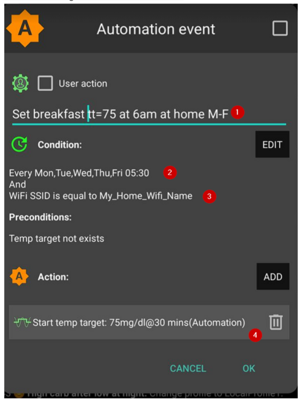

# 自動化

## 什麼是自動化？

"**Automation**" is a feature within **AAPS** which can simplify a user’s diabetes management by making automatic changes to insulin delivery in order to fit within the individual's lifestyle needs.

An **Automation** instructs **AAPS** to carry out a specific action 'automatically' as a result of one or more conditions or triggers. This can be for irregular episodic events, like low or high **BG**, a set amount of negative **IOB**. It can also be for reoccurring events, for example a meal or exercise at a certain time of day, or when the user is located within a certain distance of GPS location or WIFI SSID area.

There are a wide range of **Automation** options, and users are encouraged to study these within the **AAPS** app, in the **Automation** section. You can also search the **AAPS** user groups on **Facebook** and **Discord** for **Automation** examples from other users.

## 自動化如何幫助你

1. **Decreasing decision fatigue:** The primary benefit of **Automations** is to relieve the user from the burden of having to make manual interventions in **AAPS**. [研究](https://www.ncbi.nlm.nih.gov/pmc/articles/PMC6286423/#ref4)估計，1型糖尿病患者每天需要做出額外的180個決策。 **自動化**可以減輕心理負擔，釋放使用者的精神能量來處理生活中的其他事務。

1. **Potentially improving glycemic control:** for example, **Automations** can help ensure **Temp Targets** are always set when needed, even during busy schedules or periods of forgetfulness. For example, if a child with diabetes has sports scheduled at school on Tuesdays at 10am and Thursdays at 2pm and requires a high Temp Target ('TT') actioned 30 minutes before the sports activity, the **Temp Target** can be enabled by way of an **Automation**.

1. **Enabling AAPS to be highly customised** to be more or less aggressive in specific situations, according to a user's preference. For example, triggering a temporary reduced **Profile** % for a set period of time if negative **IOB** develops in the middle of the night, indicating that the existing **Profile** may be too strong.

以下範例說明了如何透過**自動化**來簡化步驟。 The user has set an **Automation** to trigger a 5am ‘Temp Target Exercise’ to ensure their **BG** and **IOB** are optimal, in preparation for their 6 am exercise:


## 開始使用自動化前的關鍵考慮因素

1. Before setting up an **Automation**, you should have reasonable **BG** control with **AAPS**. **Automations** should not be used to compensate for sub-optimal basal, **ISF** or **CR** settings (discussed further below). Avoid setting an automated **Profile switch** to compensate for **BG** rises due to _e.g._ food, these are better dealt with via other strategies (SMBs etc).

1. As with any technology, **CGMs**, **Pumps** and phones can malfunction: Technical issues or sensor errors can disrupt the **Automation** actions, and manual intervention may be needed.

1. **Requirements for **Automations** are likely to change as routines change**. When changing between work/school/holiday periods, set a reminder in your calendar to review which **Automations** are currently active (they are easy to activate and de-activate). For example, if you go on holiday, and no longer need a Automation set up for school sports or daily exercise, or need to adjust the timings.

1. **Automations** may conflict with each other, and it is good to review any new **Automation(s)** setting carefully in a safe environment, and understand why an **Automation** may or may not have triggered in the way you expect.

1. If using Autosens, try to use **Temp Targets** instead of **Profile Switches**. **臨時目標**不會將 Autosens 重置為 0。 **檔案切換**會重置 Autosens。

1. Most **Automations** should only be set for a **limited time duration**, after which **AAPS** can re-evaluate and repeat the **Automation**, if necessary, and if the condition is still met. For example, "start temp target of 7.0 mmol/l for 30 min" or "start **Profile** 110% for 10 min" _and_ "start temp target of 5.0 mmol/l for 10 min". Using **Automations** to create permanent changes (e.g. to stronger %profile) risks hypoglycemia.

## 何時可以開始使用自動化？

**Automations** can be started in **objective 10**.

## AAPS 中的自動化在哪裡？

根據你的[組態建置工具](../SettingUpAaps/ConfigBuilder.md)設定，**自動化**位於‘漢堡選單’中或作為**AAPS**的一個標籤頁。

## 如何設置自動化？

要設置**自動化**，請按照以下步驟在**AAPS**中建立一個「規則」：

* give your ‘rule’ a title;
* select at least one ‘Condition’; and
* select one ‘Action’;
* check the right box to the **Automation** event is ‘ticked’ to activate the **Automation**:


要停用**自動化**規則，請取消勾選**自動化**名稱左側的框。 The example below shows an **Automation** entitled ‘Low Glucose TT’ as either activated (‘ticked') or deactivated (‘unticked’).


When setting up an **Automation**, you can first test it by activating the ‘notification’ option under "Actions". 這會觸發**AAPS**首先顯示通知，而不是實際自動執行動作。 當你確認通知在正確的時間/條件下觸發時，可以更新**自動化**規則，將「通知」替換為「動作」。


```{admonition} Important note
:class: note

**Automations** are still active when the Loop is disabled!
```


## 安全限制

針對**自動化**設置了安全限制：

* 血糖值必須介於 72 到 270 mg/dl（或 4 到 15 mmol/l）之間。
* The **Profile Percentage** has to be between 70% and 130%.
* 自動化執行間隔必須至少 5 分鐘（包括首次執行）。

## 正確使用負值

```{admonition} Warning
:class: warning

Please be careful when selecting a negative value in **Automation**
```

在**自動化**中的「條件」選擇‘小於’這類負值時，請務必謹慎。 例如：


**範例 1：**建立條件**「小於」**“-0.1”將：

觸發**自動化**，當任何數字**嚴格**小於-0.1時。 這包括如-0.2、-0.3、-0.4等數值。 請記住，-0.1 本身**不**包含在此條件內。 （條件「小於或等於 -0.1」_將會_包含 -0.1）。

**範例 2：**建立條件「大於 -0.1」將：

觸發**自動化**，當任何數字**大於**-0.1時。 這包括如 0、0.2、0.4 和任何其他正數。

在選擇這些條件和數值時，仔細考慮你的**自動化**的具體意圖非常重要。

## 自動化條件

使用者可以選擇多種「條件」。 以下列表並不完整：

**條件：**連線條件

**選項：**

多個條件可以透過以下方式鏈接：
* “和”
* “或”
* “互斥或”（這意味著如果只有一個條件成立，動作將會發生）

**條件：**時間與循環時間

**選項：**

* 時間 = 單次事件
* 循環時間 = 經常發生的事件（例如每週一次、每個工作日等）

**條件：**位置

**選項：**

* 在**組態建置工具**（自動化）中，使用者可以選擇所需的位置服務。

**條件：**位置服務

**選項：**

* 使用被動位置：**AAPS** 只會在其他應用程式請求位置時獲取位置。
* Use network location: Location of your Wi-Fi.
* 使用 GPS 定位（注意！ 這可能會導致過多的電池消耗！

## 動作

**動作：**啟動**臨時目標**

**選項：**

* **血糖**必須在 72 mg/dl 和 270 mg/dl（4 mmol/l 和 15 mmol/l）之間
* **臨時目標**只有在沒有前一個臨時目標時才能工作

**動作：**停止**臨時目標**

**選項：**

無

**Actions:** **Profile Percentage**

**選項：**

* **檔案**必須在 70% 和 130% 之間
* works only if the previous Percentage is 100%

添加了「動作」後，應透過點擊並調整預設值將預設數值更改為所需的數字。


## The order of the **Automations** in the list matters
 **AAPS**將根據偏好的順序，自**自動化**列表的頂部開始執行建立的規則。 例如，如果‘低血糖’**自動化**是最重要的**自動化**，那麼他應該位於使用者**自動化**列表的頂部，如下所示：


To reprioritize the **Automation** rules, click and hold the four-lines-button on the right side of the screen. 透過移動規則上下來重新排序**自動化**。


## 如何刪除自動化規則

要刪除**自動化**規則，請點擊垃圾桶圖示。


## 自動化範例

以下是**自動化**範例。 在 Facebook 討論群組或 Discord 上，可以找到更多有關**自動化**的討論，以及用戶如何個性化他們的**自動化**。 以下範例不應被複製，除非使用者對**自動化**的運作方式有充分暸解。

### 低血糖臨時目標

這個**自動化**會在血糖低於特定門檻時自動觸發‘低血糖臨時目標’。


### 午餐時間臨時目標（包含「位置」）


這個**自動化**是為一名每天在工作時於相同時間吃午餐的用戶設置的，但僅在用戶位於設定的‘位置’時才觸發。  So if the user is not at work one day, this **Automation** will be activated.

This **Automation** will set a low **Temp Target** (Eating Soon) at 13:00 to drive ‘BG, to 90mg (or 5 mmol/l) in preparation for lunch.

透過輸入經緯度 GPS 座標來設置‘觸發’位置，如下所示：


由於‘和’連線，只有在‘選擇的時間’並且使用者位於設定位置時，**自動化**才會發生。

這個**自動化**不會在其他時間於該位置或在該時間超過設定100米 GPS 範圍內觸發。

### WIFI SSID 位置自動化

使用 WIFI SSID 是在特定 wifi 網路範圍內觸發**自動化**的良好選項（與 GPS 相比），其相對精準、耗電少，並且在 GPS 和其他位置服務可能無法使用的室內空間中也能正常運作。

這裡有另一個範例，設定工作日早餐前的**臨時目標**。


這個**自動化**將於週一至週五的上午 5:30 觸發 (2)  
當連線到家庭 wifi 網路時（3）。


It will then set a **Temp Target**  of 75mg/dl for 30 minutes (4). 加入位置的好處之一是，如果用戶外出度假，則不會觸發此自動化。



Here is the screenshot detailing the **Automation** triggers:

1) Under the main “AND” (both conditions need to be met to trigger) 1) Recurring time = M,T,W,T,F At 5:30am  
1) WIFI SSID = My_Home_WiFi_Name


## 自動化日誌

**AAPS**會在螢幕底部的**自動化**標籤下顯示最近觸發的**自動化**日誌。

以下範例中，日誌顯示：

（1）凌晨 01:58，「低血糖觸發臨時低血糖檔案」被註冊
* 血糖值低於 75mg/dl；
* delta 是負值（即：血糖正在下降）；
* 時間範圍在凌晨 01:00 到 06:00 之間。

**自動化**將會：
* 設定**臨時目標**為 110mg/dl，持續 40 分鐘；
* 啟動 50% 的**臨時檔案**，持續 40 分鐘。

（2）凌晨 03:38，觸發了「夜間低血糖後高碳水化合物」自動化
* 時間範圍在凌晨 01:05 到 06:00 之間；
* 血糖值高於 110mg/dl。

**自動化**將會：
* 將**檔案**切換為 LocalProfile1（即：取消任何臨時檔案設定）
* 停止**臨時目標**（如果有的話）


## 問題排除

* 問題：__我的自動化沒有被 AAPS 觸發嗎？__

Check the box to the right of **Automation** event is ‘ticked’ to ensure the rule is activated.

## 問題排除


* 問題：__我的自動化順序被錯誤地觸發了。__

檢查你的規則優先順序，如上所述。

## Alternatives to Automations

對於進階使用者，還有其他選擇，例如使用 IFTTT 或第三方 Android 應用程式 Automate 來自動化任務。 
