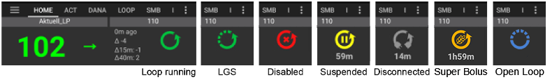

# AAPS 的主要功能

## 循環模式

循環狀態會在主畫面以下列其中一個圖示顯示。

**AAPS** 提供數種循環模式，例如開放循環（7）、封閉循環（1）與低血糖暫停（LGS - 2）。

請參閱 [AAPS 畫面 > 主畫面 > 循環狀態](#AapsScreens-loop-status) 以了解如何選擇循環模式。

(KeyAapsFeatures-OpenLoop)=

### 開放循環

**AAPS**持續評估所有可用資料（IOB、COB、BG...）並在必要時提供治療建議（臨時基礎率），告訴你如何調整治療。

這些建議不會自動執行（如封閉迴路）。 建議必須由使用者手動輸入到幫浦中（如果使用虛擬幫浦）或透過按鈕輸入，如果**AAPS**連接到真實幫浦。

此選項是用於了解**AAPS**的運作方式或如果你使用不支援的幫浦。 無論你在這裡做出什麼選擇，直到**[目標5](#objectives-objective5)**結束之前，你都將處於開放迴路中。

(KeyAapsFeatures-LGS)=

### 低血糖暫停 (LGS)

在此模式中，[maxIOB](#Open-APS-features-maximum-total-iob-openaps-cant-go-over) 設定為零。

這意味著如果血糖下降，**AAPS** 可以為你減少基礎胰島素。 但是，如果血糖上升，則不會進行自動校正。 你的基礎率將保持在你當前**設定檔**中定義的值。 只有當 IOB（來自先前的低血糖暫停）為負值時，才會額外注射胰島素來降低**血糖**。

此模式自 **[目標 6](#objectives-objective6)** 起可用。

(KeyAapsFeatures-ClosedLoop)=

### 閉合循環

**AAPS** 持續評估所有可用的資料（IOB、COB、血糖……）並在必要時自動調整治療（*即* 無需你進一步干預）以達到設定的 [目標範圍或數值](#profile-glucose-targets) （注射給藥、臨時基礎率、停用胰島素以避免低血糖等）。

閉環系統在多個安全限制內運行，可以個別設置。

閉環系統僅在你達到 **[目標 7](#objectives-objective7)** 或更高時，並使用支援的幫浦時才能使用。

(Open-APS-features-autosens)=

## 自動敏感度調整 (Autosens)

- Autosens 是一種算法，可以觀察血糖的偏差（正/負/中性）。
- 他會根據這些偏差，試圖找出你對胰島素的敏感度或抗性。
- 在 **OpenAPS** 中的 oref 實作，基於過去 24 小時和 8 小時的資料運作。 他會使用其中較敏感的資料來進行調整。
- 在**AAPS 2.7**之前的版本中，用戶必須手動選擇 8 或 24 小時。
- 從**AAPS 2.7**開始，Autosens 在**AAPS**中將在 24 小時和 8 小時窗口之間切換以計算敏感度。 它將選擇較為敏感的那一種。 
- 如果用戶曾經使用過 oref1，他們可能會注意到系統對變化的反應可能不如預期動態，這是由於 24 小時或 8 小時敏感度的不同。
- 更換套管或更改設定檔時，會將 Autosens 比例重置回 100%（設定檔持續時間切換不會重置 Autosens）。
- Autosens 會調整你的基礎胰島素和胰島素敏感因子（ISF），模仿設定檔切換的效果。
- 如果在一段延長的時間內不斷攝取碳水化合物，Autosens 在該期間的效果會較差，因為碳水化合物不包括在**BG**變化量的計算中。

(Open-APS-features-super-micro-bolus-smb)=

## 超微量注射 (Super Micro Bolus, SMB)

**SMB**，**超微量注射**的簡稱，是自 2018 年起於 Oref1 算法中引入的 OpenAPS 功能。 與**AMA**不同，**SMB**並不使用臨時基礎率來控制葡萄糖水平，而主要使用**小型超微量注射**。 在**AMA**會使用臨時基礎率添加 1.0 IU 胰島素的情況下，**SMB**則會以**5 分鐘的間隔**在小步驟中提供多次超微量注射，例如 0.4 IU、0.3 IU、0.2 IU 和 0.1 IU。 同時（為了安全），實際基礎率會在一段時間內設為 0 IU/h，以防止過量注射（稱為 **“零臨時基礎率”**）。 這使得系統能夠比**AMA**中的臨時基礎率增加更快速地調整血糖。

感謝 SMB，對於僅含“緩慢”碳水化合物的餐點，可能只需通知系統計畫中的碳水化合物量，並將其餘的留給**AAPS**。 然而，這可能會導致餐後血糖高峰，因為無法提前注射。 或者如果有必要的話，你可以進行預先注射，給予**開始注射**，此注射**僅部分**覆蓋碳水化合物（例如預估量的 2/3），並讓**SMB**提供其餘的胰島素。

SMBs 以藍色三角形的形式顯示在主圖中。 點擊三角形可以查看注射的胰島素量，或使用 [治療選單](#aaps-screens-treatments)。

**SMB 的** 功能包含一些安全機制：

1. **單次最大的 SMB 劑量**  
    單次最大的 SMB 劑量只能是以下最小值：
    
    - 基於目前基礎率（由 Autosens 調整）的數值，對應於 "限制 SMB 的最大臨時基礎率分鐘數" 中設定的持續時間，例如接下來 30 分鐘的基礎量，或
    - 目前所需胰島素量的一半，或
    - 設定中的最大可用胰島素 (maxIOB) 剩餘部分。

2. **低臨時基礎速率**  
    低臨時基礎速率（稱為「低臨時」）或臨時基礎速率為 0 U/h（稱為「零臨時」）在 **SMB** 中會更常被啟動。 這是出於安全理由的設計，若 **設定檔** 正確設定，則沒有任何負面影響。 在主圖上，IOB 曲線（黃色細線）比臨時基礎速率的變化更有意義。

3. **未通報的餐點**  
    額外計算以預測血糖的變化，例如透過 **UAM**（未通報的餐點）。 即使用戶未手動輸入碳水化合物，**UAM** 也能自動檢測因餐點、腎上腺素或其他影響導致的血糖水平顯著上升，並嘗試透過 **SMB** 進行調整。 為了安全起見，這也能反向運作，如果血糖意外快速下降，系統可以提前停止 SMB。 這就是為什麼 UAM 應該在 SMB 中始終處於啟用狀態的原因。

**你必須開始使用[目標 9](#objectives-objective9)來使用 SMB。**

另請參見：

- [OpenAPS 關於 SMB 的文件](https://openaps.readthedocs.io/en/latest/docs/Customize-Iterate/oref1.html#understanding-super-micro-bolus-smb)。
- [OpenAPS oref1 SMB 的文件](https://openaps.readthedocs.io/en/latest/docs/Customize-Iterate/oref1.html)
- [Tim 關於 SMB 的資訊](https://www.diabettech.com/artificial-pancreas/understanding-smb-and-oref1/)。

OpenAPS SMB 的設定如下。

(Open-APS-features-max-u-h-a-temp-basal-can-be-set-to)=

### 臨時基礎可以設置的最大 U/h

此安全設定決定了胰島素幫浦所能提供的最大臨時基礎率。 這也被稱為 **最大基礎**。

該值以每小時單位（U/h）測量。 建議將此設為合理的數值。 設置此參數的良好建議為：

**MAX-BASAL = 最高基礎速率 × 4**

例如，如果你的設定檔最高基礎率為0.5 U/h，你可以將他乘以4得到2 U/h的值。

**AAPS** 會依照 [偏好設定 > 治療安全 > 患者類型](#preferences-patient-type) 的「規定上限」。 規定上限如下：

- 兒童：2
- 青少年：5
- 成人：10
- 胰島素抗性成人：12
- 孕婦：25

*請參閱 [規定上限總覽](#Open-APS-features-overview-of-hard-coded-limits)。*

(Open-APS-features-maximum-total-iob-openaps-cant-go-over)=

### 最大總 IOB 是 OpenAPS 不可超過的上限

這個數值決定了**體內胰島素**（基礎與注射的體內胰島素）在運行閉環模式下**AAPS**所維持的最大值。 這也被稱為**maxIOB**。

如果當前的體內胰島素（例如在用餐注射後）高於定義的值，循環將停止給藥胰島素，直到體內胰島素限制低於設定的值。

設置此參數的一個好做法是：

    maxIOB = 平均餐前注射 + 3倍最大每日基礎量
    

當調整你的**max-IOB**時，要小心和耐心。 每個人的情況都不同，這也可以依賴於平均每日總劑量（TDD）。

**AAPS** 會依照 [偏好設定 > 治療安全 > 患者類型](#preferences-patient-type) 的「規定上限」。 規定上限如下：

- 兒童：3
- 青少年：7
- 成人：12
- 胰島素抗性成人：25
- 孕婦：40

*請參閱 [規定上限總覽](#Open-APS-features-overview-of-hard-coded-limits)。*

注意：使用**SMB**時，**max-IOB**的計算方式與AMA不同。 在**AMA**中，maxIOB是基礎**體內胰島素**的安全參數，而在SMB模式中，它也包括注射的體內胰島素。

詳細請參見[OpenAPS的SMB文檔](https://openaps.readthedocs.io/en/latest/docs/Customize-Iterate/oref1.html#understanding-super-micro-bolus-smb)。

### 啟用動態敏感度

這是[動態胰島素敏感度](../DailyLifeWithAaps/DynamicISF.md)功能。 啟用後，新的設定將可用。 設定在[動態胰島素敏感度](#dyn-isf-preferences)頁面上說明。

### 使用自動敏感度功能

這是[自動敏感度調整](#Open-APS-features-autosens)功能。 使用 DynamicISF 時，無法使用 Autosens，因為它們是兩種調整相同變數（敏感度）的不同演算法。

Autosens 會觀察血糖的偏差（正向/負向/中性）。 它會根據這些偏差來判斷你對敏感度的適應力，並根據這些偏差調整基礎率和 ISF。

啟用後，新的設定將可用。

#### 敏感度提升目標

如果啟用此選項，當偵測到敏感度（低於 100%）時，敏感度檢測（autosens）可以提高目標。 在這種情況下，您的目標將根據檢測到的敏感度百分比而提高。

如果因為敏感度檢測而調整目標值時，會在你的主螢幕上以綠色背景顯示。

當“啟用動態敏感度”或“啟用 Autosens 功能”中的任一選項被啟用時，將提供此設定。

#### 抗性降低目標

如果啟用此選項，當偵測到抗性（超過 100%）時，敏感度檢測（autosens）可以降低目標。 在這種情況下，您的目標將根據檢測到的抗性百分比而降低。

當“啟用動態敏感度”或“啟用 Autosens 功能”中的任一選項被啟用時，將提供此設定。

### 啟用 SMB

啟用此功能以使用 SMB 功能。 如果停用，將不會給予**SMBs**。

啟用後，新的設定將可用。

(Open-APS-features-enable-smb-with-high-temp-targets)=

#### 啟用具有高臨時目標的 SMB

如果啟用此設定，即使用戶選擇了高**Temp Target**（定義為超過 100mg/dL 或 5.6mmol/l，不考慮**Profile**目標），也將持續給予**SMBs**。 此選項旨在當設定被停用時，停用 SMBs。 例如，如果此選項被停用，可以通過設定高於 100mg/dL 或 5.6mmol/l 的**Temp Target**來停用**SMBs**。 即使有其他條件試圖啟用 SMB，此選項也將停用**SMBs**。

如果啟用此設定，則只有在啟用**Enable SMB with temp targets**的高溫標題下才會啟用**SMB**。

(Open-APS-features-enable-smb-always)=

#### 始終啟用 SMB

如果此設定啟用，SMB 將始終啟用（不論是否有 COB、臨時目標或注射）。 如果啟用此設定，以下的其他啟用設定將不會生效。 然而，如果**Enable SMB with high temp targets**被停用，並設定高溫目標，則 SMBs 將被停用。

此設定僅在**AAPS**檢測到您正在使用[可靠的血糖來源](#GettingStarted-TrustedBGSource)且具有高級過濾時可用。 由於在感測器故障的情況下存在無限重複舊血糖數據的風險，FreeStyle Libre 1 不被視為可靠來源。

吵雜的資料可能會導致**AAPS**認為血糖在快速上升，結果會施用不必要的 SMBs。 有關雜訊和數據平滑的更多信息，請參閱[此處](../CompatibleCgms/SmoothingBloodGlucoseData.md)。

#### 啟用具有 COB 的 SMB

如果啟用此設定，在 COB 大於 0 時會啟用 SMB。

如果“啟用 SMB 始終”開啟，則此設定將不可見。

#### 啟用具有臨時目標的 SMB

如果啟用此設定，當設定任何暫時目標（即將進餐、活動、低血糖、自訂）時，將啟用 SMB。 如果啟用此設定，但**Enable SMB with high temp targets**被停用，則當設定低溫目標（低於 100mg/dL 或 5.6mmol/l）時，SMB 將會啟用，但當設定高溫目標時則會停用。

如果“啟用 SMB 始終”開啟，則此設定將不可見。

#### 啟用碳水後的 SMB

如果啟用，在宣告碳水化合物後的 6 小時內，SMB 將被啟用，即使 COB 達到 0。

出於安全原因，此設定僅在**AAPS**檢測到您正在使用可靠的血糖來源時可用。 如果“啟用 SMB 始終”開啟，則此設定將不可見。

此設定僅在**AAPS**檢測到您正在使用[可靠的血糖來源](#GettingStarted-TrustedBGSource)且具有高級過濾時可用。 由於在感測器故障的情況下存在無限重複舊血糖數據的風險，FreeStyle Libre 1 不被視為可靠來源。

吵雜的資料可能會導致**AAPS**認為血糖在快速上升，結果會施用不必要的 SMBs。 有關雜訊和數據平滑的更多信息，請參閱[此處](../CompatibleCgms/SmoothingBloodGlucoseData.md)。  
如果“啟用 SMB 始終”開啟，則此設定將不可見。

#### SMB 執行的最小間隔時間（分鐘）

此功能限制 SMB 的頻率。 此數值決定 SMB 之間的最小時間。 注意，每次接收到葡萄糖值時循環將運行（通常是 5 分鐘）。 減去 2 分鐘以為循環提供額外時間來完成。 例如，如果您希望每次循環運行時給予 SMB，將其設定為 3 分鐘。

預設值：3 分鐘。

(Open-APS-features-max-minutes-of-basal-to-limit-smb-to)=

#### 限制 SMB 的最大基礎率時間（分鐘）

這是一項重要的安全設定。 此數值決定在設定的時間內，由於 COB 覆蓋的基礎胰島素的量可以給予多少 SMB。

增加此數值將使 SMB 更積極。 您應先從 30 分鐘的預設值開始。 經過一段時間的體驗後，按 15 分鐘的增量增加數值，並觀察多次用餐的效果。

建議不要將數值設定高於 90 分鐘，因為這會導致演算法無法調整低至 0 U/h 基礎率的血糖（即“零臨時目標”）。 您還應設置警報，特別是在測試新設定時，這樣可以在低血糖之前提前警告您。

預設值：30 分鐘。

#### 限制UAM SMB的最大基礎分鐘數

此設定允許在無碳水化合物的情況下調整 SMB 的強度。

預設值：與**最大基礎時間以限制 SMB**相同。

此設定只有在「啟用 SMB」和「啟用 UAM」開啟的情況下可見。

### 啟用 UAM

啟用此選項後，SMB 演算法可以識別未通知的餐點。 如果您忘記告訴 **AAPS** 您的碳水化合物或錯誤估算您的碳水化合物，並且輸入的碳水化合物數量不正確，或者如果餐點中含有大量脂肪和蛋白質，持續時間超過預期，這將很有幫助。 如果沒有輸入任何碳水化合物，UAM 可以識別由碳水化合物、腎上腺素等引起的快速葡萄糖上升，並試圖使用 SMB 來調整。 這也以相反的方式運作：如果出現快速葡萄糖下降，可以更早停止 SMB。

**因此，在使用 SMB 時，應始終啟用 UAM。**

(key-aaps-features-minimal-carbs-required-for-suggestion)=

### 建議所需的最少碳水化合物

顯示碳水化合物建議警示所需的最小克數。 當參考設計檢測到需要碳水化合物時，將建議額外攝入碳水化合物。 在這種情況下，您將收到通知，該通知可以延遲 5、15 或 30 分鐘。

如果有需要，碳水化合物需求通知可以推送到 Nightscout，屆時會顯示並廣播公告。

無論如何，需求的碳水化合物將顯示在您的主螢幕的 COB 部分。

### 進階設定

您可以在這裡了解更多資訊 : [OpenAPS 文件](https://openaps.readthedocs.io/en/latest/docs/While%20You%20Wait%20For%20Gear/preferences-and-safety-settings.html)。

**始終使用短期平均變化量而不是簡單資料** 如果您啟用此功能，**AAPS**將使用過去 15 分鐘的短期平均變化量/血糖，這通常是最近三個數值的平均值。 這有助於 **AAPS** 在像 xDrip+ 和 Libre 等吵雜的資料來源下保持穩定。

**每日安全乘數上限** 這是一個重要的安全限制。 預設設定（不太需要調整）為 3。 這代表著 **AAPS** 永遠無法設定臨時基礎率超過使用者在其幫浦和/或個人設定中編程的每小時最高基礎率的 3 倍。 例子：如果您的最高基礎率為 1.0 U/h，且每日安全乘數上限為 3，則 **AAPS** 可以設置的最大臨時基礎率為 3.0 U/h（= 3 x 1.0 U/h）。

預設值：3（除非您真的需要並且知道自己在做什麼，否則不應更改）

**當前基礎安全乘數** 這是另一個重要的安全限制。 預設設定（同樣不太需要調整）為 4。 這代表著 **AAPS** 永遠無法設定臨時基礎率超過使用者在其幫浦和/或個人設定中編程的目前每小時基礎率的 4 倍。

預設值：4（除非您真的需要並且知道自己在做什麼，否則不應更改）

* * *

(Open-APS-features-advanced-meal-assist-ama)=

## 進階餐食輔助 (AMA)

AMA，"進階餐點輔助" 的簡稱，是 2017 年的 OpenAPS 功能（oref0）。 OpenAPS 進階餐點輔助（AMA）允許系統在進餐注射後更快地進行高溫控制，如果您可靠地輸入碳水化合物。

您可以在 [OpenAPS 文件](https://newer-docs.readthedocs.io/en/latest/docs/walkthrough/phase-4/advanced-features.html#advanced-meal-assist-or-ama) 中找到更多資訊。

### 臨時基礎率的最大 U/h (OpenAPS "最大基礎率")

此安全設定幫助 **AAPS** 永遠不會給予危險的高基礎率，並將臨時基礎率限制在 x U/h。 建議將此設為合理的數值。 一個好的建議是將您設定檔中的最高基礎率乘以 4，最低乘以 3。 例如，如果您設定檔中的最高基礎率為 1.0 U/h，您可以將其乘以 4 獲得 4 U/h，並將 4 設為您的安全參數。

您不能選擇任何值：出於安全原因，存在一個「固定限制」，這取決於患者年齡。 在 AMA 中的 maxIOB 固定限制低於 SMB。 對於兒童，這個值是最低的，而對於胰島素抵抗的成年人，則是最高的。

在 **AAPS** 中固定編碼的參數是：

- 兒童：2
- 青少年：5
- 成人：10
- 胰島素抗性成人：12
- 孕婦：25

*請參閱 [規定上限總覽](#Open-APS-features-overview-of-hard-coded-limits)。*

### OpenAPS 可注射的最大基礎 IOB [U]（OpenAPS "最大 IOB"）

這個參數限制了 **AAPS** 仍然運行時的最大基礎 IOB。 如果 IOB 更高，則停止給予額外的基礎胰島素，直到基礎 IOB 降低到限制以下。

預設值為 2，但您應該慢慢提高這個參數，以觀察其對您的影響以及適合的值。 這因人而異，並且還取決於每日總劑量（TDD）的平均值。 出於安全原因，存在一個限制，這取決於患者年齡。 在 AMA 中的 maxIOB 固定限制低於 SMB。

- 兒童：3
- 青少年：5
- 成人：7
- 胰島素抗性成人：12
- 孕婦：25

*請參閱 [規定上限總覽](#Open-APS-features-overview-of-hard-coded-limits)。*

### 啟用 AMA Autosens

在這裡，您可以選擇是否要使用 [敏感度檢測](../DailyLifeWithAaps/SensitivityDetectionAndCob.md) 的自動敏感度調整功能。

### Autosens 也調整臨時目標

如果您啟用此選項，自動敏感度調整也可以調整目標（除了基礎和 ISF）。 這使得 **AAPS** 的工作更「積極」或否。 實際目標可能會更快達成。

### 進階設定

- 通常你無需更改此對話框中的設定！
- 如果你仍然想要更改，請務必閱讀[OpenAPS 文件](https://openaps.readthedocs.io/en/latest/docs/While%20You%20Wait%20For%20Gear/preferences-and-safety-settings.html#)，並了解你在做什麼。

**始終使用短期平均變化量而不是簡單資料** 如果您啟用此功能，**AAPS**將使用過去 15 分鐘的短期平均變化量/血糖，這通常是最近三個數值的平均值。 這有助於 **AAPS** 在像 xDrip+ 和 Libre 等這類干擾較多的資料來源時，運作得更加穩定。

**每日安全乘數上限** 這是一個重要的安全限制。 預設設定（不太需要調整）為 3。 這表示 **AAPS** 永遠不會被允許設定一個臨時基礎速率，其數值超過使用者幫浦中所設定的最高每小時基礎速率的 3 倍。 例子：如果您的最高基礎率為 1.0 U/h，且每日安全乘數上限為 3，則 **AAPS** 可以設置的最大臨時基礎率為 3.0 U/h（= 3 x 1.0 U/h）。

預設值：3（除非您真的需要並且知道自己在做什麼，否則不應更改）

**當前基礎安全乘數** 這是另一個重要的安全限制。 預設設定（同樣不太需要調整）為 4。 這表示 **AAPS** 永遠不會被允許設定一個臨時基礎速率，其數值超過使用者幫浦中當前每小時基礎速率的 4 倍。

預設值：4（除非您真的需要並且知道自己在做什麼，否則不應更改）

**注射延遲 DIA 除數** 「注射延遲」（bolus snooze）功能會在餐前注射後發揮作用。 **AAPS** 不會在進餐後的 DIA 期間設置低臨時基礎率，該期間由「注射延遲」參數劃定。 預設值為 2。 這代表著在 DIA 為 5 小時的情況下，「注射延遲」將為 5 小時 : 2 = 2.5 小時。

預設值：2

* * *

(Open-APS-features-overview-of-hard-coded-limits)=

## 固定限制總覽

|                     | 兒童  | 青少年 | 成人  | 胰島素抗性成人 | 孕婦  |
| ------------------- | --- | --- | --- | ------- | --- |
| 最大注射量 (MAXBOLUS)    | 5   | 10  | 17  | 25      | 60  |
| 最小作用時間 (MINDIA)     | 5   | 5   | 5   | 5       | 5   |
| 最大作用時間 (MAXDIA)     | 9   | 9   | 9   | 9       | 10  |
| 最小碳水比 (MINIC)       | 2   | 2   | 2   | 2       | 0.3 |
| 最大碳水比 (MAXIC)       | 100 | 100 | 100 | 100     | 100 |
| 最大 IOB (MAXIOB_AMA) | 3   | 5   | 7   | 12      | 25  |
| 最大 IOB (MAXIOB_SMB) | 7   | 13  | 22  | 30      | 70  |
| 最大基礎率 (MAXBASAL)    | 2   | 5   | 10  | 12      | 25  |