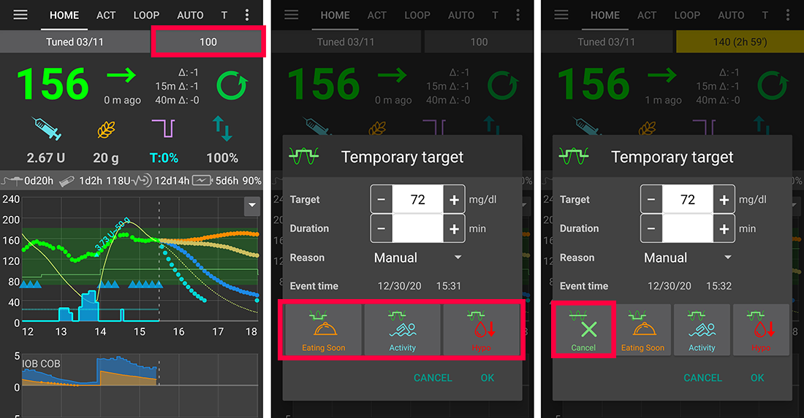
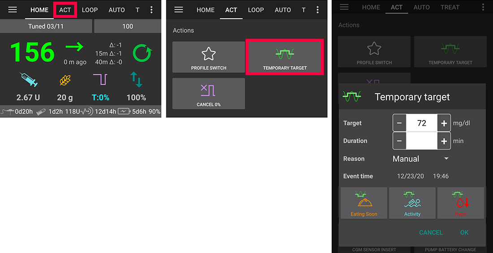

# 臨時目標

## 什麼是臨時目標，並且我可以在哪裡設置和配置他們？

**臨時目標**（或簡稱**TT**）是 **AAPS** 的一個功能，允許使用者調整其**血糖**目標範圍以配合計畫中的活動。 這是透過 **AAPS** 操控使用者的胰島素使用來實現的。

**AAPS** 提供了三種適合不同情況的**臨時目標**選項，分別是運動（**臨時目標-運動**）、餐前準備（**臨時目標-即將用餐**）以及預測低血糖（**臨時目標-低血糖**）。 **臨時目標**位於**操作選單**下。

使用者在**AAPS**中選擇臨時目標時，應對能達到的結果保持合理的期望。 達到預期**血糖**目標的成功率取決於多種因素，包括使用者的**AAPS**設置、整體**血糖**控制、胰島素庫存量、胰島素敏感度、胰島素抵抗力、運動期間的活動量等等。

一個**臨時目標**可能需要大約30分鐘甚至更長時間才能達到預期的**血糖**目標。 **AAPS** 無法立即達到**血糖**目標，因此使用者在選擇**臨時目標**時應注意這一點。

下表總結了**臨時目標-運動**、**臨時目標-即將用餐**和**臨時目標-低血糖**的功能。

## 我可以在哪裡選擇臨時目標？

1. 進入**AAPS**的**操作**選單；
2. 選擇**臨時目標**按鈕；然後
3. 選擇所需的**臨時目標**

另外，可以透過點擊「碳水化合物」按鈕（步驟1），在捷徑中選擇所需的**臨時目標**（步驟2）來啟用**臨時目標**，如下所示：

## 我可以在哪裡更改預設的**臨時目標**並根據個人偏好進行覆蓋？

要重新配置分配給使用者的預設**臨時目標**的「血糖目標範圍」和「持續時間」，請進入**AAPS**右上角的選單並

1. 選擇**偏好設定** 
2. 向下滾動至「總覽」 
3. 選擇「預設臨時目標」
4. 步驟4 說明如何更改**臨時目標-即將用餐**的持續時間
5. 步驟5 說明如何更改**臨時目標-即將用餐**的**血糖**目標範圍（同樣的步驟可應用於**臨時目標-運動**和**臨時目標-低血糖**）。

## 如何取消一個正在運作的**臨時目標**？

要取消正在運作的**臨時目標**，請在**操作選單**下的**臨時目標**中選擇「取消」按鈕，如下所示。

或者，快速點擊**AAPS**右上角黃色/綠色框中的「血糖目標」，然後選擇「取消」，如下所示：

## 如何選擇**預設臨時目標**？

要選擇**預設臨時目標**，使用者可以快速點擊首頁總覽標籤頁右上角的目標，打開**臨時目標**對話框，然後點擊「即將用餐」、「運動」或「低血糖」按鈕，或者使用橘色「碳水化合物」按鈕中的捷徑。

- 要稍微調整**預設臨時目標**的值，*長按*「即將用餐」、「運動」或「低血糖」按鈕，然後在目標或持續時間欄位中編輯數值。
- 如果臨時目標正在運作，對話框中會顯示一個額外的「取消」按鈕來取消他。

## 低血糖臨時目標

**臨時目標-低血糖**可幫助**AAPS**透過減少胰島素攝入來防止使用者經歷低血糖。 如果使用者預測**血糖**會下降，通常**AAPS**會處理他，但很大程度上取決於使用者的**AAPS**設置是否穩定。 一個**臨時目標-低血糖**允許使用者提前應對預測的低血糖，並更新**AAPS**以減少胰島素。

有時候當食用了治療低血糖的碳水化合物時，使用者的**血糖**會迅速上升，**AAPS**會透過啟用**SMB**來應對快速上升的**血糖**。

一些使用者希望在**臨時目標-低血糖**期間避免**SMB**的給藥。 這可以透過在**偏好設定**中停用*「啟用高臨時目標時的SMB」*來實現（詳見下文）：

- 在「進階設定，目標9」中，使用者可以啟用*「高臨時目標提高敏感度」*，當**臨時目標**的血糖達到100mg/dl或5.5mmol/l或更高時，**AAPS**將變得更加敏感。

- 在「進階設定，目標9」中，使用者可以停用*「高臨時目標時的SMB」*，即使**COB**大於0，並且**SMB**已啟用，且**OpenAPS SMB**處於活動狀態，**AAPS**在高臨時目標期間也不會進行**SMB**。

注意：如果使用者透過碳水化合物按鈕輸入碳水化合物，並且你的**血糖**低於72mg/dl或4mmol/l，**AAPS**會自動啟用**臨時目標-低血糖**。

## 運動臨時目標

在運動前和運動期間，使用者可能需要更高的目標來防止運動期間的低血糖。

為了簡化**臨時目標-運動**的設定，使用者可以配置一個預設的**臨時目標-運動**，透過減少胰島素使用來提高**血糖**水平，以減緩**血糖**下降並避免低血糖。

新手使用者可能需要嘗試並個人化他們的**臨時目標-運動**預設設置，以優化這項功能的效果。 每個人在運動期間達到穩定**血糖**控制的情況各不相同。 See also the [sports section in FAQ](../UsefulLinks/FAQ.md#sports). 在常見問題中。

一些使用者還喜歡在啟用**臨時目標-運動**之前和期間啟動一個**設定切換**（即設定降至100%以下以減少**AAPS**的胰島素給藥）。

進階設定，目標9：使用者可以為**臨時目標**啟用*「高臨時目標提高敏感度」*，當**臨時目標**達到或超過100mg/dl或5.5mmol/l時，**AAPS**將變得更加敏感。 此外，如果停用*「高臨時目標時的SMB」*，即使**COB**大於0，並且**SMB**已啟用，且**OpenAPS SMB**處於活動狀態，**AAPS**也不會在高臨時目標期間進行**SMB**。

另外，如果停用了『高臨時目標下的 SMB』，即使 COB > 0，啟用了『臨時目標下的 SMB』或『始終啟用 SMB』，且 OpenAPS 的 SMB 活動中，AAPS 也不會執行 SMB。

## 即將用餐臨時目標

**臨時目標-即將用餐**可以幫助實現緩和的血糖下降，並確保在用餐前有充足的**胰島素庫存量**。

這對於那些不進行餐前注射的使用者來說是一個重要工具，然而**臨時目標-即將用餐**的效果將取決於多種因素，包括使用者的設置、是否採用低碳水化合物飲食以及是否使用快效胰島素（如 Fiasp 或 Lyjumjev），以消除餐前注射的需求。 通常，除非使用者對**AAPS**有一定的經驗，否則在使用**臨時目標-即將用餐**時應該預期進行餐前注射，特別是在進食高碳水化合物飲食時。

你可以在文章[「如何啟用‘即將用餐模式’」](https://diyps.org/2015/03/26/how-to-do-eating-soon-mode-diyps-lessons-learned/)或[這裡](https://diyps.org/tag/eating-soon-mode/)了解更多關於「即將用餐模式」的訊息。

Advanced, [objective 9](../SettingUpAaps/CompletingTheObjectives.md#objective-9-enabling-additional-oref1-features-for-daytime-use-such-as-super-micro-bolus-smb): If you use OpenAPS SMB and have *'Low temp target lowers sensitivity'*, **AAPS** works a little bit more aggressively. 此選項要求**臨時目標**低於100mg/dl或5.5mmol/l。

## 如何在臨時目標期間關閉**SMB**？

要執行此操作，請在**偏好設定**中選擇，並停用*「啟用高臨時目標時的SMB」*。

這將確保**AAPS**即使在**COB**大於0，*「高臨時目標的SMB」*或*「始終啟用的SMB」*啟用且**OpenAPS SMB**處於活動狀態時，亦不會進行**SMB**。

## 自定義臨時目標

如果使用者需要手動調整**臨時目標**，*長按*「即將用餐」、「運動」或「低血糖」按鈕，然後在**血糖**「目標」或「持續時間」欄位中編輯值。

