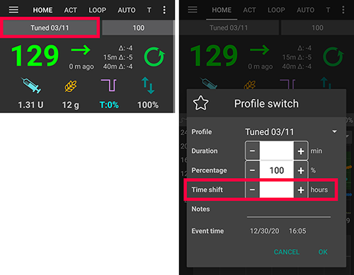

# 與幫浦跨時區旅行

## DanaR，韓國 DanaR

更改手機時區沒有問題，因為幫浦不使用歷史紀錄。

(時區-旅行-danarv2-danars)=

## DanaRv2，DanaRS

這些幫浦需要特別注意，因為 AAPS 使用來自幫浦的歷史紀錄，但幫浦紀錄中沒有時區標籤。 **這意味著如果你簡單地更改手機的時區，紀錄將會以不同的時區讀取，並且會重複。**

為避免這種情況，有兩種可能的解決方法：

### 方案1：保持家庭時間並時間調整設定

* 在手機設定中關閉「自動日期和時間」（手動更改時區）。
* 手機在整個旅行期間必須保持為你的家庭標準時間。
* 根據家庭時間與目的地時間的時差，時間調整你的設定。
   
   * 長按設定名稱（主畫面頂部中間部分）。
   * 選擇「設定切換」。
   * 根據你的目的地設置「時間調整」。
   
   
   
   * 例如：維也納 -> 紐約：設定切換 +6 小時
   * 例如：維也納 -> 悉尼：設定切換 -8 小時
* 如果使用[修補版 LibreLink 應用程式](#libre2-patched-librelink-app-with-xdrip)，可能無法選擇，因為必須設置自動時區才能啟動新的 Libre 2 傳感器。

### 方案2：刪除幫浦歷史紀錄

* 在手機設定中關閉「自動日期和時間」（手動更改時區）。

當下飛機時：

* 關閉幫浦。
* 更改手機時區。
* 關閉手機，打開幫浦。
* 清除幫浦中的歷史紀錄。
* 更改幫浦中的時間。
* 打開手機。
* 讓手機連線到幫浦並微調時間。

(時區-旅行洞察)=

## Insight

驅動程式會自動將幫浦的時間調整為手機的時間。

Insight 也會紀錄更改時間的歷史項目，紀錄時間從哪個（舊）時間更改為哪個（新）時間。 因此，儘管時間發生變更，仍可以在 AAPS 中確定正確的時間。

這可能會導致 TDD 計算不準確。 但這不應該成為問題。

因此 Insight 使用者不需要擔心時區變更和時間更改。 此規則有一個例外：Insight 幫浦內部有一個小型電池來供電時間等。 當你更換「主」電池時保持時間運作。 如果更換電池的時間過長，這個內部電池會耗盡電力，時鐘將被重置，並在插入新電池後要求輸入時間和日期。 在這種情況下，更換電池之前的所有項目將在 AAPS 的計算中被跳過，因為無法正確識別正確的時間。

## Accu-Chek Combo

新的[Combo 驅動程式](../CompatiblePumps/Accu-Chek-Combo-Pump-v2.md)會自動將幫浦的時間調整為手機的時間。 Combo 幫浦無法儲存時區，只能記錄本地時間，而新驅動正是將本地時間寫入幫浦中。 此外，他會將時區儲存在本地 AAPS 偏好設定中，以便將幫浦的本地時間轉換為具有時區偏移的完整時間戳記。 使用者不需要做任何操作；如果 Combo 的時間與手機的目前時間相差太大，幫浦的時間會自動調整。

請注意，這需要一些時間，因為只能在遠端終端模式下完成，而該模式通常較慢。 這是 Combo 無法克服的限制。

舊的基於 Ruffy 的驅動程式無法自動調整時間。 使用者必須手動進行調整。 如果是因為時區或夏令時間變更，請參閱下方的安全操作步驟。

## Medtrum

驅動程式會自動將幫浦的時間調整為手機的時間。

時區變更會保留歷史紀錄，但可能會影響 TDD。 手動更改手機上的時間可能會導致歷史紀錄和 IOB 出現問題。 如果手動更改時間，請仔細檢查 IOB。

當時區或時間更改時，正在運作的 TBR 會停止。

(時間調整-夏令時間-DST)=

## 時間調整夏令時間（DST）

根據幫浦和 CGM 的設置，時間跳變可能會導致問題。 以 Combo 為例，幫浦的歷史紀錄將重新讀取，並會導致重複項目。 因此，請在白天而非晚上進行時間調整。

如果使用計算機注射，請不要使用 COB 和 IOB，除非你確定他們是完全正確的——在 DST 轉換後幾小時內最好不要使用他們。

### Accu-Chek Combo

**注意**：如上所述，本節僅適用於舊的基於 Ruffy 的驅動程式。 新的驅動程式會自動調整日期和時間以及 DST。

如果幫浦與手機的時間相差太大，AAPS 會發出警報。 在 DST 時間調整的情況下，這通常會發生在夜間。 為了避免這種情況，並讓你可以安穩睡覺，請遵循以下步驟，以便你能夠在方便的時間強制更改時間：

#### 更改時鐘前的操作

1. 關閉任何自動設置時區的設置，以便你可以在需要時強制更改時間。 如何操作將取決於你的智慧型手機和 Android 版本。
   
   * 某些設備有兩個設置，一個是自動設置時間（理想情況下應保持開啟），另一個是自動設置時區（必須關閉）。
   * 不幸的是，一些 Android 版本只有一個開關，可以自動設置時間和時區。 你現在必須關閉這個開關。

2. 尋找一個與你目前位置有相同時間但不使用 DST 的時區。
   
   * 可在此找到這些國家的列表 [https://greenwichmeantime.com/countries](https://greenwichmeantime.com/countries/)
   * 對於中歐時間（CET），這可能是「布拉柴維爾」（剛果）。 將你的手機時區更改為剛果。

3. 在 AAPS 中重新整理你的幫浦。

4. 檢查治療標籤... 如果看到任何重複的治療：
   
   * 請勿按「刪除未來治療」
   * 請按「移除」所有未來的治療和重複的治療。 這樣可以使治療無效，而不是將其移除，因此他們將不再被計入 IOB。

5. 如果 IOB/COB 的情況不清楚——為了安全起見，請停用循環至少一個 DIA 和最大碳水化合物時間，以較大的為準。

#### 更改時鐘後的操作

更改的最佳時間是當 IOB 低時。 例如，在用餐前一小時，例如早餐，（幫浦歷史紀錄中的任何近期注射將是小的 SMB 校正）。 此時，你的 COB 和 IOB 應該都接近於零。

1. 將 Android 時區更改回你的目前位置，並重新啟用自動時區。
2. AAPS 很快就會提醒你 Combo 的時鐘與目前時間不匹配。 因此，請透過幫浦螢幕和按鈕手動更新幫浦的時鐘。
3. 在 AAPS 的「Combo」畫面中，按「重新整理」。
4. 然後轉到治療畫面，查看是否有任何未來事件。 應該不會有太多。
   
   * 請勿按「刪除未來治療」
   * 請按「移除」所有未來的治療和重複的治療。 這樣可以使治療無效，而不是將其移除，因此他們將不再被計入 IOB。

5. 如果 IOB/COB 的情況不清楚——為了安全起見，請停用循環至少一個 DIA 和最大碳水化合物時間，以較大的為準。

6. 正常繼續。

### Accu-Chek Insight

* DST 變更會自動完成。 無需進行任何操作。

### Medtrum

* DST 變更會自動完成。 無需進行任何操作。

### 其他幫浦

* 此功能自 AAPS 版本2.2起可用。
* 為了避免問題，在 DST 切換後的3小時內將暫時停用循環。 這是出於安全原因（由於 DST 變更前的重複注射，IOB 過高）。
* 你將在 DST 變更前在主畫面上收到一條通知，提示循環將暫時停用。 此訊息將不會發出嗶聲、振動或其他提示。