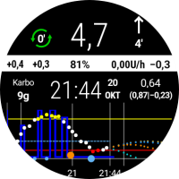
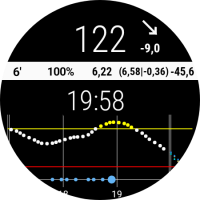
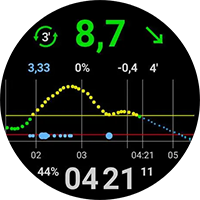
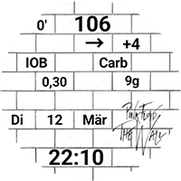

# 自訂錶盤交換站

在這裡，你可以下載用戶自行製作並與你分享的自訂錶面壓縮檔案（Zip 檔）。

Zip 檔案可以透過 Pull Request 一如往常地上傳到 GitHub 中的資料夾「**[_static/ExchangeSiteCustomWatchfaces](https://github.com/openaps/AndroidAPSdocs/tree/master/docs/_static/ExchangeSiteCustomWatchfaces)**」。

在合併 Pull Request 的過程中，文件團隊將提取 CustomWatchface.png 檔案，並在其前加上 Zip 檔案的檔名作為前綴。

|                                                                                                                                                                                                                                                                     |                                                                                                                                                                                                                                                                 |                                                                                                                                                                                                                                                                    |
|:-------------------------------------------------------------------------------------------------------------------------------------------------------------------------------------------------------------------------------------------------------------------:|:---------------------------------------------------------------------------------------------------------------------------------------------------------------------------------------------------------------------------------------------------------------:|:------------------------------------------------------------------------------------------------------------------------------------------------------------------------------------------------------------------------------------------------------------------:|
|                  [  **AAPS V2**](https://github.com/openaps/AndroidAPSdocs/raw/refs/heads/master/docs/_static/ExchangeSiteCustomWatchfaces/AAPS_V2.zip)                   |                        [  **AAPS**](https://github.com/openaps/AndroidAPSdocs/raw/refs/heads/master/docs/_static/ExchangeSiteCustomWatchfaces/AAPS.zip)                        |                [  **AIMICO**](https://github.com/openaps/AndroidAPSdocs/raw/refs/heads/master/docs/_static/ExchangeSiteCustomWatchfaces/AIMICO-V1_1.zip)                 |
|    [  **AAPS (BigChart)**](https://github.com/openaps/AndroidAPSdocs/raw/refs/heads/master/docs/_static/ExchangeSiteCustomWatchfaces/AAPS_BigChart.zip)*    |        [  **AAPS (Large)**](https://github.com/openaps/AndroidAPSdocs/raw/refs/heads/master/docs/_static/ExchangeSiteCustomWatchfaces/AAPS_Large.zip)*        |     [  **AAPS (NoChart)**](https://github.com/openaps/AndroidAPSdocs/raw/refs/heads/master/docs/_static/ExchangeSiteCustomWatchfaces/AAPS_NoChart.zip)*      |
|      [  **Analog G-Watch**](https://github.com/openaps/AndroidAPSdocs/raw/refs/heads/master/docs/_static/ExchangeSiteCustomWatchfaces/Analog_G-Watch.zip)      |              [  **AAPS (Cockpit)**](https://github.com/openaps/AndroidAPSdocs/raw/refs/heads/master/docs/_static/ExchangeSiteCustomWatchfaces/Cockpit.zip)               |   [  **Digital G-Watch**](https://github.com/openaps/AndroidAPSdocs/raw/refs/heads/master/docs/_static/ExchangeSiteCustomWatchfaces/Digital_G-Watch.zip)    |
| [  **DigitalBigGraph**](https://github.com/openaps/AndroidAPSdocs/raw/refs/heads/master/docs/_static/ExchangeSiteCustomWatchfaces/DigitalBigGraph_v1.5.zip) |                      [  **Gears**](https://github.com/openaps/AndroidAPSdocs/raw/refs/heads/master/docs/_static/ExchangeSiteCustomWatchfaces/Gears.zip)                      |                       [  **Gota**](https://github.com/openaps/AndroidAPSdocs/raw/refs/heads/master/docs/_static/ExchangeSiteCustomWatchfaces/Gota_v2.4.zip)                       |
|      [  **LuckyLoopKoeln**](https://github.com/openaps/AndroidAPSdocs/raw/refs/heads/master/docs/_static/ExchangeSiteCustomWatchfaces/LuckyLoopKoeln.zip)      |            [  **P-Zero 錶盤**](https://github.com/openaps/AndroidAPSdocs/raw/refs/heads/master/docs/_static/ExchangeSiteCustomWatchfaces/pzero_v1.0.zip)             | [  **PinkFloydTheWall**](https://github.com/openaps/AndroidAPSdocs/raw/refs/heads/master/docs/_static/ExchangeSiteCustomWatchfaces/PinkFloydTheWall.zip) |
|           [  **Robby 錶盤**](https://github.com/openaps/AndroidAPSdocs/raw/refs/heads/master/docs/_static/ExchangeSiteCustomWatchfaces/Robby_watchface.zip)           | [  **SimpleDigital**](https://github.com/openaps/AndroidAPSdocs/raw/refs/heads/master/docs/_static/ExchangeSiteCustomWatchfaces/SimpleDigital_v1.3.zip) |            [  **AAPS (SteamPunk)**](https://github.com/openaps/AndroidAPSdocs/raw/refs/heads/master/docs/_static/ExchangeSiteCustomWatchfaces/SteamPunk.zip)            |
|                  [  **藍色圈環**](https://github.com/openaps/AndroidAPSdocs/raw/refs/heads/master/docs/_static/ExchangeSiteCustomWatchfaces/Blue_Ring.zip)                  |                                                                                                                                                                                                                                                                 |                                                                                                                                                                                                                                                                    |

*需要在 Wear Watch 上安裝 Custom WatchFace V2 或以上版本（AAPS V3.3.0 或以上）

