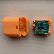

# 相容幫浦

AAPS 支援多種胰島素幫浦。  以下列表顯示目前支援的設備，並指示**AAPS**是使用你的手機的本地藍牙功能與幫浦通訊，還是需要括號中的Rileylink相容設備。

- [Accu-Chek Combo](../CompatiblePumps/Accu-Chek-Combo-Pump-v2.md)（藍牙；詳見 [Accu-Chek Combo 基本使用提示](../CompatiblePumps/Accu-Chek-Combo-Tips-for-Basic-usage.md)）
- [Accu-Chek Insight](../CompatiblePumps/Accu-Chek-Insight-Pump.md) (藍牙)
- [DanaR](../CompatiblePumps/DanaR-Insulin-Pump.md) (藍牙)
- [DanaRS](../CompatiblePumps/DanaRS-Insulin-Pump.md) (藍牙)
- [Dana-i](../CompatiblePumps/DanaRS-Insulin-Pump.md) (藍牙)
- [Diaconn G8 ](../CompatiblePumps/DiaconnG8.md)  (藍牙)
- [EOPatch2](../CompatiblePumps/EOPatch2.md) (藍牙)
- [Omnipod Eros](../CompatiblePumps/OmnipodEros.md)  ([需要額外通訊裝置](#CompatiblePumps-additional-communication-device))
- [Omnipod DASH](../CompatiblePumps/OmnipodDASH.md)  (藍牙)
- [Medtrum Nano](../CompatiblePumps/MedtrumNano.md)  (藍牙)
- [Medtrum 300U](../CompatiblePumps/MedtrumNano.md)  (藍牙)
- [Equil 5.3](../CompatiblePumps/Equil5.3.md)（藍牙）
- 某些舊款[Medtronic](../CompatiblePumps/MedtronicPump.md) ([需要額外通訊設備](#CompatiblePumps-additional-communication-device))

## 我的幫浦不在列表中

可與AAPS配合使用的其他幫浦的狀態詳細資訊列在[未來（可能）幫浦](../CompatiblePumps/Future-possible-Pump-Drivers.md)頁面上。

(CompatiblePumps-additional-communication-device)=
## 附加通訊設備

如果沒有額外的通訊設備，則胰島素幫浦與**AAPS**之間的通訊基於 Android 的內建藍牙功能，不需要額外的通訊設備來轉換通訊協議。

對於舊型的美敦力幫浦和Omnipod Eros，需要額外的通訊設備（除了你的手機）來「翻譯」幫浦至藍牙的無線信號。 請確保根據你的幫浦選擇正確的版本。

-   [OrangeLink 官網](https://getrileylink.org/product/orangelink)
-  [433MHz RileyLink](https://getrileylink.org/product/rileylink433)
-   [Emalink 官網](https://github.com/sks01/EmaLink) - [聯絡資訊](mailto:getemalink@gmail.com)
-   DiaLink - [聯絡資訊](mailto:Boshetyn@ukr.net)
-   [LoopLink 官網](https://www.getlooplink.org/) - [聯絡資訊](https://jameswedding.substack.com/) - 尚未測試