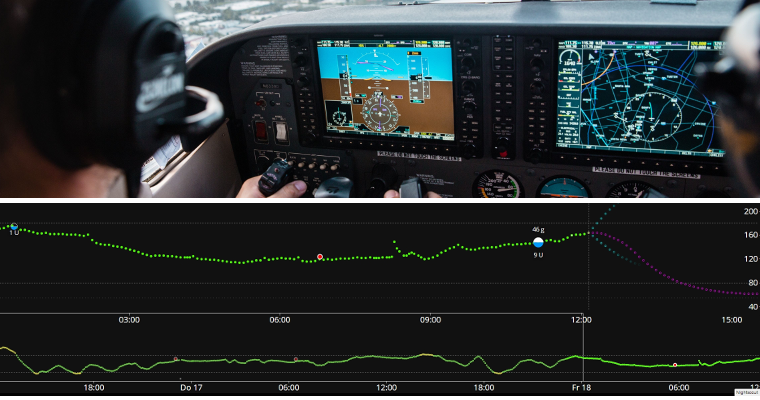
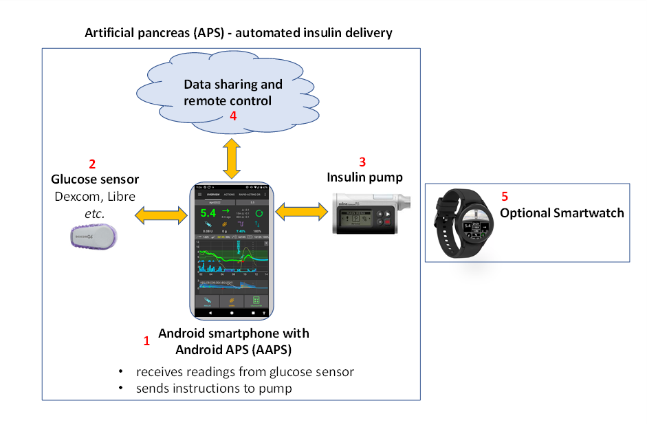
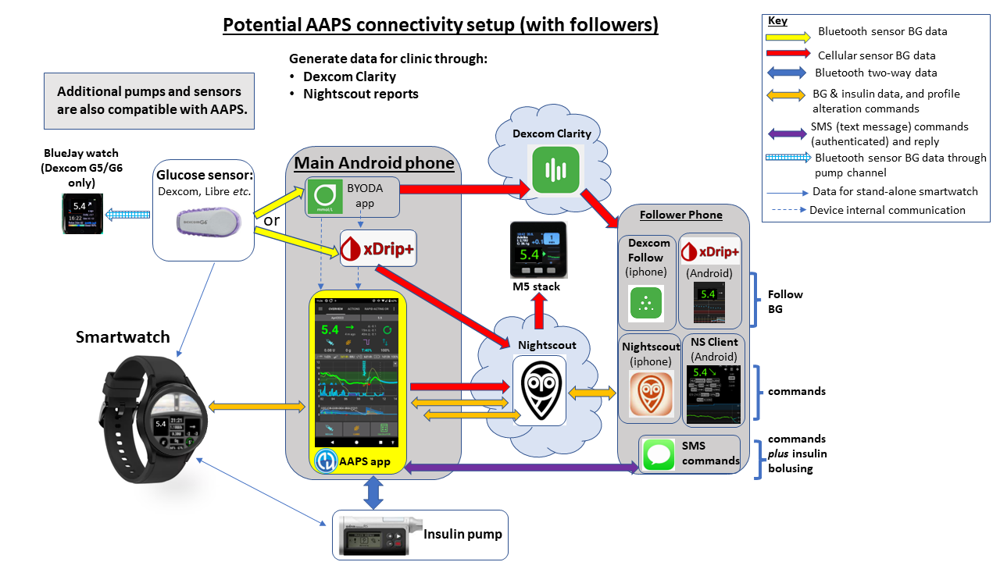

# APS 和 AAPS 的介紹

## 什麼是“人工胰臟系統”(Artificial Pancreas System)？

人的胰臟除了調節血糖外，還有許多功能。 而**” 人工胰臟系統” (APS)** 通常指的是一個能自動將血糖維持在健康範圍內的系統。

最基本的方式就是透過偵測而來的**血糖值**資料進行**計算**，然後將預測的適當劑量**胰島素**注入體內。 這個系統每隔幾分鐘會重複進行一次計算，全天候24/7運作。 他會使用**警報**和**通知**來告知使用者是否需要介入或注意。 這個系統通常由一個**血糖傳感器**、一個**胰島素幫浦**以及手機上的一個**應用程式**組成。

你可以在這篇2022年的回顧文章中閱讀更多關於目前使用及開發中的各種人工胰臟系統：

 [閉環技術的未來方向](https://www.frontiersin.org/articles/10.3389/fendo.2022.919942/full#:~:text=Fully%20closed%2Dloop%20systems%2C%20unlike,user%20input%20for%20mealtime%20boluses)

在不久的將來，一些所謂的“雙激素”系統還將能夠同時注射胰高血糖素與胰島素，目的是預防嚴重的低血糖，並實現更嚴密的血糖控制。

人工胰臟被認為是[“糖尿病的自動駕駛”](https://www.artificialpancreasbook.com/)。 那是什麼意思？

在飛機上，自動駕駛並不完全取代人類飛行員的工作，飛行員無法在整個飛行過程中睡覺。 自動駕駛輔助飛行員的工作。 他減輕了飛行員需要持續監控飛機的負擔，讓飛行員可以不時地進行更廣泛的監控。 自動駕駛從各種傳感器接收訊號，計算機會與飛行員的指示一起評估這些訊號，然後進行必要的調整，並向飛行員發出任何問題的警告。 飛行員不再需要不斷做出決策。

(Introduction-what-does-hybrid-closed-loop-mean)=
## 什麼是混合閉環系統？

對於1型糖尿病患者來說，最好的解決方案可能是“功能性治療”（可能是植入免疫系統無法攻擊的胰臟細胞）。 在我們等待這個解決方案的同時，一個“全閉環”的人工胰臟系統可能是目前最接近的理想方案。 這是一種不需要任何使用者輸入（例如為進餐注射胰島素或通知運動）的技術系統，並能夠很好地調節血糖數值。 目前，尚無“完全”閉環系統廣泛上市，所有的系統都需要一些使用者輸入。 目前可用的系統稱為“混合”閉環系統，因為他們結合了自動技術與使用者輸入。

## 為什麼循環控制系統會開始發展？

為1型糖尿病患者開發商業技術的進度非常緩慢。 在2013年，1型糖尿病社群發起了#WeAreNotWaiting運動。 他們使用現有的認證技術（胰島素幫浦和傳感器）自行開發系統，以改善血糖控制、安全性和生活品質。 這些系統被稱為DIY（自製）系統，因為他們並未經過正式的健康機構（如FDA、NHS等）的認證。 目前有四個主要的DIY系統可用：[OpenAPS](https://openaps.org/what-is-openaps/)、**AAPS**、[Loop](https://loopkit.github.io/loopdocs/#what-is-loop)和[iAPS](https://github.com/Artificial-Pancreas/iAPS?fbclid=IwAR2fA9Y9YqYzpKSrtEsotfXl5b67UclDkKgyrv52tQLzYbOoBeNGRmjlJJI)。

暸解DIY循環控制系統基本原理的絕佳方式是閱讀Dana Lewis的書《自動化胰島素輸送》。 你可以在[這裡](https://www.artificialpancreasbook.com/)免費獲取該書的電子版（或購買該書的實體書）。 如果你想了解更多關於[OpenAPS](https://openaps.org/what-is-openaps/)，**AAPS**就是從該系統發展而來的，[OpenAPS](https://openaps.org/what-is-openaps/)網站是一個很好的資訊來源。

目前已經有幾個商業混合閉環系統問世，其中最新的是 [CamAPS FX](https://camdiab.com/)（英國和歐盟）和 [Omnipod 5](https://www.omnipod.com/en-gb/what-is-omnipod/omnipod-5)（美國和歐盟）. 這些系統與DIY系統非常不同，主要是因為他們都包含一個“學習算法”，該算法根據你過去幾天的胰島素需求調整胰島素的輸送量。 許多DIY社群的成員已經嘗試過這些商業系統，並將他們與自己的DIY系統進行了比較。 你可以透過專門針對這些系統的Facebook群組進一步了解各系統之間的比較，參考 [AAPS Facebook群組](https://www.facebook.com/groups/AndroidAPSUsers/) 或在 [Discord](https://discord.com/invite/4fQUWHZ4Mw) 上詢問。

## 什麼是Android APS (AAPS)?

**圖1**。 Android APS (人工胰臟系統，AAPS) 的基本架構。

Android APS（**AAPS**）是一個混合閉環系統，或稱人工胰臟系統（APS）。 他使用 [OpenAPS](https://openaps.org/) 社群所開發的演算法（即一套規則）來進行胰島素劑量計算，這些演算法是由#WeAreNotWaiting的1型糖尿病社群所開發。

由於OpenAPS只相容於某些較舊的胰島素幫浦，**AAPS**（可以搭配更多類型的胰島素幫浦使用）於2016年由Milos Kozak為其家族中的一位1型糖尿病患者開發。 自那時以來，**AAPS**一直由一群志願電腦開發者和對1型糖尿病有關聯的愛好者持續發展和改進。 今天，**AAPS** 大約已有10,000使用者。 這是一個高度可自訂且多功能的系統，因為它是開源的，也與許多其他開源糖尿病軟體和平台相容。 目前**AAPS**系統的基本組成部分如上圖**圖1**所示。

## AAPS 的基本組成部分是什麼？

AAPS 的“核心”是一個你自己建置的**應用程式**。 這裡有詳細的步驟說明。 然後你可以將**AAPS** 應用程式安裝在[相容](../Getting-Started/Phones.md)的**Android 智慧型手機** (**1**) 上。 很多人喜歡將他們的 AAPS 循環放在另一隻獨立的手機上，而不是主要的手機 因此，你不必在日常生活中使用 Android 手機，只需用於運作你的 AAPS 循環即可。

**安卓智慧型手機**也需要安裝另一個應用程式，以及 **AAPS**。 這個[附加應用程式](../Getting-Started/CompatiblesCgms.md)透過藍牙從感測器（**2**）接收葡萄糖資料，然後將資料在手機內部傳送到**AAPS應用程式**。

**AAPS 應用程式**使用來自 OpenAPS 的決策過程（**演算法**）。 初學者開始使用基本的 **oref0** 演算法，但隨著你在AAPS上的目標進度，可以切換到使用較新的 **oref1** 演算法。 你使用哪個演算法（oref0或oref1），取決於哪個最適合你的特定情況。  在兩種情況下，演算法考慮多個因素，每次從傳感器傳入新讀取值時進行快速計算。 演算法然後透過藍牙將指令發送到胰島素幫浦（**3**），指示其提供多少胰島素。 所有訊息可以透過手機資料或wifi發送到網際網路（**4**） 如果需要，這些資料也可以與追蹤者分享，並且/或收集用於分析。

## AAPS系統的優勢是什麼？

**AAPS** 使用的 OpenAPS 算法在用戶未輸入的情况下控制血糖數值，根據定義的参數（重要的包括基礎速率、胰島素敏感因子、胰島素至碳水化合物比率、胰島素活性持續時間等），每 5分鐘對新的傳感器資料做出反應。 據報導，使用 AAPS 的一些優點包括廣泛的可調選項、自動化和增加患者/照護者對系統的透明度。 這可幫助更好地控制你(或你的扶養者) 的糖尿病，從而可能提高生活品質並增加內心的平靜。

### **特定優勢包括：**

#### 1) 內建安全
要了解名為oref0和oref1的演算法的安全功能，[請按這裡](https://openaps.org/reference-design/)。 用戶掌控自己的安全限制。

#### 2) **硬體彈性**

**AAPS** 與各種胰島素幫浦和傳感器配合使用。 舉例來說，如果你對 Dexcom 傳感器貼片膠過敏，你可以考慮改用 Libre 傳感器。 隨著生活變化，提供靈活性。 你不必重新建置或重新安裝**AAPS**應用程式，在應用程式中勾選另一個選項以更改你的硬體即可。 AAPS 獨立於特定的幫驅動程式，還包含一個"虛擬幫浦"，因此用戶可以在使用之前進行安全實驗。

#### 3) **高度可自訂，擁有廣泛的參數**

用戶可以輕鬆添加或移除模組或功能，並且 **AAPS** 可以在開放和封閉環路模式下使用。 這裡有一些使用 **AAPS** 系統的可能性示例：

 a) 在用餐前的30分鐘設定較低的葡萄糖目標；你可以將目標設定為低至72 mg/dL（4.0 mmol/L）。

 b) 如果你對胰島素有抗藥性，導致血糖偏高，**AAPS** 允許你設置一個 **自動化** 規則，當血糖升高至 8 mmol/L (144 mg/dL) 時啟動，切換到（例如）120% 的配置文件（與你正常 **設定檔** 相比，相當於基礎增加20%，並加強其他因素）。 自動化將根據你設定的時間持續生效。 此類自動化還可以設定為僅在特定星期幾、特定時間或甚至在特定位置啟動。

 c) 如果你的孩子突然在蹦床上玩耍，**AAPS** 允許你直接透過手機暫停胰島素輸送，並設定特定的時間段。

 d) 當你因游泳而中斷幫浦再次重新連線時，**AAPS** 會根據目前血糖計算你在中斷連線期間缺少的基礎胰島素，並且小心地補充。 不需要的胰島素可以透過“取消”缺少的基礎率來忽略。

 e) **AAPS** 提供設置不同情境下的不同設定檔的功能，並且能夠輕鬆切換。 例如，可以更快速降低高血糖的功能（如超微量注射（**SMB**）、未預先宣布的餐前注射（**UAM**））設置為僅在白天啟用，以避免夜間低血糖的風險。

這些都是一些範例，完整的功能範圍提供了極大的靈活性來應對日常生活中的各種狀況，包括運動、疾病、荷爾蒙周期、_其他_等。 最後，這些彈性功能該怎麼用，全看使用者自己決定，因為沒有一套通用的自動化規則適合每個人。

#### 4) **遠端監控**
有多種可用的監測管道（如 Sugarmate、Dexcom Follow、xDrip+、Android Auto _等_），這些對於父母/照護者以及在某些情境下（睡眠/駕駛）需要自訂警報的成人非常實用。 在某些應用程式（如 xDrip+）中，你也可以完全關閉警報，這對於新的傳感器正在「浸潤期」或穩定時非常實用，特別是當你尚未想進行循環時。

#### 5) **遠端控制**
**AAPS** 相對於商業系統的一個重大優勢是，關注者可以透過認證的簡訊（SMS）指令或應用程式（如 [Nightscout](https://nightscout.github.io/) 或 AAPSClient）向 **AAPS** 系統發送多種指令。 第1型糖尿病兒童的父母們廣泛使用AAPS。 例如，在遊樂場時，你可以透過自己的手機為孩子的點心提前注射，而孩子則繼續玩耍。 可以監控系統（_例如_ Fitbit）、傳送基本指令（_例如_ Samsung Galaxy 手錶4），甚至可以從高規格的智慧手錶（**5**）(_例如_ LEMFO) 運行整個AAPS系統。 在這種情況下，你不需要使用手機運作AAPS。 隨著手錶的電池壽命提高和技術變得更加穩定，這最後一個選項可能會變得越來越具吸引力。

#### 6) **開放的應用程式介面，無商業限制**
除了使用開源方法外，允許隨時查看**AAPS**的程式碼，提供開放的程式介面這一做法，也讓其他開發者有機會貢獻新想法。 **AAPS** 與 Nightscout 緊密整合。 這加快了發展，讓用戶可以添加功能，使得與糖尿病的生活更加方便。 這類整合良好例子包括 [Nightscout](https://nightscout.github.io/)、[Nightscout Reporter](https://nightscout-reporter.zreptil.de/)、[xDrip+](https://xdrip.readthedocs.io/en/latest/install/usethedoc/)、[M5 Stack](https://github.com/mlukasek/M5_NightscoutMon/wiki) 等。 開源開發者與商業系統開發者之間的對話持續進行。 許多 DIY 創新逐漸被商業系統採用，儘管開發速度較慢，這在一定程度上是因為不同公司的系統（如幫浦、應用程式、傳感器等）之間的介面需要謹慎協商和授權。 這也可能減緩創新，這些創新對患者（或一小部分特定需求的患者）很方便，因為這些創新無法帶來顯著的利潤。

#### 7) **詳細的應用程式介面**
透過 **AAPS**，你可以輕鬆追蹤幫浦胰島素數值、套管使用時間、傳感器時間、幫浦電池時間、活性胰島素量_等等_。 許多操作可以直接在 **AAPS** 應用中完成（如幫浦注射、幫浦中斷等），無需在幫浦本身上操作，這樣幫浦可以一直放在你的口袋或腰帶上。

#### 8) **便利性和負擔能力**
**AAPS**為那些目前無法自費或沒有經費/保險的人提供了一個世界級的混合閉環系統，其開發概念比市售系統領先了數年。 目前你需要擁有Nightscout帳號才能設置**AAPS**，但Nightscout帳號並不是每天運作 **AAPS**循環所必須的。 許多人繼續使用Nightscout來收集資料並進行遠端控制。 雖然**AAPS**本身是免費的，但透過不同的平台設置Nightscout可能會產生費用（新台幣$0 -$425），這取決於你需要的支援程度以及你是否要在設置後繼續使用Nightscout（請參閱比較表）。 **AAPS**與各種價格合理的(*起價約150歐元*) [Android手機](https://docs.google.com/spreadsheets/u/1/d/e/2PACX-1vScCNaIguEZVTVFAgpv1kXHdsHl3fs6xT6RB2Z1CeVJ561AvvqGwxMhlmSHk4J056gMCAQE02sAWJvT/pubhtml?gid=683363241&single=true)相容。 不同版本適用於特定地區和語系，AAPS還可以供[視障人士](#accessibility-for-users-aaps-who-are-partially-or-completely-blind)使用。

#### 9) **支援**
沒有任何自動胰島素輸送系統是完美的。 市售和開源系統在通訊和臨時硬體故障方面存在許多共同的問題。 AAPS 的用戶社群遍佈全球，他們在 Facebook、Discord 和 GitHub 上提供支援，這些用戶不僅設計和開發了 **AAPS**，同時也正在使用他。 市售APS系統還有Facebook支援群組，並可以從診所或商業公司獲得幫助——值得與這些系統的用戶或前用戶交流，了解常見問題、教育計劃的品質以及提供的持續支援。

#### 10) **可預測性、透明性與安全性**
**AAPS** 完全透明、邏輯清晰且可預測，這可能會使你更容易知道何時設置出錯，並相應地進行調整。 你可以完全看到系統在做什麼、為什麼這樣做，以及設置其運作限制，這使得控制權（和責任）掌握在你手中。 這可以讓用戶感到更有信心，並能擁有更好的睡眠品質。

#### 11) **透過開發（dev）模式查看進階功能，包括全閉環**
這份**AAPS** 文件主要集中於**“master”**分支的主流版本。 然而，研究和開發始終在進行中。 更有經驗的用戶可能希望探索**開發**分支中的實驗性功能。 開發創新主要集中於全閉環的策略（不必為用餐注射_其他_等胰島素），並一般地努力使1型糖尿病患者的生活變得更方便。

#### 12) **能夠自行參與進一步的改善**
第1型糖尿病可能會讓人感到非常沮喪和孤立。 掌控自己的糖尿病技術，並且在取得進展後幫助他人，這可以帶來極大的成就感。 你可以自我學習，發現障礙，尋求解決方案，甚至為新的開發和文件貢獻力量。 社群中有與你有相同目標的人可以與你交換想法並合作。 這就是 #WeAreNotWaiting 的核心精神。

## AAPS 與 MDI 和開環系統相比如何？

每日多次注射 （a）（MDI，見下方**圖2**）通常包括每天注射一次長效胰島素（例如Tresiba），並在用餐時間或進行矯正時注射快速作用的胰島素（例如Novorapid、Fiasp）。 開環幫浦（b）是指使用幫浦以預先設定的速率持續注入速效胰島素作為基礎速率，並在用餐時間或進行修正時透過幫浦進行追加劑量。 閉環系統（c）的基本原理是，應用程式使用傳感器的血糖資料來指導幫浦，在預測低血糖時停止胰島素輸送，並在血糖上升且預測過高時提供額外的胰島素。 雖然這個圖表與現實生活相比有所簡化，但他主要在展示這些方法的關鍵區別。 使用這三種方法中的任何一種都可以實現出色的血糖控制。

**圖2**。 簡單總覽了（a）MDI，（b）開環幫浦和（c）混合閉環幫浦。

## AAPS與其他閉環系統相比如何？

截至2023年6月25日，共有四大主要開源閉環系統：[OpenAPS](https://openaps.readthedocs.io/)，**AAPS**，[Loop](https://loopkit.github.io/loopdocs/#what-is-loop)和[iAPS](https://github.com/Artificial-Pancreas/iAPS?fbclid=IwAR2fA9Y9YqYzpKSrtEsotfXl5b67UclDkKgyrv52tQLzYbOoBeNGRmjlJJI)（前身為FreeAPS X）。 下表顯示了不同系統的特性：

| 設備類型 | 名稱                                                            | [AAPS](https://wiki.aaps.app)     | [循環](https://loopkit.github.io/loopdocs/) | [Open APS](https://openaps.readthedocs.io/en/latest/) | [iAPS](https://iaps.readthedocs.io/en/latest/) |
| ---- | ------------------------------------------------------------- | --------------------------------- | ----------------------------------------- | ----------------------------------------------------- | ---------------------------------------------- |
| 手機   | Android                                                       |     |          |                      |               |
| 手機   | iPhone                                                        |  |             |                      |                  |
| 設備   | 微型電腦 (1)                                                      |  |          |                         |               |
| 幫浦   | [Dana I](../CompatiblePumps/DanaRS-Insulin-Pump.md)           |     |          |                      |               |
| 幫浦   | [Dana RS](../CompatiblePumps/DanaRS-Insulin-Pump.md)          |     |          |                      |               |
| 幫浦   | [Dana R](../CompatiblePumps/DanaR-Insulin-Pump.md)            |     |          |                      |               |
| 幫浦   | [Omnipod (Dash)](../CompatiblePumps/OmnipodDASH.md) (2)       |     |             |                      |                  |
| 幫浦   | [Omnipod (Eros)](../CompatiblePumps/OmnipodEros.md)           |     |             |                      |                  |
| 幫浦   | [Diaconn G8](../CompatiblePumps/DiaconnG8.md)                 |     |          |                      |               |
| 幫浦   | [EOPatch 2](../CompatiblePumps/EOPatch2.md)                   |     |          |                      |               |
| 幫浦   | [Medtrum TouchCare Nano](../CompatiblePumps/MedtrumNano.md)   |     |          |                      |               |
| 幫浦   | [Medtrum TouchCare 300U](../CompatiblePumps/MedtrumNano.md)   |     |          |                      |               |
| 幫浦   | [Roche Combo](../CompatiblePumps/Accu-Chek-Combo-Pump-v2.md)  |     |          |                      |               |
| 幫浦   | [Roche Insight](../CompatiblePumps/Accu-Chek-Insight-Pump.md) |     |          |                      |               |
| 幫浦   | [舊款美敦力](../CompatiblePumps/MedtronicPump.md)                  |     |             |                         |                  |
| 幫浦   | [Equil 5.3](../CompatiblePumps/Equil5.3.md)                   |     |          |                      |               |
| CGM  | [Dexcom G7](../CompatibleCgms/DexcomG7.md)                    |     |             |                      |                  |
| CGM  | [Dexcom One](../CompatibleCgms/DexcomG6.md)                   |     |             |                      |                  |
| CGM  | [Dexcom G6](../CompatibleCgms/DexcomG6.md)                    |     |             |                         |                  |
| CGM  | [Dexcom G5](../CompatibleCgms/DexcomG5.md)                    |     |             |                         |                  |
| CGM  | [Libre 3](../CompatibleCgms/Libre3.md)                        |     |          |                      |               |
| CGM  | [Libre 2](../CompatibleCgms/Libre2.md)                        |     |          |                      |                  |
| CGM  | [Libre 1](../CompatibleCgms/Libre1.md)                        |     |          |                      |                  |
| CGM  | [Eversense](../CompatibleCgms/Eversense.md)                   |     |          |                      |                  |
| CGM  | [MM640g/MM630g](../CompatibleCgms/MM640g.md)                  |     |          |                      |                  |
| CGM  | [PocTech](../CompatibleCgms/PocTech.md)                       |     |          |                      |                  |
| CGM  | [歐態（Ottai）](../CompatibleCgms/OttaiM8.md)                     |     |          |                      |               |
| CGM  | [Syai Tag](../CompatibleCgms/SyaiTagX1.md)                    |     |          |                      |               |
| CGM  | [Nightscout 作為血糖來源](../CompatibleCgms/CgmNightscoutUpload.md) |     |             |                         |                  |

_表格說明：_
1. 一個 **設備** 是一個隨身攜帶的小型電腦，沒有顯示螢幕。 支援的設備類型包括Intel Edison + Explorer Board，另一種是Raspberry Pi + Explorer HAT或Adafruit RFM69HCW Bonnet。 最早的APS系統基於這樣的設置，因為當時的手機無法運作所需的演算法。 隨著手機設置變得更簡單，並且手機內建顯示螢幕，這些系統的使用已經減少。 Intel也已經停止銷售Intel Edison。 優秀的OpenAPS演算法**oref0**和 **oref1**現在已經被整合到AAPS和iAPS中。
2. Omnipod Dash是Omnipod Eros的後繼者。 他支援藍牙通訊，並且不需要設備作為Omnipod與手機之間的通訊閘道。 如果你可以選擇，我們建議使用Dash而不是Eros。

2022年發表了一篇由醫療專業人士撰寫的國際同行評審共識聲明，其中包含了關於開源閉環系統的實用指南，發表於一家領先的醫學期刊：[_Lancet Diabetes Endocrinol_, 2022; 10: 58–74](https://www.ncbi.nlm.nih.gov/pmc/articles/PMC8720075/)(_1_)。 這篇文章非常值得閱讀（包括你的糖尿病診所），並總結了不同開源混合閉環系統之間的主要技術差異。

很難在沒有實際使用系統或與其他使用者交流的情況下對任何系統有真實的感受，因此，建議你可以透過 Facebook 或 Discord 等平台與其他使用者聯繫並詢問他們的經驗。 大多數人發現，與其他混合閉環系統（尤其是市售系統）相比，**AAPS**極其先進，擁有大量可自定義的設置和功能，如上所述。 一些人在開始時可能會覺得有些難以應付，但不必急於一次探究所有可能性，你可以根據自己的步伐逐步進行，並且在每一步都有支援可用。

## AAPS是否使用人工智慧或任何學習演算法？

目前**AAPS**的master版本（3.3.1.3）不包含任何機器學習演算法、多參數胰島素反應模型或人工智慧。 因此，該系統是開放且透明的，操作方式可以被非專家以及臨床醫生和患者暸解。 這也意味著，如果你的日程變化劇烈（例如從一個緊張的工作週切換到一個輕鬆的假期），並且可能需要顯著不同的胰島素劑量，你可以立即切換**AAPS**來運作較弱/較強的自定義設定檔案。 ‘學習系統’會自動為你進行這種調整，但可能需要更長的時間來調整胰島素的輸送。

## 哪個系統適合我或我的家人？

實際上，你的系統選擇通常受限於你已有的幫浦，或你能從醫療提供者那裡獲得的幫浦，以及你選擇的手機（Apple或Android）。 如果你還沒有幫浦，你有最大的系統選擇權利。 技術不斷進步，幫浦被逐漸淘汰，並且有新的幫浦和傳感器推出。 大多數開源系統可與主要的傳感器（Libre和Dexcom）配合使用，或在傳感器推出約一年後迅速適應新傳感器（經過一段時間的安全性和穩定性測試）。

大多數**AAPS**用戶報告在使用系統後有更多的時間保持在正常範圍內，HbA1c下降，以及夜間系統自動調整基礎率時，睡眠品質提高，這在大多數混合閉環系統中也是如此。 有些人偏好非常簡單的系統，這些系統不具有可自定義功能（這意味著你可能會更喜歡市售系統），而另一些人則發現這種缺乏控制令人沮喪（你可能更喜歡開源系統）。 如果你（或你的家人）是新診斷的，常見的路線是先習慣使用MDI加上葡萄糖傳感器，然後進一步使用具有閉環潛力的幫浦，最後再進一步使用**AAPS**，但有些人（特別是小孩）可能會直接使用幫浦。

值得注意的是，**AAPS**用戶需要主動解決問題，並在社群的幫助下自行修復問題。 這與使用市售系統的心態完全不同。 使用**AAPS**的用戶擁有更多的控制權，但也需要承擔更多的責任，並且需要對此感到舒適。

## 使用像AAPS這樣的開源系統是否安全？

### AAPS系統的安全性
一個更正確的問法可能是「與我目前的胰島素輸送系統相比，他是否安全」，因為任何胰島素輸送方法都不是完全無風險的。 **AAPS**系統中有許多檢查和平衡機制。 最近一篇[文章](https://www.liebertpub.com/doi/epub/10.1089/dia.2019.0375)探討了在電腦模擬環境中使用**AAPS**，這是一種以有效、客觀的的方式測試系統的安全性和效能。 更普遍來說，據估計全球有超過10,000人正在使用開源自動胰島素輸送系統，並且全球範圍內的使用人數還在不斷增加。

任何使用無線通訊的設備都有可能被駭客入侵，這對非閉環的胰島素幫浦也是如此。 目前，我們尚未聽說有人試圖透過駭入糖尿病相關的醫療設備來傷害他人。 然而，有多種方法可以防範此類風險：

1.  在幫浦設置中，將最大注射量和臨時基礎率限制在你認為最安全的範圍內。 這些都是我們認為任何惡意駭客都無法繞過的硬限制。

2.  設置你的CGM警報，針對高低血糖啟用警報功能。

3.  線上監控你的胰島素輸送。 Nightscout用戶可以設置額外的警報，針對多種情況發出警示，這些情況比惡意攻擊更有可能發生。 除了高低血糖警報之外，Nightscout還可以顯示診斷資料，用來確認幫浦是否按照預期運作，包括目前的IOB、幫浦臨時基礎率歷史、幫浦注射歷史等。 他還可以被配置為主動警告用戶不希望發生的情況，例如預測的高低血糖、胰島素儲量不足以及幫浦電池電量低。

如果有人對你的胰島素幫浦發動惡意攻擊，這些策略將大大減少風險。 每位潛在的**AAPS** 用戶都需要權衡使用**AAPS**所涉及的風險，與使用其他系統的風險進行比較。

#### 關於過快改善血糖控制的安全考量

迅速降低HbA1c並改善血糖控制聽起來很吸引人。 然而，透過開始任何閉環系統過快降低平均血糖數值可能會導致永久損害，包括眼睛損傷，以及不可逆的疼痛性神經病變。 只要緩慢降低血糖數值，就可以避免這些損害。 如果你目前的HbA1c偏高，並且正在轉向使用AAPS（或其他閉環系統），請在開始之前與你的臨床團隊討論這個潛在風險，並與他們協商一個時間表。 關於如何安全降低血糖數值的更多資訊，包括與醫學文獻的連結，可以在安全部分[這裡](#preparing-safety-first)中找到。

#### 關於設備、耗材和其他藥物的醫療安全

使用經過測試、功能完善的FDA或CE認證的胰島素幫浦和CGM來建立人工胰臟閉環系統。 對這些組件進行硬體或軟體修改可能會導致胰島素劑量異常，對使用者造成重大風險。 如果你發現損壞、改裝或自製的胰島素幫浦或CGM接收器，請不要拿來建立AAPS系統。

請使用幫浦和CGM製造商批准的原裝耗材，如插入器、導管和胰島素容器。 使用未經測試或修改的耗材可能會導致 CGM 不準確和胰島素劑量錯誤。 胰島素劑量錯誤非常危險——請不要拿自己的生命開玩笑，隨便修改耗材。

在使用 **AAPS**時，請不要服用SGLT-2抑制劑（格列酮類藥物），因為他們會無法預測地降低血糖數值。 將這種效果與降低基礎率以增加血糖的系統結合使用是危險的，詳細訊息可參閱主安全部分[這裡](#preparing-safety-first)。

(introduction-how-can-i-approach-discussing-aaps-with-my-clinical-team)=
## 我該如何與我的臨床團隊討論AAPS？

建議用戶與其臨床醫生討論使用**AAPS** 的想法。 如果你打算使用**AAPS** （或其他DIY閉環系統），請不要害怕與你的糖尿病團隊進行坦誠的對話。 患者與醫生之間的透明度和信任非常重要。

### 建議的方法：
與你的臨床醫生開始對話，了解他們對糖尿病技術（如CGM、幫浦、混合閉環系統和市售閉環系統）的熟悉程度和態度。 你的臨床醫生/內分泌專家應該了解基本技術，並願意與你討論其地區內市售閉環產品的最新進展。

#### 當地先例

了解你的臨床醫生/內分泌專家對DIY閉環系統與市售閉環系統的看法，並評估他們在這方面的知識。 他們是否熟悉**AAPS** ，並且能否與你分享他們與使用DIY閉環系統患者的工作經驗？

詢問你的醫療團隊是否有任何患者已經在他們的照護下使用DIY閉環系統。 由於患者隱私，醫生無法在未經個人同意的情況下將其他患者的資料告訴你。 但是，如果你希望，**AAPS** 請他們將你的聯繫資料傳遞給現有的DIY閉環系統用戶，如果有合適的人選，醫生認為你們可能會合得來，建議該患者可以聯繫你來討論DIY閉環系統。 臨床醫生並非有義務這樣做，但有些醫生樂意這麼做，因為他們意識到點對點支援在1型糖尿病管理中的重要性。 你可能還會覺得與當地的DIY閉環系統用戶見面很有幫助。 當然，這完全取決於你自己，也不是必須的。

#### 國內和國際先例

如果你覺得你的醫療團隊不支援你使用**AAPS** ，以下討論點可能會有幫助：

a) **AAPS** 系統是由患者及其看護者設計的。 他的設計最終是為了安全，同時也借鑒了深入的患者經驗。 目前全球大約有**10,000**位AAPS用戶。 因此，你的診所患者群體中很可能有其他使用DIY閉環系統的患者（無論他們是否了解）。

b) 最近發表於國際領先醫學期刊[The Lancet](https://www.ncbi.nlm.nih.gov/pmc/articles/PMC8720075/pdf/nihms-1765784.pdf)_(1)_ 的同行評審指導確認，DIY閉環系統**安全**且**有效改善糖尿病控制**，包括增加血糖範圍內的時間。 在像[Nature](https://doi.org/10.1038/d41586-023-02648-9)_(3)_這樣的頂級期刊中經常有文章，突顯了 DIY 循環社區的進展。

c) 使用 **AAPS** 需 _一步步_ 的使用，從“開環”幫浦開始，經過低血糖暫停功能，再進入混合“閉環”模式，這一過程需要完成一些目標。 因此有一個結構化的計劃，要求用戶在每個階段展示一定的能力，並微調他們的基礎設置（基礎率、ISF和ICR），然後才能關閉閉環。

d) 你可以透過 GitHub、Discord 和 Facebook 私密群組中的 DIY 社群獲得技術支援。

e) 在診所會議中，你將能提供**CGM和胰島素閉環/幫浦資訊**的綜合報告（透過Nightscout或Tidepool），無論是列印出來還是顯示在螢幕上（如果你攜帶筆記型電腦或平板電腦）。 CGM和胰島素資料的整合將更有效地利用臨床醫生的時間來審查你的報告，並有助於他們在評估你的進展時進行討論。

f) 如果你的醫療團隊仍然強烈反對，請將本文中提到的參考文章的列印件交給你的臨床醫生，並將網頁連結提供給 **AAPS**臨床醫生部分：[臨床醫生 – **AAPS**的一般介紹和指南](../UsefulLinks/ClinicianGuideToAaps.md)

#### 其他臨床醫生對DIY閉環系統的支援

發表於[Lancet Diabetes Endocrinology](https://www.ncbi.nlm.nih.gov/pmc/articles/PMC8720075/) (_1_) [由Kings’和Guy’s以及St Thomas’ NHS Foundation Trust共同領導，並由倫敦King’s榮譽高級講師兼顧問糖尿病專家Sufyan Hussain博士共同領導] 的文章提供了：

a) 向專業人士提供關於DIY人工胰臟系統/開源系統的**保證**;，即這是一種安全且有效的第1型糖尿病治療選擇，並提供了建議、討論、支援和文件指導；

b) 認識到開源自動胰島素輸送（AID）系統可以增加血糖範圍內的時間（TIR），同時減少血糖濃度的波動以及各年齡段、性別和社群中的低血糖和高血糖事件的發生次數；

c) **建議**醫護人員應該**支援**選擇使用開源AID系統來管理其糖尿病的1型糖尿病患者或他們的照護者；

d) 建議醫護人員應努力了解可能對患者有益的所有治療選擇，包括可用的開源AID系統。  如果醫護人員沒有資源來自我教育，或者有法律或監管方面的擔憂，他們應考慮**與其他醫護人員合作或組隊**，以便提供幫助；

e) 強調所有CGM用戶應該隨時擁有**即時且開放的健康資料讀取權限**

f) 強調這些開源系統沒有經過與市售醫療技術相同的監管評估，且沒有商業技術支援。 然而，**廣泛的社群支援**可用；

g) 建議更新監管和法律框架，以確保針對這類開源系統的倫理和有效治療有明確規範。

另一篇發表於[Medical Law International2021年](http://pure-oai.bham.ac.uk/ws/files/120241375/0968533221997510.pdf) (_4_) 的文章也強調了英國普通醫務委員會的‘同意指導’，該指導強調醫生與患者共同決策的重要性。 醫生應向患者解釋DIY AID系統的潛在益處、風險、負擔和副作用，並可以推薦某個選項，而不給患者施加壓力。

Ultimately it is up to the patient to weigh up these factors, along with any non-clinical issues relevant to them and decide which treatment option, if any, to accept.

如果醫生在診所中發現其患者正在使用DIY系統，他們並不免除繼續監測患者的義務，僅僅因為他們並未處方患者所使用的特定技術；臨床醫生必須繼續監測患者。

醫生（至少在英國）並未被禁止處方未經許可的藥物，他們可以使用自己的臨床判斷。 因此，他們應該使用自己的臨床判斷來決定DIY AID系統是否適合特定患者，並與患者討論他們認為的利弊。

#### 上文提到的文章，以及其他有用的連結和立場聲明如下所示：

1. 開源自動胰島素傳遞：國際共識聲明和健康護理專業人士的實用指南 [_Lancet Diabetes Endocrinol_, (2022) _10_, 58–74](https://www.ncbi.nlm.nih.gov/pmc/articles/PMC8720075/)
2. [基於開源Android人工胰臟的數位試驗：測試DIY系統安全性和有效性的新範式，2020年](https://www.liebertpub.com/doi/epub/10.1089/dia.2019.0375)
3. DIY‘仿生胰臟’正在改變糖尿病護理——接下來會發生什麼？ [_Nature_ (2023), _620_, 940-941](https://doi.org/10.1038/d41586-023-02648-9)
4. 處方未經批准的醫療設備？ DIY人工胰臟系統案例 [_國際醫療法_, (2021), _21_, 42-68](http://pure-oai.bham.ac.uk/ws/files/120241375/0968533221997510.pdf)
5. [柏林健康研究所立場聲明，2022年](https://www.bihealth.org/en/notices/do-it-yourself-solutions-for-people-with-diabetes-are-safe-and-recommended)
6. DIY自動胰島素輸送：醫護人員使用者指南（加拿大糖尿病協會立場和指南）[_糖尿病加拿大的立場和指南_, (2023)_47_, E8, 389-397](https://www.canadianjournalofdiabetes.com/article/S1499-2671(23)00138-7/fulltext)
7.  荷蘭（EN/NL）- 致醫護人員 - [如何幫助使用開源自動胰島素輸送系統的人](https://www.diabetotech.com/blog/how-to-help-people-on-open-source-automated-insulin-delivery-systems)
8. 首次使用開源自動胰島素傳遞 AndroidAPS 在全封閉循環情況下: Pancreas4ALL 隨機化試點研究 [_糖尿病科技. Ther._, 25, _5_, 2023](https://www.liebertpub.com/doi/pdf/10.1089/dia.2022.0562?casa_token=D13eFx5vCwwAAAAA:MYvO8hChbViXVJFgov1T11RXBPx2N_wOMThLHwl3TVUxbCuANegPrIFRC5R5VXx_S71FoQYW-qg)
9. 從傳感器輔助幫浦切換到AndroidAPS混合閉環的學齡前和學齡兒童的益處：回顧性分析 [_兒科. 糖尿病_ 2021, _22_, 594-604. 2021](https://onlinelibrary.wiley.com/doi/epdf/10.1111/pedi.13190)
10. OPEN專案的成果，這是一項歐盟資助的研究，主要在探索患者使用新型DIY人工胰臟技術的證據（https://www.open-diabetes.eu/publications）

## 為什麼我不能直接下載AAPS並立即使用？

**AAPS** 應用程式並未在Google Play上架，基於法律原因，你自必從原始碼開始建置。 **AAPS** 沒有醫療許可證，這代表他沒有獲得任何國家監管機構的批准。 **AAPS** 被認為是你在自己身上進行的醫學實驗，並且是由用戶自行承擔風險進行的。

設置系統需要耐心、決心和逐步發展的技術知識。 所有訊息和支援都可以在這些文件中、線上或從已經完成的人那裡找到。 全球已有超過10,000人成功建置並正在使用**AAPS** 。

**AAPS** 的開發者非常重視安全，並希望其他人能夠有良好的使用經驗。 這就是為什麼每個用戶（或是看護者，如果用戶是兒童）都需要：

- 自己建置AAPS系統，並完成**目標** ，以便在他們“閉環”之前，擁有合理良好的個人化設定，並了解 **AAPS** 的基本運作原理；

- 透過匯出並儲存重要文件（如keystore和settings .json文件）來備份他們的系統，這樣如果需要可以快速重新設置；

- 隨著新版本的推出，及時更新到最新的主版本；並且

- 維護和監控系統，以確保其正常運作。

## AAPS系統的連線性如何？

**圖3（下方）** 顯示了一個不需要其他追蹤者與系統互動的 **AAPS** 用戶的系統範例。 還可以集成其他未顯示的開源軟體和平台。

**圖4（下方）**顯示了具有完整潛力的**AAPS** 系統，適用於具有追蹤者並需要遠端監控和調整系統的用戶（如1型糖尿病患兒）。 還可以集成其他未顯示的開源軟體和平台。

## AAPS 如何持續開發和改進？

大多數**AAPS** 用戶使用經過全面測試的主版本，該版本在發布給社群之前已進行錯誤和問題的測試。 在幕後，開發者會嘗試新改進，並在“開發者”(**dev**) 版本的**AAPS** 中進行測試，與願意短期內進行錯誤更新的用戶社群進行測試。 如果這些改進效果良好，則會發布為新的“master”版本**AAPS** 。 任何新的主版本發布都會在Facebook群組中公告，以便主流**AAPS** 用戶閱讀並更新到新的主版本。

一些有經驗且自信的**AAPS** 用戶會使用開發者版本的**AAPS** 應用程式進行新技術的實驗，對於不那麼冒險的用戶來說，這些實驗非常有趣，可以閱讀但不必自己操作！ 人們通常會在Facebook群組中分享這些實驗。

你可以在這裡閱讀更多關於這些實驗和新技術討論的內容：

Tim Street [https://www.diabettech.com/](https://www.diabettech.com/)

David Burren [https://bionicwookie.com/](https://bionicwookie.com/)

## 誰可以從AAPS中受益？

| 用戶類型               |
| ------------------ |
| ✔️ 第1型糖尿病          |
| ✔️ 第1型糖尿病患者的看護者或父母 |
| ✔️ 盲人第1型糖尿病患者      |
| ✔️ *臨床醫生和醫療專業人士    |

上述表格假設用戶可以使用連續血糖監測儀和胰島素幫浦。

*透過資料共享平台（包括Nightscout），所有來自**AAPS** 的資料都可以提供給醫療專業人士，Nightscout提供CGM資料的紀錄和實時監控，胰島素輸送、碳水化合物輸入、預測和設置。 Nightscout紀錄包括每日和每週的報告，這些報告可以幫助醫療專業人士更準確地討論1型糖尿病患者的血糖控制和行為考量。

### 針對部分或完全失明的AAPS用戶的可及性

#### AAPS的日常使用：
AAPS 可以由盲人使用。 在Android設備上，操作系統有一個名為TalkBack的程式。 這允許透過語音輸出來進行螢幕導覽，這是操作系統的一部分功能。 使用TalkBack，你可以在不需要看到螢幕的情況下操作你的智慧型手機和AAPS。

#### 建置AAPS應用程式：
作為用戶，你將在Android Studio中建置AAPS應用程式。 許多人使用Microsoft Windows來完成此工作，該系統上有與TalkBack類似的Screenreader。 由於Android Studio是Java應用程式，因此必須在控制面板中啟用“Java Access Bridge”組件。 否則，PC的螢幕閱讀器將無法在Android Studio中發聲。

如何操作取決於你的操作系統，以下提供了兩種方法：

1）在Windows開始選單中，輸入“控制面板”進行搜索，按Enter鍵打開。 打開：“所有控制面板項目”。

打開“輕鬆存取中心”。

然後按Enter鍵打開“在無顯示器的情況下使用電腦”。

在“聽取文字讀取”選項下，選擇“啟用敘述員”和“啟用音檔顯示”，然後點擊“應用”。

或：

2）按下Windows鍵並在搜索欄中輸入“控制面板”，然後按Enter鍵打開。 打開：“所有控制面板項目”。

按下字母C以進入“輕鬆存取中心”，然後按Enter鍵打開。

接著按Enter鍵打開“在無螢幕的情況下使用電腦”。

在底部，你會找到“啟用Java Access Bridge”選項框，選擇他。

完成後，關閉窗口即可！ 螢幕閱讀器現在應該可以工作了。

## 我能從AAPS獲得哪些好處？

投入你的時間，**AAPS**潛在可以帶來以下好處：

- 緩解管理1型糖尿病的壓力和負擔；

- 減少來自1型糖尿病的大量瑣碎決策；

- 基於實時資料提供個性化和動態的胰島素劑量，減少低血糖治療的需要並降低高血糖發作；

- 增加對胰島素管理的了解以及更好地微調設置的信心；

- 能夠建立與你的生活方式相符的自動設置（**自動化**）；

- 改善睡眠品質並整體減少夜間干預的頻率；

- 為1型糖尿病患者的看護者提供遠端監控和胰島素輸送管理；以及

- 透過使用由**AAPS** 控制的Android手機來簡化所有可攜帶的糖尿病設備（如連續血糖監測儀接收器和胰島素控制設備）。

最終，**AAPS** 能夠幫助個人更好地管理糖尿病，從而達到穩定的血糖數值並改善長期健康結果。

有興趣了解如何開始設置AAPS嗎？ 請查看 [事前準備](../Getting-Started/PreparingForAaps.md)章節。
