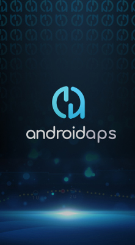

# 手機

目前版本的 **AAPS**（3.3）需要使用 Google **Android 11.0 或更高版本** 的 Android 智慧型手機。 如果您考慮購買新手機，(截至 2024 年 12 月)， **建議選擇 Android 14**。

請查看 [Facebook 或 Discord](../GettingHelp/WhereCanIGetHelp.md) 獲取有關此主題的最新更新。

為安全起見，強烈建議用戶保持其 **AAPS** 的版本為最新。 然而，對於無法使用 Android 11.0 或更新設備的用戶，仍可使用兼容舊版 Android 的早期 **AAPS** 版本，請參見：[發行說明](#maintenance-android-version-aaps-version)。

- [Jelly Pro 設定](../CompatiblePhones/Jelly.md)
- [華為設定](../CompatiblePhones/Huawei.md)

(Phones-list-of-tested-phones)=

## 測試過的手機列表

我們維護一份[已測試的硬體設置](https://docs.google.com/spreadsheets/u/1/d/e/2PACX-1vScCNaIguEZVTVFAgpv1kXHdsHl3fs6xT6RB2Z1CeVJ561AvvqGwxMhlmSHk4J056gMCAQE02sAWJvT/pubhtml?gid=683363241&single=true)清單。

此列表提供用戶對於使用手機搭配**AAPS**以及指定的幫浦和 CGM 的回饋。 這可以幫助你檢查你的手機/幫浦/CGM 是否有其他用戶已成功使用。

該文件為唯讀。 使用CTRL-F，你可以在Google表單的文字中搜尋。

若要記錄你的硬體設置測試，請填寫這個[表單](https://docs.google.com/forms/d/e/1FAIpQLSfoGKLYEx4aUAJ5RWL3xLJeNdmRyxtXmDzpGhuU3Rfcj2H_Jw/viewform)。 填寫表單資料後，該表格會自動每 5 分鐘更新一次

對於試算表的任何問題，請聯繫其維護者*@theodoor5137*，在 Discord 聯絡，或請參閱[我可以在哪裡獲得幫助? 頁面](../GettingHelp/WhereCanIGetHelp.md)。

## 我找不到我的手機

如果你對某個特定手機型號有疑問，請在我們的 [Facebook 或 Discord 社群](../GettingHelp/WhereCanIGetHelp.md) 搜尋或詢問。

如欲捐贈仍需測試的智慧型手機或智慧型手錶型號，請發送電子郵件至<donations@androidaps.org>。

(Phones-phone-wallpaper)=

## 手機桌布

如果你想以更多 **AAPS** 裝飾你的手機，可以 [在這裡下載背景圖片](../images/bg_phone.jpg)！

設計：Thiago :)