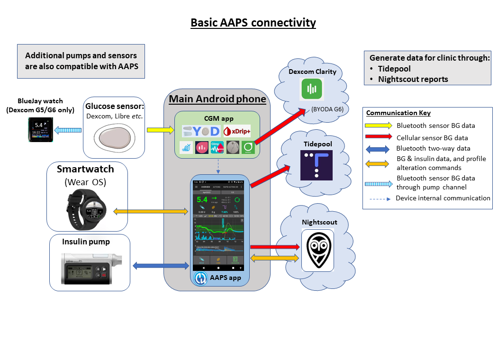
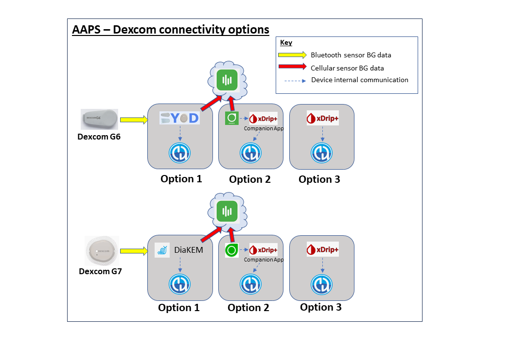
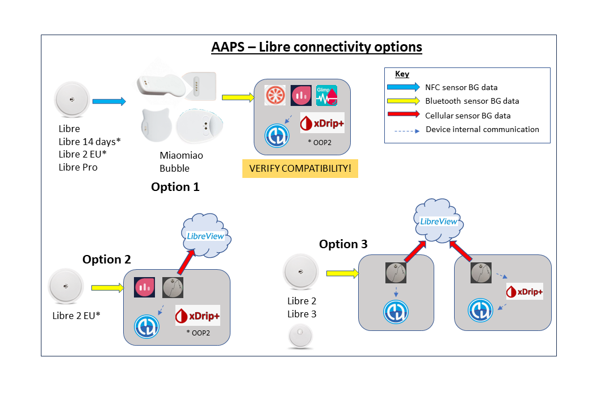
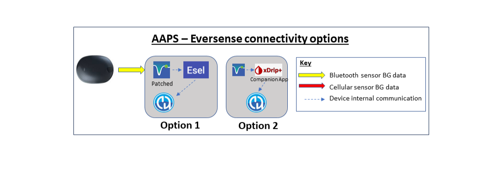

# 準備開始使用 AAPS

歡迎。 本文件主要在指導用戶準備設置並開始使用 Android 人工胰臟系統 (**AAPS**)。

## 如何在文件中找到所需訊息

可以在[這裡](../index.md)找到文件結構的**索引**和說明，你也可以點擊文件左上角的**AAPS**圖示進行查看。 在那裡，你會找到不同文件部分的總覽和目的。 你也可以使用此頁面左側的標題來瀏覽文件。 最後，文件**AAPS**圖示下方有一個方便的搜索功能。

我們主要在讓用戶輕鬆了解**AAPS**的功能和限制。 花時間閱讀文件後發現你的胰島素幫浦或 CGM 不相容，或者**AAPS**無法提供你期望的功能，這可能會令人失望。

文件中與**AAPS**使用體驗相關的許多細節在你實際使用**AAPS**時會更有意義。 就像只閱讀規則很難學習一項運動一樣，安全操作**AAPS**的基礎規則學習與開始使用**AAPS**後的應用相結合，才能有效掌握。

(preparing-safety-first)=

## 安全第一
“能力越大，責任越大……”

### 技術安全
**AAPS**具有一套廣泛的安全功能。 這些功能會透過逐步完成一系列[目標](../SettingUpAaps/CompletingTheObjectives.md)，包括測試特定參數並回答選擇題，逐步解除限制。 當成功完成目標後，**AAPS**的功能會逐步解鎖。 此過程允許用戶在從開環模式到閉環模式的過程中安全過渡，同時學習**AAPS**的不同功能。

[目標](../SettingUpAaps/CompletingTheObjectives.md)設計主要在為用戶提供最好的**AAPS**入門體驗，考慮到了**AAPS**開發者觀察到的新用戶典型錯誤和趨勢。 初學者因為經驗不足或過於急切開始使用**AAPS**而犯錯，或忽略了關鍵點。 這些[目標](../SettingUpAaps/CompletingTheObjectives.md)主要在盡量減少這些問題。

### 醫療安全
```{admonition} Avoid permanent and painful damage to your eyes and nerves
:class: danger
對於血糖控制迅速改善與 HbA1c 降低，建議要謹慎。 
```

一個重要的安全考量是，對於長期血糖升高的人來說，**HbA1c 的快速降低和血糖控制的改善可能會導致永久性損害**。 許多糖尿病患者並不知道這一點，而且並非所有臨床醫生都會提醒患者這個問題。

這種損害可能包括**視力喪失和永久性神經病變（疼痛）**。 可以通過更慢地降低平均血糖水平來避免此損害發生。 如果你目前的 HbA1c 升高並打算使用**AAPS**（或任何其他閉環系統），_請_在開始之前與你的醫療團隊討論這一潛在風險，並與他們協商逐步降低安全血糖目標的時間表。 你可以在**AAPS**中設置較高的血糖目標（目前，你可以選擇的最高目標是 10.6 mmol/L，你也可以維持一個相對較弱的設定），隨著時間的推移逐漸降低目標。

#### 我可以多快降低 HbA1c 而不會冒永久性損害的風險？

一項針對 76 名患者的回顧性[研究](https://pubmed.ncbi.nlm.nih.gov/1464975/)報告稱，如果 HbA1c 在 6 個月內下降 1%、2% 或 3%，視網膜病變進展的風險分別增加 1.6 倍、2.4 倍和 3.8 倍。 他們建議**"在任何 6 個月內 HbA1c 的降低幅度應限制在 2% 以內，以防止視網膜病變的進展...在開始血糖控制時，降低過快可能會導致視網膜病變進展的嚴重或暫時性惡化。" **

N.B. 如果你使用不同的 HbA1c 單位（mmol/mol 而非 %），請點擊[此處](https://www.diabetes.co.uk/hba1c-units-converter.html)使用 HbA1c 計算工具。

在另一項針對 954 名患者的回顧性[評估](https://academic.oup.com/brain/article/138/1/43/337923)中，研究人員指出：

**"HbA1c 在 3 個月內降低 2–3% 時，治療誘發糖尿病神經病變的絕對風險為 20%；而 HbA1c 在 3 個月內降低超過 4% 時，絕對風險超過 80%。"**

針對這項研究的一篇[評論](https://academic.oup.com/brain/article/138/1/2/340563)同意為了避免併發症，**目標應是在 3 個月內將 HbA1c 降低不超過 2%**。你可以在[這裡](https://www.ncbi.nlm.nih.gov/pmc/articles/PMC6587545/pdf/DOM-21-454.pdf)和[這裡](https://www.mdpi.com/1999-4923/15/7/1791)閱讀其他相關評論。

通常認為，_新診斷的_ 1 型糖尿病患者（通常在診斷時 HbA1c 非常高，在開始胰島素治療之前）可以立即迅速降低 HbA1c，而不會遇到這些風險，因為他們的血糖數值未長期升高。 然而，這仍然是一個需要與你的臨床醫生討論的考慮因素。

(PreparingForAaps-no-sglt-2-inhibitors)=
### 禁止使用 SGLT-2 抑制劑

```{admonition} NO SGLT-2 inhibitors
:class: danger
SGLT-2 抑制劑，也稱為 gliflozins，抑制腎臟對葡萄糖的再吸收。 Gliflozins 會無法預測地降低血糖數值，因此在使用類似 AAPS 的閉環系統時，絕對不能服用這類藥物！ 這會導致酮酸中毒和/或低血糖的重大風險！ 該藥物與降低基礎率以提高血糖數值的系統結合使用尤其危險。 

簡而言之：
- **範例 1: 低血糖風險**
>在午餐期間，你使用 **AAPS** 根據攝取 45g 葡萄糖進行注射。 問題是，由於<strong x-id="1">AAPS</strong>未知道抑制劑使身體排除了一些碳水化合物，導致攝取的胰島素過多，最終引發低血糖。

- **範例 2: 酮症酸中毒風險**
>抑制劑消除了一些背景中的碳水化合物，導致你的血糖降低。 **AAPS** 將自動指示幫浦減少胰島素攝取，包括基礎。 隨著時間的推移，這可能導致血糖保持在目標值以下，直到身體沒有足夠的背景胰島素來吸收碳水化合物，最終引發酮酸中毒。 通常，1 型糖尿病患者會因為幫浦故障而發展成酮酸中毒，這會觸發手機警報，並透過血糖值升高來顯示出來。 然而，使用 Gliflozins 的危險在於，<strong x-id="1">AAPS</strong> 不會發出警報，因為幫浦仍然正常運作，且血糖可能保持在目標範圍內。  

常見的 SGLT-2 抑制劑品牌名稱包括：Invokana、Farxiga、Jardiance、Glyxambi、Synjardy、Steglatro 和 Xigduo XR 等。
```


### 使用 AAPS 循環的關鍵原則

在使用**AAPS**之前，必須了解循環的關鍵原則和概念。 這需要你投入個人時間來閱讀**AAPS**文件，並完成目標，這些目標主要在為安全和有效使用**AAPS**提供堅實的基礎。 **AAPS**文件的內容量可能一開始會讓人感到不知所措，但請保持耐心並相信過程 - 使用正確的方法，你會逐漸掌握的！

進度的速度取決於個人，但完成所有目標通常需要 6 - 9 週的時間。 許多人會在開始使用**AAPS**之前就開始建置、安裝和設置。 為了幫助這一過程，系統提供了“虛擬幫浦”，可以在完成早期目標時使用，這樣你可以熟悉**AAPS**，而不需要實際使用他來輸送胰島素。 以下提供了詳細的時間表，請注意，當你完成**AAPS**的目標 8 時，你已進入閉環模式，後期目標包括一些附加功能，例如**SMS 指令**和**自動化**，這對某些用戶很有用，但對**AAPS**的核心功能不是必需的。

成功使用**AAPS**需要積極的態度，願意反思血糖資料，並靈活調整**AAPS**以改善你的結果。 就像僅透過閱讀規則來學習運動幾乎是不可能的，同樣的道理也適用於**AAPS**。

#### 為設定和運作所有功能可能出現的延誤和小問題做好準備

在**AAPS**的初步階段，你可能會遇到將循環的所有組件（以及潛在的追蹤者）有效通訊以及微調設置的困難。 有些問題只有在日常生活中使用**AAPS**時才能解決，但在 Facebook 群組和 Discord 上有大量幫助可供使用。 請相應地進行計劃，並選擇“適當的”時間，例如週末的安靜早晨（即不要在深夜或感到疲倦時，也不要在重要會議或旅行之前）進行問題排除和解決問題。

#### 技術相容性

**AAPS**僅與某些類型的胰島素幫浦、CGM 和手機相容，有些技術在某些國家/地區可能無法使用。 為避免任何失望或沮喪，請閱讀[CGM](../Getting-Started/CompatiblesCgms.md)、[幫浦](../Getting-Started/CompatiblePumps.md)和[手機](../Getting-Started/Phones.md)部分。

#### 應用程序建置時間和進入完整閉環的進度

建置**AAPS**應用程序的時間取決於你的專業知識和技術能力。 通常對於沒有經驗的用戶，建置**AAPS**可能需要半天到一天的時間（有社區的幫助）。 隨著你變得更加有經驗，更新版**AAPS**的建置過程會顯著加快。

為了幫助建置過程，有專門的部分：

- 列出**AAPS**中可能出現的常見錯誤的問答清單，請參閱[常見問題（K 部分）](../UsefulLinks/FAQ.md)；

- “[如何安裝 AAPS](../SettingUpAaps/BuildingAaps.md)？” （D 部分），包括[問題排除](../GettingHelp/GeneralTroubleshooting.md)子部分。

達到閉環控制的時間因人而異，但使用 AAPS 達到全閉環控制的大致時間表可以參考[>此處](#how-long-will-it-take-to-set-everything-up)。


#### Keystore 和配置設置匯出文件

“Keystore”（.jks 文件）是一個加密的文件，特定於你自己的**AAPS**副本。 你的 Android 手機使用他來確保沒有人可以在沒有 keystore 的情況下升級你的副本。 簡單來說，作為**AAPS**建置的一部分，你應該：

1.  將你的 keystore 文件（用於簽署應用程序的 .jks 文件）儲存在安全的地方；

2.  記下你的 keystore 文件密碼。


這將確保每次建立**AAPS**的更新版本時，你都可以使用相同的 keystore 文件。 平均而言，每年需要更新**AAPS**兩次。

此外，**AAPS**還提供了[匯出所有配置設置](../Maintenance/ExportImportSettings.md)的功能。 這確保你可以在更換手機、升級/重新安裝應用程序時安全恢復系統，並將干擾降至最低。 

#### 問題排除

如果你對任何問題感到不確定，請隨時聯繫**AAPS**社區——沒有什麼問題是愚蠢的！ 鼓勵具有不同經驗數值的所有用戶提出問題。 由於**AAPS**用戶眾多，問題的回應時間通常很快。

##### [在 AAPS Facebook 社群上詢問](https://www.facebook.com/groups/AndroidAPSUsers/)

##### [在 AAPS Discord 頻道上詢問](https://discord.gg/4fQUWHZ4Mw)


#### [去哪裡尋求幫助](../UsefulLinks/BackgroundReading.md)？

本節主要在為新用戶提供資源連結，以便獲得幫助，包括由新手和有經驗的用戶組成的社區支援，這些用戶可以幫助解答問題並解決使用 AAPS 時常見的問題。

#### [臨床醫師專區](../UsefulLinks/ClinicianGuideToAaps.md)

這是一個[專為臨床醫師設計的部分](../UsefulLinks/ClinicianGuideToAaps.md)，適合希望了解 AAPS 和開源人工胰腺技術更多信息。 在簡介中還提供了[如何與你的臨床團隊討論 AAPS](#introduction-how-can-i-approach-discussing-aaps-with-my-clinical-team)的指南。

## 我們要建置和安裝什麼？

此圖表提供了**AAPS**系統的主要組件（硬體和軟體）的總覽：




除了三個基本硬體組件（手機、胰島素幫浦、血糖傳感器）之外，我們還需要：1) **AAPS**應用程式 2) 報告伺服器3) 持續血糖監測儀（CGM）應用程式

### 1) Android 手機應用程式：**AAPS**

**AAPS**是一個運作在 Android 智慧型手機和裝置上的應用程式。 你將依照逐步指南，從 GitHub 下載 **AAPS** 的原始碼，並在你的電腦上安裝必要的程式（如 Android Studio、GitHub Desktop），自行建置屬於自己的 **AAPS** 應用程式（apk 檔）。 然後，你將透過電子郵件、USB 線等方式將**AAPS**應用程式傳輸到你的智慧型手機並安裝。

### 2) 報告伺服器：NightScout（或 Tidepool）

為了充分利用**AAPS**，你需要設置 Nightscout 伺服器。 你可以[自己動手](https://nightscout.github.io/nightscout/new_user/#free-diy)，或者支付小額費用讓[代理的Nightscout服務](https://nightscout.github.io/#nightscout-as-a-service)為你設置。 Nightscout 用於收集**AAPS**隨時間推移的資料，並能夠生成詳細的報告，以關聯 CGM 和胰島素模式。 照護者還可以使用 Nightscout 遠端與**AAPS**應用程式通訊，以監控其孩子的糖尿病管理。 這些遠端通訊功能包括即時監控血糖和胰島素數值、遠端注射胰島素（透過發送訊息）以及餐點通知。 試圖將 CGM 資料與幫浦資料分開進行分析，就像駕駛時司機是盲人，乘客在旁描述場景一樣。  從 AAPS 3.2 版開始，也可以使用 Tidepool 作為 Nightscout 的替代方案。

### 3) CGM 傳感器應用程式

根據你的血糖傳感器/CGM，你將需要一個相容的應用程式來接收血糖資料並將其發送到**AAPS**。 以下展示了不同的選項，更多訊息請參閱[相容的 CGM 部分](../Getting-Started/CompatiblesCgms.md)：

  

### AAPS 系統的維護

**Nightscout**和**AAPS**必須大約每年更新一次，隨著改進版本的發佈。 在某些情況下，更新可以延後，但在其他情況下，更新被強烈建議或視為安全的重要措施。 這些更新的通知將在 Facebook 群組和 Discord 伺服器上發佈。 發佈說明將明確說明具體情況。 在更新時，可能會有許多人與你提出類似問題，你將獲得支援來進行更新。

(preparing-how-long-will-it-take)=
## 設置所有內容需要多長時間？

如前所述，使用**AAPS**更像是一段旅程，需要你投入個人時間。 這不是一次性的設置。 關於建立建置**AAPS**、安裝和配置**AAPS**和**CGM**軟體，到從開放循環進入混合閉環循環的過程，大約需要 4 到 6 個月。 因此建議你優先建立 **AAPS** 應用程式並儘快完成早期目標，即使你仍然在使用其他胰島素輸送系統（你可以使用虛擬幫浦到達目標 5）。

部分目標需要一定的天數以確保你暸解新功能。 無法跳過此等待時間，這些最小時間是為了你的安全而設定的。

以下是大致的時間表：

| 任務                                        |      大致時間      |
| ----------------------------------------- |:--------------:|
| 初步閱讀文件                                    |     1-2 天      |
| 安裝/配置電腦以允許建立                              |     2-8 小時     |
| 設置報告伺服器                                   |      1 小時      |
| 安裝 CGM 應用程式 (xDrip+、BYODA 等)              |      1 小時      |
| 初步配置 CGM → xDrip+ → APPS                  |      1 小時      |
| 初步配置 AAPS → 幫浦                            |      1 小時      |
| 初步配置 AAPS → Nightscout/Tidepool（僅限報告）     |      1 小時      |
| 可選：配置 Nightscout ↔ **AAPS** 及 NSFollowers |      1 小時      |
| 目標 1：設置可視化和監控                             |      1 小時      |
| 目標 2：學習如何控制 AAPS                          |      2 小時      |
| 目標 3：證明你的知識                               |    最多 14 天     |
| 目標 4：開始使用開環                               |     最少 7 天     |
| 目標 5：暸解你的開環                               |      7 天       |
| 目標 6：開始閉環（LGS - 低血糖暫停）                    | 最少 5 天，最多 14 天 |
| 目標 7：調整閉環                                 | 最少 1 天，最多 7 天  |
| 目標 8：調整基礎率和比例，啟用 Autosens                 | 最少 7 天，最多 14 天 |
| 目標 9：啟用超微量注射 (SMB)                        |    最少 28 天     |
| 目標 10：自動化                                 |    最少 28 天     |
| 目標 11：動態 ISF                              |    最少 28 天     |

當你開始使用**AAPS**，你仍然需要定期調整設定，以持續改善你的糖尿病管理。

## 需求

### 醫療考量

除了 [安全部分](#safety-first) 中的醫療警告外，根據你在幫浦中使用的胰島素類型，還有不同的參數需要考量。

#### 胰島素選擇

**AAPS** 的計算是基於 100U/ml 的胰島素濃度（與幫浦的標準一致）。 目前支援的胰島素輪廓預設如下：

- 速效型 Oref：Humalog/NovoRapid/NovoLog
- 超速效型 ORef：Fiasp
- Lyumjev：

僅供實驗/進階用戶：
- 自由峰值 Oref：允許你自行定義胰島素活性的峰值


### 技術性

本文件主要在將技術專業知識的需求降到最低。 你將需要使用電腦在 Android Studio 中建置 **AAPS** 應用程式（逐步指導）。 你還需要在公共雲端上設定一個伺服器，配置幾個 Android 手機應用程式，並發展糖尿病管理的專業知識。 這可以透過逐步行動、保持耐心並從 **AAPS** 社群中獲得幫助來實現。 如果你已經能夠瀏覽網際網路、管理自己的 Gmail 郵件並保持電腦更新，那麼建置 **AAPS** 是一項可行的任務。 只需花點時間。

### 智慧型手機

#### AAPS 與 Android 版本

目前版本的 **AAPS**（3.3）需要使用 Google **Android 11.0 或更高版本** 的 Android 智慧型手機。 如果你考慮購買新手機，(截至 2024 年 12 月)，建議使用 Android 14。<br/> 強烈建議使用者將 **AAPS** 的版本保持最新，以確保安全。 然而，對於無法使用 Android 11.0 或更新版本的使用者，早期版本的 **AAPS** 仍然可與舊版 Android 相容，詳情請見： [版本說明](#maintenance-android-version-aaps-version)。

#### 智慧型手機型號選擇
你選購的具體型號取決於所需的功能。 你可以在 [手機頁面](../Getting-Started/Phones.md) 上找到推薦與用戶對於可用設置的反饋。

我們鼓勵用戶保持手機 Android 版本的最新狀態，包括安全參數。 然而，如果你是 **AAPS** 的新手，或者不是技術專家，你可能希望等到其他人確認更新是安全的後再進行更新，這可以透過我們的各大論壇確認。

```{admonition} delaying Samsung phones updates
:class: warning
三星有迫使更新其手機的糟糕紀錄，這會導致藍牙連線問題。 要禁用這些強制更新，您需要將手機切換到「開發者模式」，步驟如下：
前往設定，然後關於，之後點擊軟體資訊，然後按建構號直到確認您已解鎖開發者模式。 返回設置主選單，你應該會看到一個新的“開發者選項”選單項。 打開開發者選項並向下滾動以找到自動系統更新並關閉他
```

```{admonition} Google Play Protect potential Issue
:class: warning
每個早晨都有幾份報告指出 **AAPS** 被 Google Play Protect 任意關閉。 如果發生此問題，你需要進入 Google Play 的選項，停用 “Google Play Protect”。 並非所有手機型號或所有 Android 版本都會受到影響。
```

