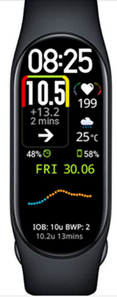

# 智慧型手錶與 AAPS

各種智慧型手錶可以用來顯示 **AAPS** 中可用的一些資訊或執行遠端操作。

讓智慧型手錶直接控制 **AAPS**（幫浦和傳感器）需要使用完整的 Android 手錶（被視為小型 [智慧型手機](./Phones.md)）。

某些智慧型手錶可以讓你輸入治療方案或更多，但手機本身仍然管理 **AAPS**。

智慧型手錶越來越多地與 **AAPS** 結合使用，_無論是_ 對於患有糖尿病的成年人還是兒童的照護者/父母。

## 使用智慧型手錶搭配 **AAPS** 的一般優勢


根據不同的型號，智慧型手錶可以以多種不同的方式與 **AAPS** 結合使用。 他們可以用來完全或部分控制 **AAPS**，或者只是遠端查看血糖值、胰島素剩餘量（IOB）及其他參數。

在很多情況下，將智慧型手錶與 **AAPS** 整合非常有用，包括開車或騎車時，以及進行運動時。 有些人認為在會議、聚會、餐桌上等場合看手錶比看手機更為低調。 從安全的角度來看，當移動時，智慧型手錶還能提供幫助，使用戶可以將 **AAPS** 手機存放在看不見的地方（例如包內），但仍可以透過智慧型手錶進行遠端控制。

## 父母/照護者使用 **AAPS** 的具體優勢

對於孩子來說，如果他們的 **AAPS** 手機在附近，照護者可以使用智慧型手錶進行監控或修改，而無需使用 **AAPS** 手機。 例如，當 **AAPS** 手機藏在幫浦腰帶中時，這會很有用。

智慧型手錶可以作為[僅關注](../RemoteFeatures/FollowingOnly.md)的選擇，或作為{em x-id="4">額外</em>的手機遠端控制選項。

此外，與依賴移動網路或 Wi-Fi 連線的父母/照顧者追蹤手機不同，藍牙連接的智慧型手錶在遠端地點（如洞穴、船上或山腰）也可以非常有用。 如果兩個設備（**AAPS** 手機和智慧型手錶）都連線到相同的 Wi-Fi 網絡，他們也可以使用 Wi-Fi。

## 不同類型的智慧型手錶與 AAPS 的互動方式

目前有五種主要方式可將智慧型手錶與 **AAPS** 結合使用。 這些方式在下表中顯示： 

| 手錶設定   | 功能                 | 需求                                                                                                                                                                                                                                   |
| ------ | ------------------ | ------------------------------------------------------------------------------------------------------------------------------------------------------------------------------------------------------------------------------------ |
| 獨立運作   | 無需手機的 AAPS         | 完整 Android 智慧型手錶（檢查最小 Android 版本）</br>運行 **app-fullRelease**                                                                                                                                                                         |
| 完全遠端控制 | 大部分 AAPS 功能        | Android **Wear OS** 手錶（檢查 Android /API）</br>運行 **wear-fullRelease**                                                                                                                                                                  |
| 遠端控制   | AAPSClient 功能      | Android **Wear OS** 手錶（檢查 Android/API）</br>運行 **[wear-aapsclientRelease](https://github.com/nightscout/AndroidAPS/releases)**                                                                                                        |
| 遠端控制   | 部分 AAPSClient 功能   | 一些三星、Fitbit 和 Garmin 手錶</br>見下文。                                                                                                                                                                                                     |
| 顯示     | 顯示一些 AAPSClient 指示 | 許多智慧型手錶（見 [這裡](https://bigdigital.home.blog/)）</br>[xDrip+](https://github.com/nightscoutfoundation/xdrip/releases) 和 [WatchDrip+](https://bigdigital.home.blog/2022/06/16/watchdrip-a-new-application-for-xdrip-watch-integration/) |

## 在購買智慧型手錶之前……

你購買的智慧型手錶具體型號取決於你所需的功能。 你可能會在 [手機頁面](#Phones-list-of-tested-phones) 上找到有用的信息，包括一份測試過的手機列表，還包含一些智慧型手錶。

受歡迎的手錶品牌包括三星 Galaxy、Garmin、Fossil、米動手環和 Fitbit。 上面表格中不同選項的摘要將在下面詳細說明，幫助你決定哪款智慧型手錶最適合你的情況。

如果你打算將智慧型手錶與**AAPS** 手機結合使用並遠端操作**AAPS**，你還需要考慮這兩個設備是否相容，尤其是如果你的手機較舊或比較特殊。

一般來說，如果你只想要追蹤血糖資料而不與**AAPS** 進行互動，有更多價格實惠且簡單的手錶可供選擇。

選擇智慧型手錶的最佳方式是搜尋 Discord 或 Facebook**AAPS** 群組中的“手錶”相關帖子。 閱讀其他人的經驗分享，如果舊帖子中未解答你的問題，請發布具體問題。

## 完整簽章

這聽起來像是一個很有吸引力的選項，對嗎？ 然而，目前只有少數愛好者正在嘗試在獨立手錶上運作 **AAPS**。 能夠與 **AAPS** 和你的 CGM 應用程式一起良好運作的獨立手錶界面目前數量有限。 熱門型號包括LEMFO LEM。 你需要在手錶上載入 **AAPS** 的“完整” apk（通常安裝在智慧型手機上的 apk），而不是 **AAPS** 的“wear” apk。

雖然目前沒有明確的規範告訴你哪款手錶適合獨立使用 **AAPS**，但以下參數會有所幫助：

1)  Android 11 或更新版本。 2)  能夠將錶盤從“方形”模式移除，以使文本更大、更易讀。 3)  非常好的電池續航能力。 4) 良好的藍牙範圍。

大多數在獨立手錶上運作 **AAPS** 的挫折來自於與小螢幕的互動，並且目前 **AAPS** 完整應用程式的界面並非為手錶設計。 由於螢幕大小受限，你可能會更願意使用觸控筆來編輯 **AAPS** 設定，並且某些 **AAPS** 按鈕可能無法在手錶螢幕上顯示。

額外的挑戰包括很難獲得足夠的電池續航能力，並且擁有足夠電池容量的手錶通常體積龐大且厚重。 用戶反映，他們在使用手錶時遇到以下問題：需要花很多功夫調整作業系統和省電設定、啟動傳感器困難、藍牙範圍不足（難以同時維持與傳感器及幫浦的連線），以及防水性能令人存疑。 示例顯示在下面的照片中。


如果你有興趣設置獨立手錶，請閱讀 **AAPS** Facebook 群組中的帖子和評論（好的搜尋詞是“standalone”和“Lemfo”）以及 Discord 獲取更多資訊。

## Wear OS

**AAPS** 程式碼包含一個應用外掛，可安裝在[**Wear OS** 智慧型手錶](https://wearos.google.com/#oem-carousel)上。


驗證你的智慧型手錶是否滿足 **AAPS** [前置條件](#maintenance-android-version-aaps-version)。

### 什麼是 _Wear OS_？

前三個智慧型手錶選項要求智慧型手錶安裝 **Wear OS**。

**Wear OS** 是運作在部分現代 Android 智慧型手錶上的作業系統。 如果智慧型手錶的描述僅指示與 Android 和 iOS 相容，則並不意味著他運作的是 **Wear OS**。 他可能運作的是其他供應商專用的作業系統，這些系統不與 **AAPS** 相容。 要支援任何版本的**AAPS**或**AAPSClient**的安裝和使用，智慧手錶必須運行**Wear OS**並且是Android 11或更新版本。 作為參考，截至 2024 年 10 月，**Wear OS** 的最新版本是基於 Android 13 的 5.0 版本。

如果你在 **Wear OS** 手錶上安裝 **AAPS** wear.apk，將可以選擇不同的自訂 **AAPS** 錶盤。 或者，你可以使用標準的智慧型手機錶盤，並在錶盤上包含稱為“小工具”的小方塊，顯示你的 **AAPS** 資訊。 複雜功能是指除了時間之外，顯示在錶盤上的任何功能。


### 我的智慧型手錶會長什麼樣子？

在 [安裝 **AAPS** 到你的手錶後](../WearOS/WearOsSmartwatch.md)，你將自動能選擇你喜歡的錶盤，這些都是專為 **AAPS** 設計的錶盤。 在大多數手錶上，你只需長按主畫面，直到畫面縮小，然後向右滑動以選擇另一個畫面：


這些是嵌入在 **AAPS** 中的基本畫面，還有[更多的錶盤](#WearOS_changing-to-AAPS-watchface)，並且你也可以使用[複雜功能](#Watchfaces-complications)。

### 如何在日常操作中使用 Wear OS 手錶？

有關錶盤的更多細節和日常使用，包括如何製作（和分享）自己的自訂錶盤，請參閱[在智慧型手錶上操作 Wear AAPS](../WearOS/WearOsSmartwatch.md)的部分。

(Watchfaces-tizen)=

## 三星 Tizen

**AAPS** 支援將資料傳送到[G-Watch 應用程式](https://play.google.com/store/apps/details?id=sk.trupici.g_watch)。

請查看專屬的[Facebook 群組](https://www.facebook.com/groups/gwatchapp)以獲得最新消息。


(Watchfaces-garmin)=

## Garmin

在 Garmin ConnectIQ 商店中，有一些與 [AAPS](https://apps.garmin.com/search?keywords=androidaps) 整合的 Garmin 錶盤。


[AAPS Glucose Watch](https://apps.garmin.com/apps/3d163641-8b13-456e-84c3-470ecd781fb1) 直接與 **AAPS** 整合。 它除了顯示血糖數值外，還顯示循環狀態資料（體內胰島素、臨時基礎）並將心率數值傳送至 **AAPS**。 它在 ConnectIQ 商店中可用，所需的 **AAPS** 外掛僅在 **AAPS** 3.2 中可用。 


## Fitbit

```{Warning}
Google 正在逐步淘汰 Fitbit 產品。 自訂錶盤在歐洲不再可用（你需要使用 VPN）。 現在不建議購買 Fitbit。
```

**AAPS** 支援將資料傳送到[Sentinel](http://ryanwchen.com/sentinel.html) 錶盤。


**"Sentinel"** 是一款由[Ryan Chen](http://ryanwchen.com/sentinel.html) 為其家人開發並免費提供給 FitBit 智慧型手錶的錶盤：Sense1/2, Versa 2/3/4。 他與 FitBit Luxe 不相容，因為他只是健身追蹤器。 Sentinel 可以從[FitBit 移動應用程式](https://gallery.fitbit.com/details/5f75448f-413d-4ece-a53d-b969c6afea7c)下載。

他允許使用 Dexcom Share、Nightscout 或兩者結合作為資料來源，來監控一個、兩個或三個人的血糖數值。

如果與本地網頁伺服器模式一起使用，你還可以使用 xDrip+ 或 SpikeApp。 用戶可以設置自定義警報，並透過 Nightscout 的 careportal 功能提交事件，直接從手錶追蹤胰島素剩餘量（IOB）、碳水化合物剩餘量（COB），輸入餐食資訊（碳水化合物計數和注射量），以及血糖檢查數值。

所有這些都將顯示在 Nightscout 的時間軸圖表中，並作為更新值顯示在 IOB 和 COB 欄位中。 社群支援可以在專門的[Facebook 群組 Sentinel](https://www.facebook.com/groups/3185325128159614)中找到。

FitBit 手錶還有一些僅限於監控的選項。 這包括[Glance](https://glancewatchface.com/)。 這些額外選項在[Nightscout 網頁](https://nightscout.github.io/nightscout/wearable/#fitbit)中有描述。

## 僅跟隨

這些智慧型手錶會顯示一些**AAPS** 的資訊，其中一些需要其他應用程式。

還有各種經濟實惠的智慧型手錶可供顯示資料使用。 如果你使用 Nightscout，那麼這裡有關所有選項的一個不錯的總覽 [這裡](https://nightscout.github.io/nightscout/wearable/#)

以下是一些受到 **AAPS** 用戶喜愛的僅跟隨手錶選項：

### **小米和 Amazfit 手錶**

[Artem](https://github.com/bigdigital) 為各種智慧型手錶型號建立了一個 xDrip+ 集成應用程式 WatchDrip+，主要針對小米（如 Mi band）和 Amazfit 品牌：




你可以在他的网站[這裡](https://bigdigital.home.blog/)了解更多，包括如何設置。 這些手錶的優勢在於它們小巧且相對實惠。 他們是兒童和手腕較小的人們一個不錯的選擇。

### Pebble 手錶


Pebble 手錶（[現已停產](https://en.wikipedia.org/wiki/Pebble_(watch))）從 2013 年到 2016 年一般出售，可能仍有二手產品可供購買。 Fitbit 接管了 Pebble 的資產。 Pebble 用戶可以使用 Urchin 表盤查看 Nightscout 資料。 顯示的資料選項包括 IOB、目前的臨時基礎速率和預測值。 如果使用開放循環，你可以使用 IFTTT 建立一個應用程式，如果收到來自**AAPS**的通知，則發送 SMS 或 pushover 通知。

### [Bluejay 手錶](https://bluejay.website/)


這些是獨特的技術產品，可以直接從 Dexcom 發射器接收血糖資料。 Dexcom G6/G7 發射器實際上是透過兩個獨立的頻道傳播當前的血糖資料，分別是電話頻道和醫療頻道，這一點並不為廣泛知曉。 Bluejay 手錶可以設置為接收任一頻道上的血糖資料，因此如果 **AAPS** 使用電話頻道，則 Bluejay 手錶可以使用醫療頻道。

其主要優點是他目前是唯一完全獨立於手機和循環系統的手錶。 So, for example, if you disconnect the pump and the **AAPS** phone at the beach or theme park, and are out of range of the **AAPS** phone, you can still get readings from your Dexcom directly to the Bluejay watch.

報告的缺點包括它不一定每 5 分鐘都能讀取一個資料，且電池不可更換。 Bluejay GTS 手錶運行的是修改過的 xDrip+ 軟體，而 Bluejay U1 則運行完整的 xDrip+。

### Apple 手錶

查看[手錶上的 Nightscout](https://nightscout.github.io/nightscout/wearable/#)。

Apple 手錶現在支援 G7 直接連接，並且可以和 **AAPS** 同時使用。

