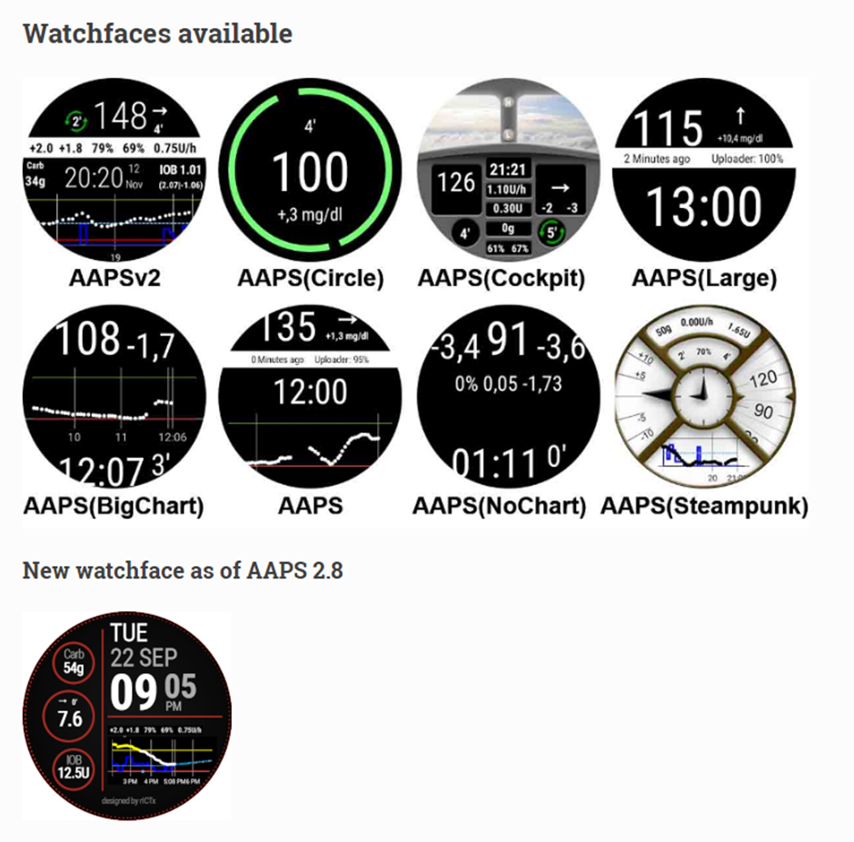

# Smartwatches and AAPS

Various smartwatches can be used to display some of the information available in **AAPS** or perform remote actions.

Having a smartwatch directly control **AAPS** (pump and sensor) is achieved using full Android watches (that are considered like small [smartphones](./Phones.md)).

Some smartwatches can allow you to enter treatments, or more, but with the phone itself still managing **AAPS**.

智慧型手錶越來越多地與 **AAPS** 結合使用，_無論是_ 對於患有糖尿病的成年人還是兒童的照護者/父母。

## 使用智慧型手錶搭配 **AAPS** 的一般優勢


根據不同的型號，智慧型手錶可以以多種不同的方式與 **AAPS** 結合使用。 他們可以用來完全或部分控制 **AAPS**，或者只是遠端查看血糖值、胰島素剩餘量（IOB）及其他參數。

在很多情況下，將智慧型手錶與 **AAPS** 整合非常有用，包括開車或騎車時，以及進行運動時。 有些人覺得在會議、聚會、餐桌等場合查看手錶比查看手機更加低調。 從安全的角度來看，當移動時，智慧型手錶還能提供幫助，使用戶可以將 **AAPS** 手機存放在看不見的地方（例如包內），但仍可以透過智慧型手錶進行遠端控制。

## 父母/照護者使用 **AAPS** 的具體優勢

對於孩子來說，如果他們的 **AAPS** 手機在附近，照護者可以使用智慧型手錶進行監控或修改，而無需使用 **AAPS** 手機。 例如，當 **AAPS** 手機藏在幫浦腰帶中時，這會很有用。

智慧手錶可以作為[僅關注](../RemoteFeatures/FollowingOnly.md)的選擇，或作為{em x-id="4">額外</em>的手機遠端控制選項。

Additionally, unlike parent/caregiver follower phones (which rely on the mobile network or Wi-Fi connection), Bluetooth connected smartwatches can be useful in remote locations, like a cave, in a boat, or half-way up a mountain. 如果兩個設備（**AAPS** 手機和智慧型手錶）都連線到相同的 Wi-Fi 網絡，他們也可以使用 Wi-Fi。

## 不同類型的智慧型手錶與 AAPS 的互動方式

目前有五種主要方式可將智慧型手錶與 **AAPS** 結合使用。 這些方式在下表中顯示： 

| Watch Setup         | Features                            | 需求                                                                                                                                                                                                                                                    |
| ------------------- | ----------------------------------- | ----------------------------------------------------------------------------------------------------------------------------------------------------------------------------------------------------------------------------------------------------- |
| Standalone          | AAPS without a phone                | Full Android smartwatch (check min Android)</br> Running **app-fullRelease**                                                                                                                                                                          |
| Full remote control | Most AAPS functions                 | Android **Wear OS** watch (check Android/API)</br>Running **wear-fullRelease**                                                                                                                                                                        |
| Remote control      | AAPSClient functions                | Android **Wear OS** watch (check Android/API)</br>Running **[wear-aapsclientRelease](https://github.com/nightscout/AndroidAPS/releases)**                                                                                                             |
| Remote control      | Some AAPSClient functions           | Some Samsung, Fitbit and Garmin watches</br>See below.                                                                                                                                                                                                |
| Display             | Display some AAPSClient indications | Many smartwatches (see [here](https://bigdigital.home.blog/))</br>[xDrip+](https://github.com/nightscoutfoundation/xdrip/releases) and [WatchDrip+](https://bigdigital.home.blog/2022/06/16/watchdrip-a-new-application-for-xdrip-watch-integration/) |

## 在購買智慧型手錶之前……

你購買的智慧型手錶具體型號取決於你所需的功能。 你可能會在 [手機頁面](#Phones-list-of-tested-phones) 上找到有用的信息，包括一份測試過的手機列表，還包含一些智慧型手錶。

受歡迎的手錶品牌包括三星 Galaxy、Garmin、Fossil、米動手環和 Fitbit。 The different options summarized in the Table above are explained in more detail below, to help you decide which smartwatch is right for your situation.

如果你打算將智慧型手錶與**AAPS** 手機結合使用並遠端操作**AAPS**，你還需要考慮這兩個設備是否相容，尤其是如果你的手機較舊或比較特殊。

一般來說，如果你只想要追蹤血糖資料而不與**AAPS** 進行互動，有更多價格實惠且簡單的手錶可供選擇。

選擇智慧型手錶的最佳方式是搜尋 Discord 或 Facebook**AAPS** 群組中的“手錶”相關帖子。 閱讀其他人的經驗分享，如果舊帖子中未解答你的問題，請發布具體問題。

## Full Android

這聽起來像是一個很有吸引力的選項，對嗎？ 然而，目前只有少數愛好者正在嘗試在獨立手錶上運作 **AAPS**。 能夠與 **AAPS** 和你的 CGM 應用程式一起良好運作的獨立手錶界面目前數量有限。 受歡迎的型號包括 LEMFO LEM 14、15 和 16。 你需要在手錶上載入 **AAPS** 的“完整” apk（通常安裝在智慧型手機上的 apk），而不是 **AAPS** 的“wear” apk。

雖然目前沒有明確的規範告訴你哪款手錶適合獨立使用 **AAPS**，但以下參數會有所幫助：

1)  Android 10 或更新版本。 2)  能夠將錶盤從“方形”模式移除，以使文本更大、更易讀。 3)  非常好的電池續航能力。 4)  Good Bluetooth range.

大多數在獨立手錶上運作 **AAPS** 的挫折來自於與小螢幕的互動，並且目前 **AAPS** 完整應用程式的界面並非為手錶設計。 由於螢幕大小受限，你可能會更願意使用觸控筆來編輯 **AAPS** 設定，並且某些 **AAPS** 按鈕可能無法在手錶螢幕上顯示。

額外的挑戰包括很難獲得足夠的電池續航能力，並且擁有足夠電池容量的手錶通常體積龐大且厚重。 Users report fighting with the OS and power-saving settings, difficulty in starting sensors on the watch, poor Bluetooth range (for maintaining connection with both the sensor and pump) and questionable water resistance. Examples are shown in the photos below.


如果你有興趣設置獨立手錶，請閱讀 **AAPS** Facebook 群組中的帖子和評論（好的搜尋詞是“standalone”和“Lemfo”）以及 Discord 獲取更多資訊。

## Wear OS

**AAPS** code contains an app extension that can be installed on [**Wear OS** smartwatches](https://wearos.google.com/#oem-carousel).


Verify your smartwatch satisfies **AAPS** [prerequisites](#maintenance-android-version-aaps-version).

### What _is_ Wear OS?

前三個智慧型手錶選項要求智慧型手錶安裝 **Wear OS**。

**Wear OS** 是運作在部分現代 Android 智慧型手錶上的作業系統。 在 [2018年](https://en.wikipedia.org/wiki/Wear_OS)，Google 將 _Android Wear 1.x_ 更名為 **Wear OS**，版本為 2.x。 因此，如果某款設備標示為“_Android Wear_”而不是 **Wear OS**，這可能表示該設備運作的是較舊版本。 如果智慧型手錶的描述僅指示與 Android 和 iOS 相容，則並不意味著他運作的是 **Wear OS**。 他可能運作的是其他供應商專用的作業系統，這些系統不與 **AAPS** 相容。 要支援安裝和使用任何版本的 **AAPS** 或 **AAPSClient**，智慧型手錶必須運作 **Wear OS**，且最好是 Android 10 或更新版本。 作為指引，截至 2023 年 10 月，**Wear OS** 的最新版本是基於 Android 13 的 4.0 版本。

If you install **AAPS** wear.apk on a **Wear OS** watch, there are a range of different custom **AAPS** watchfaces which can be selected. 或者，你可以使用標準的智慧型手機錶盤，並在錶盤上包含稱為“小工具”的小方塊，顯示你的 **AAPS** 資訊。 A complication is any feature that is displayed on a watchface in addition to the time. 像這樣的小工具需要 Wear OS 2.0 或更新版本才能正常運作。


### What could my smartwatch look like?

After [installing **AAPS** onto your watch](../WearOS/WearOsSmartwatch.md), you will automatically be able to select your preferred watchface from these **AAPS**-dedicated watchfaces. On most watches, you simply long-press on the home screen until the screen shrinks and swipe right to select an alternative screen:



These are the basic screens embedded in **AAPS**, there are [more watchfaces](#WearOS_changing-to-AAPS-watchface) and you can also use [complications](#Watchfaces-complications).

### 如何在日常操作中使用 Wear OS 手錶？

Further details about the watchfaces, and day-to-day use, including how to make (and share) your own customized watchface, can be found in the section [Operation of Wear AAPS on a Smartwatch](../WearOS/WearOsSmartwatch.md).

(Watchfaces-tizen)=

## 三星 Tizen

**AAPS** supports sending data to the [G-Watch app](https://play.google.com/store/apps/details?id=sk.trupici.g_watch).

Please check the dedicated [Facebook group](https://www.facebook.com/groups/gwatchapp) for latest news.


(Watchfaces-garmin)=

## Garmin

There are a some watch faces for Garmin that integrate with [AAPS](https://apps.garmin.com/search?keywords=androidaps), on the Garmin ConnectIQ store.


[AAPS Glucose Watch](https://apps.garmin.com/apps/3d163641-8b13-456e-84c3-470ecd781fb1) integrates directly with **AAPS**. It shows loop status data (insulin on board, temporary basal) in addition to glucose readings and sends heart rate readings to **AAPS**. It is available in the ConnectIQ store, the necessary **AAPS** plugin is only available from **AAPS** 3.2. 


## Fitbit

```{Warning}
Google is phasing out Fitbit products. Custom watchfaces are not available in Europe anymore (you need to use a VPN). Purchasing a Fitbit now is not recommended.
```

**AAPS** supports sending data to the [Sentinel](http://ryanwchen.com/sentinel.html) watchface.


**"Sentinel"** 是一款由[Ryan Chen](http://ryanwchen.com/sentinel.html) 為其家人開發並免費提供給 FitBit 智慧型手錶的錶盤：Sense1/2, Versa 2/3/4。 他與 FitBit Luxe 不相容，因為他只是健身追蹤器。 Sentinel 可以從[FitBit 移動應用程式](https://gallery.fitbit.com/details/5f75448f-413d-4ece-a53d-b969c6afea7c)下載。

他允許使用 Dexcom Share、Nightscout 或兩者結合作為資料來源，來監控一個、兩個或三個人的血糖數值。

如果與本地網頁伺服器模式一起使用，你還可以使用 xDrip+ 或 SpikeApp。 用戶可以設置自定義警報，並透過 Nightscout 的 careportal 功能提交事件，直接從手錶追蹤胰島素剩餘量（IOB）、碳水化合物剩餘量（COB），輸入餐食資訊（碳水化合物計數和注射量），以及血糖檢查數值。

所有這些都將顯示在 Nightscout 的時間軸圖表中，並作為更新值顯示在 IOB 和 COB 欄位中。 社群支援可以在專門的[Facebook 群組 Sentinel](https://www.facebook.com/groups/3185325128159614)中找到。

FitBit 手錶還有一些僅限於監控的選項。 這包括[Glance](https://glancewatchface.com/)。 這些額外選項在[Nightscout 網頁](https://nightscout.github.io/nightscout/wearable/#fitbit)中有描述。

## Following only

These smartwatches will reflect some **AAPS** information, some will require other apps.

還有各種經濟實惠的智慧型手錶可供顯示資料使用。 如果你使用 Nightscout，那麼這裡有關所有選項的一個不錯的概述 [這裡](https://nightscout.github.io/nightscout/wearable/#)

Here below some of the follow-only watch options popular with **AAPS** users:

### **Xiaomi and Amazfit watches**

[Artem](https://github.com/bigdigital) 為各種智慧型手錶型號建立了一個 xDrip+ 集成應用程式 WatchDrip+，主要針對小米（如 Mi band）和 Amazfit 品牌：


你可以在他的网站[這裡](https://bigdigital.home.blog/)了解更多，包括如何設置。 The advantage of these watches is that they are small and relatively affordable. 他們是兒童和手腕較小的人們一個不錯的選擇。

### Pebble watch


Pebble 手錶（[現已停產](https://en.wikipedia.org/wiki/Pebble_(watch))）從 2013 年到 2016 年一般出售，可能仍有二手產品可供購買。 Fitbit 接管了 Pebble 的資產。 Pebble 用戶可以使用 Urchin 表盤查看 Nightscout 資料。 顯示的資料選項包括 IOB、目前的臨時基礎速率和預測值。 如果使用開放循環，你可以使用 IFTTT 建立一個應用程式，如果收到來自**AAPS**的通知，則發送 SMS 或 pushover 通知。

### [Bluejay watches](https://bluejay.website/)


These are unique pieces of technology which can receive glucose data **directly** from the Dexcom transmitter. It is not widely known that Dexcom G6/G7 transmitters actually broadcasts the current glucose data on _two_ separate channels, a phone channel and a medical channel. The Bluejay watches can be set to receive glucose data on either channel, so if **AAPS ** is using the phone channel, then the Bluejay watches can use the medical channel.

其主要優點是他目前是唯一完全獨立於手機和循環系統的手錶。 So, for example, if you disconnect the pump and the **AAPS** phone at the beach or flume park, and are out of range of the **AAPS** phone, you can still get readings from your Dexcom directly to the Bluejay watch.

報告的缺點包括它不一定每 5 分鐘都能讀取一個資料，且電池不可更換。 The Bluejay GTS watch runs a modified version of xDrip+ software whilst the Bluejay U1 runs full xDrip+.

### Apple watch

Check [Nightscout on your watch](https://nightscout.github.io/nightscout/wearable/#).

The Apple watch now supports G7 direct connection and can be used simultaneously with **AAPS**.

