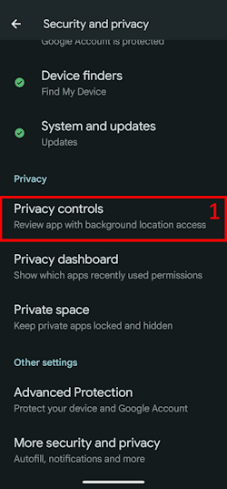

(bluetoothtroubleshooting-bluetooth-related-issues)=

# **藍牙相關問題**

有些使用者遇到與藍牙相關的 Omnipod DASH 註冊失敗、Medtrum Nano 連線問題，以及其他 Pod 錯誤。 其中許多問題可追溯到以下其中一項原因。

其中部分問題也可能適用於其他藍牙胰島素幫浦；Medtrum Nano 與 Omnipod DASH 一樣，已知會受「Nearby devices」權限影響。

---

(bluetoothtroubleshooting-cannot-start-omnipod-with-android-16)=

## 無法在 Android 16 上啟動 Omnipod
- 在 Android 16 上，Omnipod DASH 要能正常運作至少需要 **AAPS** 版本 3.3.2.1，因為該版本加入了修正，專門處理 Android 16 導致 Omnipod 的已知問題。

---

(bluetoothtroubleshooting-apps-using-nearby-device-permission)=

## 使用 Android 權限「Nearby devices」的應用程式，可能導致連線中斷與 Pod 註冊問題

Android 透過權限模型讓你控制每個應用程式在手機上能做什麼、能存取什麼。 你可針對每個已安裝的應用程式允許或拒絕特定權限，例如存取裝置上的檔案、存取藍牙、掃描附近裝置等。

**AAPS** 需要多項特定權限才能運作，其中確保 Pod 正常工作的必要權限是「附近裝置」。 也有許多其他應用程式需要此權限；社群發現，當某些應用被授予此權限時，可能會在部分裝置上導致新 Pod 的啟用發生問題。

(bluetoothtroubleshooting-apps-using-nearby-device-permission-known-apps)=

### **使用「附近裝置」權限且已知會引發問題的應用程式：**

社群中多處討論過，以下清單中的應用程式會對 Omnipod DASH 裝置造成問題，有些情況下也會影響 Medtrum Nano。

```{admonition} Updating the list
:class: note
在 #omnipod-dash 的 Discord 頻道 ping @XiTatiON，討論要加入此清單的應用程式。
```

- **myBMW** MyBMW 會干擾 Medtrum Nano 與 Omnipod DASH。 MyBMW App 對「尋找附近裝置」權限只會提示一次；即使不授權，仍可正常運作。

- **Amazon Alexa** 對部分人而言，移除 Alexa 應用程式的「Nearby devices」權限可解決問題，但會使配對 Matter IoT 裝置的功能失效

- **MINI app** 此 App 似乎是以 myBMW app 為基礎，因此可能會呈現相同行為

- **BM2** 太陽能電池監測應用程式，常用於部分露營車與露營太陽能架設；當該 App 執行時，會阻止新 Pod 的註冊。 在註冊新 Pod 時強制停止該 App，是解決此問題的權宜之計。 之後再執行該 App，似乎不會干擾 Dash 的功能（在執行 Android 16 的 Pixel 8 Pro 上）。

(bluetoothtroubleshooting-revoke-nearby-device-permission)=

### **如何撤銷其他應用程式的「附近裝置」權限：**
如果你在啟用新 Pod 時遇到問題，且你使用的 **AAPS** 版本與你的 Android 版本相容， 在啟用新 Pod 的過程中，可能需要先撤銷其他應用程式的該權限。

請依照以下步驟，將除了 **AAPS** 之外的所有應用程式的「附近裝置」權限撤銷：

```{admonition} Menus and settings
:class: note${NEW_LINE>本指南中的螢幕擷取畫面與說明，來自 Google Pixel 8 Pro 的原生 Android 16 安裝。 其他品牌與裝置的選單與設定描述可能不完全相同，請依你的裝置調整步驟；若卡關，請參閱 [Where to get help for dash](#omnipod-dash-where-to-get-help-for-dash) 章節，了解如何向社群尋求支援。
```

1. 打開手機上的 Android 設定，向下捲動並點選**安全與隱私 (1)**。

    

2. 向下捲動並點選**隱私控制 (1)**。

   

3. 點選**權限管理員 (1)**。

   

3. 向下捲動並點選**附近裝置 (1)**。

   

4. 瀏覽應用程式清單，點選你要撤銷**附近裝置**權限的應用程式。

   在本指南中，我們以**Android Auto (1)** 作為撤銷權限的示範 App。

   為避免讓更多 Pod 變磚，我們建議一開始先對除 **AAPS** 之外的所有應用程式撤銷該權限。

```{admonition} Which app to select?
:class: tip
若不確定是哪個 App 造成問題，請先全部停用（也別忘了檢查已知問題 App 清單，並從那些開始）。在你能承受可能報廢幾個 Pod 的前提下，每次註冊新 Pod 前只對一個新的 App 啟用該權限，如此逐步縮小範圍，找出特定導致 Pod 問題的 App。 如果你確定了新的問題應用程式，請在 Discord 的 #omnipod-dash 頻道告訴我們。
```

   

5. 若要撤銷該權限，請點選 **Don't allow (1)**，然後點選 **Don't allow anyway (2)**。 若操作正確，您應會看到 **Don't allow (3)** 為已選取的切換選項。 現在您可以按下 **Back arrow (4)** 返回 **Nearby device** 選單；如有需要，也可在其他應用程式上變更此設定。

      

(bluetoothtroubleshooting-re-enable-nearby-device-permission)=

### **如何為系統應用程式與其他應用程式重新啟用「Nearby device」權限：**

1. 如有需要，請參閱 **「How to revoke "Nearby device" permissions for other apps」** 章節以瞭解如何前往應用程式的隱私設定，進入 **Nearby device** 設定後請繼續第 2 步。

2. 瀏覽應用程式清單，點選您希望允許 **Nearby devices** 權限的應用程式。

   在本指南中，**Android Auto (1)** 是我們要允許該權限的應用程式。

   您會注意到在撤銷權限後，應用程式清單中找不到 **Android Auto (1)**。 這是因為 **Android Auto** 應用程式是 **系統應用程式**，而系統應用程式在預設情況下會被隱藏。

   

3. 若要顯示隱藏的系統應用程式，請點選 **三條線（漢堡選單）(1)**，接著點選 **"顯示系統  (1)"**。 現在您應該可以在清單中看到先前隱藏的系統應用程式 **Android Auto (3)**。

```{admonition} Find your app
:class: tip
如果某個 App 的權限已被撤銷，你需要往下捲動，直到在清單較下方看到「已撤銷的 App」清單。
```

     

5. 請反向依照 **「How to revoke "Nearby device" permissions for other apps」** 的指引，為各個應用程式重新啟用權限。

---

(bluetoothtroubleshooting-android-15-bluetooth-connection-problems)=

## Android 15 經常性藍牙連線問題

升級 Android 或更換到近期手機後，**AAPS**經常會失去與幫浦的藍牙連線。 重新啟動手機後，這個問題會暫時消失。 若手機執行 Android 15。 在 **AAPS** 設定中啟用 **Bond BT device on Android 15+** 設定，可能有助於提升藍牙連線穩定性；請依下列指南啟用：

```{admonition} Android 16
:class: warning
僅在 Android 15，且確實遇到連線問題時，才啟用「**Bond BT device on Android 15+**」選項。 請勿在 Android 16 啟用綁定（bonding）選項。
```

1) 透過點擊主畫面右上角的三個點的選單來 **打開偏好設定**。

   

2. 向下滾動並打開 **確認嗶聲** / **進階** 子選單。 啟用 **Android 15+ 的 Bond BT 裝置**。

   


3. 如果幫浦要求配對請求，請允許它。

4. 重新啟動您的手機。
