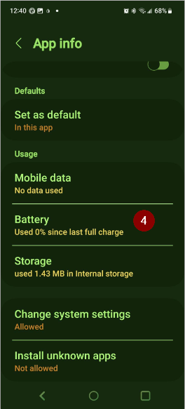

# 問題排除

你可以在許多 wiki 頁面上找到問題排除的資訊。 此頁面是幫助你找到解決問題資訊的鏈接集合。

額外的有用資訊也可能在[FAQ](../UsefulLinks/FAQ.md)中提供。

## AAPS 應用程式

### 建立 & 更新

* [遺失的密鑰庫](#troubleshooting_androidstudio-lost-keystore)
* [問題排除 AndroidStudio](TroubleshootingAndroidStudio)

### 安裝中

你可能會看到一個 Google Play Protect 警告，表示該應用程式不安全，是為了舊版 Android 而建置，並且不包含最新的隱私防護。

忽略：更多詳細資訊，仍然安裝。

### 設定
* 設定檔

  

* [幫浦 - 來自不同幫浦的資料](#update30-failure-message-data-from-different-pump)

  

* [Nightscout 用戶端](../GettingHelp/TroubleshootingNsClient.md)

### 使用說明
* [碳水化合物值錯誤](#CobCalculation-detection-of-wrong-cob-values)

   

* [SMS 指令](#SMSCommands-troubleshooting)

### 無法在 Android 16 上啟動 Omnipod

升級到最低版本的 AndroidAPS：3.3.2.1。

### 藍牙連線問題頻繁

#### Android 15

升級 Android 或更換到近期手機後，**AAPS**經常會失去與幫浦的藍牙連線。 重新啟動手機後，這個問題會暫時消失。 如果手機運行 Android 15，您可以嘗試啟用以下設定：

1) 透過點擊主畫面右上角的三個點的選單來 **打開偏好設定**。

2. 向下滾動並打開 **確認嗶聲** / **進階** 子選單。 啟用 **Android 15+ 的 Bond BT 裝置**。

   

3. 如果幫浦要求配對請求，請允許它。

4. 重新啟動您的手機。

#### 電池優化

這可能會發生在各種幫浦上。 除了將 AAPS 排除在任何電池優化之外，您還可以將系統藍牙應用排除在電池優化之外。 這在某些情況下有幫助。 根據您使用的手機，您會以不同的方式找到藍牙應用。

這裡是一些如何在特定 Android 手機上找到他們的範例。

##### Pixel 手機（原生 Android）

* 進入 Android 設定，選擇「應用程式」。

  

* 選擇「查看所有應用程式」

  

* 在右側的選單中，選擇「顯示系統應用程式」。

  

* 現在搜尋並選擇「藍牙」應用程式。

  

* 點擊「應用程式電池使用情況」並選擇「未優化」。

  

##### Samsung 手機

* 進入 Android 設定，選擇「應用程式」

* 在圖示上（1）選擇變更排序演算法，然後選擇「顯示系統應用程式」（2）。

  

  

* 現在搜尋藍牙應用程式並選擇他來查看其設定。

  

* 選擇「電池」。

  

* 將其設為「未優化」。

  

## CGM

* [一般問題](#general-cgm-troubleshooting)
* [Dexcom G6](#DexcomG6-troubleshooting-g6)
* [Libre 3](#libre3-experiences-and-troubleshooting)
* [Libre 2](#Libre2-experiences-and-troubleshooting)
* [xDrip - 無 CGM 資料](#xdrip-identify-receiver)
* [xDrip - Dexcom 問題排除](#xdrip-troubleshooting-dexcom-g5-g6-and-xdrip)

## 幫浦

* [DanaRS](#DanaRS-Insulin-Pump-dana-rs-specific-errors)
* [Accu-Chek Combo 總覽](../CompatiblePumps/Accu-Chek-Combo-Tips-for-Basic-usage.md)
* [Accu-Chek Insight](#Accu-Chek-Insight-Pump-insight-specific-errors)
* [Medtronic + RileyLink](#MedtronicPump-what-to-do-if-i-loose-connection-to-rileylink-and-or-pump)

## 手機

* [Jelly](../CompatiblePhones/Jelly.md)
* [華為藍牙 & 電池優化](../CompatiblePhones/Huawei.md)

## 智慧型手錶

* [問題排除 Wear 應用程式](#Watchfaces-troubleshooting-the-wear-app)
