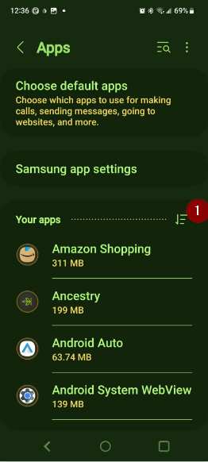

(generaltroubleshooting)=

# **問題排除**

你可以在許多 wiki 頁面上找到問題排除的資訊。 This page is a collection of links to help you find the information to solve your problem for various known issues.

額外的有用資訊也可能在[FAQ](../UsefulLinks/FAQ.md)中提供。

---

(generaltroubleshooting-aaps-app)=

## **AAPS 應用程式**

### **建立 & 更新**

* [遺失的密鑰庫](#troubleshooting_androidstudio-lost-keystore)
* [問題排除 AndroidStudio](TroubleshootingAndroidStudio)

### **安裝中**

你可能會看到一個 Google Play Protect 警告，表示該應用程式不安全，是為了舊版 Android 而建置，並且不包含最新的隱私防護。

忽略：更多詳細資訊，仍然安裝。

### **設定**
* 設定檔

  

* [幫浦 - 來自不同幫浦的資料](#update30-failure-message-data-from-different-pump)

  

* [Nightscout 用戶端](../GettingHelp/TroubleshootingNsClient.md)

### **使用說明**
* [碳水化合物值錯誤](#CobCalculation-detection-of-wrong-cob-values)

   

* [SMS 指令](#SMSCommands-troubleshooting)

---

(generaltroubleshooting-bluetooth-related-issues)=

## **Bluetooth related issues**

For known issues with Bluetooth connections, dropouts of pump/pods, or activation and connection issues [Bluetooth Troubleshooting](../GettingHelp/BluetoothTroubleshooting.md)

---

(generaltroubleshooting-android-related-issues)=

## **Android Related Issues**

### **電池優化**

Android has implemented battery saving setting that are enabled by default. These settings automatically suspend/pause applications that are not required for the system to function to help conserve the amount of battery energy used by apps that don't always need to be running.

When this is enabled, it will very likely cause issue for **AAPS** and other supporting apps like **xDrip+**.

It's important to ensure that you have disabled Battery Optimization to ensure **AAPS** and other supporting apps remain active all the time.

Depending on your phone model and make there may be more than one location and setting which needs to have this disabled.

***NOTE:** Follow the steps below to Disable Battery Optimization for the Bluetooth service if your phone has this option, the same steps can be used to disable for **AAPS** and other apps, however the screenshots will only show how to do this for the Bluetooth service.*

#### **Pixel 手機（原生 Android）**

* Go to the Android settings, select "Apps".

  

* 選擇「查看所有應用程式」

  

* 在右側的選單中，選擇「顯示系統應用程式」。

  

* 現在搜尋並選擇「藍牙」應用程式。

  

* 點擊「應用程式電池使用情況」並選擇「未優化」。

  

#### **Samsung 手機**

* 進入 Android 設定，選擇「應用程式」

* 在圖示上（1）選擇變更排序演算法，然後選擇「顯示系統應用程式」（2）。

  

  

* 現在搜尋藍牙應用程式並選擇他來查看其設定。

  

* 選擇「電池」。

  

* 將其設為「未優化」。

  

#### **Huawei phones**

See this guide for [Huawei bluetooth & battery optimization](../CompatiblePhones/Huawei.md)

---

(generaltroubleshooting-cgm)=

## **Continious Glucose Monitor (CGM)**

Useful links to known issues and steps to resolve for CGMs.

* [一般問題](#general-cgm-troubleshooting)
* [Dexcom G6](#DexcomG6-troubleshooting-g6)
* [Libre 3](#libre3-experiences-and-troubleshooting)
* [xDrip - 無 CGM 資料](#xdrip-identify-receiver)
* [xDrip - Dexcom 問題排除](#xdrip-troubleshooting-dexcom-g5-g6-and-xdrip)

---

(generaltroubleshooting-pumps)=

## **幫浦**

Useful links to known issues and steps to resolve for Pumps

* [DanaRS](#DanaRS-Insulin-Pump-dana-rs-specific-errors)
* [Accu-Chek Combo 總覽](../CompatiblePumps/Accu-Chek-Combo-Tips-for-Basic-usage.md)
* [Accu-Chek Insight](#Accu-Chek-Insight-Pump-insight-specific-errors)
* [Medtronic + RileyLink](#MedtronicPump-what-to-do-if-i-loose-connection-to-rileylink-and-or-pump)

---

(generaltroubleshooting-phones)=

## **手機**

Useful links to known issues and steps to resolve for Phones

* [List of tested phone and device setups](https://docs.google.com/spreadsheets/u/1/d/e/2PACX-1vScCNaIguEZVTVFAgpv1kXHdsHl3fs6xT6RB2Z1CeVJ561AvvqGwxMhlmSHk4J056gMCAQE02sAWJvT/pubhtml?gid=683363241&single=true)
* [Jelly](../CompatiblePhones/Jelly.md)
* [華為藍牙 & 電池優化](../CompatiblePhones/Huawei.md)

(generaltroubleshooting-smartwatches)=

## 智慧型手錶

Useful links to known issues and steps to resolve for Smartwatches

* [問題排除 Wear 應用程式](#Watchfaces-troubleshooting-the-wear-app)
