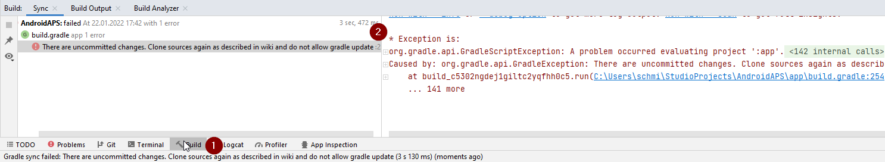
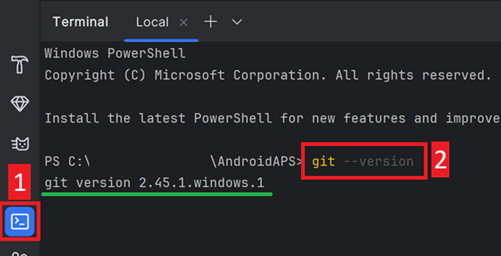
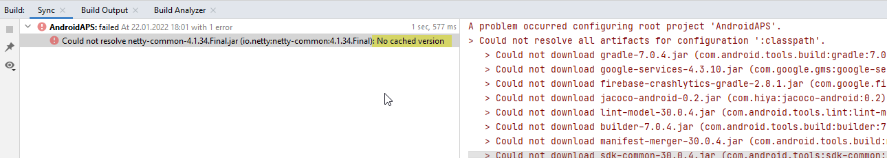
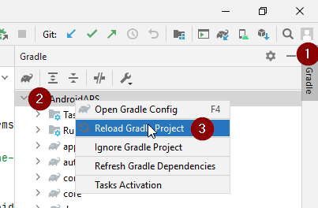
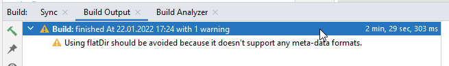
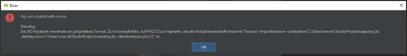
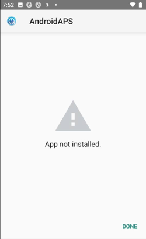

(troubleshooting_androidstudio-troubleshooting-android-studio)=
# 問題排除 Android Studio

(troubleshooting_androidstudio-lost-keystore)=
## 遺失的密鑰庫
如果你在更新 AAPS 時使用相同的密鑰庫，則無需在你的智慧型手機上卸載之前的版本。 這就是為什麼建議將密鑰庫存放在安全地方的原因。

如果你嘗試安裝使用不同密鑰庫簽章的 apk，則會收到一條錯誤訊息，提示安裝失敗！

如果你無法再找到舊密鑰庫或其密碼，請按照以下步驟進行：

1. [匯出設定](../Maintenance/ExportImportSettings.md)到您的手機。
2. 將設置文件從手機複製或上傳到外部位置（例如你的電腦、雲端存儲服務……）。
4. 生成新版本的簽名 apk，具體描述請參見[更新指南](../Maintenance/UpdateToNewVersion)並將其轉移到您的手機。
5. 卸載手機上的上一個 AAPS 版本。
6. 在手機上安裝新的 AAPS 版本。
7. [匯入設置](#ExportImportSettings-restoring-from-your-backups-on-a-new-phone-or-fresh-installation-of-aaps)以恢復你的目標和配置。

   如果你無法在手機上找到他們，請將他們從外部存儲複製到手機上。

8. 檢查你的電池優化選項並再次停用他們。
9. 繼續循環。

## Gradle 同步失敗
Gradle 同步可能由於各種原因失敗。 當你收到訊息提示 gradle 同步失敗時，打開 Android Studio 底部的“Build”選項卡 (1)，查看顯示的錯誤訊息 (2)。

  

這些是常見的 gradle 同步失敗：
* [未提交的更改](#uncommitted-changes)
* [無法使用 ... 的緩存版本](#could-not-resolveno-cached-version)
* [不相容的 Gradle JVM](#incompatible-gradle-jvm)
* [Android Gradle 外掛程式版本不相容](#incompatible-version-of-android-gradle-plugin)

*重要*: 在您遵循針對具體問題的指示後，您需要再次觸發[gradle 同步](#gradle-resync)。

(troubleshooting_androidstudio-uncommitted-changes)=
### 未提交的更改

如果你收到失敗訊息，如


#### 步驟 1 - 檢查 git 安裝
  * 打開 Android Studio 底部的終端選項卡 (1)，複製以下文字並粘貼或輸入到終端中。
    ```
    git --version
    ```

    

    注意：git 和 version 之間有一個空格和兩個破折號！

  * 你應該收到一條訊息，告訴你安裝了什麼版本的 git，正如上面的截圖所示。 在這種情況下，請轉到 [第 2 步](#troubleshooting-android-studio-check-for-uncommitted-changes)。

  * 如果你收到訊息提示
    ```
    Git：找不到指令
    ```
    你的 Git 安裝不正確。

  * [檢查 git 安裝](#BuildingAaps-steps-for-installing-git)

  * 如果你在 Windows 上並且剛剛安裝了 git，應該重新啟動計算機，以便在安裝後使 git 在全系統範圍內可用

  * 如果已安裝 Git，並且已重新啟動（如果是在 Windows 上），git 仍然找不到：

  * 在計算機上搜索文件“git.exe”。

    請記下他所在的目錄。

  * 轉到 Windows 中的環境變數，選擇變數“PATH”，然後點擊編輯。 添加你找到的 git 安裝目錄。

  * 儲存並關閉。

  * 重新啟動 Android Studio。

(問題排除-檢查 Android Studio 是否有未提交的更改)=
#### 步驟 2：檢查未提交的更改。

  * 在 Android Studio 中，打開左側的“提交”標籤 (1)。 
  * 你可以看到“預設變更集”(2) 或“未版本化文件”(3)：

    * 對於“預設變更集”，你可能錯誤地更新了 gradle 或更改了一些文件內容。

    * 右鍵單擊“預設變更集”，然後選擇“回滾”

      

    * 文件將再次從 Git 服務器中獲取。 如果在提交標籤中沒有其他更改，請轉到[第3步](#gradle-resync)。

  * 如果你看到“未版本化文件”，你可能將文件存儲在源碼目錄中，應將其移到其他地方，例如你的密鑰庫文件。

    * 使用計算機上的常規文件瀏覽器將該文件移動或剪切並粘貼到安全的位置。

    * 返回 Android Studio，並點擊提交標籤中的重新整理按鈕 (4)，以確保該文件不再存儲在 AAPS 目錄中。

      如果在提交標籤中沒有其他更改，請轉到[第3步](#gradle-resync)。


(troubleshooting_androidstudio-step-3-gradle-resync)=

#### 步驟 3：再次同步 Gradle

請按照[Gradle Resync](#gradle-resync)上的指示進行操作。

(troubleshooting_androidstudio-android-gradle-plugin-requires-java-11-to-run)=

(incompatible-gradle-jvm)=
### 不相容的 Gradle JVM

 如果您遇到以下錯誤訊息，您需要下載正確的JVM版本後再重新嘗試：
* 點擊Android Studio右側的大象圖示 (1) 來打開Gradle視圖，然後打開設定 (2)，並選擇**Gradle設定** (3)：


* 打開**Gradle JDK**選項，然後選擇**下載JDK...**


* 在**版本** (1) 中，您需要選擇**17**。 然後從**供應商** (2) 選項中選擇**JetBrains Runtime**。 不要更改**位置** (3)。


* 用**OK**關閉**設定**對話框。
* 您現在需要重新啟動Gradle同步。 請按照[Gradle Resync](#gradle-resync)上的指示進行操作。

(incompatible-version-of-android-gradle-plugin)=
### 不相容的 Android Gradle 外掛版本

  如果你遇到以下錯誤訊息

  

  你使用的是過期版本的 Android Studio。 在選單中，轉到幫助 > 檢查更新，並安裝找到的所有 Android Studio 及其外掛的更新。

(troubleshooting_androidstudio-could-not-resolve-no-cached-version)=
### 無法解析/無緩存版本

  你可能會收到此錯誤訊息：



  * 在右側，打開 Gradle 標籤 (1)。

    確保顯示為 (2) 的按鈕*未選中*。

    

  * 現在你需要觸發[Gradle 重新同步](#gradle-resync)

(troubleshooting_androidstudio-unable-to-start-daemon-process)=
### 無法啟動守護程序進程

  如果你看到如下所示的錯誤訊息，你可能使用的是 Windows 10 32 位系統。 這不被Android Studio 3.5.1及以上版本支援，遺憾的是AAPS開發者無法解決這個問題！

  網際網路上有很多指南介紹如何確定你擁有 32 位或 64 位操作系統 - 例如[這篇文章](https://support.microsoft.com/en-us/windows/32-bit-and-64-bit-windows-frequently-asked-questions-c6ca9541-8dce-4d48-0415-94a3faa2e13d)。

  

(gradle-resync)=
### Gradle 重新同步

  如果你仍然看到 Gradle 同步失敗的訊息，請選擇鏈接 "再試一次"。 


  如果不再看到任何訊息，你仍可以手動觸發此操作：

  * 在 Android Studio 的右側邊框打開 Gradle 標籤 (1)。

    

  * 右鍵單擊 AAPS (2)

  * 點擊 "重新載入 Gradle 項目" (3)

## 成功生成簽章 APK，但生成了 0 個建置變體

當你生成簽章 APK 時，你可能會收到通知，提示生成成功，但顯示生成了 0 個建置變體：


這是一個錯誤警告。 檢查你選擇作為 "目標文件夾" 的目錄（步驟 [生成簽章 APK](#Building-APK-generate-signed-apk)），你將在那裡找到生成的 apk！


## 應用程序是用編譯器/Kotlin 警告建立的

如果你的建置成功完成，但出現編譯器或 Kotlin 警告（由黃色或藍色感嘆號標識），那麼你可以忽略這些警告。

 

你的應用程序已成功建置並可以傳輸到手機！


## 密鑰生成時出現錯誤

在 Windows 上為生成簽章 APK 建立新密鑰庫時，可能會出現以下錯誤訊息



這似乎是 Android Studio 3.5.1 及其在 Windows 中捆綁的 Java 環境中的一個錯誤。 密鑰已正確建立，但建議錯誤顯示為錯誤。 目前可以忽略此問題。


## AAPS 未接收 CGM 資料

* 如果你使用的是修補過的 Dexcom G6 應用程序：此應用程序已過時。 請改用[BYODA](#DexcomG6-if-using-g6-with-build-your-own-dexcom-app)應用程序。

* 如果你使用的是 xDrip+：請按照[xDrip+ 設置頁面](#xdrip-identify-receiver)中的說明識別接收器。


## 應用程序未安裝



* 請確保你已將 "app-full-release.apk" 文件傳輸到你的手機。
* 如果手機上顯示 "應用程序未安裝"，請按照以下步驟操作：

1. [匯出設定](../Maintenance/ExportImportSettings.md)（在已安裝於您手機上的 AAPS 版本中）
2. 卸載手機上的 AAPS。
3. 啟用飛行模式並關閉藍牙。
4. 安裝新版本（"app-full-release.apk"）
5. [匯入設置](../Maintenance/ExportImportSettings.md)
6. 重新打開藍牙並關閉飛行模式

## 應用程序已安裝但版本仍為舊版本

如果你成功建置了應用程序，將其傳輸到手機並成功安裝，但版本號保持不變，則可能是你遺漏了[更新本地副本](#Update-to-new-version-update-your-local-copy)。

## 上述方法均無效

如果上述提示均無法幫助你，你可能需要考慮從頭開始建置應用程序：

1. [匯出設定](../Maintenance/ExportImportSettings.md)（在已安裝於您手機上的 AAPS 版本中）

2. 準備好你的密鑰密碼和密鑰庫密碼。 如果你忘記了密碼，可以嘗試在項目文件中找到他們，具體方法如[此處](https://youtu.be/nS3wxnLgZOo)所述。

    或者你可以使用新的密鑰庫。

3. 按照[這裡描述的步驟](#Building-APK-download-AAPS-code)從頭開始構建應用程式。

4. 當你成功建置 APK 後，請刪除手機上的現有應用程序，將新 APK 傳輸到手機並安裝。
5. [再次匯入設定](../Maintenance/ExportImportSettings.md)以恢復您的目標和設定。
6. 你應該檢查你的電池優化選項並再次停用他們。

## 最壞的情況

如果即使從頭建置應用程序也無法解決你的問題，你可能需要嘗試完全卸載 Android Studio。 一些用戶報告說，這解決了他們的問題。

**確保卸載與 Android Studio 相關的所有文件。** 如果你未完全刪除 Android Studio 及其所有隱藏文件，卸載可能會導致新問題，而不是解決現有問題。 可以在網際網路上找到完整卸載指南，例如

[https://stackoverflow.com/questions/39953495/how-to-completely-uninstall-android-studio-from-windowsv10](https://stackoverflow.com/questions/39953495/how-to-completely-uninstall-android-studio-from-windowsv10)。

按照[此處](#Building-APK-install-android-studio)的說明從頭安裝 Android Studio。
