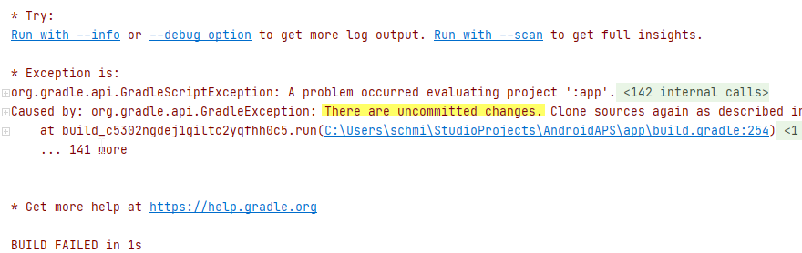
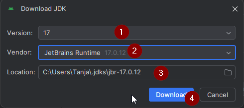
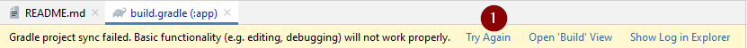

(troubleshooting_androidstudio-troubleshooting-android-studio)=
# 問題排除 Android Studio

(troubleshooting_androidstudio-lost-keystore)=
## 遺失的密鑰庫
If you use the same keystore when updating **AAPS** you do not have to uninstall the previous version on your smartphone. That's why it is recommended to store the keystore in a safe place.

If you try to install the apk, signed with a different keystore than before, you will get an error message explaining that the installation failed!

In the event that you cannot trace your old keystore or password, proceed as follows:

1. [匯出設定](../Maintenance/ExportImportSettings.md)到您的手機。
2. 將設置文件從手機複製或上傳到外部位置（例如你的電腦、雲端存儲服務……）。
4. Generate a new version of the signed apk as described on the [Update guide](../Maintenance/UpdateToNewVersion) and transfer it to your phone.
5. Uninstall previous **AAPS** version on your phone.
6. Install new **AAPS** version on your phone.
7. [匯入設置](#ExportImportSettings-restoring-from-your-backups-on-a-new-phone-or-fresh-installation-of-aaps)以恢復你的目標和配置。

   If you can't find these on your phone, copy them from the external storage to your phone.

8. 檢查你的電池優化選項並再次停用他們。
9. 繼續循環。

## Gradle 同步失敗
Gradle Sync can fail for various reasons. When you receive a message saying that 'gradle sync failed', open the "Build" tab (1) at the bottom of Android Studio and check what error message (2) is displayed.

  

Likely reasons for gradle sync failures are:
* [未提交的更改](#uncommitted-changes)
* [無法使用 ... 的緩存版本](#could-not-resolveno-cached-version)
* [不相容的 Gradle JVM](#incompatible-gradle-jvm)
* [Android Gradle 外掛程式版本不相容](#incompatible-version-of-android-gradle-plugin)

*重要*: 在您遵循針對具體問題的指示後，您需要再次觸發[gradle 同步](#gradle-resync)。


### 未提交的更改

If you receive a failure message like this one:



#### 步驟 1 - 檢查 git 安裝
  * 打開 Android Studio 底部的終端選項卡 (1)，複製以下文字並粘貼或輸入到終端中。
    ```
    git --version
    ```

    

    Note: There is a space and two hyphens between Git and version!

  * You must receive a message saying what Git version is installed, as you can see in the screenshot above. 在這種情況下，請轉到 [第 2 步](#troubleshooting-android-studio-check-for-uncommitted-changes)。

  * 如果你收到訊息提示
    ```
    Git：找不到指令
    ```
    你的 Git 安裝不正確。

  * [檢查 git 安裝](#BuildingAaps-steps-for-installing-git)

  * if on Windows and the Git was just installed, you should restart your computer to make Git globally available after the installation

  * If Git is installed, you have restarted (if on windows), and Git still couldn't found:

  * 在計算機上搜索文件“git.exe”。

    Note for yourself, which directory it is saved in.

  * 轉到 Windows 中的環境變數，選擇變數“PATH”，然後點擊編輯。 Add the directory where you have found your Git installation.

  * 儲存並關閉。

  * 重新啟動 Android Studio。


#### 步驟 2：檢查未提交的更改。

  * In Android Studio, open the 'Commit' tab (1) on the left-hand side. 
  * 你可以看到“預設變更集”(2) 或“未版本化文件”(3)：

    * For "Default changeset", you probably updated 'Gradle' or changed some of the file contents by mistake.

    * 右鍵單擊“預設變更集”，然後選擇“回滾”

      

    * 文件將再次從 Git 服務器中獲取。 如果在提交標籤中沒有其他更改，請轉到[第3步](#gradle-resync)。

  * If you can see "Unversioned Files", you might have stored files in your source code directory by mistake. Maybe they are important files: like your keystore file, that should be moved elsewhere. If you don't know what those files are and you have not created them yourself, you can delete them.

    * Use your regular file explorer on your computer to move or cut and paste that file to a safe place.

    * Go back to Android Studio and click the Refresh button (4) within the Commit tab to make sure the file is not stored in the **AAPS** directory anymore.

      If there are no other changes in the Commit tab, go to [Step 3](#gradle-resync).


#### 步驟 3：再次同步 Gradle

請按照[Gradle Resync](#gradle-resync)上的指示進行操作。

(troubleshooting_androidstudio-android-gradle-plugin-requires-java-11-to-run)=

(incompatible-gradle-jvm)=
### 不相容的 Gradle JVM

 If you experience the above error message, you need to download a correct JVM version before you can try rebuild again:
1.  檢查[需求表](#Building-APK-recommended-specification-of-computer-for-building-apk-file)以確定你需要的**AAPS**版本的 JVM 版本，並做好記錄。

2. Open the Gradle view by clicking on the elephant (1) on the right side of Android Studio and open the settings (2) and select **Gradle Settings** (3):


3.  **In **Gradle JDK** field, check if the appropriate version is selected (1) If not, click on the field, and see if it is already available in the list. The example below shows JVM 21 is labeled as “jbr-21”. If you find it, just select it, and you are done. If not available, then select 'Download JDK'.


4. In Version (1), select the JDK required for your **AAPS** version (the one you made a note of when you checked the requirement table). In Vendor (2) select 'JetBrains Runtime'. Location (3): do not change.



5.  用**OK**關閉**設定**對話框。
6. 您現在需要重新啟動Gradle同步。 請按照[Gradle Resync](#gradle-resync)上的指示進行操作。

(incompatible-version-of-android-gradle-plugin)=
### Incompatible version of Android Gradle plugin

  如果你遇到以下錯誤訊息

  

  你使用的是過期版本的 Android Studio。 在選單中，轉到幫助 > 檢查更新，並安裝找到的所有 Android Studio 及其外掛的更新。

(troubleshooting_androidstudio-could-not-resolve-no-cached-version)=
### 無法解析/無緩存版本

  你可能會收到此錯誤訊息：


  * 在右側，打開 Gradle 標籤 (1)。

    確保顯示為 (2) 的按鈕*未選中*。

    

  * 現在你需要觸發[Gradle 重新同步](#gradle-resync)

(troubleshooting_androidstudio-unable-to-start-daemon-process)=
### 無法啟動守護程序進程

  如果你看到如下所示的錯誤訊息，你可能使用的是 Windows 10 32 位系統。 This is not supported by Android Studio 3.5.1 and above and unfortunately there is nothing that the **AAPS** developers can do about this!

  There is information on the internet about how to determine wether you have a 32-bit or 64-bit OS - i.e. [this one](https://support.microsoft.com/en-us/windows/32-bit-and-64-bit-windows-frequently-asked-questions-c6ca9541-8dce-4d48-0415-94a3faa2e13d).

  

(gradle-resync)=
### Gradle 重新同步

  如果你仍然看到 Gradle 同步失敗的訊息，請選擇鏈接 "再試一次"。 


  If you don't see the message anymore, you can still trigger this manually:

  * 在 Android Studio 的右側邊框打開 Gradle 標籤 (1)。

    

  * 右鍵單擊 AAPS (2)

  * 點擊 "重新載入 Gradle 項目" (3)

## 成功生成簽章 APK，但生成了 0 個建置變體

When you generate the signed apk, you might get the notification that generation was successfully but are told that this is with '0 build variants' were generated:


這是一個錯誤警告。 Check the directory for your selected "Destination folder" for generation (step [Generate Signed APK](#Building-APK-generate-signed-apk)) and you will find the generated apk there!


## 應用程序是用編譯器/Kotlin 警告建立的

如果你的建置成功完成，但出現編譯器或 Kotlin 警告（由黃色或藍色感嘆號標識），那麼你可以忽略這些警告。

 

Your apk was built successfully and can be transferred to your phone!


## Key was created with errors

When creating a new keystore for building the signed apk, on Windows the following error message might appear


這似乎是 Android Studio 3.5.1 及其在 Windows 中捆綁的 Java 環境中的一個錯誤。 密鑰已正確建立，但建議錯誤顯示為錯誤。 目前可以忽略此問題。


## AAPS 未接收 CGM 資料

* If you are using patched Dexcom G6 app: this app is outdated. 請改用[BYODA](#DexcomG6-if-using-g6-with-build-your-own-dexcom-app)應用程序。

* If you are using xDrip+: identify receiver as described on [xDrip+ settings page](#xdrip-identify-receiver).


## Apk not installed


* 請確保你已將 "app-full-release.apk" 文件傳輸到你的手機。
* 如果手機上顯示 "應用程序未安裝"，請按照以下步驟操作：

1. [匯出設定](../Maintenance/ExportImportSettings.md)（在已安裝於您手機上的 AAPS 版本中）
2. Uninstall **AAPS** on your phone.
3. 啟用飛行模式並關閉藍牙。
4. 安裝新版本（"app-full-release.apk"）
5. [匯入設置](../Maintenance/ExportImportSettings.md)
6. 重新打開藍牙並關閉飛行模式

## Apk installed but old version

如果你成功建置了應用程序，將其傳輸到手機並成功安裝，但版本號保持不變，則可能是你遺漏了[更新本地副本](#Update-to-new-version-update-your-local-copy)。

## 上述方法均無效

If none of the above tips helped you might consider building the apk from scratch:

1. [匯出設定](../Maintenance/ExportImportSettings.md)（在已安裝於您手機上的 AAPS 版本中）

2. 準備好你的密鑰密碼和密鑰庫密碼。 如果你忘記了密碼，可以嘗試在項目文件中找到他們，具體方法如[此處](https://youtu.be/nS3wxnLgZOo)所述。

    或者你可以使用新的密鑰庫。

3. Build the apk from scratch as described [here](#Building-APK-download-AAPS-code).

4. When you have built the apk successfully delete the existing apk on your phone, transfer the new apk to your phone and install.
5. [再次匯入設定](../Maintenance/ExportImportSettings.md)以恢復您的目標和設定。
6. 你應該檢查你的電池優化選項並再次停用他們。

## 最壞的情況

If the above does not solve your build issue you may wish to try to uninstall Android Studio completely and rebuild from scratch.  Some users find that this can resolve their build problem.  When deleting Android Studio, do not delete Android user settings and **Make sure to uninstall all files associated with Android Studio.** If you do not completely remove Android Studio with all hidden files, uninstalling may cause new problems instead of solving your existing one(s). 可以在網際網路上找到完整卸載指南，例如

[https://stackoverflow.com/questions/39953495/how-to-completely-uninstall-android-studio-from-windowsv10](https://stackoverflow.com/questions/39953495/how-to-completely-uninstall-android-studio-from-windowsv10)。

按照[此處](#Building-APK-install-android-studio)的說明從頭安裝 Android Studio。
