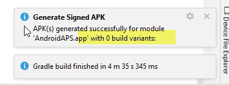

(troubleshooting_androidstudio-troubleshooting-android-studio)=

# 問題排除 Android Studio

(troubleshooting_androidstudio-lost-keystore)=
## 遺失的密鑰庫
如果在更新**AAPS**時使用相同的金鑰存檔，你就不必在智慧型手機上卸載先前的版本。 因此建議將金鑰存檔儲存在安全的地方。

如果你嘗試安裝用與之前不同的金鑰存檔簽署的 apk，你將收到錯誤訊息，解釋安裝失敗！

如果你無法找到舊的金鑰存檔或密碼，請按以下步驟進行：

1. [匯出設定](../Maintenance/ExportImportSettings.md)到你的手機。
2. 將設置文件從手機複製或上傳到外部位置（例如你的電腦、雲端存儲服務……）。
4. 根據 [更新指導](../Maintenance/UpdateToNewVersion) 中的描述生成簽名的 apk 新版本，並將其轉移到你的手機上。
5. 在你的手機上卸載先前的 **AAPS** 版本。
6. 在你的手機上安裝新的 **AAPS** 版本。
7. [匯入設置](#ExportImportSettings-restoring-from-your-backups-on-a-new-phone-or-fresh-installation-of-aaps)以恢復你的目標和配置。

   如果你在手機上找不到這些檔案，請將它們從外部存儲複製到手機上。

8. 檢查你的電池優化選項並再次停用他們。
9. 繼續循環。

## Gradle 同步失敗
Gradle 同步可能因多種原因失敗。 當你收到“gradle 同步失敗”的訊息時，請打開 Android Studio 底部的“建置”選項卡 (1)，檢查顯示的錯誤訊息 (2)。


gradle 同步失敗的可能原因包括：
* [未提交的更改](#uncommitted-changes)
* [無法使用 ... 的緩存版本](#could-not-resolveno-cached-version)
* [不相容的 Gradle JVM](#incompatible-gradle-jvm)
* [Android Gradle 外掛程式版本不相容](#incompatible-version-of-android-gradle-plugin)

*重要*: 在你遵循針對具體問題的指示後，你需要再次觸發[gradle 同步](#gradle-resync)。


### 未提交的更改

如果你收到像這樣的失敗訊息：


```
Build file 'C:\Data\50-Android\AndroidAPS\app\build.gradle.kts' line: 243

There are uncommitted changes.
Clone sources again as described in wiki and do not allow gradle update
```

#### 步驟 1 - 檢查 git 安裝
  * 打開 Android Studio 底部的終端選項卡 (1)，複製以下文字並粘貼或輸入到終端中。
    ```
    git --version
    ```

    

    注意：Git 和版本之間有一個空格和兩個連字符！

  * 你必須收到一條訊息，告訴你安裝了什麼 Git 版本，如上圖所示。 在這種情況下，請轉到 [第 2 步](#troubleshooting-android-studio-check-for-uncommitted-changes)。

  * 如果你收到訊息提示
    ```
    Git: command not found
    ```
    你的 Git 安裝不正確。

  * [檢查 git 安裝](#BuildingAaps-steps-for-installing-git)

  * 如果你在 Windows 上，且剛安裝了 Git，則應重新啟動電腦，以便全域可用 Git。

  * 如果 Git 已安裝，你已經重新啟動（如果在 Windows 上），而 Git 仍無法找到：

  * 在計算機上搜索文件“git.exe”。

    請記下它存儲在哪個目錄。

  * 轉到 Windows 中的環境變數，選擇變數“PATH”，然後點擊編輯。 請添加你找到 Git 安裝的目錄。

  * 儲存並關閉。

  * 重新啟動 Android Studio。


#### 步驟 2：檢查未提交的更改。

  * 在 Android Studio 中，打開左側的“提交”選項卡 (1)。 
  * 你可以看到“預設變更集”(2) 或“未版本化文件”(3)：

    * 對於“預設變更集”，你可能更新了“Gradle”或錯誤地更改了一些文件內容。

    * 右鍵單擊“預設變更集”，然後選擇“回滾”

      

    * 文件將再次從 Git 服務器中獲取。 如果在提交標籤中沒有其他更改，請轉到[第3步](#gradle-resync)。

  * 如果你能看到“未版本控制的文件”，則可能不小心將文件儲存在源代碼目錄中。 也許它們是重要的文件：例如你的金鑰存儲文件，應移動到其他地方。 如果你不知道那些文件是什麼，且你沒有自己創建它們，你可以刪除它們。

    * 使用你電腦上的常規文件管理器將該文件移動或剪切並粘貼到安全的地方。

    * 返回 Android Studio，單擊提交選項卡內的重新整理按鈕 (4)，以確保該文件不再儲存在 **AAPS** 目錄中。

      如果提交選項卡中沒有其他更改，請轉到 [步驟 3](#gradle-resync)。


#### 步驟 3：再次同步 Gradle

請按照[Gradle Resync](#gradle-resync)上的指示進行操作。

### Git Pull Failed - Please tell me who you are

如果您看到此訊息，Git 需要您進行身份確認。


打開命令列視窗，依序輸入以下兩條指令：

```
git config --global user.name "你的名稱"
git config --global user.email 你的email@xxx.com
```

您的名稱需要用引號括起來。


(troubleshooting_androidstudio-android-gradle-plugin-requires-java-11-to-run)=

(incompatible-gradle-jvm)=
### 不相容的 Gradle JVM


```
Your build is currently configured to use incompatible Java 21.0.3 and Gradle 8.2.
Cannot sync the project.

We recommend upgrading to Gradle version 8.9.

The minimum compatible Gradle version is 8.5.

The maximum compatible Gradle JVM version is 19.
```

或:

```
Cause: error: invalid source release: 21
```

如果你遇到以上錯誤訊息，則在重新構建之前需要下載正確的 JVM 版本：

1.  檢查[需求表](#Building-APK-recommended-specification-of-computer-for-building-apk-file)以確定你需要的**AAPS**版本的 JVM 版本，並做好記錄。

2. 通過單擊 Android Studio 右側的“大象圖示” (1) 打開 Gradle 視圖，並打開設定 (2)，然後選擇 **Gradle 設定** (3)：


3.  In **Gradle JDK** field, check if the appropriate version is selected (1) If not, click on the field, and see if it is already available in the list. 下面的範例顯示 JVM 21 標示為“jbr-21”。 如果你找到了，請選擇它，就完成了。 如果不可用，則選擇“下載 JDK”。


4. 在版本 (1) 中，選擇你的 **AAPS** 版本所需的 JDK（當你檢查需求表時做的註記）。 在供應商 (2) 中選擇“JetBrains Runtime”。 位置 (3)：請勿更改。


5.  用**OK**關閉**設定**對話框。
6. 你現在需要重新啟動Gradle同步。 請按照[Gradle Resync](#gradle-resync)上的指示進行操作。

(incompatible-version-of-android-gradle-plugin)=
### 不相容的 Android Gradle 外掛版本

  如果你遇到以下錯誤訊息

  

  你使用的是過期版本的 Android Studio。 在選單中，轉到幫助 > 檢查更新，並安裝找到的所有 Android Studio 及其外掛的更新。

(troubleshooting_androidstudio-could-not-resolve-no-cached-version)=
### 無法解析/無緩存版本

  你可能會收到此錯誤訊息：


  * 在右側，打開 Gradle 標籤 (1)。

    確保顯示為 (2) 的按鈕*未選中*。

    

  * 現在你需要觸發[Gradle 重新同步](#gradle-resync)

(troubleshooting_androidstudio-unable-to-start-daemon-process)=
### 無法啟動守護程序進程

  如果你看到如下所示的錯誤訊息，你可能使用的是 Windows 10 32 位系統。 這在 Android Studio 3.5.1 及以上版本中不受支援，很遺憾 **AAPS** 開發者無法對此做出任何改變！

  網路上有關於如何判斷你是否使用 32 位或 64 位作業系統的資訊 - 例如 [這一個](https://support.microsoft.com/en-us/windows/32-bit-and-64-bit-windows-frequently-asked-questions-c6ca9541-8dce-4d48-0415-94a3faa2e13d)。

  

(gradle-resync)=
### Gradle 重新同步

  如果你仍然看到 Gradle 同步失敗的訊息，請選擇鏈接 "再試一次"。 


  如果你不再看到這條訊息，你仍然可以手動觸發：

  * 在 Android Studio 的右側邊框打開 Gradle 標籤 (1)。

    

  * 右鍵單擊 AAPS (2)

  * 點擊 "重新載入 Gradle 項目" (3)

## 成功生成簽章 APK，但生成了 0 個建置變體

當你生成簽名 apk 時，你可能會收到生成成功的通知，但告訴你“生成的 build 變體為 0”：



這是一個錯誤警告。 檢查你選擇的“目的地資料夾”以進行生成（步驟 [生成簽名 APK](#Building-APK-generate-signed-apk)），你會在那裡找到生成的 apk！


## 應用程序是用編譯器/Kotlin 警告建立的

如果你的建置成功完成，但出現編譯器或 Kotlin 警告（由黃色或藍色感嘆號標識），那麼你可以忽略這些警告。

 

你的 apk 已成功建立，可以轉移到你的手機上！


## AAPS 未接收 CGM 資料

* 如果你正在使用修補過的 Dexcom G6 應用程式：此應用程式已過時。 請改用[BYODA](#DexcomG6-if-using-g6-with-build-your-own-dexcom-app)應用程序。

* 如果你正在使用 xDrip+：請按照 [xDrip+ 設定頁面](#xdrip-identify-receiver) 上的描述來識別接收器。


## Apk 未安裝


* 請確保你已將 "app-full-release.apk" 文件傳輸到你的手機。
* 如果手機上顯示 "應用程序未安裝"，請按照以下步驟操作：

1. [匯出設定](../Maintenance/ExportImportSettings.md)（在已安裝於你手機上的 AAPS 版本中）
2. 在你的手機上卸載 **AAPS**。
3. 啟用飛行模式並關閉藍牙。
4. 安裝新版本（"app-full-release.apk"）
5. [匯入設置](../Maintenance/ExportImportSettings.md)
6. 重新打開藍牙並關閉飛行模式

## Apk 已安裝但版本舊

如果你成功建置了應用程序，將其傳輸到手機並成功安裝，但版本號保持不變，則可能是你遺漏了[更新本地副本](#Update-to-new-version-update-your-local-copy)。

## 上述方法均無效

如果以上技巧均未幫助你，你可能考慮從頭開始構建 apk：

1. [匯出設定](../Maintenance/ExportImportSettings.md)（在已安裝於你手機上的 AAPS 版本中）

2. 準備好你的密鑰密碼和密鑰庫密碼。 如果你忘記了密碼，可以嘗試在項目文件中找到他們，具體方法如[此處](https://youtu.be/nS3wxnLgZOo)所述。

    或者你可以使用新的密鑰庫。

3. 按此 [從頭構建 apk](#Building-APK-download-AAPS-code) 的說明。

4. 當你成功構建 apk 後，請刪除手機上現有的 apk，將新的 apk 轉移到手機上並安裝。
5. [再次匯入設定](../Maintenance/ExportImportSettings.md)以恢復你的目標和設定。
6. 你應該檢查你的電池優化選項並再次停用他們。

## 最壞的情況

如果上述方法無法解決你的構建問題，你可能希望嘗試完全卸載 Android Studio，然後從頭開始構建。  一些用戶發現這可以解決他們的構建問題。  在刪除 Android Studio 時，請勿刪除 Android 使用者設定，並**確保卸載與 Android Studio 相關的所有文件。** 如果你不完全移除 Android Studio 及所有隱藏文件，卸載可能會導致新的問題，而不是解決你當前存在的問題。 可以在網際網路上找到完整卸載指南，例如

[https://stackoverflow.com/questions/39953495/how-to-completely-uninstall-android-studio-from-windowsv10](https://stackoverflow.com/questions/39953495/how-to-completely-uninstall-android-studio-from-windowsv10)。

按照[此處](#Building-APK-install-android-studio)的說明從頭安裝 Android Studio。
